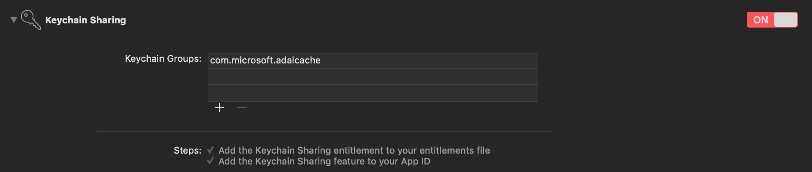

# How to: Configure SSO on macOS and iOS

The Microsoft Authentication Library (MSAL) for macOS and iOS supports Single Sign-on (SSO) between macOS/iOS apps and browsers. This article covers the following SSO scenarios:

- [Silent SSO between multiple apps](#silent-sso-between-apps)

This type of SSO works between multiple apps distributed by the same Apple Developer. It provides silent SSO (that is, the user isn't prompted for credentials) by reading refresh tokens written by other apps from the keychain, and exchanging them for access tokens silently.  

- [SSO through Authentication broker](#sso-through-authentication-broker-on-ios)

> [!IMPORTANT]
> This flow is not available on macOS.

Microsoft provides apps, called brokers, that enable SSO between applications from different vendors as long as the mobile device is registered with Azure Active Directory (AAD). This type of SSO requires a broker application be installed on the user's device.

- **SSO between MSAL and Safari**

SSO is achieved through the [ASWebAuthenticationSession](https://developer.apple.com/documentation/authenticationservices/aswebauthenticationsession?language=objc) class. It uses existing sign-in state from other apps and the Safari browser. It's not limited to apps distributed by the same Apple Developer, but it requires some user interaction.

If you use the default web view in your app to sign in users, you'll get automatic SSO between MSAL-based applications and Safari. To learn more about the web views that MSAL supports, visit [Customize browsers and WebViews](customize-webviews.md).

> [!IMPORTANT]
> This type of SSO is currently not available on macOS. MSAL on macOS only supports WKWebView which doesn't have SSO support with Safari. 

- **Silent SSO between ADAL and MSAL macOS/iOS apps**

MSAL Objective-C supports migration and SSO with ADAL Objective-C-based apps. The apps must be distributed by the same Apple Developer.

See [SSO between ADAL and MSAL apps on macOS and iOS](sso-between-adal-msal-apps-macos-ios.md) for instructions for cross-app SSO between ADAL and MSAL-based apps.

## Silent SSO between apps

MSAL supports SSO sharing through iOS keychain access groups.

To enable SSO across your applications, you'll need to do the following steps, which are explained in more detail below:

1. Ensure that all your applications use the same Client ID or Application ID.
1. Ensure that all of your applications share the same signing certificate from Apple so that you can share keychains.
1. Request the same keychain entitlement for each of your applications.
1. Tell the MSAL SDKs about the shared keychain you want us to use if it's different from the default one.

### Use the same Client ID and Application ID

For the Microsoft identity platform to know which applications can share tokens, those applications need to share the same Client ID or Application ID. This is the unique identifier that was provided to you when you registered your first application in the portal.

The way the Microsoft identity platform tells apps that use the same Application ID apart is by their **Redirect URIs**. Each application can have multiple Redirect URIs registered in the onboarding portal. Each app in your suite will have a different redirect URI. For example:

App1 Redirect URI: `msauth.com.contoso.mytestapp1://auth`  
App2 Redirect URI: `msauth.com.contoso.mytestapp2://auth`  
App3 Redirect URI: `msauth.com.contoso.mytestapp3://auth`  

> [!IMPORTANT]
> The format of redirect uris must be compatible with the format MSAL supports, which is documented in [MSAL Redirect URI format requirements](redirect-uris-ios.md#msal-redirect-uri-format-requirements).

### Setup keychain sharing between applications

Refer to Apple's [Adding Capabilities](https://developer.apple.com/library/ios/documentation/IDEs/Conceptual/AppDistributionGuide/AddingCapabilities/AddingCapabilities.html) article to enable keychain sharing. What is important is that you decide what you want your keychain to be called and add that capability to all of your applications that will be involved in SSO.

When you have the entitlements set up correctly, you'll see a `entitlements.plist` file in your project directory that contains something like this example:

```xml
<?xml version="1.0" encoding="UTF-8"?>
<!DOCTYPE plist PUBLIC "-//Apple//DTD PLIST 1.0//EN" "http://www.apple.com/DTDs/PropertyList-1.0.dtd">
<plist version="1.0">
<dict>
    <key>keychain-access-groups</key>
    <array>
        <string>$(AppIdentifierPrefix)com.myapp.mytestapp</string>
        <string>$(AppIdentifierPrefix)com.myapp.mycache</string>
    </array>
</dict>
</plist>
```

#### Add a new keychain group

Add a new keychain group to your project **Capabilities**. The keychain group should be:
* `com.microsoft.adalcache` on iOS 
* `com.microsoft.identity.universalstorage` on macOS.



For more information, see [keychain groups](howto-v2-keychain-objc.md).

## Configure the application object

Once you have the keychain entitlement enabled in each of your applications, and you're ready to use SSO, configure `MSALPublicClientApplication` with your keychain access group as in the following example:

Objective-C:

```objc
NSError *error = nil;
MSALPublicClientApplicationConfig *configuration = [[MSALPublicClientApplicationConfig alloc] initWithClientId:@"<my-client-id>"];
configuration.cacheConfig.keychainSharingGroup = @"my.keychain.group";
    
MSALPublicClientApplication *application = [[MSALPublicClientApplication alloc] initWithConfiguration:configuration error:&error];
```

Swift:

```swift
let config = MSALPublicClientApplicationConfig(clientId: "<my-client-id>")
config.cacheConfig.keychainSharingGroup = "my.keychain.group"

do {
   let application = try MSALPublicClientApplication(configuration: config)
  // continue on with application
} catch let error as NSError {
  // handle error here
}
```

> [!WARNING]
> When you share a keychain across your applications, any application can delete users or even all of the tokens across your application.
> This is particularly impactful if you have applications that rely on tokens to do background work.
> Sharing a keychain means that you must be very careful when your app uses Microsoft identity SDK remove operations.

That's it! The Microsoft identity SDK will now share credentials across all your applications. The account list will also be shared across application instances.

## SSO through Authentication broker on iOS

MSAL provides support for brokered authentication with Microsoft Authenticator. Microsoft Authenticator provides SSO for AAD registered devices, and also helps your application follow Conditional Access policies.

The following steps are how you enable SSO using an authentication broker for your app:

1. Register a broker compatible Redirect URI format for the application in your app's Info.plist. The broker compatible Redirect URI format is `msauth.<app.bundle.id>://auth`. Replace `<app.bundle.id>`` with your application's bundle ID. For example:

    ```xml
    <key>CFBundleURLSchemes</key>
    <array>
        <string>msauth.<app.bundle.id></string>
    </array>
    ```

1. Add following schemes to your app's Info.plist under `LSApplicationQueriesSchemes`:

    ```xml
    <key>LSApplicationQueriesSchemes</key>
    <array>
         <string>msauthv2</string>
         <string>msauthv3</string>
    </array>
    ```

1. Add the following to your `AppDelegate.m` file to handle callbacks:

    Objective-C:
    
    ```objc
    - (BOOL)application:(UIApplication *)app openURL:(NSURL *)url options:(NSDictionary<NSString *,id> *)options
    {
        return [MSALPublicClientApplication handleMSALResponse:url sourceApplication:options[UIApplicationOpenURLOptionsSourceApplicationKey]];
    }
    ```
    
    Swift:
    
    ```swift
    func application(_ app: UIApplication, open url: URL, options: [UIApplication.OpenURLOptionsKey : Any] = [:]) -> Bool {
        return MSALPublicClientApplication.handleMSALResponse(url, sourceApplication: options[UIApplication.OpenURLOptionsKey.sourceApplication] as? String)
    }
    ```
    
**If you are using Xcode 11**, you should place MSAL callback into the `SceneDelegate` file instead.
If you support both UISceneDelegate and UIApplicationDelegate for compatibility with older iOS, MSAL callback would need to be placed into both files.

Objective-C:

```objc
 - (void)scene:(UIScene *)scene openURLContexts:(NSSet<UIOpenURLContext *> *)URLContexts
 {
     UIOpenURLContext *context = URLContexts.anyObject;
     NSURL *url = context.URL;
     NSString *sourceApplication = context.options.sourceApplication;
     
     [MSALPublicClientApplication handleMSALResponse:url sourceApplication:sourceApplication];
 }
```

Swift:

```swift
func scene(_ scene: UIScene, openURLContexts URLContexts: Set<UIOpenURLContext>) {
        
        guard let urlContext = URLContexts.first else {
            return
        }
        
        let url = urlContext.url
        let sourceApp = urlContext.options.sourceApplication
        
        MSALPublicClientApplication.handleMSALResponse(url, sourceApplication: sourceApp)
    }
```

## Next steps

Learn more about [Authentication flows and application scenarios](authentication-flows-app-scenarios.md)