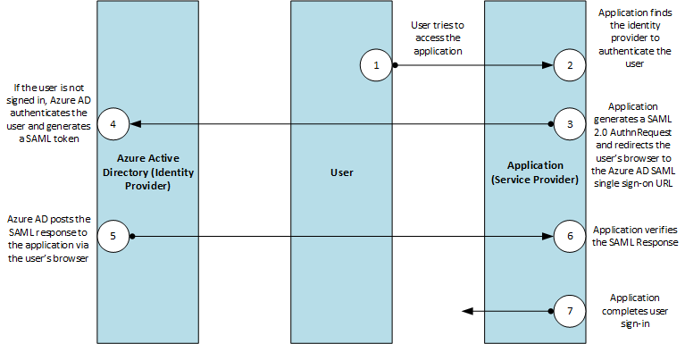

# Single Sign-On SAML protocol

This article covers the SAML 2.0 authentication requests and responses that Azure Active Directory (Azure AD) supports for Single Sign-On.

The protocol diagram below describes the single sign-on sequence. The cloud service (the service provider) uses an HTTP Redirect binding to pass an `AuthnRequest` (authentication request) element to Azure AD (the identity provider). Azure AD then uses an HTTP post binding to post a `Response` element to the cloud service.



## AuthnRequest

To request a user authentication, cloud services send an `AuthnRequest` element to Azure AD. A sample SAML 2.0 `AuthnRequest` could look like the following example:

```
<samlp:AuthnRequest
xmlns="urn:oasis:names:tc:SAML:2.0:metadata"
ID="id6c1c178c166d486687be4aaf5e482730"
Version="2.0" IssueInstant="2013-03-18T03:28:54.1839884Z"
xmlns:samlp="urn:oasis:names:tc:SAML:2.0:protocol">
<Issuer xmlns="urn:oasis:names:tc:SAML:2.0:assertion">https://www.contoso.com</Issuer>
</samlp:AuthnRequest>
```

| Parameter |  | Description |
| --- | --- | --- |
| ID | Required | Azure AD uses this attribute to populate the `InResponseTo` attribute of the returned response. ID must not begin with a number, so a common strategy is to prepend a string like "id" to the string representation of a GUID. For example, `id6c1c178c166d486687be4aaf5e482730` is a valid ID. |
| Version | Required | This parameter should be set to **2.0**. |
| IssueInstant | Required | This is a DateTime string with a UTC value and [round-trip format ("o")](https://msdn.microsoft.com/library/az4se3k1.aspx). Azure AD expects a DateTime value of this type, but doesn't evaluate or use the value. |
| AssertionConsumerServiceUrl | Optional | If provided, this parameter must match the `RedirectUri` of the cloud service in Azure AD. |
| ForceAuthn | Optional | This is a boolean value. If true, it means that the user will be forced to re-authenticate, even if they have a valid session with Azure AD. |
| IsPassive | Optional | This is a boolean value that specifies whether Azure AD should authenticate the user silently, without user interaction, using the session cookie if one exists. If this is true, Azure AD will attempt to authenticate the user using  the session cookie. |

All other `AuthnRequest` attributes, such as Consent, Destination, AssertionConsumerServiceIndex, AttributeConsumerServiceIndex, and ProviderName are **ignored**.

Azure AD also ignores the `Conditions` element in `AuthnRequest`.

### Issuer

The `Issuer` element in an `AuthnRequest` must exactly match one of the **ServicePrincipalNames** in the cloud service in Azure AD. Typically, this is set to the **App ID URI** that is specified during application registration.

A SAML excerpt containing the `Issuer` element looks like the following sample:

```
<Issuer xmlns="urn:oasis:names:tc:SAML:2.0:assertion">https://www.contoso.com</Issuer>
```

### NameIDPolicy

This element requests a particular name ID format in the response and is optional in `AuthnRequest` elements sent to Azure AD.

A `NameIdPolicy` element looks like the following sample:

```
<NameIDPolicy Format="urn:oasis:names:tc:SAML:2.0:nameid-format:persistent"/>
```

If `NameIDPolicy` is provided, you can include its optional `Format` attribute. The `Format` attribute can have only one of the following values; any other value results in an error.

* `urn:oasis:names:tc:SAML:2.0:nameid-format:persistent`: Azure Active Directory issues the NameID claim as a pairwise identifier.
* `urn:oasis:names:tc:SAML:1.1:nameid-format:emailAddress`: Azure Active Directory issues the NameID claim in e-mail address format.
* `urn:oasis:names:tc:SAML:1.1:nameid-format:unspecified`: This value permits Azure Active Directory to select the claim format. Azure Active Directory issues the NameID as a pairwise identifier.
* `urn:oasis:names:tc:SAML:2.0:nameid-format:transient`: Azure Active Directory issues the NameID claim as a randomly generated value that is unique to the current SSO operation. This means that the value is temporary and cannot be used to identify the authenticating user.

Azure AD ignores the `AllowCreate` attribute.

### RequestAuthnContext
The `RequestedAuthnContext` element specifies the desired authentication methods. It is optional in `AuthnRequest` elements sent to Azure AD. Azure AD supports `AuthnContextClassRef` values such as `urn:oasis:names:tc:SAML:2.0:ac:classes:Password`.

### Scoping
The `Scoping` element, which includes a list of identity providers, is optional in `AuthnRequest` elements sent to Azure AD.

If provided, don't include the `ProxyCount` attribute, `IDPListOption` or `RequesterID` element, as they aren't supported.

### Signature
Don't include a `Signature` element in `AuthnRequest` elements, as Azure AD does not support signed authentication requests.

### Subject
Azure AD ignores the `Subject` element of `AuthnRequest` elements.

## Response
When a requested sign-on completes successfully, Azure AD posts a response to the cloud service. A response to a successful sign-on attempt looks like the following sample:

```
<samlp:Response ID="_a4958bfd-e107-4e67-b06d-0d85ade2e76a" Version="2.0" IssueInstant="2013-03-18T07:38:15.144Z" Destination="https://contoso.com/identity/inboundsso.aspx" InResponseTo="id758d0ef385634593a77bdf7e632984b6" xmlns:samlp="urn:oasis:names:tc:SAML:2.0:protocol">
  <Issuer xmlns="urn:oasis:names:tc:SAML:2.0:assertion"> https://login.microsoftonline.com/82869000-6ad1-48f0-8171-272ed18796e9/</Issuer>
  <ds:Signature xmlns:ds="https://www.w3.org/2000/09/xmldsig#">
    ...
  </ds:Signature>
  <samlp:Status>
    <samlp:StatusCode Value="urn:oasis:names:tc:SAML:2.0:status:Success" />
  </samlp:Status>
  <Assertion ID="_bf9c623d-cc20-407a-9a59-c2d0aee84d12" IssueInstant="2013-03-18T07:38:15.144Z" Version="2.0" xmlns="urn:oasis:names:tc:SAML:2.0:assertion">
    <Issuer>https://login.microsoftonline.com/82869000-6ad1-48f0-8171-272ed18796e9/</Issuer>
    <ds:Signature xmlns:ds="https://www.w3.org/2000/09/xmldsig#">
      ...
    </ds:Signature>
    <Subject>
      <NameID>Uz2Pqz1X7pxe4XLWxV9KJQ+n59d573SepSAkuYKSde8=</NameID>
      <SubjectConfirmation Method="urn:oasis:names:tc:SAML:2.0:cm:bearer">
        <SubjectConfirmationData InResponseTo="id758d0ef385634593a77bdf7e632984b6" NotOnOrAfter="2013-03-18T07:43:15.144Z" Recipient="https://contoso.com/identity/inboundsso.aspx" />
      </SubjectConfirmation>
    </Subject>
    <Conditions NotBefore="2013-03-18T07:38:15.128Z" NotOnOrAfter="2013-03-18T08:48:15.128Z">
      <AudienceRestriction>
        <Audience>https://www.contoso.com</Audience>
      </AudienceRestriction>
    </Conditions>
    <AttributeStatement>
      <Attribute Name="http://schemas.xmlsoap.org/ws/2005/05/identity/claims/name">
        <AttributeValue>testuser@contoso.com</AttributeValue>
      </Attribute>
      <Attribute Name="http://schemas.microsoft.com/identity/claims/objectidentifier">
        <AttributeValue>3F2504E0-4F89-11D3-9A0C-0305E82C3301</AttributeValue>
      </Attribute>
      ...
    </AttributeStatement>
    <AuthnStatement AuthnInstant="2013-03-18T07:33:56.000Z" SessionIndex="_bf9c623d-cc20-407a-9a59-c2d0aee84d12">
      <AuthnContext>
        <AuthnContextClassRef> urn:oasis:names:tc:SAML:2.0:ac:classes:Password</AuthnContextClassRef>
      </AuthnContext>
    </AuthnStatement>
  </Assertion>
</samlp:Response>
```

### Response

The `Response` element includes the result of the authorization request. Azure AD sets the `ID`, `Version` and `IssueInstant` values in the `Response` element. It also sets the following attributes:

* `Destination`: When sign-on completes successfully, this is set to the `RedirectUri` of the service provider (cloud service).
* `InResponseTo`: This is set to the `ID` attribute of the `AuthnRequest` element that initiated the response.

### Issuer

Azure AD sets the `Issuer` element to `https://login.microsoftonline.com/<TenantIDGUID>/` where \<TenantIDGUID> is the tenant ID of the Azure AD tenant.

For example, a response with Issuer element could look like the following sample:

```
<Issuer xmlns="urn:oasis:names:tc:SAML:2.0:assertion"> https://login.microsoftonline.com/82869000-6ad1-48f0-8171-272ed18796e9/</Issuer>
```

### Status

The `Status` element conveys the success or failure of sign-on. It includes the `StatusCode` element, which contains a code or a set of nested codes that represents the status of the request. It also includes the `StatusMessage` element, which contains custom error messages that are generated during the sign-on process.

<!-- TODO: Add an authentication protocol error reference -->

The following sample is a SAML response to an unsuccessful sign-on attempt.

```
<samlp:Response ID="_f0961a83-d071-4be5-a18c-9ae7b22987a4" Version="2.0" IssueInstant="2013-03-18T08:49:24.405Z" InResponseTo="iddce91f96e56747b5ace6d2e2aa9d4f8c" xmlns:samlp="urn:oasis:names:tc:SAML:2.0:protocol">
  <Issuer xmlns="urn:oasis:names:tc:SAML:2.0:assertion">https://sts.windows.net/82869000-6ad1-48f0-8171-272ed18796e9/</Issuer>
  <samlp:Status>
    <samlp:StatusCode Value="urn:oasis:names:tc:SAML:2.0:status:Requester">
      <samlp:StatusCode Value="urn:oasis:names:tc:SAML:2.0:status:RequestUnsupported" />
    </samlp:StatusCode>
    <samlp:StatusMessage>AADSTS75006: An error occurred while processing a SAML2 Authentication request. AADSTS90011: The SAML authentication request property 'NameIdentifierPolicy/SPNameQualifier' is not supported.
Trace ID: 66febed4-e737-49ff-ac23-464ba090d57c
Timestamp: 2013-03-18 08:49:24Z</samlp:StatusMessage>
  </samlp:Status>
```

### Assertion

In addition to the `ID`, `IssueInstant` and `Version`, Azure AD sets the following elements in the `Assertion` element of the response.

#### Issuer

This is set to `https://sts.windows.net/<TenantIDGUID>/`where \<TenantIDGUID> is the Tenant ID of the Azure AD tenant.

```
<Issuer>https://login.microsoftonline.com/82869000-6ad1-48f0-8171-272ed18796e9/</Issuer>
```

#### Signature

Azure AD signs the assertion in response to a successful sign-on. The `Signature` element contains a digital signature that the cloud service can use to authenticate the source to verify the integrity of the assertion.

To generate this digital signature, Azure AD uses the signing key in the `IDPSSODescriptor` element of its metadata document.

```
<ds:Signature xmlns:ds="https://www.w3.org/2000/09/xmldsig#">
      digital_signature_here
    </ds:Signature>
```

#### Subject

This specifies the principal that is the subject of the statements in the assertion. It contains a `NameID` element, which represents the authenticated user. The `NameID` value is a targeted identifier that is directed only to the service provider that is the audience for the token. It is persistent - it can be revoked, but is never reassigned. It is also opaque, in that it does not reveal anything about the user and cannot be used as an identifier for attribute queries.

The `Method` attribute of the `SubjectConfirmation` element is always set to `urn:oasis:names:tc:SAML:2.0:cm:bearer`.

```
<Subject>
      <NameID>Uz2Pqz1X7pxe4XLWxV9KJQ+n59d573SepSAkuYKSde8=</NameID>
      <SubjectConfirmation Method="urn:oasis:names:tc:SAML:2.0:cm:bearer">
        <SubjectConfirmationData InResponseTo="id758d0ef385634593a77bdf7e632984b6" NotOnOrAfter="2013-03-18T07:43:15.144Z" Recipient="https://contoso.com/identity/inboundsso.aspx" />
      </SubjectConfirmation>
</Subject>
```

#### Conditions

This element specifies conditions that define the acceptable use of SAML assertions.

```
<Conditions NotBefore="2013-03-18T07:38:15.128Z" NotOnOrAfter="2013-03-18T08:48:15.128Z">
      <AudienceRestriction>
        <Audience>https://www.contoso.com</Audience>
      </AudienceRestriction>
</Conditions>
```

The `NotBefore` and `NotOnOrAfter` attributes specify the interval during which the assertion is valid.

* The value of the `NotBefore` attribute is equal to or slightly (less than a second) later than the value of `IssueInstant` attribute of the `Assertion` element. Azure AD does not account for any time difference between itself and the cloud service (service provider), and does not add any buffer to this time.
* The value of the `NotOnOrAfter` attribute is 70 minutes later than the value of the `NotBefore` attribute.

#### Audience

This contains a URI that identifies an intended audience. Azure AD sets the value of this element to the value of `Issuer` element of the `AuthnRequest` that initiated the sign-on. To evaluate the `Audience` value, use the value of the `App ID URI` that was specified during application registration.

```
<AudienceRestriction>
        <Audience>https://www.contoso.com</Audience>
</AudienceRestriction>
```

Like the `Issuer` value, the `Audience` value must exactly match one of the service principal names that represents the cloud service in Azure AD. However, if the value of the `Issuer` element is not a URI value, the `Audience` value in the response is the `Issuer` value prefixed with `spn:`.

#### AttributeStatement

This contains claims about the subject or user. The following excerpt contains a sample `AttributeStatement` element. The ellipsis indicates that the element can include multiple attributes and attribute values.

```
<AttributeStatement>
      <Attribute Name="http://schemas.xmlsoap.org/ws/2005/05/identity/claims/name">
        <AttributeValue>testuser@contoso.com</AttributeValue>
      </Attribute>
      <Attribute Name="http://schemas.microsoft.com/identity/claims/objectidentifier">
        <AttributeValue>3F2504E0-4F89-11D3-9A0C-0305E82C3301</AttributeValue>
      </Attribute>
      ...
</AttributeStatement>
```        

* **Name Claim** - The value of the `Name` attribute (`http://schemas.xmlsoap.org/ws/2005/05/identity/claims/name`) is the user principal name of the authenticated user, such as `testuser@managedtenant.com`.
* **ObjectIdentifier Claim** - The value of the `ObjectIdentifier` attribute (`http://schemas.microsoft.com/identity/claims/objectidentifier`) is the `ObjectId` of the directory object that represents the authenticated user in Azure AD. `ObjectId` is an immutable, globally unique, and reuse safe identifier of the authenticated user.

#### AuthnStatement

This element asserts that the assertion subject was authenticated by a particular means at a particular time.

* The `AuthnInstant` attribute specifies the time at which the user authenticated with Azure AD.
* The `AuthnContext` element specifies the authentication context used to authenticate the user.

```
<AuthnStatement AuthnInstant="2013-03-18T07:33:56.000Z" SessionIndex="_bf9c623d-cc20-407a-9a59-c2d0aee84d12">
      <AuthnContext>
        <AuthnContextClassRef> urn:oasis:names:tc:SAML:2.0:ac:classes:Password</AuthnContextClassRef>
      </AuthnContext>
</AuthnStatement>
```
