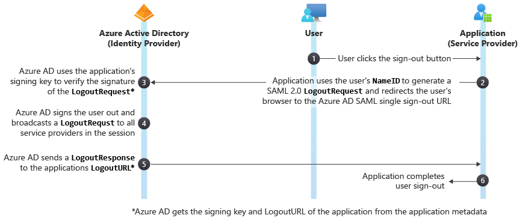

# Single Sign-Out SAML Protocol

Azure Active Directory (Azure AD) supports the SAML 2.0 web browser single sign-out profile. For single sign-out to work correctly, the **LogoutURL** for the application must be explicitly registered with Azure AD during application registration. Azure AD uses the LogoutURL to redirect users after they're signed out.

The following diagram shows the workflow of the Azure AD single sign-out process.



## LogoutRequest
The cloud service sends a `LogoutRequest` message to Azure AD to indicate that a session has been terminated. The following excerpt shows a sample `LogoutRequest` element.

```
<samlp:LogoutRequest xmlns="urn:oasis:names:tc:SAML:2.0:metadata" ID="idaa6ebe6839094fe4abc4ebd5281ec780" Version="2.0" IssueInstant="2013-03-28T07:10:49.6004822Z" xmlns:samlp="urn:oasis:names:tc:SAML:2.0:protocol">
  <Issuer xmlns="urn:oasis:names:tc:SAML:2.0:assertion">https://www.workaad.com</Issuer>
  <NameID xmlns="urn:oasis:names:tc:SAML:2.0:assertion"> Uz2Pqz1X7pxe4XLWxV9KJQ+n59d573SepSAkuYKSde8=</NameID>
</samlp:LogoutRequest>
```

### LogoutRequest
The `LogoutRequest` element sent to Azure AD requires the following attributes:

* `ID` - This identifies the sign-out request. The value of `ID` should not begin with a number. The typical practice is to append **id** to the string representation of a GUID.
* `Version` - Set the value of this element to **2.0**. This value is required.
* `IssueInstant` - This is a `DateTime` string with a Coordinate Universal Time (UTC) value and [round-trip format ("o")](https://msdn.microsoft.com/library/az4se3k1.aspx). Azure AD expects a value of this type, but doesn't enforce it.

### Issuer
The `Issuer` element in a `LogoutRequest` must exactly match one of the **ServicePrincipalNames** in the cloud service in Azure AD. Typically, this is set to the **App ID URI** that is specified during application registration.

### NameID
The value of the `NameID` element must exactly match the `NameID` of the user that is being signed out.

## LogoutResponse
Azure AD sends a `LogoutResponse` in response to a `LogoutRequest` element. The following excerpt shows a sample `LogoutResponse`.

```
<samlp:LogoutResponse ID="_f0961a83-d071-4be5-a18c-9ae7b22987a4" Version="2.0" IssueInstant="2013-03-18T08:49:24.405Z" InResponseTo="iddce91f96e56747b5ace6d2e2aa9d4f8c" xmlns:samlp="urn:oasis:names:tc:SAML:2.0:protocol">
  <Issuer xmlns="urn:oasis:names:tc:SAML:2.0:assertion">https://sts.windows.net/82869000-6ad1-48f0-8171-272ed18796e9/</Issuer>
  <samlp:Status>
    <samlp:StatusCode Value="urn:oasis:names:tc:SAML:2.0:status:Success" />
  </samlp:Status>
</samlp:LogoutResponse>
```

### LogoutResponse
Azure AD sets the `ID`, `Version` and `IssueInstant` values in the `LogoutResponse` element. It also sets the `InResponseTo` element to the value of the `ID` attribute of the `LogoutRequest` that elicited the response.

### Issuer
Azure AD sets this value to `https://login.microsoftonline.com/<TenantIdGUID>/` where \<TenantIdGUID> is the tenant ID of the Azure AD tenant.

To evaluate the value of the `Issuer` element, use the value of the **App ID URI** provided during application registration.

### Status
Azure AD uses the `StatusCode` element in the `Status` element to indicate the success or failure of sign-out. When the sign-out attempt fails, the `StatusCode` element can also contain custom error messages.
