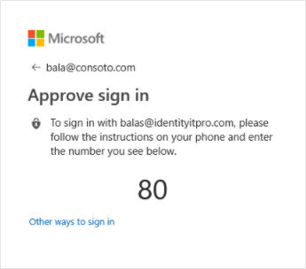

# Support passwordless authentication with FIDO2 keys in apps you develop

Using Azure Active Directory for authentication in your applications allows you to support [passwordless authentication with FIDO2 security keys](https://docs.microsoft.com/en-u/azure/active-directory/authentication/concept-authentication-passwordless#fido2-security-keys). This document covers our recommendations for developers to ensure that the FIDO2 passwordless authentication option will be available to users of your applications.

## General app configuration considerations

There are a few configurations that will affect whether passwordless authentication is available to users of your apps. These are independent of the app&#39;s platform and language.

**Home-realm discovery and domain hints**

Bypassing [home-realm discovery](https://docs.microsoft.com/azure/active-directory/manage-apps/configure-authentication-for-federated-users-portal#home-realm-discovery) by providing a domain hint will prevent passwordless authentication from being available. Your app should not use a domain hint in the authorization request if you wish to support passwordless authentication.

**Requiring specific kinds of credentials**

Applications that use SAML can specify the type of authentication that they want to use by [using the RequestedAuthnContext element](single-sign-on-saml-protocol.md#requestauthncontext). However, this will prevent passwordless authentication from working if you require a password.

The RequestedAuthnContext element is optional, so to resolve this you can remove it from your SAML authentication requests. This is a general best practice, as using this element can also prevent other authentication options like multi-factor authentication from working correctly.

**Changing from the most recently used authentication method**

Be aware that the sign in method that was most recently used by a user will be presented to them first. This may cause confusion when users believe they must use the first option presented. However, they can choose another option.

## Platform specific considerations

The following is our best practices guidance for ensuring the availability of FIDO2 passwordless authentication by platform.

**Desktop best practices**

Our first reccomendation is that .NET desktop applications that are using the Microsoft Authentication Library should use the Windows Authentication Manager (WAM) to support the best authentication experience. This integration and its benefits are [documented on GitHub](https://github.com/AzureAD/microsoft-authentication-library-for-dotnet/wiki/wam).

If this is not an option, your application should use [WebView2](https://docs.microsoft.com/microsoft-edge/webview2/) to support FIDO2 in an embedded browser so that users can authenticate without leaving the app.

And if neither of those will work for you, you should use the system browser. The MSAL librararies for desktop platforms use this method by default. You can consult our page on FIDO2 browser compatibility to ensure the browser you use supports FIDO2 authentication. 

**Mobile best practices**

As of February 2020, FIDO2 is not currently supported for native iOS or Android apps, but it is in development.

To prepare applications for its availability, and as a general best practice, iOS and Android applications should use MSAL with its default configuration of using the system web browser.

If you are not using MSAL, you should still use the system web browser for authentication. Features such as single sign-on and conditional access rely on a shared web surface provided by the system web browser. This means using [Chrome Custom Tabs](https://developer.chrome.com/docs/multidevice/android/customtabs/) (Android) or [Authenticating a User Through a Web Service | Apple Developer Documentation](https://developer.apple.com/documentation/authenticationservices/authenticating_a_user_through_a_web_service) (iOS).

**Web App and SPA best practices**

The availability of FIDO2 passwordless authentication for applications that run in a web browser will depending on the combination of browser and platform. You can consult or FIDO2 compatibility matrix to check if the combination your users will encounter is supported.

## Additional resources

[Passwordless authentication options for Azure Active Directory](https://docs.microsoft.com/azure/active-directory/authentication/concept-authentication-passwordless)
