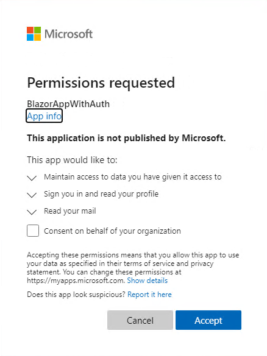
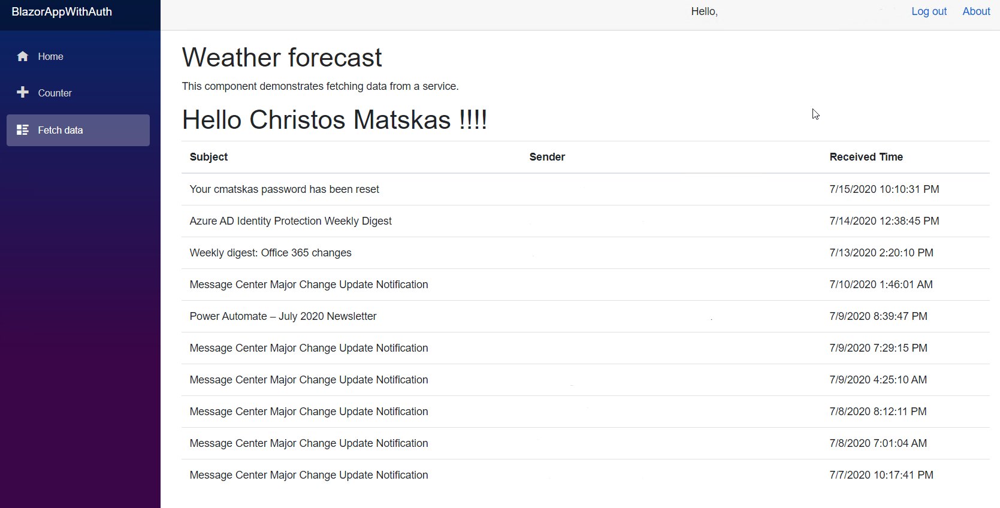

# Tutorial: Create a Blazor Server app that uses the Microsoft identity platform for authentication

Blazor Server provides support for hosting Razor components on the server in an ASP.NET Core app. In this tutorial, you learn how to implement authentication and retrieve data from Microsoft Graph in a Blazor Server app with the Microsoft identity platform.

In this tutorial, you learn how to:

> [!div class="checklist"]
> * Create a new Blazor Server app configured to use Azure Active Directory (Azure AD) for authentication
> * Handle both authentication and authorization using Microsoft.Identity.Web
> * Retrieve data from a protected web API, Microsoft Graph

## Prerequisites

- [.NET Core 3.1 SDK](https://dotnet.microsoft.com/download/dotnet-core/3.1)
- An Azure AD tenant where you can register an app. If you don’t have access to an Azure AD tenant, you can get one by registering with the [Microsoft 365 Developer Program](https://developer.microsoft.com/microsoft-365/dev-program) or by creating an [Azure free account](https://azure.microsoft.com/free).

## Create the app using the .NET CLI and register it in the Azure portal

Every app that uses Azure Active Directory (Azure AD) for authentication must be registered with Azure AD. You can create a new registration and then use the [.NET CLI](/dotnet/core/tools/) to create a new Blazor app using the following instructions. If you're using Visual Studio 2019, you can skip this option and instead use [Option 2](#option-2-register-and-create-the-app-using-visual-studio-2019).

First, follow the instructions in [Register an application](quickstart-register-app.md) with the following settings:

- For **Supported account types**, select **Accounts in this organizational directory only**.
- Leave the **Redirect URI** drop down set to **Web** and enter `https://localhost:5001/signin-oidc`. The default port for an app running on Kestrel is 5001. If the app is available on a different port, specify that port number instead of `5001`.

In **Authentication** > **Implicit grant**, select the check boxes for **Access tokens** and **ID tokens**, and then select the **Save** button.

Create the app in an empty folder. Run the following command to download the templates for Microsoft.Identity.Web, which we will make use of in this tutorial. 

'''dotnetcli
dotnet new --install Microsoft.Identity.Web.ProjectTemplates::0.4.0-preview
'''

Then, run the following command to create the application. Replace the placeholders in the command with the proper information from your app's overview page and execute the command in a command shell:

```dotnetcli
dotnet new blazorserver2 --auth SingleOrg --calls-graph -o {APP NAME} --client-id "{CLIENT ID}" --tenant-id "{TENANT ID}"
```

| Placeholder   | Azure portal name       | Example                                |
| ------------- | ----------------------- | -------------------------------------- |
| `{APP NAME}`  | &mdash;                 | `BlazorSample`                         |
| `{CLIENT ID}` | Application (client) ID | `41451fa7-0000-0000-0000-69eff5a761fd` |
| `{TENANT ID}` | Directory (tenant) ID   | `e86c78e2-0000-0000-0000-918e0565a45e` |

The output location specified with the `-o|--output` option creates a project folder if it doesn't exist and becomes part of the app's name.

Finally, because the app calls a protected API (in this case Microsoft Graph), it needs a client secret in order to verify its identity when it requests an access token to call that API. 

1. Within the same app registration, under **Manage**, select **Certificates & secrets**.
2. Create a **New client secret** that never expires.
3. Copy the secret's **Value** to your clipboard. You can’t access it again once you navigate away from this pane. However, you can recreate it as needed.

Navigate to your new Blazor app in your editor and add the client secret to the *appsettings.json* file, replacing the text "secret-from-app-registration".

You can now build and run the app. When you run this template app, you must specify the framework to run using --framework. This tutorial uses the .NET Core 3.1 SDK. 

'''dotnetcli
dotnet run --framework netcoreapp3.1
'''

In your browser, navigate to `https://localhost:5001`, and log in using an Azure AD user account to see the app running. 

## Retrieving data from Microsoft Graph

[Microsoft Graph](/graph/overview) offers a range of APIs that provide access to your users' Microsoft 365 data. By using the Microsoft identity platform as the identity provider for your app, you have easier access to this information since Microsoft Graph directly supports the tokens issued by the Microsoft identity platform. In this section, you add code can display the signed in user's emails on the application's "fetch data" page.

Before you start, log out of your app since you'll be making changes to the required permissions, and your current token won't work. If you haven't already, run your app again and select **Log out** before updating the code below. 

Now you will update your app's registration and code to pull a user's email and display the messages within the app. To achieve this, first extend the app registration permissions in Azure AD to enable access to the email data. Then, add code to the Blazor app to retrieve and display this data in one of the pages.

1. In the Azure portal, select your app in **App registrations**.
1. Under **Manage**, select **API permissions**.
1. Select **Add a permission** > **Microsoft Graph**.
1. Select **Delegated Permissions**, then search for and select the **Mail.Read** permission.
1. Select **Add permissions**.

In the *appsettings.json* file, update your code so it fetches the appropriate token with the right permissions. Add "mail.read" after the "user.read" scope under "DownstreamAPI". This is specifying which scopes (or permissions) the app will request access to.

Next, update the code in the *FetchData.razor* file to retrieve email data instead of the default (random) weather details. Replace the code in that file with the following:

```csharp
@page "/fetchdata"

@inject IHttpClientFactory HttpClientFactory
@inject Microsoft.Identity.Web.ITokenAcquisition TokenAcquisitionService

<h1>Weather forecast</h1>

<p>This component demonstrates fetching data from a service.</p>

@if (messages == null)
{
    <p><em>Loading...</em></p>
}
else
{
    <h1>Hello @userDisplayName !!!!</h1>
    <table class="table">
        <thead>
            <tr>
                <th>Subject</th>
                <th>Sender</th>
                <th>Received Time</th>
            </tr>
        </thead>
        <tbody>
            @foreach (var mail in messages)
            {
                <tr>
                    <td>@mail.Subject</td>
                    <td>@mail.Sender</td>
                    <td>@mail.ReceivedTime</td>
                </tr>
            }
        </tbody>
    </table>
}

@code {

    private string userDisplayName;
    private List<MailMessage> messages = new List<MailMessage>();

    private HttpClient _httpClient;

    protected override async Task OnInitializedAsync()
    {
        _httpClient = HttpClientFactory.CreateClient();


        // get a token
        var token = await TokenAcquisitionService.GetAccessTokenForUserAsync(new string[] { "User.Read", "Mail.Read" });

        // make API call
        _httpClient.DefaultRequestHeaders.Authorization = new System.Net.Http.Headers.AuthenticationHeaderValue("Bearer", token);
        var dataRequest = await _httpClient.GetAsync("https://graph.microsoft.com/beta/me");

        if (dataRequest.IsSuccessStatusCode)
        {
            var userData = System.Text.Json.JsonDocument.Parse(await dataRequest.Content.ReadAsStreamAsync());
            userDisplayName = userData.RootElement.GetProperty("displayName").GetString();
        }

        var mailRequest = await _httpClient.GetAsync("https://graph.microsoft.com/beta/me/messages?$select=subject,receivedDateTime,sender&$top=10");

        if (mailRequest.IsSuccessStatusCode)
        {
            var mailData = System.Text.Json.JsonDocument.Parse(await mailRequest.Content.ReadAsStreamAsync());
            var messagesArray = mailData.RootElement.GetProperty("value").EnumerateArray();

            foreach (var m in messagesArray)
            {
                var message = new MailMessage();
                message.Subject = m.GetProperty("subject").GetString();
                message.Sender = m.GetProperty("sender").GetProperty("emailAddress").GetProperty("address").GetString();
                message.ReceivedTime = m.GetProperty("receivedDateTime").GetDateTime();
                messages.Add(message);
            }
        }
    }

    public class MailMessage
    {
        public string Subject;
        public string Sender;
        public DateTime ReceivedTime;
    }
}

```

> [!NOTE]
> If you stop the app while using an in-memory token cache, the token cache will be cleared but the application cookie may persist. To avoid this, you can use a persistent token cache, or clear you cookies from the browser session to avoid an abnormal app state.

Launch the app. You’ll notice that you're prompted for the newly added permissions, indicating that everything is working as expected. Now, beyond basic user profile data, the app is requesting access to email data.



After granting consent, navigate to the "Fetch Data" page to read some email.



## Next steps

- [Microsoft identity platform best practices and recommendations](./identity-platform-integration-checklist.md)
