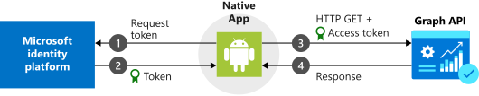

# Tutorial: Sign in users and call the Microsoft Graph from an Android application 

>[!NOTE]
>This tutorial demonstrates simplified examples of how to work with MSAL for Android. For simplicity, this tutorial only uses Single Account Mode. You can also view the repo and clone [the preconfigured sample app](https://github.com/Azure-Samples/ms-identity-android-java/) to explore more complex scenarios. View the [Quickstart](https://docs.microsoft.com/azure/active-directory/develop/quickstart-v2-android) for more on the sample app, configuration, and registration. 

In this tutorial, you'll learn how to integrate your android app with the Microsoft identity platform using the Microsoft Authentication Library for Android. You'll learn how to sign in and sign out a user, get an access token to call the Microsoft Graph API, and make a request to the Graph API. 

> [!div class="checklist"]
> * Integrate your Android App with the Microsoft Identity Platform 
> * Sign in a user 
> * Get an access token to call the Microsoft Graph API 
> * Call the Microsoft Graph API 
> * Sign out a user 

When you've completed this tutorial, your application will accept sign-ins of personal Microsoft accounts (including outlook.com, live.com, and others) as well as work or school accounts from any company or organization that uses Azure Active Directory.

If you don’t have an Azure subscription, create a [free account](https://azure.microsoft.com/free/?WT.mc_id=A261C142F) before you begin.

## How this tutorial works



The app in this tutorial will sign in users and get data on their behalf. This data will be accessed through a protected API (Microsoft Graph API) that requires authorization and is protected by the Microsoft identity platform.

More specifically:

* Your app will sign in the user either through a browser or the Microsoft Authenticator and Intune Company Portal.
* The end user will accept the permissions your application has requested.
* Your app will be issued an access token for the Microsoft Graph API.
* The access token will be included in the HTTP request to the web API.
* Process the Microsoft Graph response.

This sample uses the Microsoft Authentication library for Android (MSAL) to implement Authentication: [com.microsoft.identity.client](https://javadoc.io/doc/com.microsoft.identity.client/msal).

 MSAL will automatically renew tokens, deliver single sign-on (SSO) between other apps on the device, and manage the Account(s).

### Prerequisites

* This tutorial requires Android Studio version 3.5+

## Create a Project
If you do not already have an Android application, follow these steps to set up a new project. 

1. Open Android Studio, and select **Start a new Android Studio project**.
2. Select **Basic Activity** and select **Next**.
3. Name your application.
4. Save the package name. You will enter it later into the Azure portal.
5. Change the language from **Kotlin** to **Java**.
6. Set the **Minimum API level** to **API 19** or higher, and click **Finish**.
7. In the project view, choose **Project** in the dropdown to display source and non-source project files, open **app/build.gradle** and set `targetSdkVersion` to `28`.

## Integrate with Microsoft Authentication Library 

### Register your application

1. Go to the [Azure portal](https://aka.ms/MobileAppReg).
2. Open the [App registrations blade](https://ms.portal.azure.com/#blade/Microsoft_AAD_RegisteredApps/ApplicationsListBlade) and click **+New registration**.
3. Enter a **Name** for your app and then, **without** setting a Redirect URI, click **Register**.
4. In the **Manage** section of the pane that appears, select **Authentication** > **+ Add a platform** > **Android**. (You may have to select "Switch to the new experience" near the top of the blade to see this section)
5. Enter your project's Package Name. If you downloaded the code, this value is `com.azuresamples.msalandroidapp`.
6. In the **Signature hash** section of the **Configure your Android app** page, click **Generating a development Signature Hash.** and copy the KeyTool command to use for your platform.

   > [!Note]
   > KeyTool.exe is installed as part of the Java Development Kit (JDK). You must also install the OpenSSL tool to execute the KeyTool command. Refer to the [Android documentation on generating a key](https://developer.android.com/studio/publish/app-signing#generate-key) for more information. 

7. Enter the **Signature hash** generated by KeyTool.
8. Click `Configure` and save the **MSAL Configuration** that appears in the **Android configuration** page so you can enter it when you configure your app later.  Click **Done**.

### Configure your application 

1. In Android Studio's project pane, navigate to **app\src\main\res**.
2. Right-click **res** and choose **New** > **Directory**. Enter `raw` as the new directory name and click **OK**.
3. In **app** > **src** > **main** > **res** > **raw**, create a new JSON file called `auth_config_single_account.json` and paste the MSAL Configuration that you saved earlier. 

    Below the redirect URI, paste: 
    ```json
      "account_mode" : "SINGLE",
    ```
    Your config file should resemble this example: 
    ```json   
    {
      "client_id" : "0984a7b6-bc13-4141-8b0d-8f767e136bb7",
      "authorization_user_agent" : "DEFAULT",
      "redirect_uri" : "msauth://com.azuresamples.msalandroidapp/1wIqXSqBj7w%2Bh11ZifsnqwgyKrY%3D",
      "account_mode" : "SINGLE",
      "authorities" : [
        {
          "type": "AAD",
          "audience": {
            "type": "AzureADandPersonalMicrosoftAccount",
            "tenant_id": "common"
          }
        }
      ]
    }
   ```
    
   >[!NOTE]
   >This tutorial only demonstrates how to configure an app in Single Account mode. View the documentation for more information on [single vs. multiple account mode](https://docs.microsoft.com/azure/active-directory/develop/single-multi-account) and [configuring your app](https://docs.microsoft.com/azure/active-directory/develop/msal-configuration)
   
4. In **app** > **src** > **main** > **AndroidManifest.xml**, add the `BrowserTabActivity` activity below to the application body. This entry allows Microsoft to call back to your application after it completes the authentication:

    ```xml
    <!--Intent filter to capture System Browser or Authenticator calling back to our app after sign-in-->
    <activity
        android:name="com.microsoft.identity.client.BrowserTabActivity">
        <intent-filter>
            <action android:name="android.intent.action.VIEW" />
            <category android:name="android.intent.category.DEFAULT" />
            <category android:name="android.intent.category.BROWSABLE" />
            <data android:scheme="msauth"
                android:host="Enter_the_Package_Name"
                android:path="/Enter_the_Signature_Hash" />
        </intent-filter>
    </activity>
    ```

    Substitute the package name you registered in the Azure portal for the `android:host=` value.
    Substitute the key hash you registered in the Azure portal for the `android:path=` value. The Signature Hash should **not** be URL encoded. Ensure that there is a leading `/` at the beginning of your Signature Hash. 
    >[!NOTE]
    >The "Package Name" you will replace the `android:host` value with should look similar to: "com.azuresamples.msalandroidapp"
    >The "Signature Hash" you will replace your `android:path` value with should look similar to: "/1wIqXSqBj7w+h11ZifsnqwgyKrY="
    >You will also be able to find these values in the Authentication blade of your app registration. Note that your redirect URI will look similar to: "msauth://com.azuresamples.msalandroidapp/1wIqXSqBj7w%2Bh11ZifsnqwgyKrY%3D". While the Signature Hash is URL encoded at the end of this value, the Signature Hash should **not** be URL encoded in your `android:path` value. 

## Use MSAL 

### Add MSAL to your project

1. In the Android Studio project window, navigate to **app** > **src** > **build.gradle** and add the following: 

    ```gradle
    repositories{
        jcenter()
    }  
    dependencies{
        implementation 'com.microsoft.identity.client:msal:1.+'
        implementation 'com.microsoft.graph:microsoft-graph:1.5.+'
    }
    packagingOptions{
        exclude("META-INF/jersey-module-version") 
    }
    ```
    [More on the Microsoft Graph SDK](https://github.com/microsoftgraph/msgraph-sdk-java/)

### Required Imports 

Add the following to the top of **app** > **src** > **main**> **java** > **com.example(yourapp)** > **MainActivity.java** 

```java
import android.os.Bundle;
import android.util.Log;
import android.view.View;
import android.widget.Button;
import android.widget.TextView;
import android.widget.Toast;
import androidx.annotation.NonNull;
import androidx.annotation.Nullable;
import androidx.appcompat.app.AppCompatActivity;
import com.google.gson.JsonObject;
import com.microsoft.graph.authentication.IAuthenticationProvider; //Imports the Graph sdk Auth interface
import com.microsoft.graph.concurrency.ICallback;
import com.microsoft.graph.core.ClientException;
import com.microsoft.graph.http.IHttpRequest;
import com.microsoft.graph.models.extensions.*;
import com.microsoft.graph.requests.extensions.GraphServiceClient;
import com.microsoft.identity.client.AuthenticationCallback; // Imports MSAL auth methods
import com.microsoft.identity.client.*;
import com.microsoft.identity.client.exception.*;
```

## Instantiate PublicClientApplication
#### Initialize Variables 
```java
private final static String[] SCOPES = {"Files.Read"};
/* Azure AD v2 Configs */
final static String AUTHORITY = "https://login.microsoftonline.com/common";
private ISingleAccountPublicClientApplication mSingleAccountApp;

private static final String TAG = MainActivity.class.getSimpleName();

/* UI & Debugging Variables */
Button signInButton;
Button signOutButton;
Button callGraphApiInteractiveButton;
Button callGraphApiSilentButton;
TextView logTextView;
TextView currentUserTextView;
```

### onCreate
Inside the `MainActivity` class, refer to the following onCreate() method to instantiate MSAL using the `SingleAccountPublicClientApplication`.

```java
@Override
protected void onCreate(Bundle savedInstanceState) {
    super.onCreate(savedInstanceState);
    setContentView(R.layout.activity_main);

    initializeUI();

    PublicClientApplication.createSingleAccountPublicClientApplication(getApplicationContext(),
            R.raw.auth_config_single_account, new IPublicClientApplication.ISingleAccountApplicationCreatedListener() {
                @Override
                public void onCreated(ISingleAccountPublicClientApplication application) {
                    mSingleAccountApp = application;
                    loadAccount();
                }
                @Override
                public void onError(MsalException exception) {
                    displayError(exception);
                }
            });
}
```

### loadAccount 

```java
//When app comes to the foreground, load existing account to determine if user is signed in 
private void loadAccount() {
    if (mSingleAccountApp == null) {
        return;
    }

    mSingleAccountApp.getCurrentAccountAsync(new ISingleAccountPublicClientApplication.CurrentAccountCallback() {
        @Override
        public void onAccountLoaded(@Nullable IAccount activeAccount) {
            // You can use the account data to update your UI or your app database.
            updateUI(activeAccount);
        }
        
        @Override
        public void onAccountChanged(@Nullable IAccount priorAccount, @Nullable IAccount currentAccount) {
            if (currentAccount == null) {
                // Perform a cleanup task as the signed-in account changed.
                performOperationOnSignOut();
            }
        }

        @Override
        public void onError(@NonNull MsalException exception) {
            displayError(exception);
        }
    });
}
```

### initializeUI
Listen to buttons and call methods or log errors accordingly. 
```java
private void initializeUI(){
        signInButton = findViewById(R.id.signIn);
        callGraphApiSilentButton = findViewById(R.id.callGraphSilent);
        callGraphApiInteractiveButton = findViewById(R.id.callGraphInteractive);
        signOutButton = findViewById(R.id.clearCache);
        logTextView = findViewById(R.id.txt_log);
        currentUserTextView = findViewById(R.id.current_user);
        
        //Sign in user 
        signInButton.setOnClickListener(new View.OnClickListener(){
            public void onClick(View v) {
                if (mSingleAccountApp == null) {
                    return;
                }
                mSingleAccountApp.signIn(MainActivity.this, null, SCOPES, getAuthInteractiveCallback());
            }
        });
        
        //Sign out user
        signOutButton.setOnClickListener(new View.OnClickListener() {
            @Override
            public void onClick(View v) {
                if (mSingleAccountApp == null){
                    return;
                }
                mSingleAccountApp.signOut(new ISingleAccountPublicClientApplication.SignOutCallback() {
                    @Override
                    public void onSignOut() {
                        updateUI(null);
                        performOperationOnSignOut();
                    }
                    @Override
                    public void onError(@NonNull MsalException exception){
                        displayError(exception);
                    }
                });
            }
        });
        
        //Interactive 
        callGraphApiInteractiveButton.setOnClickListener(new View.OnClickListener() {
            @Override
            public void onClick(View v) {
                if (mSingleAccountApp == null) {
                    return;
                }
                mSingleAccountApp.acquireToken(MainActivity.this, SCOPES, getAuthInteractiveCallback());
            }
        });

        //Silent
        callGraphApiSilentButton.setOnClickListener(new View.OnClickListener() {
            @Override
            public void onClick(View v) {
                if (mSingleAccountApp == null){
                    return;
                }
                mSingleAccountApp.acquireTokenSilentAsync(SCOPES, AUTHORITY, getAuthSilentCallback());
            }
        });
    }
```

> [!Important]
> Signing out with MSAL removes all known information about a user from the application, but the user will still have an active session on their device. If the user attempts to sign in again they may see sign-in UI, but may not need to reenter their credentials because the device session is still active. 

### getAuthInteractiveCallback
Callback used for interactive requests.

```java 
private AuthenticationCallback getAuthInteractiveCallback() {
    return new AuthenticationCallback() {
        @Override
        public void onSuccess(IAuthenticationResult authenticationResult) {
            /* Successfully got a token, use it to call a protected resource - MSGraph */
            Log.d(TAG, "Successfully authenticated");
            /* Update UI */
            updateUI(authenticationResult.getAccount());
            /* call graph */
            callGraphAPI(authenticationResult);
        }

        @Override
        public void onError(MsalException exception) {
            /* Failed to acquireToken */
            Log.d(TAG, "Authentication failed: " + exception.toString());
            displayError(exception);
        }
        @Override
        public void onCancel() {
            /* User canceled the authentication */
            Log.d(TAG, "User cancelled login.");
        }
    };
}
```

### getAuthSilentCallback
Callback used for silent requests 
```java 
private SilentAuthenticationCallback getAuthSilentCallback() {
    return new SilentAuthenticationCallback() {
        @Override
        public void onSuccess(IAuthenticationResult authenticationResult) {
            Log.d(TAG, "Successfully authenticated");
            callGraphAPI(authenticationResult);
        }
        @Override
        public void onError(MsalException exception) {
            Log.d(TAG, "Authentication failed: " + exception.toString());
            displayError(exception);
        }
    };
}
```

## Call Microsoft Graph API 

The following code demonstrates how to call the GraphAPI using the Graph SDK. 

### callGraphAPI 

```java
private void callGraphAPI(IAuthenticationResult authenticationResult) {

    final String accessToken = authenticationResult.getAccessToken();

    IGraphServiceClient graphClient =
            GraphServiceClient
                    .builder()
                    .authenticationProvider(new IAuthenticationProvider() {
                        @Override
                        public void authenticateRequest(IHttpRequest request) {
                            Log.d(TAG, "Authenticating request," + request.getRequestUrl());
                            request.addHeader("Authorization", "Bearer " + accessToken);
                        }
                    })
                    .buildClient();
    graphClient
            .me()
            .drive()
            .buildRequest()
            .get(new ICallback<Drive>() {
                @Override
                public void success(final Drive drive) {
                    Log.d(TAG, "Found Drive " + drive.id);
                    displayGraphResult(drive.getRawObject());
                }

                @Override
                public void failure(ClientException ex) {
                    displayError(ex);
                }
            });
}
```

## Add UI
### Activity 
If you would like to model your UI off this tutorial, the following methods provide a guide to updating text and listening to buttons.

#### updateUI
Enable/disable buttons based on sign-in state and set text.  
```java 
private void updateUI(@Nullable final IAccount account) {
    if (account != null) {
        signInButton.setEnabled(false);
        signOutButton.setEnabled(true);
        callGraphApiInteractiveButton.setEnabled(true);
        callGraphApiSilentButton.setEnabled(true);
        currentUserTextView.setText(account.getUsername());
    } else {
        signInButton.setEnabled(true);
        signOutButton.setEnabled(false);
        callGraphApiInteractiveButton.setEnabled(false);
        callGraphApiSilentButton.setEnabled(false);
        currentUserTextView.setText("");
        logTextView.setText("");
    }
}
```
#### displayError
```java 
private void displayError(@NonNull final Exception exception) {
       logTextView.setText(exception.toString());
   }
```

#### displayGraphResult

```java
private void displayGraphResult(@NonNull final JsonObject graphResponse) {
      logTextView.setText(graphResponse.toString());
  }
```
#### performOperationOnSignOut
Method to update text in UI to reflect sign out. 

```java
private void performOperationOnSignOut() {
    final String signOutText = "Signed Out.";
    currentUserTextView.setText("");
    Toast.makeText(getApplicationContext(), signOutText, Toast.LENGTH_SHORT)
            .show();
}
```
### Layout 

Sample `activity_main.xml` file to display buttons and text boxes. 

```xml 
<?xml version="1.0" encoding="utf-8"?>
<LinearLayout xmlns:android="http://schemas.android.com/apk/res/android"
    xmlns:tools="http://schemas.android.com/tools"
    android:id="@+id/activity_main"
    android:layout_width="match_parent"
    android:layout_height="match_parent"
    android:background="#FFFFFF"
    android:orientation="vertical"
    tools:context=".MainActivity">

    <LinearLayout
        android:layout_width="match_parent"
        android:layout_height="wrap_content"
        android:orientation="horizontal"
        android:paddingTop="5dp"
        android:paddingBottom="5dp"
        android:weightSum="10">

        <Button
            android:id="@+id/signIn"
            android:layout_width="0dp"
            android:layout_height="wrap_content"
            android:layout_weight="5"
            android:gravity="center"
            android:text="Sign In"/>

        <Button
            android:id="@+id/clearCache"
            android:layout_width="0dp"
            android:layout_height="wrap_content"
            android:layout_weight="5"
            android:gravity="center"
            android:text="Sign Out"
            android:enabled="false"/>

    </LinearLayout>
    <LinearLayout
        android:layout_width="match_parent"
        android:layout_height="wrap_content"
        android:gravity="center"
        android:orientation="horizontal">

        <Button
            android:id="@+id/callGraphInteractive"
            android:layout_width="0dp"
            android:layout_height="wrap_content"
            android:layout_weight="5"
            android:text="Get Graph Data Interactively"
            android:enabled="false"/>

        <Button
            android:id="@+id/callGraphSilent"
            android:layout_width="0dp"
            android:layout_height="wrap_content"
            android:layout_weight="5"
            android:text="Get Graph Data Silently"
            android:enabled="false"/>
    </LinearLayout>

    <TextView
        android:text="Getting Graph Data..."
        android:textColor="#3f3f3f"
        android:layout_width="match_parent"
        android:layout_height="wrap_content"
        android:layout_marginLeft="5dp"
        android:id="@+id/graphData"
        android:visibility="invisible"/>

    <TextView
        android:id="@+id/current_user"
        android:layout_width="match_parent"
        android:layout_height="0dp"
        android:layout_marginTop="20dp"
        android:layout_weight="0.8"
        android:text="Account info goes here..." />

    <TextView
        android:id="@+id/txt_log"
        android:layout_width="match_parent"
        android:layout_height="0dp"
        android:layout_marginTop="20dp"
        android:layout_weight="0.8"
        android:text="Output goes here..." />
</LinearLayout>
```

## Test your app

### Run locally

Build and deploy the app to a test device or emulator. You should be able to sign in and get tokens for Azure AD or personal Microsoft accounts.

After you sign in, the app will display the data returned from the Microsoft Graph `/me` endpoint.

### Consent

The first time any user signs into your app, they will be prompted by Microsoft identity to consent to the permissions requested. Some Azure AD tenants have disabled user consent which requires admins to consent on behalf of all users. To support this scenario, you will either need to create your own tenant or receive admin consent. 

## Clean up resources

When no longer needed, delete the app object that you created in the [Register your application](#register-your-application) step.

## Get help

Visit [Help and support](https://docs.microsoft.com/azure/active-directory/develop/developer-support-help-options) if you have trouble with this tutorial or with the Microsoft identity platform.
