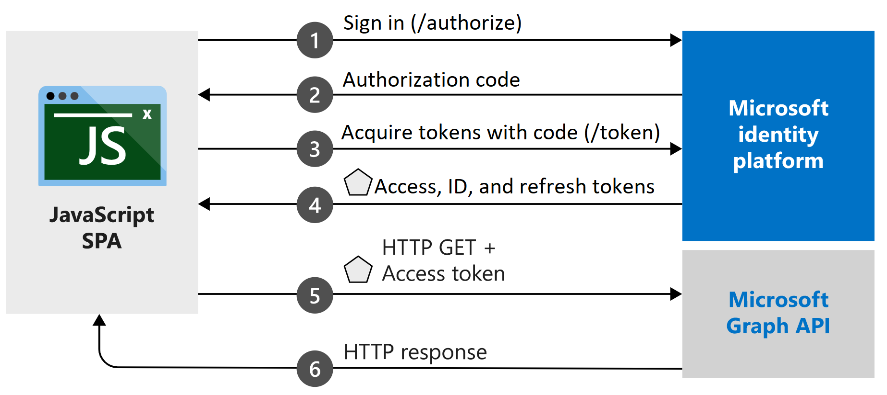

# Tutorial: Sign in users and call the Microsoft Graph API from an Angular single-page application (SPA) using auth code flow

In this tutorial, you build an Angular single-page application (SPA) that signs in users and calls the Microsoft Graph API by using the authorization code flow with PKCE. The SPA you build uses the Microsoft Authentication Library (MSAL) for JavaScript v2.0.

In this tutorial:

> [!div class="checklist"]
> * Create an Angular project with `npm`
> * Register the application in the Azure portal
> * Add code to support user sign-in and sign-out
> * Add code to call Microsoft Graph API
> * Test the app

MSAL.js 2.0 improves on MSAL.js 1.0 by supporting the authorization code flow in the browser instead of the implicit grant flow. MSAL.js 2.0 does **NOT** support the implicit flow.

## Prerequisites

* [Node.js](https://nodejs.org/en/download/) for running a local web server.
* [Visual Studio Code](https://code.visualstudio.com/download) or other editor for modifying project files.

## How the sample app works



The sample application created in this tutorial enables an Angular SPA to query the Microsoft Graph API or a web API that accepts tokens issued by the Microsoft identity platform. It uses the Microsoft Authentication Library (MSAL) for Angular v2.0, a wrapper of the MSAL.js v2.0 library. MSAL Angular enables Angular 9+ applications to authenticate enterprise users by using Azure Active Directory (Azure AD), and also users with Microsoft accounts and social identities like Facebook, Google, and LinkedIn. The library also enables applications to get access to Microsoft cloud services and Microsoft Graph.

In this scenario, after a user signs in, an access token is requested and added to HTTP requests through the authorization header. Token acquisition and renewal are handled by MSAL.

### Libraries

This tutorial uses the following library:

|Library|Description|
|---|---|
|[msal.js](https://github.com/AzureAD/microsoft-authentication-library-for-js)|Microsoft Authentication Library for JavaScript Angular Wrapper|

You can find the source code for the MSAL.js library in the [AzureAD/microsoft-authentication-library-for-js](https://github.com/AzureAD/microsoft-authentication-library-for-js) repository on GitHub.

## Create your project

Generate a new Angular application by using the following npm commands:

```bash
npm install -g @angular/cli                         # Install the Angular CLI
ng new my-application --routing=true --style=css    # Generate a new Angular app
cd my-application                                   # Change to the app directory
npm install @angular/material @angular/cdk          # Install the Angular Material component library (optional, for UI)
npm install @azure/msal-browser @azure/msal-angular # Install MSAL Browser and MSAL Angular in your application
ng generate component page-name                     # To add a new page (such as a home or profile page)
```

## Register your application

Follow the [instructions to register a single-page application](./scenario-spa-app-registration.md) in the Azure portal.

On the app **Overview** page of your registration, note the **Application (client) ID** value for later use.

Register your **Redirect URI** value as **http://localhost:4200/** and type as 'SPA'.

## Configure the application

1. In the *src/app* folder, edit *app.module.ts* and add `MsalModule` to `imports` as well as the `isIE` constant:

    ```javascript
    import { MsalModule } from '@azure/msal-angular';
    import { PublicClientApplication } from '@azure/msal-browser';

    const isIE = window.navigator.userAgent.indexOf('MSIE ') > -1 || window.navigator.userAgent.indexOf('Trident/') > -1;

    @NgModule({
      declarations: [
        AppComponent
      ],
      imports: [
        BrowserModule,
        AppRoutingModule,
        MsalModule.forRoot( new PublicClientApplication({
          auth: {
            clientId: 'Enter_the_Application_Id_here', // This is your client ID
            authority: 'Enter_the_Cloud_Instance_Id_Here'/'Enter_the_Tenant_Info_Here', // This is your tenant ID
            redirectUri: 'Enter_the_Redirect_Uri_Here'// This is your redirect URI
          },
          cache: {
            cacheLocation: 'localStorage',
            storeAuthStateInCookie: isIE, // Set to true for Internet Explorer 11
          }
        }), null, null)
      ],
      providers: [],
      bootstrap: [AppComponent]
    })
    ```

    Replace these values:

    |Value name|About|
    |---------|---------|
    |Enter_the_Application_Id_Here|On the **Overview** page of your application registration, this is your **Application (client) ID** value. |
    |Enter_the_Cloud_Instance_Id_Here|This is the instance of the Azure cloud. For the main or global Azure cloud, enter **https://login.microsoftonline.com**. For national clouds (for example, China), see [National clouds](./authentication-national-cloud.md).|
    |Enter_the_Tenant_Info_Here| Set to one of the following options: If your application supports *accounts in this organizational directory*, replace this value with the directory (tenant) ID or tenant name (for example, **contoso.microsoft.com**). If your application supports *accounts in any organizational directory*, replace this value with **organizations**. If your application supports *accounts in any organizational directory and personal Microsoft accounts*, replace this value with **common**. To restrict support to *personal Microsoft accounts only*, replace this value with **consumers**. |
    |Enter_the_Redirect_Uri_Here|Replace with **http://localhost:4200**.|

    For more information about available configurable options, see [Initialize client applications](msal-js-initializing-client-applications.md).

2. At the top of the same file, add the following import statement:

    ```javascript
    import { MsalModule, MsalInterceptor } from '@azure/msal-angular';
    ```

3. If you are planning to use redirects, we recommend also bootstrapping the `MsalRedirectComponent` and adding the `<app-redirect>` selector to *src/index.html*:

    ```javascript
    // app.component.ts
    import { MsalModule, MsalRedirectComponent } from '@azure/msal-angular';

    @NgModule({
      // ...
      bootstrap: [AppComponent, MsalRedirectComponent]
    })
    ```

    ```javascript
    // index.html
    <body>
      <app-root></app-root>
      <app-redirect></app-redirect>
    </body>
    ```

4. Add the following import statements to the top of `src/app/app.component.ts`:

    ```javascript
    import { MsalService, MsalBroadcastService } from '@azure/msal-angular';
    import { Component, OnInit } from '@angular/core';
    ```
## Sign in a user

Add the following code to `AppComponent` to sign in a user:

```javascript
export class AppComponent implements OnInit {
  constructor(private broadcastService: MsalBroadcastService, private authService: MsalService) { }

  ngOnInit() { }

  login() {
    const isIE = window.navigator.userAgent.indexOf('MSIE ') > -1 || window.navigator.userAgent.indexOf('Trident/') > -1;

    if (isIE) {
      this.authService.loginRedirect();
    } else {
      this.authService.loginPopup();
    }
  }
}
```

> [!TIP]
> We recommend using `loginRedirect` for Internet Explorer users.

### Signing in with Redirects
Redirects have to be handled after signing in. If you have bootstrapped the `MsalRedirectComponent` above, redirects back to your app should be handled. If you want to access the result from the sign in, you should subscribe to the `MsalBroadcastService`, filtering for the the `LOGIN_SUCCESS` event as follows:

```javascript
import { Component, OnInit } from '@angular/core';
import { MsalBroadcastService } from '@azure/msal-angular';
import { EventMessage, EventType } from '@azure/msal-browser';
import { filter } from 'rxjs/operators';

export class HomeComponent implements OnInit {

  constructor(private msalBroadcastService: MsalBroadcastService) { }

  ngOnInit(): void {   
    this.msalBroadcastService.msalSubject$
      .pipe(
        filter((msg: EventMessage) => msg.eventType === EventType.LOGIN_SUCCESS),
      )
      .subscribe((result: EventMessage) => {
        // Do something with result here
      });
  }
}
```

If you are unable to bootstrap the `MsalRedirectComponent`, you can handle redirects manually by adding `handleRedirectObservable` to all pages redirected to. If using this method, you can access the result from the sign in as follows:

```javascript
import { Component, OnInit } from '@angular/core';
import { MsalService } from '@azure/msal-angular';

export class HomeComponent implements OnInit {
  loginDisplay = false;

  constructor(private authService: MsalService) { }

  ngOnInit(): void {
    this.authService.handleRedirectObservable().subscribe({
      next: (result) => {
        // Do something with result here
      },
      error: (error) => console.log(error)
    });
  }
}

```

### Signing in with Popups

Results from signing in with popups can be accessed as follows:

```javascript
this.authService.loginPopup()
  .subscribe({
    next: (result) => {
      // Do something with result here
    },
    error: (error) => console.log(error)
  });
```

Other components can also subscribe to the `MsalBroadcastService` and filter for the `LOGIN_SUCCESS` event, as above, when signing in with popups.

## Guarding routes

### Angular Guard

MSAL Angular provides a `Guard` class that can be used to protect routes and require authentication before accessing the protected route.

First, include the `Guard` class as a provider in your application:

```javascript
import { MsalGuard, MsalModule } from "@azure/msal-angular";

@NgModule({
  // ...
  providers: [
    MsalGuard
  ]
}
```

Next, provide configurations for MsalGuard in the `MsalModule.forRoot()`. Scopes needed for acquiring tokens later can be provided in the `authRequest`, and the type of interaction for the Guard can be set to `Redirect` or `Popup`. An optional route can also be provided for when the guard fails.

```javascript
import { InteractionType, PublicClientApplication } from '@azure/msal-browser';

@NgModule({
  // ...
  imports: [
    // ...
    MsalModule.forRoot({
      auth: {
        clientId: 'Enter_the_Application_Id_here', 
        authority: 'Enter_the_Cloud_Instance_Id_Here'/'Enter_the_Tenant_Info_Here', 
        redirectUri: 'Enter_the_Redirect_Uri_Here' 
      },
      cache: {
        cacheLocation: 'localStorage',
        storeAuthStateInCookie: isIE,
      },
    }, {
        interactionType: InteractionType.Redirect, // MSAL Guard Configuration
        authRequest: {
          scopes: ['user.read']
        },
        loginFailedRoute: "/login-failed" 
    }, {
        // ... MSAL Interceptor Configuration 
    })
  ],
});
```

Finally, set the `Guard` on the routes you wish to protect, in the `app-routing.module.ts` in your application:

```javascript
import { NgModule } from '@angular/core';
import { Routes, RouterModule } from '@angular/router';
import { MsalGuard } from '@azure/msal-angular';
import { ProfileComponent } from './profile/profile.component';
import { HomeComponent } from './home/home.component';
import { FailedComponent } from './failed/failed.component';

const routes: Routes = [
  {
    path: 'profile',
    component: ProfileComponent,
    canActivate: [MsalGuard]
  },
  {
    path: '',
    component: HomeComponent
  },
  {
    path: 'login-failed',
    component: FailedComponent
  }
];

@NgModule({
  imports: [RouterModule.forRoot(routes, {
    initialNavigation: !isIframe ? 'enabled' : 'disabled' // Don't perform initial navigation in iframes
  })],
  exports: [RouterModule]
})
export class AppRoutingModule { }
```

You may also wish to adjust your login calls in `app.component.ts` to take the `authRequest` set in the guard configurations into account:

```javascript
import { Component, Inject, OnInit } from '@angular/core';
import { MsalService, MsalBroadcastService, MSAL_GUARD_CONFIG, MsalGuardConfiguration } from '@azure/msal-angular';
import { PopupRequest, RedirectRequest } from '@azure/msal-browser';

export class AppComponent implements OnInit {
  constructor(
    @Inject(MSAL_GUARD_CONFIG) private msalGuardConfig: MsalGuardConfiguration, 
    private msalBroadcastService: MsalBroadcastService, 
    private authService: MsalService) { }

  ngOnInit() { }

  loginRedirect() {
    if (this.msalGuardConfig.authRequest){
      this.authService.loginRedirect({...this.msalGuardConfig.authRequest} as RedirectRequest);
    } else {
      this.authService.loginRedirect();
    }
  }

  loginPopup() {
    if (this.msalGuardConfig.authRequest){
      this.authService.loginPopup({...this.msalGuardConfig.authRequest} as PopupRequest)
        .subscribe();
    } else {
      this.authService.loginPopup()
        .subscribe();
    }
  }
}
```

## Acquire a token

### Angular Interceptor

MSAL Angular provides an `Interceptor` class that automatically acquires tokens for outgoing requests that use the Angular `http` client to known protected resources.

First, include the `Interceptor` class as a provider to your application:

```javascript
import { MsalInterceptor, MsalModule } from "@azure/msal-angular";
import { HTTP_INTERCEPTORS, HttpClientModule } from "@angular/common/http";

@NgModule({
  // ...
  imports : [
    // ...
    HttpClientModule
  ],
  providers: [
    {
      provide: HTTP_INTERCEPTORS,
      useClass: MsalInterceptor,
      multi: true
    }
  ]
}
```

Next, provide configurations for Msal Interceptor in `MsalModule.forRoot()`. The protected resources are provided as a `protectedResourceMap`. The URLs you provide in the `protectedResourceMap` collection are case-sensitive.

```javascript
@NgModule({
  // ...
  imports: [
    // ...
    MsalModule.forRoot({
      auth: {
        clientId: 'Enter_the_Application_Id_here', 
        authority: 'Enter_the_Cloud_Instance_Id_Here'/'Enter_the_Tenant_Info_Here', 
        redirectUri: 'Enter_the_Redirect_Uri_Here' 
      },
      cache: {
        cacheLocation: 'localStorage',
        storeAuthStateInCookie: isIE,
      },
    }, {
        interactionType: InteractionType.Redirect // MSAL Guard Configuration
    }, {
        interactionType: InteractionType.Redirect, // MSAL Interceptor Configuration
        protectedResourceMap: new Map([ 
            ['https://graph.microsoft.com/v1.0/me', ['user.read']]
        ])
    })
  ],
});
```

Finally, retrieve a user's profile with an HTTP request in a component:

```JavaScript
import { Component, OnInit } from '@angular/core';
import { HttpClient } from '@angular/common/http';

const graphMeEndpoint = "https://graph.microsoft.com/v1.0/me";

export class ProfileComponent implements OnInit {
  profile!: { givenName?: string };

  constructor(private http: HttpClient) { }

  ngOnInit(): void {
    this.getProfile();
  }

  getProfile() {
    this.http.get(graphMeEndpoint)
      .subscribe(profile => {
        this.profile = profile;
      });
  }
}

```

### acquireTokenSilent, acquireTokenPopup, acquireTokenRedirect
MSAL uses three methods to acquire tokens: `acquireTokenRedirect`, `acquireTokenPopup`, and `acquireTokenSilent`. However, we recommend using the `MsalInterceptor` class instead for Angular apps, as shown in the previous section.

#### Get a user token silently

The `acquireTokenSilent` method handles token acquisitions and renewal without user interaction. After the `loginRedirect` or `loginPopup` method is executed for the first time, `acquireTokenSilent` is commonly used to obtain tokens used to access protected resources in later calls. Calls to request or renew tokens are made silently.

```javascript
const requestObj = {
  scopes: ["user.read"]
};

this.authService.acquireTokenSilent(requestObj).subscribe({
  next: (tokenResponse) => {
    // Additional code here
    console.log(tokenResponse.accessToken);
  },
  error: (error) => console.log(error)
});
```

In that code, `scopes` contains scopes being requested to be returned in the access token for the API.

For example:

* `["user.read"]` for Microsoft Graph
* `["<Application ID URL>/scope"]` for custom web APIs (that is, `api://<Application ID>/access_as_user`)

#### Get a user token interactively

Sometimes you need the user to interact with the Microsoft identity platform endpoint. For example:

* Users might need to reenter their credentials because their password has expired.
* Your application is requesting access to additional resource scopes that the user needs to consent to.
* Two-factor authentication is required.

The recommended pattern for most applications is to call `acquireTokenSilent` first, then catch the exception, and then call `acquireTokenPopup` (or `acquireTokenRedirect`) to start an interactive request.

```javascript
const requestObj = {
  scopes: ["user.read"]
};

this.authService.acquireTokenSilent(requestObj).subscribe({
  next: (tokenResponse) => {
    console.log(tokenResponse.accessToken);
  },
  error: (error) => {
    this.authService.acquireTokenRedirect(requestObj);
  }
});
```

Calling `acquireTokenPopup` results in a pop-up sign-in window. Alternatively, `acquireTokenRedirect` redirects users to the Microsoft identity platform endpoint. In that window, users need to confirm their credentials, give consent to the required resource, or complete two-factor authentication.

```javascript
const requestObj = {
  scopes: ["user.read"]
};

this.authService.acquireTokenPopup(requestObj).subscribe({
  next: (tokenResponse) => {
    // Additional code here
    console.log(tokenResponse.accessToken);
  },
  error: (error) => console.log(error)
});
```

> [!NOTE]
> This quickstart uses the `loginRedirect` and `acquireTokenRedirect` methods with Microsoft Internet Explorer because of a [known issue](https://github.com/AzureAD/microsoft-authentication-library-for-js/wiki/Known-issues-on-IE-and-Edge-Browser#issues) related to the handling of pop-up windows by Internet Explorer.

## Log out

Add the following code or alternatively call `logoutPopup` or `logoutRedirect` directly to log out a user:

```javascript
logout(popup?: boolean) {
  if (popup) {
    this.authService.logoutPopup({
      mainWindowRedirectUri: "/"
    });
  } else {
    this.authService.logoutRedirect();
  }
}
```

## Add UI
For an example of how to add UI by using the Angular Material component library, see the [sample application](https://github.com/Azure-Samples/ms-identity-javascript-angular-spa).

For UI or functionality that involve user accounts, we recommend subscribing to the `inProgress$` observable and checking that all interactions have completed first:

```javascript
this.msalBroadcastService.inProgress$
  .pipe(
    // Filtering for all interactions to be completed
    filter((status: InteractionStatus) => status === InteractionStatus.None),
  )
  .subscribe(() => {
    // Do something related to user accounts or UI here
  })
}
```

## Test your code

1.  Start the web server to listen to the port by running the following commands at a command-line prompt from the application folder:

    ```bash
    npm install
    npm start
    ```
1. In your browser, enter **http://localhost:4200** or **http://localhost:{port}**, where *port* is the port that your web server is listening on.


### Provide consent for application access

The first time that you start to sign in to your application, you're prompted to grant it access to your profile and allow it to sign you in:


## Add scopes and delegated permissions

The Microsoft Graph API requires the *user.read* scope to read a user's profile. By default, this scope is automatically added in every application that's registered on the registration portal. Other APIs for Microsoft Graph, as well as custom APIs for your back-end server, might require additional scopes. For example, the Microsoft Graph API requires the *Calendars.Read* scope in order to list the user's calendars.

To access the user's calendars in the context of an application, add the *Calendars.Read* delegated permission to the application registration information. Then, add the *Calendars.Read* scope to the `acquireTokenSilent` call.

>[!NOTE]
>The user might be prompted for additional consents as you increase the number of scopes.

If a back-end API doesn't require a scope (not recommended), you can use *clientId* as the scope in the calls to acquire tokens.

[!INCLUDE [Help and support](../../../includes/active-directory-develop-help-support-include.md)]

## Next steps

Delve deeper into single-page application (SPA) development on the Microsoft identity platform in our the multi-part article series.

> [!div class="nextstepaction"]
> [Scenario: Single-page application](scenario-spa-overview.md)
