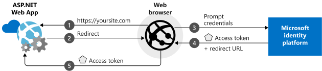
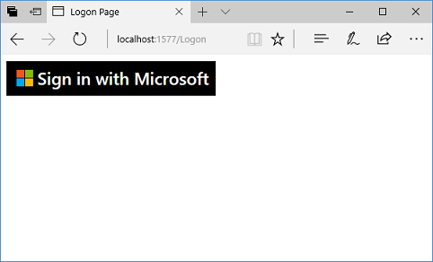

# Add sign-in with Microsoft to an ASP.NET web app

This guide demonstrates how to implement sign-in with Microsoft using an ASP.NET MVC solution with a traditional web browser-based application using OpenID Connect.

At the end of this guide, your application will be able to accept sign-ins of personal accounts, for example outlook.com, live.com, and others. These accounts also include work and school accounts from any company or organization that has integrated with Azure Active Directory.

> This guide requires Visual Studio 2019.  Don’t have it?  [Download Visual Studio 2019 for free](https://www.visualstudio.com/downloads/)

## How the sample app generated by this guide works



The sample application you create is based on the scenario where you use the browser to access an ASP.NET web site that requests a user to authenticate via a sign-in button. In this scenario, most of the work to render the web page occurs on the server side.

## Libraries

This guide uses the following libraries:

|Library|Description|
|---|---|
|[Microsoft.Owin.Security.OpenIdConnect](https://www.nuget.org/packages/Microsoft.Owin.Security.OpenIdConnect/)|Middleware that enables an application to use OpenIdConnect for authentication|
|[Microsoft.Owin.Security.Cookies](https://www.nuget.org/packages/Microsoft.Owin.Security.Cookies)|Middleware that enables an application to maintain user session using cookies|
|[Microsoft.Owin.Host.SystemWeb](https://www.nuget.org/packages/Microsoft.Owin.Host.SystemWeb)|Enables OWIN-based applications to run on IIS using the ASP.NET request pipeline|

## Set up your project

This section shows the steps to install and configure the authentication pipeline via OWIN middleware on an ASP.NET project using OpenID Connect.

> Prefer to download this sample's Visual Studio project instead? [Download a project](https://github.com/AzureADQuickStarts/AppModelv2-WebApp-OpenIDConnect-DotNet/archive/master.zip) and skip to the [Configuration step](#register-your-application) to configure the code sample before executing.

### Create your ASP.NET project

1. In Visual Studio: `File` > `New` > `Project`
2. Under *Visual C#\Web*, select `ASP.NET Web Application (.NET Framework)`.
3. Name your application and click *OK*
4. Select `Empty` and select the checkbox to add `MVC` references

## Add authentication components

1. In Visual Studio: `Tools` > `Nuget Package Manager` > `Package Manager Console`
2. Add *OWIN middleware NuGet packages* by typing the following in the Package Manager Console window:

    ```powershell
    Install-Package Microsoft.Owin.Security.OpenIdConnect
    Install-Package Microsoft.Owin.Security.Cookies
    Install-Package Microsoft.Owin.Host.SystemWeb
    ```

<!--start-collapse-->
> ### About these libraries
> The libraries above enable single sign-on (SSO) using OpenID Connect via cookie-based authentication. After authentication is completed and the token representing the user is sent to your application, OWIN middleware creates a session cookie. The browser then uses this cookie on subsequent requests so the user doesn't need to retype the password, and no additional verification is needed.
<!--end-collapse-->

## Configure the authentication pipeline

The steps below are used to create an OWIN middleware Startup Class to configure OpenID Connect authentication. This class will be executed automatically when your IIS process starts.

> [!TIP]
> If your project doesn't have a `Startup.cs` file in the root folder:
> 1. Right-click on the project's root folder: > `Add` > `New Item...` > `OWIN Startup class`<br/>
> 2. Name it `Startup.cs`
>
>> Make sure the class selected is an OWIN Startup Class and not a standard C# class. Confirm this by checking if you see `[assembly: OwinStartup(typeof({NameSpace}.Startup))]` above the namespace.

1. Add *OWIN* and *Microsoft.IdentityModel* references to `Startup.cs`:

    ```csharp
    using Microsoft.Owin;
    using Owin;
    using Microsoft.IdentityModel.Protocols.OpenIdConnect;
    using Microsoft.IdentityModel.Tokens;
    using Microsoft.Owin.Security;
    using Microsoft.Owin.Security.Cookies;
    using Microsoft.Owin.Security.OpenIdConnect;
    using Microsoft.Owin.Security.Notifications;
    ```

2. Replace Startup class with the code below:

    ```csharp
    public class Startup
    {
        // The Client ID is used by the application to uniquely identify itself to Azure AD.
        string clientId = System.Configuration.ConfigurationManager.AppSettings["ClientId"];

        // RedirectUri is the URL where the user will be redirected to after they sign in.
        string redirectUri = System.Configuration.ConfigurationManager.AppSettings["RedirectUri"];

        // Tenant is the tenant ID (e.g. contoso.onmicrosoft.com, or 'common' for multi-tenant)
        static string tenant = System.Configuration.ConfigurationManager.AppSettings["Tenant"];

        // Authority is the URL for authority, composed by Azure Active Directory v2.0 endpoint and the tenant name (e.g. https://login.microsoftonline.com/contoso.onmicrosoft.com/v2.0)
        string authority = String.Format(System.Globalization.CultureInfo.InvariantCulture, System.Configuration.ConfigurationManager.AppSettings["Authority"], tenant);

        /// <summary>
        /// Configure OWIN to use OpenIdConnect 
        /// </summary>
        /// <param name="app"></param>
        public void Configuration(IAppBuilder app)
        {
            app.SetDefaultSignInAsAuthenticationType(CookieAuthenticationDefaults.AuthenticationType);

            app.UseCookieAuthentication(new CookieAuthenticationOptions());
            app.UseOpenIdConnectAuthentication(
                new OpenIdConnectAuthenticationOptions
                {
                    // Sets the ClientId, authority, RedirectUri as obtained from web.config
                    ClientId = clientId,
                    Authority = authority,
                    RedirectUri = redirectUri,
                    // PostLogoutRedirectUri is the page that users will be redirected to after sign-out. In this case, it is using the home page
                    PostLogoutRedirectUri = redirectUri,
                    Scope = OpenIdConnectScope.OpenIdProfile,
                    // ResponseType is set to request the id_token - which contains basic information about the signed-in user
                    ResponseType = OpenIdConnectResponseType.IdToken,
                    // ValidateIssuer set to false to allow personal and work accounts from any organization to sign in to your application
                    // To only allow users from a single organizations, set ValidateIssuer to true and 'tenant' setting in web.config to the tenant name
                    // To allow users from only a list of specific organizations, set ValidateIssuer to true and use ValidIssuers parameter
                    TokenValidationParameters = new TokenValidationParameters()
                    {
                        ValidateIssuer = false // This is a simplification
                    },
                    // OpenIdConnectAuthenticationNotifications configures OWIN to send notification of failed authentications to OnAuthenticationFailed method
                    Notifications = new OpenIdConnectAuthenticationNotifications
                    {
                        AuthenticationFailed = OnAuthenticationFailed
                    }
                }
            );
        }

        /// <summary>
        /// Handle failed authentication requests by redirecting the user to the home page with an error in the query string
        /// </summary>
        /// <param name="context"></param>
        /// <returns></returns>
        private Task OnAuthenticationFailed(AuthenticationFailedNotification<OpenIdConnectMessage, OpenIdConnectAuthenticationOptions> context)
        {
            context.HandleResponse();
            context.Response.Redirect("/?errormessage=" + context.Exception.Message);
            return Task.FromResult(0);
        }
    }
    ```

> [!NOTE]
> Setting `ValidateIssuer = false` is a simplification for this quickstart. In real applications you need to validate the issuer
> See the samples to understand how to do that.

<!--start-collapse-->
> ### More Information
> The parameters you provide in *OpenIDConnectAuthenticationOptions* serve as coordinates for the application to communicate with Azure AD. Because the OpenID Connect middleware uses cookies in the background, you also need to set up cookie authentication as the code above shows. The *ValidateIssuer* value tells OpenIdConnect to not restrict access to one specific organization.
<!--end-collapse-->

## Add a controller to handle sign-in and sign-out requests

This step shows how to create a new controller to expose sign-in and sign-out methods.

1.	Right click the `Controllers` folder and select `Add` > `Controller`
2.	Select `MVC (.NET version) Controller – Empty`.
3.	Click *Add*
4.	Name it `HomeController` and click *Add*
5.	Add *OWIN* references to the class:

    ```csharp
    using Microsoft.Owin.Security;
    using Microsoft.Owin.Security.Cookies;
    using Microsoft.Owin.Security.OpenIdConnect;
    ```
    
6. Add the two methods below to handle sign-in and sign-out to your controller by initiating an authentication challenge via code:
    
    ```csharp
    /// <summary>
    /// Send an OpenID Connect sign-in request.
    /// Alternatively, you can just decorate the SignIn method with the [Authorize] attribute
    /// </summary>
    public void SignIn()
    {
        if (!Request.IsAuthenticated)
        {
            HttpContext.GetOwinContext().Authentication.Challenge(
                new AuthenticationProperties{ RedirectUri = "/" },
                OpenIdConnectAuthenticationDefaults.AuthenticationType);
        }
    }
    
    /// <summary>
    /// Send an OpenID Connect sign-out request.
    /// </summary>
    public void SignOut()
    {
        HttpContext.GetOwinContext().Authentication.SignOut(
                OpenIdConnectAuthenticationDefaults.AuthenticationType,
                CookieAuthenticationDefaults.AuthenticationType);
    }
    ```

## Create the app's home page to sign in users via a sign-in button

In Visual Studio, create a new view to add the sign-in button and display user information after authentication:

1.	Right click the `Views\Home` folder and select `Add View`
2.	Name it `Index`.
3.	Add the following HTML, which includes the sign-in button, to the file:

    ```html
    <html>
    <head>
        <meta name="viewport" content="width=device-width" />
        <title>Sign in with Microsoft Guide</title>
    </head>
    <body>
    @if (!Request.IsAuthenticated)
    {
        <!-- If the user is not authenticated, display the sign-in button -->
        <a href="@Url.Action("SignIn", "Home")" style="text-decoration: none;">
            <svg xmlns="http://www.w3.org/2000/svg" xml:space="preserve" width="300px" height="50px" viewBox="0 0 3278 522" class="SignInButton">
            <style type="text/css">.fil0:hover {fill: #4B4B4B;} .fnt0 {font-size: 260px;font-family: 'Segoe UI Semibold', 'Segoe UI'; text-decoration: none;}</style>
            <rect class="fil0" x="2" y="2" width="3174" height="517" fill="black" />
            <rect x="150" y="129" width="122" height="122" fill="#F35325" />
            <rect x="284" y="129" width="122" height="122" fill="#81BC06" />
            <rect x="150" y="263" width="122" height="122" fill="#05A6F0" />
            <rect x="284" y="263" width="122" height="122" fill="#FFBA08" />
            <text x="470" y="357" fill="white" class="fnt0">Sign in with Microsoft</text>
            </svg>
        </a>
    }
    else
    {
        <span><br/>Hello @System.Security.Claims.ClaimsPrincipal.Current.FindFirst("name").Value;</span>
        <br /><br />
        @Html.ActionLink("See Your Claims", "Index", "Claims")
        <br /><br />
        @Html.ActionLink("Sign out", "SignOut", "Home")
    }
    @if (!string.IsNullOrWhiteSpace(Request.QueryString["errormessage"]))
    {
        <div style="background-color:red;color:white;font-weight: bold;">Error: @Request.QueryString["errormessage"]</div>
    }
    </body>
    </html>
    ```

<!--start-collapse-->
> ### More Information
> This page adds a sign-in button in SVG format with a black background:<br/><br/> For more sign-in buttons, please go to the [this page](https://docs.microsoft.com/azure/active-directory/develop/active-directory-branding-guidelines "Branding guidelines").
<!--end-collapse-->

## Add a controller to display user's claims
This controller demonstrates the uses of the `[Authorize]` attribute to protect a controller. This attribute restricts access to the controller by only allowing authenticated users. The code below makes use of the attribute to display user claims that were retrieved as part of the sign-in.

1.	Right click the `Controllers` folder: `Add` > `Controller`
2.	Select `MVC {version} Controller – Empty`.
3.	Click *Add*
4.	Name it `ClaimsController`
5.	Replace the code of your controller class with the code below - this adds the `[Authorize]` attribute to the class:

    ```csharp
    [Authorize]
    public class ClaimsController : Controller
    {
        /// <summary>
        /// Add user's claims to viewbag
        /// </summary>
        /// <returns></returns>
        public ActionResult Index()
        {
            var userClaims = User.Identity as System.Security.Claims.ClaimsIdentity;
    
            //You get the user’s first and last name below:
            ViewBag.Name = userClaims?.FindFirst("name")?.Value;
    
            // The 'preferred_username' claim can be used for showing the username
            ViewBag.Username = userClaims?.FindFirst("preferred_username")?.Value;
    
            // The subject/ NameIdentifier claim can be used to uniquely identify the user across the web
            ViewBag.Subject = userClaims?.FindFirst(System.Security.Claims.ClaimTypes.NameIdentifier)?.Value;
    
            // TenantId is the unique Tenant Id - which represents an organization in Azure AD
            ViewBag.TenantId = userClaims?.FindFirst("http://schemas.microsoft.com/identity/claims/tenantid")?.Value;
    
            return View();
        }
    }
    ```

<!--start-collapse-->
> ### More Information
> Because of the use of the `[Authorize]` attribute, all methods of this controller can only be executed if the user is authenticated. If the user is not authenticated and tries to access the controller, OWIN will initiate an authentication challenge and force the user to authenticate. The code above looks at the list of claims for specific user attributes included in the user’s Id token. These attributes include the user’s full name and username, as well as the global user identifier subject. It also contains the *Tenant ID*, which represents the ID for the user’s organization. 
<!--end-collapse-->

## Create a view to display the user's claims

In Visual Studio, create a new view to display the user's claims in a web page:

1.	Right click the `Views\Claims` folder and: `Add View`
2.	Name it `Index`.
3.	Add the following HTML to the file:

    ```html
    <html>
    <head>
        <meta name="viewport" content="width=device-width" />
        <title>Sign in with Microsoft Sample</title>
        <link href="@Url.Content("~/Content/bootstrap.min.css")" rel="stylesheet" type="text/css" />
    </head>
    <body style="padding:50px">
        <h3>Main Claims:</h3>
        <table class="table table-striped table-bordered table-hover">
            <tr><td>Name</td><td>@ViewBag.Name</td></tr>
            <tr><td>Username</td><td>@ViewBag.Username</td></tr>
            <tr><td>Subject</td><td>@ViewBag.Subject</td></tr>
            <tr><td>TenantId</td><td>@ViewBag.TenantId</td></tr>
        </table>
        <br />
        <h3>All Claims:</h3>
        <table class="table table-striped table-bordered table-hover table-condensed">
        @foreach (var claim in System.Security.Claims.ClaimsPrincipal.Current.Claims)
        {
            <tr><td>@claim.Type</td><td>@claim.Value</td></tr>
        }
        </table>
        <br />
        <br />
        @Html.ActionLink("Sign out", "SignOut", "Home", null, new { @class = "btn btn-primary" })
    </body>
    </html>
    ```

## Register your application

To register your application and add your application registration information to your solution, you have two options:

### Option 1: Express mode

You can quickly register your application by doing the following:

1. Go to the new  [Azure portal - App registrations](https://portal.azure.com/#blade/Microsoft_AAD_RegisteredApps/applicationsListBlade/quickStartType/AspNetWebAppQuickstartPage/sourceType/docs) pane.
1. Enter a name for your application and click **Register**.
1. Follow the instructions to download and automatically configure your new application for you in one click.

### Option 2: Advanced mode

To register your application and add the app's registration information to your solution manually, follow these steps:

1. Go to Visual Studio and:
   1. in Solution Explorer, select the project and look at the Properties window (if you don’t see a Properties window, press F4).
   1. Change SSL Enabled to `True`.
   1. Right-click on the project in Visual Studio, then choose **Properties**, and the **Web** tab. In the *Servers* section change the *Project Url* to be the SSL URL.
   1. Copy the SSL URL. You will add this URL to the list of Redirect URLs in the Registration Portal’s list of Redirect URLs in the next step:<br/><br/><br />
1. Sign in to the [Azure portal](https://portal.azure.com) using either a work or school account, or a personal Microsoft account.
1. If your account gives you access to more than one tenant, select your account in the top right corner, and set your portal session to the desired Azure AD tenant.
1. Navigate to the Microsoft identity platform for developers [App registrations](https://go.microsoft.com/fwlink/?linkid=2083908) page.
1. Select **New registration**.
1. When the **Register an application** page appears, enter your application's registration information:
   1. In the **Name** section, enter a meaningful application name that will be displayed to users of the app, for example `ASPNET-Tutorial`.
   1. Add the SSL URL you had copied from Visual Studio in Step 1 (for instance `https://localhost:44368/`) in **Reply URL**, and click **Register**.
1. Select **Authentication** menu, set **ID tokens** under **Implicit Grant**, and then select **Save**.
1. Add the following in `web.config` located in the root folder under the section `configuration\appSettings`:

    ```xml
    <add key="ClientId" value="Enter_the_Application_Id_here" />
    <add key="redirectUri" value="Enter_the_Redirect_URL_here" />
    <add key="Tenant" value="common" />
    <add key="Authority" value="https://login.microsoftonline.com/{0}/v2.0" />
    ```

1. Replace `ClientId` with the Application ID you just registered.
1. Replace `redirectUri` with the SSL URL of your project.

## Test your code

To test your application in Visual Studio, press **F5** to run your project. The browser opens to the http://<span></span>localhost:{port} location and you see the **Sign in with Microsoft** button. Select the button to start the sign-in process.

When you're ready to run your test, use a Microsoft Azure Active Directory (Azure AD) account (work or school account) or a personal Microsoft account (<span>live.</span>com or <span>outlook.</span>com) to sign in.


<br/><br/>


<!--start-collapse-->
> ###  Permissions and consent in the Microsoft identity platform endpoint
>  Applications that integrate with Microsoft identity platform follow an authorization model that gives users and administrators control over how data can be accessed. After a user authenticates with Azure AD to access this application, they will be prompted to consent to the permissions requested by the application (i.e. "View your basic profile" and "Maintain access to data you have given it access to"). After accepting these permissions, the user will continue on to the application results. However, the user may instead be prompted with a **Need admin consent** page if either of the following occur:
>  > - The application developer adds any additional permissions that require **Admin consent**.
>  > - Or the tenant is configured (in **Enterprise Applications -> User Settings**) where users cannot consent to apps accessing company data on their behalf.
>
> For more information, please refer to [Permissions and consent in the Microsoft identity platform endpoint](https://docs.microsoft.com/en-us/azure/active-directory/develop/v2-permissions-and-consent)
<!--end-collapse-->

#### View application results

After you sign in, the user is redirected to the home page of your website. The home page is the HTTPS URL that is specified in your application registration information in the Microsoft Application Registration Portal. The home page includes a welcome message *"Hello \<User>,"* a link to sign out, and a link to view the user’s claims. The link for the user's claims browses to the *Claims* controller that you created earlier.

### Browse to see the user's claims

To see the user's claims, select the link to browse to the controller view that is available only to authenticated users.

#### View the claims results

After you browse to the controller view, you should see a table that contains the basic properties for the user:

|Property |Value |Description |
|---|---|---|
|**Name** |User's full name | The user’s first and last name.
|**Username** |user<span>@domain.com</span> | The username that is used to identify the user.
|**Subject** |Subject |A string that uniquely identifies the user across the web.|
|**Tenant ID** |Guid | A **guid** that uniquely represents the user’s Azure AD organization.|

In addition, you should see a table of all claims that are in the authentication request. For more information, see the [list of claims that are in an Azure AD ID Token](https://docs.microsoft.com/azure/active-directory/develop/active-directory-token-and-claims).

### Test access to a method that has an Authorize attribute (optional)

To test access as an anonymous user to a controller protected with the `Authorize` attribute, follow these steps:

1. Select the link to sign out the user and complete the sign-out process.
2. In your browser, type http://<span></span>localhost:{port}/claims to access your controller that is protected with the `Authorize` attribute.

#### Expected results after access to a protected controller

You're prompted to authenticate to use the protected controller view.

## Advanced options

<!--start-collapse-->
### Protect your entire website
To protect your entire website, in the **Global.asax** file, add the `AuthorizeAttribute` attribute to the `GlobalFilters` filter in the `Application_Start` method:

```csharp
GlobalFilters.Filters.Add(new AuthorizeAttribute());
```
<!--end-collapse-->

### Restrict who can sign in to your application

By default when you build the application created by this guide, your application will accept sign-ins of personal accounts (including outlook.com, live.com, and others) as well as work and school accounts from any company or organization that has integrated with Azure Active Directory. This is a recommended option for SaaS applications.

To restrict user sign-in access for your application, multiple options are available:

#### Option 1: Restrict users from only one organization's Active Directory instance to sign in to your application (single-tenant)

This option is a common scenario for *LOB applications*: If you want your application to accept sign-ins only from accounts that belong to a specific Azure Active Directory instance (including *guest accounts* of that instance) do the following:

1. In the **web.config** file, change the value for the `Tenant` parameter from `Common` to the tenant name of the organization, such as `contoso.onmicrosoft.com`.
2. In your [OWIN Startup class](#configure-the-authentication-pipeline), set the `ValidateIssuer` argument to `true`.

#### Option 2: Restrict access to your application to users in a specific list of organizations

You can restrict sign-in access to only user accounts that are in an Azure AD organization that is in the list of allowed organizations:
1. In your [OWIN Startup class](#configure-the-authentication-pipeline), set the `ValidateIssuer` argument to `true`.
2. Set the value of the `ValidIssuers` parameter to the list of allowed organizations.

#### Option 3: Use a custom method to validate issuers

You can implement a custom method to validate issuers by using the **IssuerValidator** parameter. For more information about how to use this parameter, read about the [TokenValidationParameters class](/previous-versions/visualstudio/dn464192(v=vs.114)).

## Next steps

Learn about Web apps calling web APIs:.

### Learn the steps to create the application used in this quickstart

> [!div class="nextstepaction"]
> [Web apps calling Web APIs]( https://aka.ms/msal-net-authorization-code)

[!INCLUDE [Help and support](../../../includes/active-directory-develop-help-support-include.md)]

Help us improve the Microsoft identity platform. Tell us what you think by completing a short two-question survey.

> [!div class="nextstepaction"]
> [Microsoft identity platform survey](https://forms.office.com/Pages/ResponsePage.aspx?id=v4j5cvGGr0GRqy180BHbRyKrNDMV_xBIiPGgSvnbQZdUQjFIUUFGUE1SMEVFTkdaVU5YT0EyOEtJVi4u)
