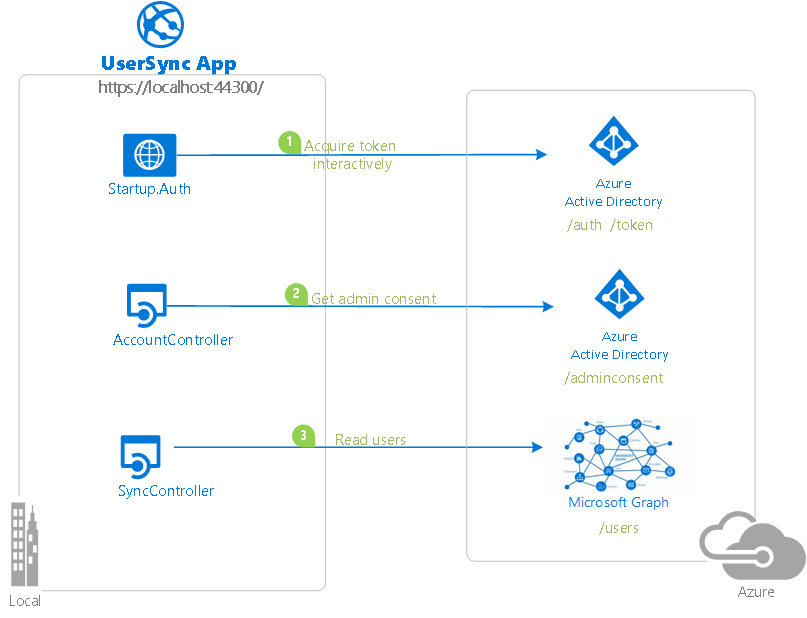
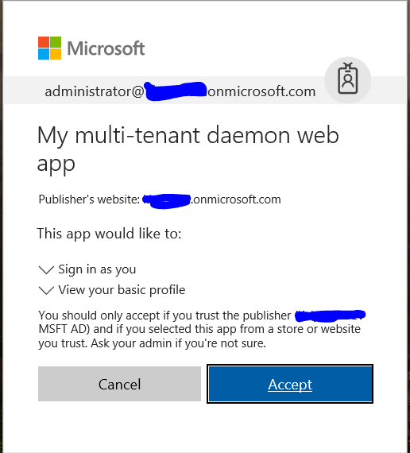

# Tutorial: Build a multitenant daemon that uses the Microsoft identity platform endpoint

In this tutorial, you learn how to use the Microsoft identity platform to access the data of Microsoft business customers in a long-running, non-interactive process. The sample daemon uses the [OAuth2 client credentials grant](v2-oauth2-client-creds-grant-flow.md) to acquire an access token. The daemon then uses the token to call [Microsoft Graph](https://graph.microsoft.io) and access organizational data.

> [!div class="checklist"]
> * Integrate a daemon app with the Microsoft identity platform
> * Grant application permissions directly to the app by an admin
> * Get an access token to call the Microsoft Graph API
> * Call the Microsoft Graph API.

If you don’t have an Azure subscription, create a [free account](https://azure.microsoft.com/free/?WT.mc_id=A261C142F) before you begin.

The app is built as an ASP.NET MVC application. It uses the OWIN OpenID Connect middleware to sign in users.  

The "daemon" component in this sample is an API controller, `SyncController.cs`. When the controller is called, it pulls in a list of users in the customer's Azure Active Directory (Azure AD) tenant from Microsoft Graph. `SyncController.cs` is triggered by an AJAX call in the web application. It uses the [Microsoft Authentication Library (MSAL) for .NET](msal-overview.md) to acquire an access token for Microsoft Graph.

For a simpler console daemon application, see the [.NET Core daemon quickstart](quickstart-v2-netcore-daemon.md).

## Scenario

Because the app is a multitenant app for Microsoft business customers, it must provide a way for customers to "sign up" or "connect" the application to their company data. During the connection flow, a company administrator first grants *application permissions* directly to the app so that it can access company data in a non-interactive fashion, without the presence of a signed-in user. The majority of the logic in this sample shows how to achieve this connection flow by using the identity platform's [admin consent](v2-permissions-and-consent.md#using-the-admin-consent-endpoint) endpoint.



For more information on the concepts used in this sample, read the [client credentials protocol documentation for the identity platform endpoint](v2-oauth2-client-creds-grant-flow.md).

## Prerequisites

To run the sample in this quickstart, you'll need:

- [Visual Studio 2017 or 2019](https://visualstudio.microsoft.com/downloads/).
- An Azure AD tenant. For more information, see [How to get an Azure AD tenant](quickstart-create-new-tenant.md).
- One or more user accounts in your Azure AD tenant. This sample won't work with a Microsoft account (formerly Windows Live account). If you signed in to the [Azure portal](https://portal.azure.com) with a Microsoft account and have never created a user account in your directory, you need to do that now.

## Clone or download this repository

From your shell or command line, enter this command:

```Shell
git clone https://github.com/Azure-Samples/active-directory-dotnet-daemon-v2.git
```

Or [download the sample in a zip file](https://github.com/Azure-Samples/ms-identity-aspnet-daemon-webapp/archive/master.zip).

## Register your application

This sample has one project. To register the application with your Azure AD tenant, you can either:

- Follow the steps in [Register the sample with your Azure Active Directory tenant](#register-your-application) and [Configure the sample to use your Azure AD tenant](#choose-the-azure-ad-tenant).
- Use PowerShell scripts that:
  - *Automatically* create the Azure AD applications and related objects (passwords, permissions, dependencies) for you.
  - Modify the Visual Studio projects' configuration files.

If you want to use the automation:

1. On Windows, run PowerShell and go to the root of the cloned directory.
1. Run this command:

   ```PowerShell
   Set-ExecutionPolicy -ExecutionPolicy RemoteSigned -Scope Process -Force
   ```

1. Run the script to create your Azure AD application and configure the code of the sample application accordingly:

   ```PowerShell
   .\AppCreationScripts\Configure.ps1
   ```

   Other ways of running scripts are described in [App creation scripts](https://github.com/Azure-Samples/ms-identity-aspnet-daemon-webapp/blob/master/AppCreationScripts/AppCreationScripts.md).

1. Open the Visual Studio solution and select **Start** to run the code.

If you don't want to use the automation, use the steps in the following sections.

### Choose the Azure AD tenant

1. Sign in to the [Azure portal](https://portal.azure.com) by using a work or school account or a personal Microsoft account.
1. If your account is in more than one Azure AD tenant, select your profile on the menu at the top of the page, and then select **Switch directory**.
1. Change your portal session to the desired Azure AD tenant.

### Register the client app (dotnet-web-daemon-v2)

1. Go to the [App registrations](https://go.microsoft.com/fwlink/?linkid=2083908) page in the Microsoft identity platform for developers.
1. Select **New registration**.
1. When the **Register an application** page appears, enter your application's registration information:
   - In the **Name** section, enter a meaningful application name that will be displayed to users of the app. For example, enter **dotnet-web-daemon-v2**.
   - In the **Supported account types** section, select **Accounts in any organizational directory**.
   - In the **Redirect URI (optional)** section, select **Web** in the combo box and enter the following redirect URIs:
       - **https://localhost:44316/**
       - **https://localhost:44316/Account/GrantPermissions**
          
     If there are more than two redirect URIs, you'll need to add them from the **Authentication** tab later, after the app is created successfully.
1. Select **Register** to create the application.
1. On the app's **Overview** page, find the **Application (client) ID** value and record it for later. You'll need it to configure the Visual Studio configuration file for this project.
1. In the list of pages for the app, select **Authentication**. Then:
   - In the **Advanced settings** section, set **Logout URL** to **https://localhost:44316/Account/EndSession**.
   - In the **Advanced settings** > **Implicit grant** section, select **Access tokens** and **ID tokens**. This sample requires the [implicit grant flow](v2-oauth2-implicit-grant-flow.md) to be enabled to sign in the user and call an API.
1. Select **Save**.
1. From the **Certificates & secrets** page, in the **Client secrets** section, select **New client secret**. Then:

   1. Enter a key description (for example, **app secret**),
   1. Select a key duration of either **In 1 year**, **In 2 years**, or **Never Expires**.
   1. Select the **Add** button. 
   1. When the key value appears, copy and save it in a safe location. You'll need this key later to configure the project in Visual Studio. It won't be displayed again or retrievable by any other means.
1. In the list of pages for the app, select **API permissions**. Then:
   1. Select the **Add a permission** button.
   1. Ensure that the **Microsoft APIs** tab is selected.
   1. In the **Commonly used Microsoft APIs** section, select **Microsoft Graph**.
   1. In the **Application permissions** section, ensure that the right permissions are selected: **User.Read.All**.
   1. Select the **Add permissions** button.

## Configure the sample to use your Azure AD tenant

In the following steps, **ClientID** is the same as "application ID" or **AppId**.

Open the solution in Visual Studio to configure the projects.

### Configure the client project

If you used the setup scripts, the following changes will have been applied for you.

1. Open the **UserSync\Web.Config** file.
1. Find the app key **ida:ClientId**. Replace the existing value with the application ID of the **dotnet-web-daemon-v2** application copied from the Azure portal.
1. Find the app key **ida:ClientSecret**. Replace the existing value with the key that you saved during the creation of the **dotnet-web-daemon-v2** app in the Azure portal.

## Run the sample

Clean the solution, rebuild the solution, run the UserSync application, and then sign in as an administrator in your Azure AD tenant. If you don't have an Azure AD tenant for testing, you can [follow these instructions](quickstart-create-new-tenant.md) to get one.

When you sign in, the app first asks you for permission to sign you in and read your user profile. This consent allows the app to ensure that you're a business user.



The app then tries to sync a list of users from your Azure AD tenant, via Microsoft Graph. If it can't, it asks you (the tenant administrator) to connect your tenant to the app.

The app then asks for permission to read the list of users in your tenant.


After you grant permission, you're signed out from the app. This sign-out ensures that any existing access tokens for Microsoft Graph is removed from the token cache. When you sign in again, the fresh token that's obtained will have the necessary permissions to make calls to Microsoft Graph.


When you grant the permission, the app can then query for users at any point. You can verify this by selecting the **Sync Users** button and refreshing the list of users. Try adding or removing a user and resyncing the list. (But note that the app syncs only the first page of users.)

## About the code

The relevant code for this sample is in the following files:

- **App_Start\Startup.Auth.cs**, **Controllers\AccountController.cs**: Initial sign-in. In particular, the actions on the controller have an **Authorize** attribute, which forces the user to sign in. The application uses the [authorization code flow](v2-oauth2-auth-code-flow.md) to sign in the user.
- **Controllers\SyncController.cs**: Syncing the list of users to the local in-memory store.
- **Controllers\UserController.cs**: Displaying the list of users from the local in-memory store.
- **Controllers\AccountController.cs**: Acquiring permissions from the tenant admin by using the admin consent endpoint.

## Re-create the sample app

1. In Visual Studio, create a new **Visual C#** **ASP.NET Web Application (.NET Framework)** project. 
1. On the next screen, choose the **MVC** project template. Also add folder and core references for **Web API**, because you'll add a web API controller later. Leave the project's chosen authentication mode as the default: **No Authentication**.
1. Select the project in the **Solution Explorer** window and select the **F4** key. 
1. In the project properties, set **SSL Enabled** to **True**. Note the information in **SSL URL**. You'll need it when configuring this application's registration in the Azure portal.
1. Add the following ASP.NET OWIN middleware NuGet packages: 
   - Microsoft.Owin.Security.ActiveDirectory
   - Microsoft.Owin.Security.Cookies
   - Microsoft.Owin.Host.SystemWeb
   - Microsoft.IdentityModel.Protocol.Extensions
   - Microsoft.Owin.Security.OpenIdConnect
   - Microsoft.Identity.Client 
1. In the **App_Start** folder:
   1. Create a class called **Startup.Auth.cs**. 
   1. Remove **.App_Start** from the namespace name. 
   1. Replace the code for the **Startup** class with the code from the same file of the sample app.       
   Be sure to take the whole class definition. The definition changes from **public class Startup** to **public partial class Startup.**
1. In **Startup.Auth.cs**, resolve missing references by adding **using** statements as suggested by Visual Studio IntelliSense.
1. Right-click the project, select **Add**, and then select **Class**.
1. In the search box, enter **OWIN**. **OWIN Startup class** appears as a selection. Select it, and name the class **Startup.cs**.
1. In **Startup.cs**, replace the code for the **Startup** class with the code from the same file of the sample app. Again, note that the definition changes from **public class Startup** to **public partial class Startup**.
1. In the **Models** folder, add a new class called **MsGraphUser.cs**. Replace the implementation with the contents of the file of the same name from the sample.
1. Add a new **MVC 5 Controller - Empty** instance called **AccountController**. Replace the implementation with the contents of the file of the same name from the sample.
1. Add a new **MVC 5 Controller - Empty** instance called **UserController**. Replace the implementation with the contents of the file of the same name from the sample.
1. Add a new **Web API 2 Controller - Empty** instance called **SyncController**. Replace the implementation with the contents of the file of the same name from the sample.
1. For the user interface, in the **Views\Account** folder, add three **Empty (without model) Views** instances named **GrantPermissions**, **Index**, and **UserMismatch**. Add and one named **Index** in the **Views\User** folder. Replace the implementation with the contents of the file of the same name from the sample.
1. Update **Shared\_Layout.cshtml** and **Home\Index.cshtml** to correctly link the various views together.

## Deploy the sample to Azure

This project has web app and web API projects. To deploy them to Azure websites, take the following steps for each one:

1. Create an Azure website.
1. Publish the web app and web APIs to the website.
1. Update clients to call the website instead of IIS Express.

### Create and publish dotnet-web-daemon-v2 to an Azure website

1. Sign in to the [Azure portal](https://portal.azure.com).
1. In the upper-left corner, select **Create a resource**.
1. Select **Web** > **Web App**, and then give your website a name. For example, name it **dotnet-web-daemon-v2-contoso.azurewebsites.net**.
1. Select the information for **Subscription**, **Resource group**, and **App service plan and location**. **OS** is **Windows**, and **Publish** is **Code**.
1. Select **Create** and wait for the app service to be created.
1. When you get the **Deployment succeeded** notification, select **Go to resource** to go to the newly created app service.
1. After the website is created, find it in the **Dashboard** and select it to open the app service's **Overview** screen.
1. From the **Overview** tab of the app service, download the publish profile by selecting the **Get publish profile** link and save it. You can use other deployment mechanisms, such as deploying from source control.
1. Switch to Visual Studio and then:
   1. Go to the **dotnet-web-daemon-v2** project. 
   1. Right-click the project in Solution Explorer, and then select **Publish**.
   1. Select **Import Profile** on the bottom bar, and import the publish profile that you downloaded earlier.
1. Select **Configure**.
1. On the **Connection** tab, update the destination URL so that it uses "https." For example, use [https://dotnet-web-daemon-v2-contoso.azurewebsites.net](https://dotnet-web-daemon-v2-contoso.azurewebsites.net). Select **Next**.
1. On the **Settings** tab, make sure that **Enable Organizational Authentication** is cleared.  
1. Select **Save**. Select **Publish** on the main screen.

Visual Studio will publish the project and automatically open a browser to the project's URL. If you see the default webpage of the project, the publication was successful.

### Update the Azure AD tenant application registration for dotnet-web-daemon-v2

1. Go back to the [Azure portal](https://portal.azure.com).
1. In the left pane, select the **Azure Active Directory** service, and then select **App registrations**.
1. Select the **dotnet-web-daemon-v2** application.
1. On the **Authentication** page for your application, update the **Logout URL** fields with the address of your service. For example, use [https://dotnet-web-daemon-v2-contoso.azurewebsites.net](https://dotnet-web-daemon-v2-contoso.azurewebsites.net).
1. From the **Branding** menu, update the **Home page URL** to the address of your service. For example, use [https://dotnet-web-daemon-v2-contoso.azurewebsites.net](https://dotnet-web-daemon-v2-contoso.azurewebsites.net).
1. Save the configuration.
1. Add the same URL in the list of values of the **Authentication** > **Redirect URIs** menu. If you have multiple redirect URLs, make sure that there's a new entry that uses the app service's URI for each redirect URL.

## Clean up resources
When no longer needed, delete the app object that you created in the [Register your application](#register-your-application) step.  To remove the application, follow the instructions in [Remove an application authored by you or your organization](quickstart-remove-app.md#remove-an-application-authored-by-you-or-your-organization).

## Get help

Use [Stack Overflow](http://stackoverflow.com/questions/tagged/msal) to get support from the community.
Ask your questions on Stack Overflow first, and browse existing issues to see if someone has asked your question before.
Make sure that your questions or comments are tagged with "adal," "msal," and "dotnet."

If you find a bug in the sample, please raise the issue on [GitHub Issues](https://github.com/Azure-Samples/ms-identity-aspnet-daemon-webapp/issues).

If you find a bug in MSAL.NET, please raise the issue on [MSAL.NET GitHub Issues](https://github.com/AzureAD/microsoft-authentication-library-for-dotnet/issues).

To provide a recommendation, go to the [User Voice page](https://feedback.azure.com/forums/169401-azure-active-directory).

## Next steps
Learn more about the different [Authentication flows and application scenarios](authentication-flows-app-scenarios.md) that the Microsoft identity platform supports.

For more information, see the following conceptual documentation:

- [Tenancy in Azure Active Directory](single-and-multi-tenant-apps.md)
- [Understanding Azure AD application consent experiences](application-consent-experience.md)
- [Sign in any Azure Active Directory user using the multitenant application pattern](howto-convert-app-to-be-multi-tenant.md)
- [Understand user and admin consent](howto-convert-app-to-be-multi-tenant.md#understand-user-and-admin-consent)
- [Application and service principal objects in Azure Active Directory](app-objects-and-service-principals.md)
- [Quickstart: Register an application with the Microsoft identity platform](quickstart-register-app.md)
- [Quickstart: Configure a client application to access web APIs](quickstart-configure-app-access-web-apis.md)
- [Acquiring a token for an application with client credential flows](msal-client-applications.md)

For a simpler multitenant console daemon application, see the [.NET Core daemon quickstart](quickstart-v2-netcore-daemon.md).
