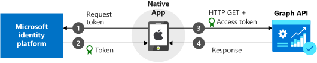

# Sign in users and call the Microsoft Graph from an iOS app

In this tutorial, you'll learn how to integrate an iOS app with the Microsoft identity platform. The app will sign in a user, get an access token to call the Microsoft Graph API, and make a request to the Microsoft Graph API.  

When you've completed the guide, your application will accept sign-ins of personal Microsoft accounts (including outlook.com, live.com, and others) and work or school accounts from any company or organization that uses Azure Active Directory.

## How this tutorial works



The app in this tutorial will sign in users and get data on their behalf.  This data will be accessed via a protected API (Microsoft Graph API in this case) that requires authorization and is protected by the Microsoft identity platform.

More specifically:

* Your app will sign in the user either through a browser or the Microsoft Authenticator.
* The end user will accept the permissions your application has requested.
* Your app will be issued an access token for the Microsoft Graph API.
* The access token will be included in the HTTP request to the web API.
* Process the Microsoft Graph response.

This sample uses the Microsoft Authentication library (MSAL) to implement Authentication. MSAL will automatically renew tokens, deliver single sign-on (SSO) between other apps on the device, and manage the Account(s).

## Prerequisites

- XCode version 10.x is required to build the app in this guide. You can download XCode from the [iTunes website](https://geo.itunes.apple.com/us/app/xcode/id497799835?mt=12 "XCode Download URL").
- Microsoft Authentication Library ([MSAL.framework](https://github.com/AzureAD/microsoft-authentication-library-for-objc)). You can use a dependency manager or add the library manually. The instructions below show you how.

This tutorial will create a new project. If you want to download the completed tutorial instead, [download the code](https://github.com/Azure-Samples/active-directory-ios-swift-native-v2/archive/master.zip).

## Create a new project

1. Open Xcode and select **Create a new Xcode project**.
2. Select **iOS** > **Single view App** and select **Next**.
3. Provide a product name.
4. Set the **Language** to **Swift** and select **Next**.
5. Select a folder to create your app and click **Create**.

## Register your application

1. Go to the [Azure portal](https://aka.ms/MobileAppReg)
2. Open the [App registrations blade](https://ms.portal.azure.com/?feature.broker=true#blade/Microsoft_AAD_IAM/ActiveDirectoryMenuBlade/RegisteredAppsPreview) and click **+New registration**.
3. Enter a **Name** for your app and then, without setting a Redirect URI, click **Register**.
4. In the **Manage** section of the pane that appears, select **Authentication**.
5. Click **Try out the new experience** near the top of the screen to open the new app registration experience, and then click **+New registration** > **+ Add a platform** > **iOS**.
    - Enter your project's Bundle ID. If you downloaded the code, this is `com.microsoft.identitysample.MSALiOS`. If you're creating your own project, select your project in Xcode and open the **General** tab. The bundle identifier appears in the **Identity** section.
6. Click `Configure` and save the **MSAL Configuration** that appears in the **iOS configuration** page so you can enter it when you configure your app later.  Click **Done**.

## Add MSAL

Choose one of the following ways to install the MSAL library in your app:

### CocoaPods

1. If you're using [CocoaPods](https://cocoapods.org/), install `MSAL` by first creating an empty file called `podfile` in the same folder as your project's `.xcodeproj` file. Add the following to `podfile`:

   ```
   use_frameworks!
   
   target '<your-target-here>' do
      pod 'MSAL', '~> 0.4.0'
   end
   ```

2. Replace `<your-target-here>` with the name of your project.
3. In a terminal window, navigate to the folder that contains the `podfile` you created and run `pod install` to install the MSAL library.
4. Close Xcode and open `<your project name>.xcworkspace` to reload the project in Xcode.

### Carthage

If you're using [Carthage](https://github.com/Carthage/Carthage), install `MSAL` by adding it to your `Cartfile`:

```
github "AzureAD/microsoft-authentication-library-for-objc" "master"
```

### Manually

You can also use Git Submodule, or check out the latest release to use as a framework in your application.

## Add your app registration

Next, we'll add your app registration to your code. 

First, add the following import statement to the top of the `ViewController.swift` and `AppDelegate.swift` files:

```swift
import MSAL
```

Then Add the following code to `ViewController.swift` prior to `viewDidLoad()`:

```swift
let kClientID = "Your_Application_Id_Here"

// Additional variables for Auth and Graph API
let kGraphURI = "https://graph.microsoft.com/v1.0/me/"
let kScopes: [String] = ["https://graph.microsoft.com/user.read"]
let kAuthority = "https://login.microsoftonline.com/common"
var accessToken = String()
var applicationContext : MSALPublicClientApplication?
```

Modify the value assigned to `kClientID`to be your Application ID. This value is part of the MSAL Configuration data that you saved during the step at the beginning of this tutorial to register the application in the Azure portal.

## Configure URL schemes

In this step, you will register `CFBundleURLSchemes` so that the user can be redirected back to the app after sign in. By the way, `LSApplicationQueriesSchemes` also allows  your app to make use of Microsoft Authenticator.

In Xcode, open `Info.plist` as a source code file, and add the following inside of the `<dict>` section. Replace `[BUNDLE_ID]` with the value you used in the Azure portal which, if you downloaded the code, is `com.microsoft.identitysample.MSALiOS`. If you're creating your own project, select your project in Xcode and open the **General** tab. The bundle identifier appears in the **Identity** section.

```xml
<key>CFBundleURLTypes</key>
<array>
    <dict>
        <key>CFBundleURLSchemes</key>
        <array>
            <string>msauth.[BUNDLE_ID]</string>
        </array>
    </dict>
</array>
<key>LSApplicationQueriesSchemes</key>
<array>
    <string>msauth</string>
	<string>msauthv2</string>
</array>
```

## Create your app’s UI

Now create a UI that includes a button to call the Microsoft Graph API, another to sign out,  and a text view to see some output by adding the following code to the `ViewController`class:

```swift
var loggingText: UITextView!
var signOutButton: UIButton!
var callGraphButton: UIButton!

func initUI() {
        // Add call Graph button
        callGraphButton  = UIButton()
        callGraphButton.translatesAutoresizingMaskIntoConstraints = false
        callGraphButton.setTitle("Call Microsoft Graph API", for: .normal)
        callGraphButton.setTitleColor(.blue, for: .normal)
        callGraphButton.addTarget(self, action: #selector(callGraphAPI(_:)), for: .touchUpInside)
        self.view.addSubview(callGraphButton)
        
        callGraphButton.centerXAnchor.constraint(equalTo: view.centerXAnchor).isActive = true
        callGraphButton.topAnchor.constraint(equalTo: view.topAnchor, constant: 50.0).isActive = true
        callGraphButton.widthAnchor.constraint(equalToConstant: 300.0).isActive = true
        callGraphButton.heightAnchor.constraint(equalToConstant: 50.0).isActive = true
        
        // Add sign out button
        signOutButton = UIButton()
        signOutButton.translatesAutoresizingMaskIntoConstraints = false
        signOutButton.setTitle("Sign Out", for: .normal)
        signOutButton.setTitleColor(.blue, for: .normal)
        signOutButton.setTitleColor(.gray, for: .disabled)
        signOutButton.addTarget(self, action: #selector(signOut(_:)), for: .touchUpInside)
        self.view.addSubview(signOutButton)
        
        signOutButton.centerXAnchor.constraint(equalTo: view.centerXAnchor).isActive = true
        signOutButton.topAnchor.constraint(equalTo: callGraphButton.bottomAnchor, constant: 10.0).isActive = true
        signOutButton.widthAnchor.constraint(equalToConstant: 150.0).isActive = true
        signOutButton.heightAnchor.constraint(equalToConstant: 50.0).isActive = true
        signOutButton.isEnabled = false
        
        // Add logging textfield
        loggingText = UITextView()
        loggingText.isUserInteractionEnabled = false
        loggingText.translatesAutoresizingMaskIntoConstraints = false
        
        self.view.addSubview(loggingText)
        
        loggingText.topAnchor.constraint(equalTo: signOutButton.bottomAnchor, constant: 10.0).isActive = true
        loggingText.leftAnchor.constraint(equalTo: self.view.leftAnchor, constant: 10.0).isActive = true
        loggingText.rightAnchor.constraint(equalTo: self.view.rightAnchor, constant: 10.0).isActive = true
        loggingText.bottomAnchor.constraint(equalTo: self.view.bottomAnchor, constant: 10.0).isActive = true
    }
```

Next, also inside the `ViewController` class, replace the `viewDidLoad()` method with:

```swift
    override func viewDidLoad() {
        super.viewDidLoad()
        initUI()
        do {
            try self.initMSAL()
        } catch let error {
            self.loggingText.text = "Unable to create Application Context \(error)"
        }
    }
```

## Use MSAL

### Initialize MSAL

Add the following `InitMSAL` method to the `ViewController` class:

```swift
    func initMSAL() throws {
        
        guard let authorityURL = URL(string: kAuthority) else {
            self.loggingText.text = "Unable to create authority URL"
            return
        }
        
        let authority = try MSALAADAuthority(url: authorityURL)
        
        let msalConfiguration = MSALPublicClientApplicationConfig(clientId: kClientID, redirectUri: nil, authority: authority)
        self.applicationContext = try MSALPublicClientApplication(configuration: msalConfiguration)
    }
```

### Handle the sign-in callback

Open the `AppDelegate.swift` file. To handle the callback after sign-in, add `MSALPublicClientApplication.handleMSALResponse` to the `appDelegate` class like this:

```swift
    func application(_ app: UIApplication, open url: URL, options: [UIApplication.OpenURLOptionsKey : Any] = [:]) -> Bool {
        
        guard let sourceApplication = options[UIApplication.OpenURLOptionsKey.sourceApplication] as? String else {
            return false
        }
        
        return MSALPublicClientApplication.handleMSALResponse(url, sourceApplication: sourceApplication)
    }
```

#### Acquire Tokens

Now, we can implement the application's UI processing logic and get tokens interactively through MSAL.

MSAL exposes two primary methods for getting tokens: `acquireTokenSilently()` and `acquireTokenInteractively()`: 

- `acquireTokenSilently()` attempts to sign in a user and get tokens without any user interaction as long as an account is present.

- `acquireTokenInteractively()` always shows UI when attempting to sign in the user. It may use session cookies in the browser or an account in the Microsoft authenticator to provide an interactive-SSO experience.

Add the following code to the `ViewController` class:

```swift
    @objc func callGraphAPI(_ sender: UIButton) {
        
        guard let currentAccount = self.currentAccount() else {
            // We check to see if we have a current logged in account.
            // If we don't, then we need to sign someone in.
            acquireTokenInteractively()
            return
        }
        
        acquireTokenSilently(currentAccount)
    }

    func currentAccount() -> MSALAccount? {
        
        guard let applicationContext = self.applicationContext else { return nil }
        
        // We retrieve our current account by getting the first account from cache
        // In multi-account applications, account should be retrieved by home account identifier or username instead
        
        do {
            let cachedAccounts = try applicationContext.allAccounts()
            if !cachedAccounts.isEmpty {
                return cachedAccounts.first
            }
        } catch let error as NSError {
            self.updateLogging(text: "Didn't find any accounts in cache: \(error)")
        }
        
        return nil
    }
```

#### Get a token interactively

The code below gets a token for the first time by creating an `MSALInteractiveTokenParameters` object and calling `acquireToken`. Next you will add code that:

1. Creates `MSALInteractiveTokenParameters` with scopes.
2. Calls `acquireToken()` with the created parameters.
3. Handles errors. For more detail, refer to the [iOS error handling guide](https://github.com/AzureAD/microsoft-authentication-library-for-objc/wiki/Error-Handling).
4. Handles the successful case.

Add the following code to the `ViewController` class.

```swift
    func acquireTokenInteractively() {
   
        guard let applicationContext = self.applicationContext else { return }
     // #1    
        let parameters = MSALInteractiveTokenParameters(scopes: kScopes)
     // #2        
        applicationContext.acquireToken(with: parameters) { (result, error) in
     // #3            
            if let error = error {
                self.updateLogging(text: "Could not acquire token: \(error)")
                return
            }
            guard let result = result else {   
                self.updateLogging(text: "Could not acquire token: No result returned")
                return
            }
     // #4            
            self.accessToken = result.accessToken
            self.updateLogging(text: "Access token is \(self.accessToken)")
            self.updateSignOutButton(enabled: true)
            self.getContentWithToken()
        }
    }
```


#### Get a token silently

To acquire an updated token silently, add the following code to the `ViewController` class. It creates an `MSALSilentTokenParameters` object and calls `acquireTokenSilent()`:

```swift
    
    func acquireTokenSilently(_ account : MSALAccount!) {
        guard let applicationContext = self.applicationContext else { return }
        let parameters = MSALSilentTokenParameters(scopes: kScopes, account: account)
        
        applicationContext.acquireTokenSilent(with: parameters) { (result, error) in    
            if let error = error {
                let nsError = error as NSError
                if (nsError.domain == MSALErrorDomain) {
                    if (nsError.code == MSALError.interactionRequired.rawValue) {
                        DispatchQueue.main.async {
                            self.acquireTokenInteractively()
                        }
                        return
                    }
                }
                self.updateLogging(text: "Could not acquire token silently: \(error)")
                return
            }
            
            guard let result = result else {
                self.updateLogging(text: "Could not acquire token: No result returned")
                return
            }
            
            self.accessToken = result.accessToken
            self.updateLogging(text: "Refreshed Access token is \(self.accessToken)")
            self.updateSignOutButton(enabled: true)
            self.getContentWithToken()
        }
    }
```

### Call the Microsoft Graph API 

Once you have a token, your app can use it in the HTTP header to make an authorized request to the Microsoft Graph:

| header key    | value                 |
| ------------- | --------------------- |
| Authorization | Bearer \<access-token> |

Add the following code to the `ViewController` class:

```swift
    func getContentWithToken() {        
        // Specify the Graph API endpoint
        let url = URL(string: kGraphURI)
        var request = URLRequest(url: url!)
        
        // Set the Authorization header for the request. We use Bearer tokens, so we specify Bearer + the token we got from the result
        request.setValue("Bearer \(self.accessToken)", forHTTPHeaderField: "Authorization")
               
        URLSession.shared.dataTask(with: request) { data, response, error in
               
        if let error = error {
            self.updateLogging(text: "Couldn't get graph result: \(error)")
            return
        }
               
        guard let result = try? JSONSerialization.jsonObject(with: data!, options: []) else {
               
        self.updateLogging(text: "Couldn't deserialize result JSON")
            return
        }
               
        self.updateLogging(text: "Result from Graph: \(result))")
        
        }.resume()
    }
```

See [Microsoft Graph API](https://graph.microsoft.com) to learn more about the Microsoft Graph API.

### Use MSAL for Sign-out

Next, add support for sign-out.

> [!Important]
> Signing out with MSAL removes all known information about a user from the application, but the user will still have an active session on their device. If the user attempts to sign in again they may see sign-in UI, but may not need to reenter their credentials because the device session is still active.

To add sign-out capability, add the following code inside the `ViewController` class. This method cycles through all accounts and removes them:

```swift 
    @objc func signOut(_ sender: UIButton) {
        
        guard let applicationContext = self.applicationContext else { return }
        
        guard let account = self.currentAccount() else { return }
        
        do {
            
            /**
             Removes all tokens from the cache for this application for the provided account
             
             - account:    The account to remove from the cache */
            
            try applicationContext.remove(account)
            self.loggingText.text = ""
            self.signOutButton.isEnabled = false
            
        } catch let error as NSError {
            
            self.updateLogging(text: "Received error signing account out: \(error)")
        }
    }
```

### Enable token caching

By default, MSAL caches your app's tokens in the iOS keychain. 

To enable token caching:
1. Go to your Xcode Project Settings > **Capabilities tab** > **Enable Keychain Sharing**
2. Click **+** and enter `com.microsoft.adalcache` as a **Keychain Groups** entry.

### Add helper methods

Add the following helper methods to the `ViewController` class to complete the sample:

``` swift
    
    func updateLogging(text : String) {
        
        if Thread.isMainThread {
            self.loggingText.text = text
        } else {
            DispatchQueue.main.async {
                self.loggingText.text = text
            }
        }
    }
    
    func updateSignOutButton(enabled : Bool) {
        if Thread.isMainThread {
            self.signOutButton.isEnabled = enabled
        } else {
            DispatchQueue.main.async {
                self.signOutButton.isEnabled = enabled
            }
        }
    }
```

### Multi-account applications

This app is built for a single account scenario. MSAL also supports multi-account scenarios, but it requires some additional work from apps. You will need to create UI to help user's select which account they want to use for each action that requires tokens. Alternatively, your app can implement a heuristic to select which account to use via the `getAccounts()` method.

## Test your app

### Run locally

Build and deploy the app to a test device or emulator. You should be able to sign in and get tokens for Azure AD or personal Microsoft accounts.

The first time a user signs into your app, they will be prompted by Microsoft identity to consent to the permissions requested.  While most users are capable of consenting, some Azure AD tenants have disabled user consent, which requires admins to consent on behalf of all users. To support this scenario, register your app's scopes in the Azure portal.

After you sign in, the app will display the data returned from the Microsoft Graph `/me` endpoint.

## Get help

Visit [Help and support](https://docs.microsoft.com/azure/active-directory/develop/developer-support-help-options) if you have trouble with this tutorial or with the Microsoft identity platform.
