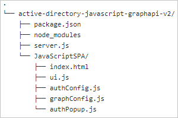

# Sign in users and call the Microsoft Graph API from a JavaScript single-page application (SPA) - MSAL.js 2.0

> [!IMPORTANT]
> This feature is currently in preview. Previews are made available to you on the condition that you agree to the [supplemental terms of use](https://azure.microsoft.com/support/legal/preview-supplemental-terms/). Some aspects of this feature might change before general availability (GA).

This tutorial uses a version of MSAL.js that uses the OAuth 2.0 Authorization Code Flow with PKCE. To read more about this protocol, as well as the differences between implicit flow and authorization code flow, see the [documentation](https://docs.microsoft.com/azure/active-directory/develop/v2-oauth2-auth-code-flow). If you are looking for a tutorial that uses the implicit flow, please see the [MSAL.js v1 tutorial](https://docs.microsoft.com/azure/active-directory/develop/tutorial-v2-javascript-spa).

This version of MSAL.js improves on the current msal-core library, and uses the authorization code flow in the browser. Most features available in the old library are available in this version, but there are nuances to the authentication flow in both. This version does **NOT** support the implicit flow.

This guide demonstrates how a JavaScript single-page application (SPA) can:
- Sign in personal accounts, as well as work and school accounts
- Acquire an access token
- Call the Microsoft Graph API or other APIs that require access tokens from the *Microsoft identity platform endpoint*

## How the sample app generated by this guide works


### More information

The sample application created by this guide enables a JavaScript SPA to query the Microsoft Graph API or a web API that accepts tokens from the Microsoft identity platform endpoint. In this scenario, after a user signs in, an access token is requested and added to HTTP requests through the authorization header. Token acquisition and renewal are handled by the Microsoft Authentication Library (MSAL).

### Libraries

This guide uses the following library:

|Library|Description|
|---|---|
|[msal.js](https://github.com/AzureAD/microsoft-authentication-library-for-js/tree/dev/lib/msal-browser)|Microsoft Authentication Library for JavaScript browser package|

## Set up your web server or project

Prefer to download this sample's project instead? To run the project by using a local web server, such as Node.js, clone the project files:

`git clone https://github.com/Azure-Samples/ms-identity-javascript-v2`

To configure the code sample before you execute it, skip to the [configuration step](#register-your-application).

## Prerequisites

* To run this tutorial, you need a local web server, such as [Node.js](https://nodejs.org/en/download/) or [.NET Core](https://www.microsoft.com/net/core).

* If you're using Node.js to run the project, install an integrated development environment (IDE) like [Visual Studio Code](https://code.visualstudio.com/download) to edit the project files.

* Instructions in this tutorial are based on Node.js.

## Create your project

Make sure you have [Node.js](https://nodejs.org/en/download/) installed, and then create a folder to host your application. Next, implement a small [Express](https://expressjs.com/) web server to serve your `index.html` file.

1. First, navigate to your project folder in your terminal and then run the following NPM commands.
    ```console
    npm init -y
    npm install @azure/msal-Browser
    npm install express
    ```
2. Next, create a .js file named *server.js*, and then add the following code:

   ```JavaScript
   const express = require('express');
   const morgan = require('morgan');
   const path = require('path');
   const argv = require('yargs')
      .usage('Usage: $0 -p [PORT]')
      .alias('p', 'port')
      .describe('port', '(Optional) Port Number - default is 3000')
      .strict()
      .argv;

   const DEFAULT_PORT = 3000;

   //initialize express.
   const app = express();

   // Initialize variables.
   let port = DEFAULT_PORT; // -p {PORT} || 3000;
   if (argv.p) {
      port = argv.p;
   }

   // Configure morgan module to log all requests.
   app.use(morgan('dev'));

   // Set the front-end folder to serve public assets.
   app.use("/lib", express.static(path.join(__dirname, "../../lib/msal-browser/lib")));

   // Setup app folders
   app.use(express.static('app'));

   // Set up a route for index.html.
   app.get('*', function (req, res) {
      res.sendFile(path.join(__dirname + '/index.html'));
   });

   // Start the server.
   app.listen(port);
   console.log(`Listening on port ${port}...`);
    ```

You now have a simple server to serve your SPA. The intended folder structure at the end of this tutorial is as follows:



## Create the SPA UI

1. Create an *index.html* file for your JavaScript SPA in the *app* folder. This file implements a UI built with **Bootstrap 4 Framework** and imports script files for configuration, authentication, and API calls.

   In the *index.html* file, add the following code:

   ```html
   <!DOCTYPE html>
   <html lang="en">
      <head>
         <meta charset="UTF-8">
         <meta name="viewport" content="width=device-width, initial-scale=1.0, shrink-to-fit=no">
         <title>Quickstart | MSAL.JS Vanilla JavaScript SPA</title>

         <!-- IE support: add promises polyfill before msal.js  -->
         <script type="text/javascript" src="//cdn.jsdelivr.net/npm/bluebird@3.7.2/js/browser/bluebird.min.js"></script>
         <script type="text/javascript" src="https://alcdn.msauth.net/browser/2.0.0-beta.0/js/msal-browser.js"></script>

         <!-- adding Bootstrap 4 for UI components  -->
         <link rel="stylesheet" href="https://stackpath.bootstrapcdn.com/bootstrap/4.4.1/css/bootstrap.min.css" integrity="sha384-Vkoo8x4CGsO3+Hhxv8T/Q5PaXtkKtu6ug5TOeNV6gBiFeWPGFN9MuhOf23Q9Ifjh" crossorigin="anonymous">
         <link rel="SHORTCUT ICON" href="https://c.s-microsoft.com/favicon.ico?v2" type="image/x-icon">
      </head>
      <body>
         <nav class="navbar navbar-expand-lg navbar-dark bg-primary">
            <a class="navbar-brand" href="/">MS Identity Platform</a>
            <div class="btn-group ml-auto dropleft">
               <button type="button" id="SignIn" class="btn btn-secondary" onclick="signIn()">
                  Sign In
               </button>
            </div>
         </nav>
         <br>
         <h5 class="card-header text-center">Vanilla JavaScript SPA calling MS Graph API with MSAL.JS</h5>
         <br>
         <div class="row" style="margin:auto" >
         <div id="card-div" class="col-md-3" style="display:none">
         <div class="card text-center">
            <div class="card-body">
            <h5 class="card-title" id="WelcomeMessage">Please sign-in to see your profile and read your mails</h5>
            <div id="profile-div"></div>
            <br>
            <br>
            <button class="btn btn-primary" id="seeProfile" onclick="seeProfile()">See Profile</button>
            <br>
            <br>
            <button class="btn btn-primary" id="readMail" onclick="readMail()">Read Mails</button>
            </div>
         </div>
         </div>
         <br>
         <br>
            <div class="col-md-4">
            <div class="list-group" id="list-tab" role="tablist">
            </div>
            </div>
            <div class="col-md-5">
             <div class="tab-content" id="nav-tabContent">
            </div>
            </div>
         </div>
         <br>
         <br>

         <!-- importing bootstrap.js and supporting js libraries -->
         <script src="https://code.jquery.com/jquery-3.4.1.slim.min.js" integrity="sha384-J6qa4849blE2+poT4WnyKhv5vZF5SrPo0iEjwBvKU7imGFAV0wwj1yYfoRSJoZ+n" crossorigin="anonymous"></script>
         <script src="https://cdn.jsdelivr.net/npm/popper.js@1.16.0/dist/umd/popper.min.js" integrity="sha384-Q6E9RHvbIyZFJoft+2mJbHaEWldlvI9IOYy5n3zV9zzTtmI3UksdQRVvoxMfooAo" crossorigin="anonymous"></script>
         <script src="https://stackpath.bootstrapcdn.com/bootstrap/4.4.1/js/bootstrap.min.js" integrity="sha384-wfSDF2E50Y2D1uUdj0O3uMBJnjuUD4Ih7YwaYd1iqfktj0Uod8GCExl3Og8ifwB6" crossorigin="anonymous"></script>

         <!-- importing app scripts (load order is important) -->
         <script type="text/javascript" src="./authConfig.js"></script>
         <script type="text/javascript" src="./graphConfig.js"></script>
         <script type="text/javascript" src="./ui.js"></script>

         <!-- <script type="text/javascript" src="./authRedirect.js"></script>   -->
         <!-- uncomment the above line and comment the line below if you would like to use the redirect flow -->
         <script type="text/javascript" src="./authPopup.js"></script>
         <script type="text/javascript" src="./graph.js"></script>
      </body>
     </html>
     ```

   > [!TIP]
   > You can replace the version of MSAL.js in the preceding script with the latest released version under [MSAL.js releases](https://github.com/AzureAD/microsoft-authentication-library-for-js/releases).


2. Now, create a .js file named *ui.js* that will access and update DOM elements, and add the following code:

   ```JavaScript
   // Select DOM elements to work with
   const welcomeDiv = document.getElementById("welcomeMessage");
   const signInButton = document.getElementById("signIn");
   const signOutButton = document.getElementById('signOut');
   const cardDiv = document.getElementById("card-div");
   const mailButton = document.getElementById("readMail");
   const profileButton = document.getElementById("seeProfile");
   const profileDiv = document.getElementById("profile-div");

   function showWelcomeMessage(account) {
     // Reconfiguring DOM elements
     cardDiv.classList.remove('d-none');
     welcomeDiv.innerHTML = `Welcome ${account.name}`;
     signInButton.classList.add('d-none');
     signOutButton.classList.remove('d-none');
   }

   function updateUI(data, endpoint) {
     console.log('Graph API responded at: ' + new Date().toString());

     if (endpoint === graphConfig.graphMeEndpoint) {
       const title = document.createElement('p');
       title.innerHTML = "<strong>Title: </strong>" + data.jobTitle;
       const email = document.createElement('p');
       email.innerHTML = "<strong>Mail: </strong>" + data.mail;
       const phone = document.createElement('p');
       phone.innerHTML = "<strong>Phone: </strong>" + data.businessPhones[0];
       const address = document.createElement('p');
       address.innerHTML = "<strong>Location: </strong>" + data.officeLocation;
       profileDiv.appendChild(title);
       profileDiv.appendChild(email);
       profileDiv.appendChild(phone);
       profileDiv.appendChild(address);

     } else if (endpoint === graphConfig.graphMailEndpoint) {
         if (data.value.length < 1) {
           alert("Your mailbox is empty!")
         } else {
           const tabList = document.getElementById("list-tab");
           tabList.innerHTML = ''; // clear tabList at each readMail call
           const tabContent = document.getElementById("nav-tabContent");

           data.value.map((d, i) => {
             // Keeping it simple
             if (i < 10) {
               const listItem = document.createElement("a");
               listItem.setAttribute("class", "list-group-item list-group-item-action")
               listItem.setAttribute("id", "list" + i + "list")
               listItem.setAttribute("data-toggle", "list")
               listItem.setAttribute("href", "#list" + i)
               listItem.setAttribute("role", "tab")
               listItem.setAttribute("aria-controls", i)
               listItem.innerHTML = d.subject;
               tabList.appendChild(listItem)

               const contentItem = document.createElement("div");
               contentItem.setAttribute("class", "tab-pane fade")
               contentItem.setAttribute("id", "list" + i)
               contentItem.setAttribute("role", "tabpanel")
               contentItem.setAttribute("aria-labelledby", "list" + i + "list")
               contentItem.innerHTML = "<strong> from: " + d.from.emailAddress.address + "</strong><br><br>" + d.bodyPreview + "...";
               tabContent.appendChild(contentItem);
             }
           });
         }
     }
   }
   ```

## Register your application

Follow the instructions to [register a new single page application](https://docs.microsoft.com/azure/active-directory/develop/scenario-spa-app-registration).

#### Set a redirect URL for Node.js

For Node.js, you can set the web server port in the *server.js* file. This tutorial uses port 3000, but you can use any other available port.

To set up a redirect URL in the application registration information, switch back to the **Application Registration** pane and register a new **SPA** with either of the following:

- Set *`http://localhost:3000/`* as the **Redirect URL**.
- If you're using a custom TCP port, use *`http://localhost:<port>/`* (where *\<port>* is the custom TCP port number).

### Configure your JavaScript SPA

Create a new .js file named *authConfig.js* to contain your configuration parameters for authentication, and add the following code:

```javascript
  const msalConfig = {
    auth: {
      clientId: "Enter_the_Application_Id_Here",
      authority: "Enter_the_Cloud_Instance_Id_HereEnter_the_Tenant_Info_Here",
      redirectUri: "Enter_the_Redirect_Uri_Here",
    },
    cache: {
      cacheLocation: "sessionStorage", // This configures where your cache will be stored
      storeAuthStateInCookie: false, // Set this to "true" if you are having issues on IE11 or Edge
    }
  };

  // Add here scopes for id token to be used at MS Identity Platform endpoints.
  const loginRequest = {
   scopes: ["openid", "profile", "User.Read"]
  };

   // Add here scopes for access token to be used at MS Graph API endpoints.
  const tokenRequest = {
   scopes: ["User.Read", "Mail.Read"]
  };

```

 Where:
 - *\<Enter_the_Application_Id_Here>* is the **Application (client) ID** for the application you registered.
 - *\<Enter_the_Cloud_Instance_Id_Here>* is the instance of the Azure cloud. For the main or global Azure cloud, simply enter *https://login.microsoftonline.com*. For **national** clouds (for example, China), see [National clouds](https://docs.microsoft.com/azure/active-directory/develop/authentication-national-cloud).
 - *\<Enter_the_Tenant_info_here>* is set to one of the following options:
   - If your application supports *accounts in this organizational directory*, replace this value with the **Tenant ID** or **Tenant name** (for example, *contoso.microsoft.com*).
   - If your application supports *accounts in any organizational directory*, replace this value with **organizations**.
   - If your application supports *accounts in any organizational directory and personal Microsoft accounts*, replace this value with **common**. To restrict support to *personal Microsoft accounts only*, replace this value with **consumers**.
- *\Enter_the_Redirect_Uri_Here>* is the port you registered in the portal (*`http://localhost:3000/`*)


Create a new .js file named `graphConfig.js`, which will contain your configuration parameters calling Microsoft Graph API, and add the following code:
```javascript
// Add here the endpoints for MS Graph API services you would like to use.
const graphConfig = {
    graphMeEndpoint: "Enter_the_Graph_Endpoint_Herev1.0/me",
    graphMailEndpoint: "Enter_the_Graph_Endpoint_Herev1.0/me/messages"
};
```
- *\<Enter_the_Graph_Endpoint_Here>* is the instance of MS Graph API. For the global MS Graph API endpoint, simply replace this string with `https://graph.microsoft.com`. For national cloud deployments, please refer to [Graph API Documentation](https://docs.microsoft.com/graph/deployments).

## Use the Microsoft Authentication Library (MSAL) to sign in the user

### PopUp
Create a new .js file named `authPopup.js`, which will contain your authentication and token acquisition logic for login popUp, and add the following code:

   ```JavaScript
  // Create the main myMSALObj instance
// configuration parameters are located at authConfig.js
const myMSALObj = new msal.PublicClientApplication(msalConfig);

function signIn() {
    myMSALObj.loginPopup(loginRequest)
        .then(loginResponse => {
            console.log('id_token acquired at: ' + new Date().toString());

            if (myMSALObj.getAccount()) {
                showWelcomeMessage(myMSALObj.getAccount());
            }
        }).catch(error => {
            console.error(error);
        });
}

function signOut() {
    myMSALObj.logout();
}

function getTokenPopup(request) {
    return myMSALObj.acquireTokenSilent(request)
        .catch(error => {
            console.warn(error);
            console.warn("silent token acquisition fails. acquiring token using popup");

            // fallback to interaction when silent call fails
            return myMSALObj.acquireTokenPopup(request)
                .then(tokenResponse => {
                    return tokenResponse;
                }).catch(error => {
                    console.error(error);
                });
        });
}

function seeProfile() {
    if (myMSALObj.getAccount()) {
        getTokenPopup(loginRequest)
            .then(response => {
                callMSGraph(graphConfig.graphMeEndpoint, response.accessToken, updateUI);
                profileButton.classList.add('d-none');
                mailButton.classList.remove('d-none');
            }).catch(error => {
                console.error(error);
            });
    }
}

function readMail() {
    if (myMSALObj.getAccount()) {
        getTokenPopup(tokenRequest)
            .then(response => {
                callMSGraph(graphConfig.graphMailEndpoint, response.accessToken, updateUI);
            }).catch(error => {
                console.error(error);
            });
    }
}
   ```
### Redirect
Create a new .js file named `authRedirect.js`, which will contain your authentication and token acquisition logic for login redirect, and add the following code:

```javascript
// Create the main myMSALObj instance
// configuration parameters are located at authConfig.js
const myMSALObj = new msal.PublicClientApplication(msalConfig);

let accessToken;

// Register Callbacks for Redirect flow
myMSALObj.handleRedirectCallback(authRedirectCallBack);

function authRedirectCallBack(error, response) {
    if (error) {
        console.error(error);
    } else {
        if (myMSALObj.getAccount()) {
            console.log('id_token acquired at: ' + new Date().toString());
            showWelcomeMessage(myMSALObj.getAccount());
            getTokenRedirect(loginRequest);
        } else if (response.tokenType === "Bearer") {
            console.log('access_token acquired at: ' + new Date().toString());
        } else {
            console.log("token type is:" + response.tokenType);
        }
    }
}

// Redirect: once login is successful and redirects with tokens, call Graph API
if (myMSALObj.getAccount()) {
    showWelcomeMessage(myMSALObj.getAccount());
}

function signIn() {
    myMSALObj.loginRedirect(loginRequest);
}

function signOut() {
    myMSALObj.logout();
}

// This function can be removed if you do not need to support IE
function getTokenRedirect(request) {
    return myMSALObj.acquireTokenSilent(request)
        .then((response) => {
            console.log(response);
            if (response.accessToken) {
                console.log('access_token acquired at: ' + new Date().toString());
                accessToken = response.accessToken;

                callMSGraph(graphConfig.graphMeEndpoint, response.accessToken, updateUI);
                profileButton.style.display = 'none';
                mailButton.style.display = 'initial';
            }
        })
        .catch(error => {
            console.warn("silent token acquisition fails. acquiring token using redirect");
            // fallback to interaction when silent call fails
            return myMSALObj.acquireTokenRedirect(request);
        });
}

function seeProfile() {
    getTokenRedirect(loginRequest);
}

function readMail() {
    getTokenRedirect(tokenRequest);
}
```

### More information

After a user selects the **Sign In** button for the first time, the `signIn` method calls `loginPopup` to sign in the user. This method opens a pop-up window with the *Microsoft identity platform endpoint* to prompt and validate the user's credentials. After a successful sign-in, *msal.js* initiates the [authorization code flow](https://docs.microsoft.com/azure/active-directory/develop/v2-oauth2-auth-code-flow).

At this point, a PKCE-protected authorization code is sent to the CORS-protected token endpoint and is exchanged for tokens. An ID token, access token, and refresh token are received, processed by *msal.js*, and the information contained in the token is cached.

The ID token  contains basic information about the user, such as their display name. If you plan to use any data provided by this token, it must be validated by your back-end server to guarantee the token was issued to a valid user for your application. The refresh token has a limited lifetime and expires after 24 hours. The refresh token can be used to silently acquire new access tokens.

The SPA generated by this guide calls `acquireTokenSilent` and/or `acquireTokenPopup` to acquire an *access token* used to query the Microsoft Graph API for user profile info. If you need a sample that validates the ID token, see the [active-directory-javascript-singlepageapp-dotnet-webapi-v2](https://github.com/Azure-Samples/active-directory-javascript-singlepageapp-dotnet-webapi-v2) sample application on GitHub. The sample uses an ASP.NET web API for token validation.

#### Get a user token interactively

After initial sign-in, your users should not be asked to reauthenticate every time they need to request a token to access a resource. To prevent such reauthentication requests, use `acquireTokenSilent`. There are some situations, however, where you might need to force users to interact with the Microsoft identity platform endpoint. For example:

- Users need to re-enter their credentials because the password has expired.
- Your application is requesting access to a resource and you need the user's consent.
- Two-factor authentication is required.

Calling `acquireTokenPopup` opens a pop-up window (or `acquireTokenRedirect` redirects users to the Microsoft identity platform endpoint). In that window, users need to interact by confirming their credentials, giving consent to the required resource, or completing the two-factor authentication.

#### Get a user token silently

The `acquireTokenSilent` method handles token acquisition and renewal without any user interaction. After `loginPopup` (or `loginRedirect`) is executed for the first time, `acquireTokenSilent` is the method commonly used to obtain tokens used to access protected resources for subsequent calls. (Calls to request or renew tokens are made silently.)
`acquireTokenSilent` may fail in some cases. For example, the user's password may have expired. Your application can handle this exception in two ways:

1. Make a call to `acquireTokenPopup` immediately to trigger a user sign-in prompt. This pattern is commonly used in online applications where there is no unauthenticated content in the application available to the user. The sample generated by this guided setup uses this pattern.

1. Visually indicate to the user that an interactive sign-in is required so the user can select the right time to sign in, or the application can retry `acquireTokenSilent` at a later time. This technique is commonly used when the user can use other functionality of the application without being disrupted. For example, there might be unauthenticated content available in the application. In this situation, the user can decide when they want to sign in to access the protected resource, or to refresh the outdated information.

> [!NOTE]
> This quickstart uses the `loginPopup` and `acquireTokenPopup` methods by default. If you are using Internet Explorer as your browser, it is recommended to use `loginRedirect` and `acquireTokenRedirect` methods, due to a [known issue](https://github.com/AzureAD/microsoft-authentication-library-for-js/wiki/Known-issues-on-IE-and-Edge-Browser#issues) related to the way Internet Explorer handles pop-up windows. If you would like to see how to achieve the same result using redirect methods, please see [*authRedirect.js*](https://github.com/Azure-Samples/active-directory-javascript-graphapi-v2/blob/quickstart/JavaScriptSPA/authRedirect.js).

## Call the Microsoft Graph API by using the token you just acquired


 Create a .js file named *graph.js* that will make a REST call to Microsoft Graph API, and add the following code:

   ```javascript

// Helper function to call MS Graph API endpoint
// using authorization bearer token scheme
function callMSGraph(endpoint, token, callback) {
    const headers = new Headers();
    const bearer = `Bearer ${token}`;

    headers.append("Authorization", bearer);

    const options = {
        method: "GET",
        headers: headers
    };

    console.log('request made to Graph API at: ' + new Date().toString());

    fetch(endpoint, options)
        .then(response => response.json())
        .then(response => callback(response, endpoint))
        .catch(error => console.log(error));
}
   ```

### More information about making a REST call against a protected API

In the sample application created by this guide, the `callMSGraph()` method is used to make an HTTP `GET` request against a protected resource that requires a token. The request then returns the content to the caller. This method adds the acquired token in the *HTTP Authorization header*. For the sample application created by this guide, the resource is the Microsoft Graph API *me* endpoint, which displays the user's profile information.

## Test your code

1. For Node.js, start the web server by running the following commands from within the application folder:

   ```bash
   npm install
   npm start
   ```
1. In your browser, enter **http://localhost:3000** or **http://localhost:{port}**, where *port* is the port that your web server is listening on. You should see the contents of your *index.html* file and the **Sign In** button.

## Test your application

After the browser loads your *index.html* file, select **Sign In**. You're prompted to sign in with the Microsoft identity platform endpoint:


### Provide consent for application access

The first time that you sign in to your application, you're prompted to grant it access to your profile and sign you in:


### View application results

After you sign in, your user profile information is returned in the Microsoft Graph API response that's displayed:


### More information about scopes and delegated permissions

The Microsoft Graph API requires the *user.read* scope to read a user's profile. By default, this scope is automatically added in every application that's registered in the Azure portal. Other APIs for Microsoft Graph, as well as custom APIs for your back-end server, might require additional scopes. For example, the Microsoft Graph API requires the *Mail.Read* scope in order to list the user's mails.

> [!NOTE]
> The user might be prompted for additional consent as you add scopes.

If a back-end API doesn't require a scope (not recommended), you can use *clientId* as the scope in the calls to acquire tokens.

[!INCLUDE [Help and support](../../../includes/active-directory-develop-help-support-include.md)]

## Next steps

The [MSAL.js GitHub repo](https://github.com/AzureAD/microsoft-authentication-library-for-js) contains additional library documentation, a FAQ, and provides issue support.
