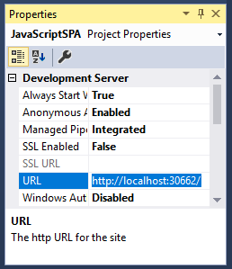
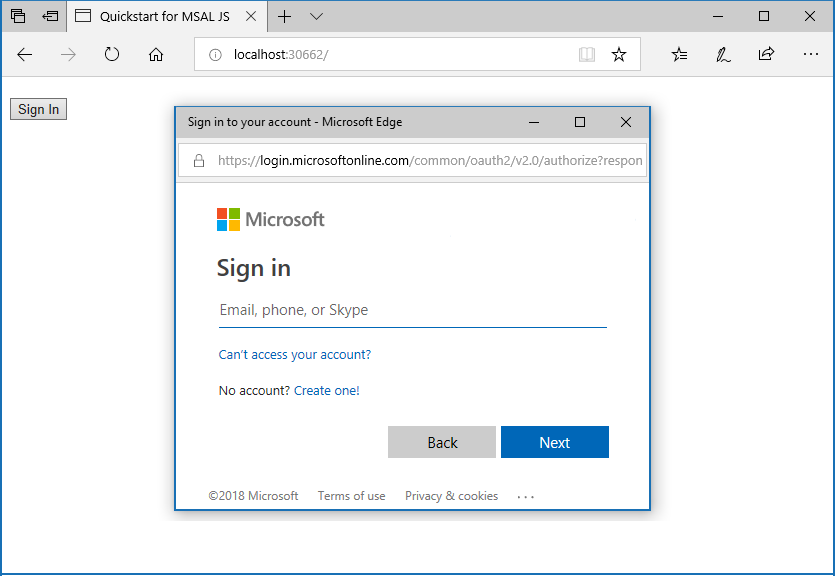
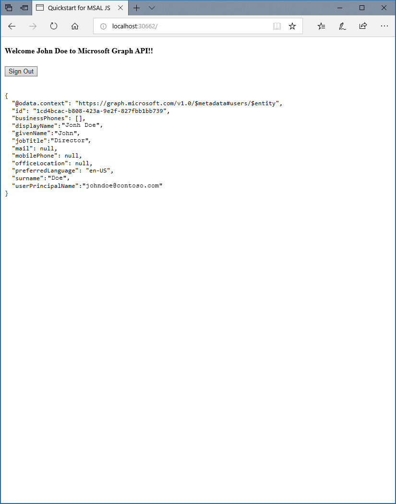

# Sign in users and call the Microsoft Graph API from a JavaScript single-page application (SPA)

This guide demonstrates how a JavaScript single-page application (SPA) can sign in personal, work and school accounts, get an access token, and call the Microsoft Graph API or other APIs that require access tokens from the Microsoft identity platform endpoint.

## How the sample app generated by this guide works


<!--start-collapse-->
### More Information

The sample application created by this guide enables a JavaScript SPA to query the Microsoft Graph API or a Web API that accepts tokens from Microsoft identity platform endpoint. For this scenario, after a user signs in, an access token is requested and added to HTTP requests through the authorization header. Token acquisition and renewal are handled by the Microsoft Authentication Library (MSAL).

<!--end-collapse-->

<!--start-collapse-->
### Libraries

This guide uses the following library:

|Library|Description|
|---|---|
|[msal.js](https://github.com/AzureAD/microsoft-authentication-library-for-js)|Microsoft Authentication Library for JavaScript Preview|

> [!NOTE]
> *msal.js* targets the *Microsoft identity platform endpoint* which enables personal, school and work accounts to sign in and acquire tokens. The *Microsoft identity platform endpoint* has [some limitations](azure-ad-endpoint-comparison.md#limitations).
> To understand differences between the v1.0 and v2.0 endpoints read the [Endpoint comparison guide](azure-ad-endpoint-comparison.md).

<!--end-collapse-->

## Set up your web server or project

> Prefer to download this sample's project instead? Do either of the following:
> 
> - To run the project with a local web server, such as Node.js, [download the project files](https://github.com/Azure-Samples/active-directory-javascript-graphapi-v2/archive/quickstart.zip).
>
> - (Optional) To run the project with the IIS server, [download the Visual Studio project](https://github.com/Azure-Samples/active-directory-javascript-graphapi-v2/archive/vsquickstart.zip).
>
> And then, to configure the code sample before you execute it, skip to the [configuration step](#register-your-application).

## Prerequisites

* To run this tutorial, you need a local web server, such as [Node.js](https://nodejs.org/en/download/), [.NET Core](https://www.microsoft.com/net/core), or IIS Express integration with [Visual Studio 2017](https://www.visualstudio.com/downloads/).

* If you're using Node.js to run the project, install an integrated development environment (IDE), such as [Visual Studio Code](https://code.visualstudio.com/download), to edit the project files.

* Instructions in this guide are based on both Node.js and Visual Studio 2017, but you can use any other development environment or web server.

## Create your project

> ### Option 1: Node.js or other web servers
> Make sure you have installed [Node.js](https://nodejs.org/en/download/), and then do the following:
> -	Create a folder to host your application.
>
> ### Option 2: Visual Studio
> If you're using Visual Studio and are creating a new project, do the following:
> 1. In Visual Studio, select **File** > **New** > **Project**.
> 1. Under **Visual C#\Web**, select **ASP.NET Web Application (.NET Framework)**.
> 1. Enter a name for your application, and then select **OK**.
> 1. Under **New ASP.NET Web Application**, select **Empty**.

## Create the SPA UI
1. Create an *index.html* file for your JavaScript SPA. If you're using Visual Studio, select the project (project root folder), right-click and select **Add** > **New Item** > **HTML page**, and name the file *index.html*.

1. In the *index.html* file, add the following code:

   ```html
   <!DOCTYPE html>
   <html>
   <head>
       <title>Quickstart for MSAL JS</title>
       <script src="https://cdnjs.cloudflare.com/ajax/libs/bluebird/3.3.4/bluebird.min.js"></script>
       <script src="https://secure.aadcdn.microsoftonline-p.com/lib/1.0.0/js/msal.js"></script>
   </head>
   <body>
       <h2>Welcome to MSAL.js Quickstart</h2><br/>
       <h4 id="WelcomeMessage"></h4>
       <button id="SignIn" onclick="signIn()">Sign In</button><br/><br/>
       <pre id="json"></pre>
       <script>
           //JS code
       </script>
   </body>
   </html>
   ```

   > [!TIP]
   > You can replace the version of MSAL.js in the preceding script with the latest released version under [MSAL.js releases](https://github.com/AzureAD/microsoft-authentication-library-for-js/releases).

## Use the Microsoft Authentication Library (MSAL) to sign in the user

1. Add the following code to your `index.html` file within the `<script></script>` tags:

    ```javascript
    var msalConfig = {
        auth: {
            clientId: "Enter_the_Application_Id_here"
            authority: "https://login.microsoftonline.com/Enter_the_Tenant_Info_Here"
        },
        cache: {
            cacheLocation: "localStorage",
            storeAuthStateInCookie: true
        }
    };

    var graphConfig = {
        graphMeEndpoint: "https://graph.microsoft.com/v1.0/me"
    };

    // this can be used for login or token request, however in more complex situations
    // this can have diverging options
    var requestObj = {
        scopes: ["user.read"]
    };

    var myMSALObj = new Msal.UserAgentApplication(msalConfig);
    // Register Callbacks for redirect flow
    myMSALObj.handleRedirectCallback(authRedirectCallBack);


    function signIn() {

        myMSALObj.loginPopup(requestObj).then(function (loginResponse) {
            //Login Success
            showWelcomeMessage();
            acquireTokenPopupAndCallMSGraph();
        }).catch(function (error) {
            console.log(error);
        });
    }

    function acquireTokenPopupAndCallMSGraph() {
        //Always start with acquireTokenSilent to obtain a token in the signed in user from cache
        myMSALObj.acquireTokenSilent(requestObj).then(function (tokenResponse) {
            callMSGraph(graphConfig.graphMeEndpoint, tokenResponse.accessToken, graphAPICallback);
        }).catch(function (error) {
            console.log(error);
            // Upon acquireTokenSilent failure (due to consent or interaction or login required ONLY)
            // Call acquireTokenPopup(popup window)
            if (requiresInteraction(error.errorCode)) {
                myMSALObj.acquireTokenPopup(requestObj).then(function (tokenResponse) {
                    callMSGraph(graphConfig.graphMeEndpoint, tokenResponse.accessToken, graphAPICallback);
                }).catch(function (error) {
                    console.log(error);
                });
            }
        });
    }


    function graphAPICallback(data) {
        document.getElementById("json").innerHTML = JSON.stringify(data, null, 2);
    }


    function showWelcomeMessage() {
        var divWelcome = document.getElementById('WelcomeMessage');
        divWelcome.innerHTML = 'Welcome ' + myMSALObj.getAccount().userName + "to Microsoft Graph API";
        var loginbutton = document.getElementById('SignIn');
        loginbutton.innerHTML = 'Sign Out';
        loginbutton.setAttribute('onclick', 'signOut();');
    }


    //This function can be removed if you do not need to support IE
    function acquireTokenRedirectAndCallMSGraph() {
         //Always start with acquireTokenSilent to obtain a token in the signed in user from cache
         myMSALObj.acquireTokenSilent(requestObj).then(function (tokenResponse) {
             callMSGraph(graphConfig.graphMeEndpoint, tokenResponse.accessToken, graphAPICallback);
         }).catch(function (error) {
             console.log(error);
             // Upon acquireTokenSilent failure (due to consent or interaction or login required ONLY)
             // Call acquireTokenRedirect
             if (requiresInteraction(error.errorCode)) {
                 myMSALObj.acquireTokenRedirect(requestObj);
             }
         });
     }


    function authRedirectCallBack(error, response) {
        if (error) {
            console.log(error);
        }
        else {
            if (response.tokenType === "access_token") {
                callMSGraph(graphConfig.graphEndpoint, response.accessToken, graphAPICallback);
            } else {
                console.log("token type is:" + response.tokenType);
            }
        }
    }

    function requiresInteraction(errorCode) {
        if (!errorCode || !errorCode.length) {
            return false;
        }
        return errorCode === "consent_required" ||
            errorCode === "interaction_required" ||
            errorCode === "login_required";
    }

    // Browser check variables
    var ua = window.navigator.userAgent;
    var msie = ua.indexOf('MSIE ');
    var msie11 = ua.indexOf('Trident/');
    var msedge = ua.indexOf('Edge/');
    var isIE = msie > 0 || msie11 > 0;
    var isEdge = msedge > 0;
    //If you support IE, our recommendation is that you sign-in using Redirect APIs
    //If you as a developer are testing using Edge InPrivate mode, please add "isEdge" to the if check
    // can change this to default an experience outside browser use
    var loginType = isIE ? "REDIRECT" : "POPUP";

    if (loginType === 'POPUP') {
        if (myMSALObj.getAccount()) {// avoid duplicate code execution on page load in case of iframe and popup window.
            showWelcomeMessage();
            acquireTokenPopupAndCallMSGraph();
        }
    }
    else if (loginType === 'REDIRECT') {
        document.getElementById("SignIn").onclick = function () {
            myMSALObj.loginRedirect(requestObj);
        };
        if (myMSALObj.getAccount() && !myMSALObj.isCallback(window.location.hash)) {// avoid duplicate code execution on page load in case of iframe and popup window.
            showWelcomeMessage();
            acquireTokenRedirectAndCallMSGraph();
        }
    } else {
        console.error('Please set a valid login type');
    }
    ```

<!--start-collapse-->
### More Information

After a user clicks the **Sign In** button for the first time, the `signIn` method calls `loginPopup` to sign in the user. This method results in opening a popup window with the *Microsoft identity platform endpoint* to prompt and validate the user's credentials. As a result of a successful sign-in, the user is redirected back to the original *index.html* page, and a token is received, processed by `msal.js` and the information contained in the token is cached. This token is known as the *ID token* and contains basic information about the user, such as the user display name. If you plan to use any data provided by this token for any purposes, you need to make sure this token is validated by your backend server to guarantee that the token was issued to a valid user for your application.

The SPA generated by this guide calls `acquireTokenSilent` and/or `acquireTokenPopup` to acquire an *access token* used to query the Microsoft Graph API for user profile info. If you need a sample that validates the ID token, take a look at [this](https://github.com/Azure-Samples/active-directory-javascript-singlepageapp-dotnet-webapi-v2 "GitHub active-directory-javascript-singlepageapp-dotnet-webapi-v2 sample") sample application in GitHub – the sample uses an ASP.NET Web API for token validation.

#### Getting a user token interactively

After the initial sign-in, you do not want to ask users to reauthenticate every time they need to request a token to access a resource – so *acquireTokenSilent* should be used most of the time to acquire tokens. There are situations however that you need to force users to interact with Microsoft identity platform endpoint – some examples include:

- Users may need to reenter their credentials because the password has expired
- Your application is requesting access to a resource that the user needs to consent to
- Two factor authentication is required

Calling the *acquireTokenPopup* results in a popup window (or *acquireTokenRedirect* results in redirecting users to the Microsoft identity platform endpoint) where users need to interact by either confirming their credentials, giving the consent to the required resource, or completing the two factor authentication.

#### Getting a user token silently

The `acquireTokenSilent` method handles token acquisitions and renewal without any user interaction. After `loginPopup` (or `loginRedirect`) is executed for the first time, `acquireTokenSilent` is the method commonly used to obtain tokens used to access protected resources for subsequent calls - as calls to request or renew tokens are made silently.
`acquireTokenSilent` may fail in some cases – for example, the user's password has expired. Your application can handle this exception in two ways:

1. Make a call to `acquireTokenPopup` immediately, which results in prompting the user to sign in. This pattern is commonly used in online applications where there is no unauthenticated content in the application available to the user. The sample generated by this guided setup uses this pattern.

2. Applications can also make a visual indication to the user that an interactive sign-in is required, so the user can select the right time to sign in, or the application can retry `acquireTokenSilent` at a later time. This is commonly used when the user can use other functionality of the application without being disrupted - for example, there is unauthenticated content available in the application. In this case, the user can decide when they want to sign in to access the protected resource, or to refresh the outdated information.

> [!NOTE]
> This quickstart uses the `loginRedirect` and `acquireTokenRedirect` methods when the browser used is Internet Explorer due to a [known issue](https://github.com/AzureAD/microsoft-authentication-library-for-js/wiki/Known-issues-on-IE-and-Edge-Browser#issues) related to handling of popup windows by Internet Explorer browser.
<!--end-collapse-->

## Call the Microsoft Graph API using the token you just obtained

Add the following code to your `index.html` file within the `<script></script>` tags:

```javascript
function callMSGraph(theUrl, accessToken, callback) {
    var xmlHttp = new XMLHttpRequest();
    xmlHttp.onreadystatechange = function () {
        if (this.readyState == 4 && this.status == 200)
            callback(JSON.parse(this.responseText));
    }
    xmlHttp.open("GET", theUrl, true); // true for asynchronous
    xmlHttp.setRequestHeader('Authorization', 'Bearer ' + accessToken);
    xmlHttp.send();
}
```
<!--start-collapse-->

### More information on making a REST call against a protected API

In the sample application created by this guide, the `callMSGraph()` method is used to make an HTTP `GET` request against a protected resource that requires a token and then return the content to the caller. This method adds the acquired token in the *HTTP Authorization header*. For the sample application created by this guide, the resource is the Microsoft Graph API *me* endpoint – which displays the user's profile information.

<!--end-collapse-->

## Add a method to sign out the user

Add the following code to your `index.html` file within the `<script></script>` tags:

```javascript
/**
 * Sign out the user
 */
 function signOut() {
     myMSALObj.logout();
 }
```

## Register your application

1. Sign in to the [Azure portal](https://portal.azure.com/).

1. If your account gives you access to more than one tenant, select the account at the top right, and then set your portal session to the Azure AD tenant that you want to use.
1. Go to the Microsoft identity platform for developers [App registrations](https://go.microsoft.com/fwlink/?linkid=2083908) page.
1. When the **Register an application** page appears, enter a name for your application.
1. Under **Supported account types**, select **Accounts in any organizational directory and personal Microsoft accounts**.
1. Under the **Redirect URI** section, in the drop-down list, select the **Web** platform, and then set the value to the application URL that's based on your web server. 

   For information about setting and obtaining the redirect URL in Visual Studio and Node.js, see the next two sections.

1. Select **Register**.
1. On the app **Overview** page, note the **Application (client) ID** value for later use.
1. This quickstart requires the [Implicit grant flow](v2-oauth2-implicit-grant-flow.md) to be enabled. In the left pane of the registered application, select **Authentication**.
1. In **Advanced settings**, under **Implicit grant**, select the **ID tokens** and **Access tokens** check boxes. ID tokens and access tokens are required, because this app needs to sign in users and call an API.
1. Select **Save**.

> #### Set a redirect URL for Node.js
> For Node.js, you can set the web server port in the *server.js* file. This tutorial uses port 30662 for reference, but you can use any other available port. 
>
> To set up a redirect URL in the application registration information, switch back to the **Application Registration** pane, and do either of the following:
>
> - Set *`http://localhost:30662/`* as the **Redirect URL**.
> - If you're using a custom TCP port, use *`http://localhost:<port>/`* (where *\<port>* is the custom TCP port number).
>
> #### Set a redirect URL for Visual Studio
> To obtain the redirect URL for Visual Studio, do the following:
> 1. In **Solution Explorer**, select the project.
>
>    The **Properties** window opens. If it doesn't open, press **F4**.
>
>    
>
> 1. Copy the **URL** value.
 
> 1. Switch back to the **Application Registration** pane, and paste the copied value as the **Redirect URL**.

#### Configure your JavaScript SPA

1. In the *index.html* file that you created during project setup, add the application registration information. At the top of the file, within the `<script></script>` tags, add the following code:

    ```javascript
    var msalConfig = {
        auth: {
            clientId: "<Enter_the_Application_Id_here>",
            authority: "https://login.microsoftonline.com/<Enter_the_Tenant_info_here>"
        },
        cache: {
            cacheLocation: "localStorage",
            storeAuthStateInCookie: true
        }
    };
    ```

    Where:
    - *\<Enter_the_Application_Id_here>* is the **Application (client) ID** for the application you registered.
    - *\<Enter_the_Tenant_info_here>* is set to one of the following options:
       - If your application supports *Accounts in this organizational directory*, replace this value with the **Tenant ID** or **Tenant name** (for example, *contoso.microsoft.com*).
       - If your application supports *Accounts in any organizational directory*, replace this value with **organizations**.
       - If your application supports *Accounts in any organizational directory and personal Microsoft accounts*, replace this value with **common**. To restrict support to *Personal Microsoft accounts only*, replace this value with **consumers**.

## Test your code

Test your code by using either of the following environments.

### Test with Node.js

If you're not using Visual Studio, make sure your web server is started.

1. Configure the server to listen to a TCP port that's based on the location of your *index.html* file. For Node.js, start the web server to listen to the port by running the following commands on a command-line prompt from the application folder:

    ```bash
    npm install
    node server.js
    ```
1. In your browser, enter **http://\<span>\</span>localhost:30662** or **http://\<span>\</span>localhost:{port}**, where *port* is the port that your web server is listening to. You should see the contents of your *index.html* file and the **Sign In** button.

### Test with Visual Studio

If you're using Visual Studio, select the project solution, and then select F5 to run your project. The browser opens to the http://<span></span>localhost:{port} location, and the **Sign In** button should be visible.

## Test your application

After the browser loads your *index.html* file, select **Sign In**. You're prompted to sign in with the Microsoft identity platform endpoint:



### Provide consent for application access

The first time that you sign in to your application, you're prompted to give it access to your profile and sign you in:


### View application results

After you sign in, your user profile information is returned in the Microsoft Graph API response that's displayed on the page.



<!--start-collapse-->
### More information about scopes and delegated permissions

The Microsoft Graph API requires the *user.read* scope to read a user's profile. This scope is automatically added by default in every application that's registered on the registration portal. Other APIs for Microsoft Graph, as well as custom APIs for your back-end server, might require additional scopes. For example, the Microsoft Graph API requires the *Calendars.Read* scope to list the user’s calendars.

To access the user’s calendars in the context of an application, add the *Calendars.Read* delegated permission to the application registration information. Then, add the *Calendars.Read* scope to the `acquireTokenSilent` call.

>[!NOTE]
>The user might be prompted for additional consents as you increase the number of scopes.

If a back-end API doesn't require a scope (not recommended), you can use the *clientId* as the scope in the calls to acquire tokens.

<!--end-collapse-->

[!INCLUDE [Help and support](../../../includes/active-directory-develop-help-support-include.md)]

Help us improve the Microsoft identity platform. Tell us what you think by completing a short two-question survey.

> [!div class="nextstepaction"]
> [Microsoft identity platform survey](https://forms.office.com/Pages/ResponsePage.aspx?id=v4j5cvGGr0GRqy180BHbRyKrNDMV_xBIiPGgSvnbQZdUQjFIUUFGUE1SMEVFTkdaVU5YT0EyOEtJVi4u)