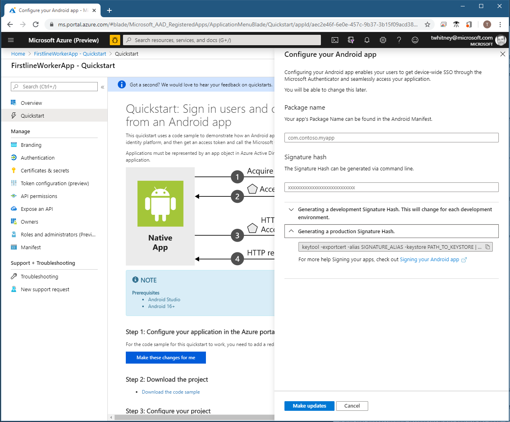
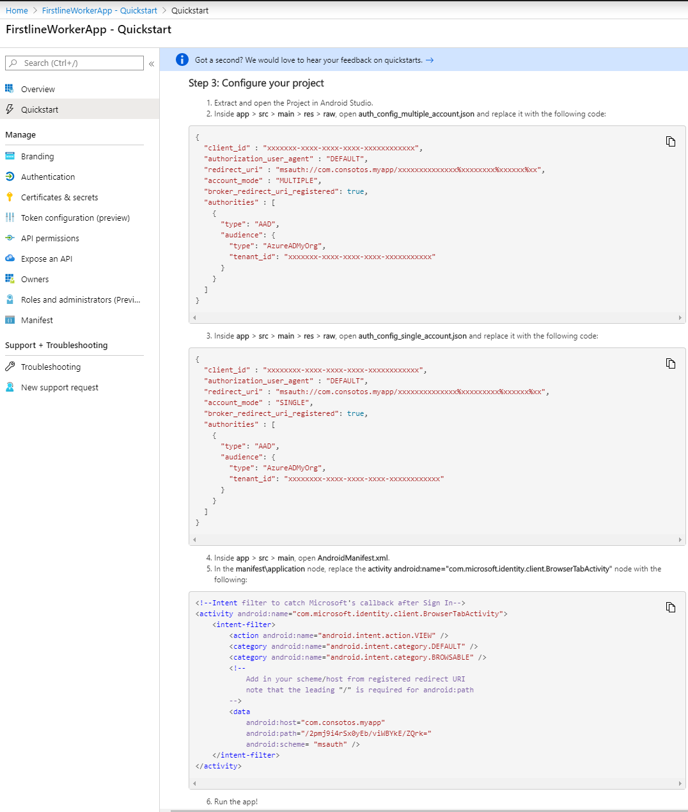
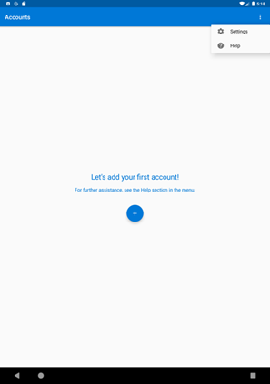
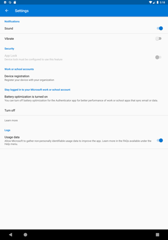
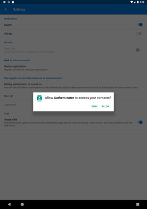
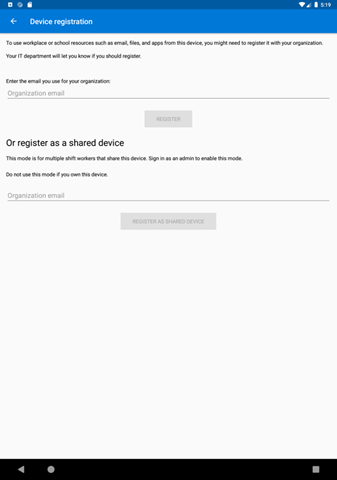
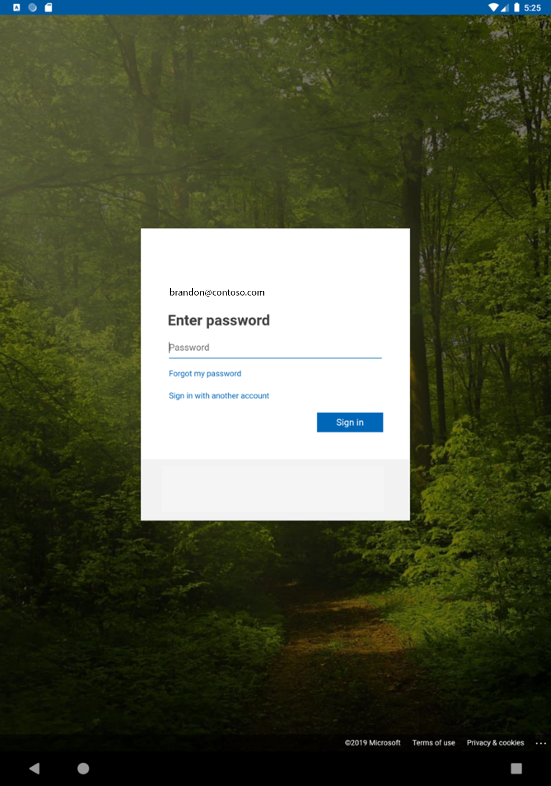
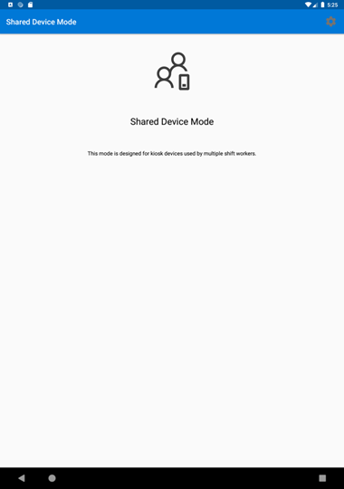
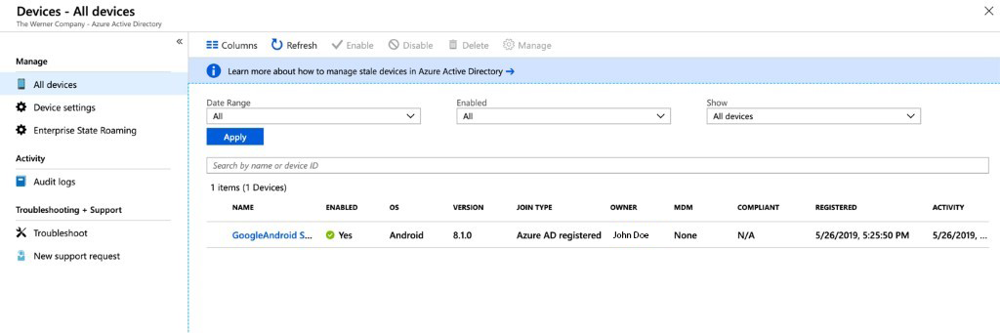
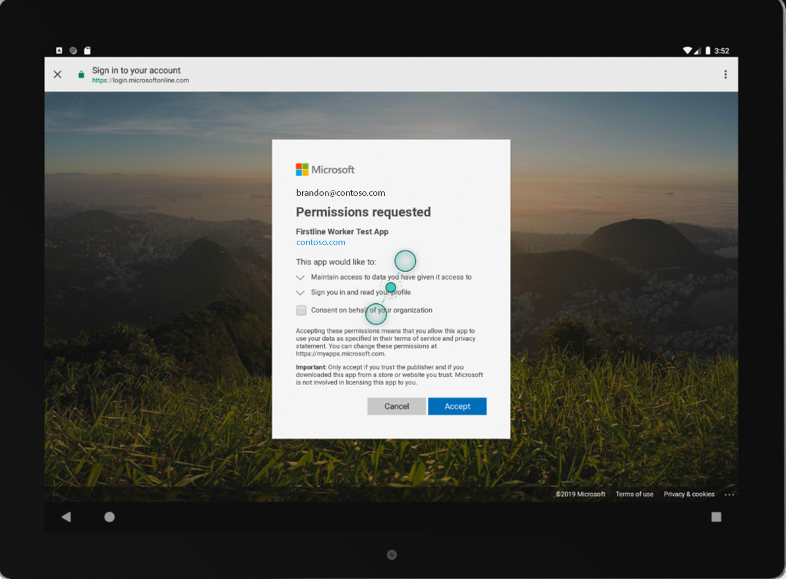

# Tutorial: Use shared-device mode in your Android application

> [!NOTE]
> This feature is in public preview.
> This preview version is provided without a service level agreement, and it's not recommended for production workloads. Certain features might not be supported or might have constrained capabilities.
> For more information, see [Supplemental Terms of Use for Microsoft Azure Previews](https://azure.microsoft.com/support/legal/preview-supplemental-terms/).

## Developer guide

This guide provides developer guidance to implement shared-device mode in an Android application using the Microsoft Authentication Library (MSAL). See the [MSAL Android tutorial](https://docs.microsoft.com/azure/active-directory/develop/tutorial-v2-android) to see how to integrate MSAL with your Android app, sign in a user, call Microsoft graph, and sign out a user.

### Download the sample

Clone the [sample application](https://github.com/Azure-Samples/ms-identity-android-java/) from GitHub. The sample has the capability to work in [single or multi account mode](https://docs.microsoft.com/azure/active-directory/develop/single-multi-account).

### Add the MSAL SDK to your local Maven repository

If you're not using the sample app, add the MSAL library as a dependency in your build.gradle file, like so:

```gradle
dependencies{
  implementation 'com.microsoft.identity.client.msal:1.0.+'
}
```

### Configure your app to use shared-device mode

Refer to the [configuration documentation](https://docs.microsoft.com/azure/active-directory/develop/msal-configuration) for more information on setting up your config file.

Set `"shared_device_mode_supported"` to `true` in your MSAL configuration file.

You may not be planning to support multiple-account mode. That could be if you're not using a shared device, and the user can sign into the app with more than one account at the same time. If so, set `"account_mode"` to `"SINGLE"`. This guarantees that your app will always get `ISingleAccountPublicClientApplication`, and significantly simplifies your MSAL integration. The default value of `"account_mode"` is `"MULTIPLE"`, so it is important to change this value in the config file if you're using `"single account"` mode.

Here's an example of the auth_config.json file included in the **app**>**main**>**res**>**raw** directory of the sample app:

```json
{
 "client_id":"Client ID after app registration at https://aka.ms/MobileAppReg",
 "authorization_user_agent":"DEFAULT",
 "redirect_uri":"Redirect URI after app registration at https://aka.ms/MobileAppReg",
 "account_mode":"SINGLE",
 "broker_redirect_uri_registered": true,
 "shared_device_mode_supported": true,
 "authorities":[
  {
   "type":"AAD",
   "audience":{
     "type": "AzureADandPersonalMicrosoftAccount",
     "tenant_id":"common"
   }
  }
 ]
}
```

### Detect shared-device mode

Shared-device mode allows you to configure Android devices to be shared by multiple employees, while providing Microsoft Identity backed management of the device. Employees can sign in to their devices and access customer information quickly. When they are finished with their shift or task, they will be able to sign-out of all apps on the shared device with a single click and the device will be immediately ready for the next employee to use.

Use `isSharedDevice()` to determine if an app is running on a device that is in shared-device mode. Your app could use this flag to determine if it should modify UX accordingly.

Here's a code snippet that shows how you could use `isSharedDevice()`.  It's from the `SingleAccountModeFragment` class in the sample app:

```Java
deviceModeTextView.setText(mSingleAccountApp.isSharedDevice() ?"Shared" :"Non-Shared");
```

### Initialize the PublicClientApplication object

If you set `"account_mode":"SINGLE"` in the MSAL config file, you can safely cast the returned application object as an `ISingleAccountPublicCLientApplication`.

```java
private ISingleAccountPublicClientApplication mSingleAccountApp;

/*Configure your sample app and save state for this activity*/ 
PublicClientApplication.create(this.getApplicationCOntext(),
  R.raw.auth_config, 
  new PublicClientApplication.ApplicationCreatedListener(){
  @Override
  public void onCreated(IPublicClientApplication application){
  mSingleAccountApp = (ISingleAccountPublicClientApplication)application;
  loadAccount();
  }
  @Override
  public void onError(MsalException exception{
  /*Fail to initialize PublicClientApplication */
  }
});  
```

### Detect single vs. multiple account mode

If you're writing an app that will only be used for firstline workers on a shared device, we recommend you write your app to only support single-account mode. This includes most applications that are task focused such as medical records apps, invoice apps, and most line-of-business apps. This will simplify your development as many features of the SDK won’t need to be accommodated.

If your app supports multiple accounts as well as shared device mode, you must perform a type check and cast to the appropriate interface as shown below.

```java
private IPublicClientApplication mApplication;

        if (mApplication instanceOf IMultipleAccountPublicClientApplication) {
          IMultipleAccountPublicClientApplication multipleAccountApplication = (IMultipleAccountPublicClientApplication) mApplication;
          ...
        } else if (mApplication instanceOf    ISingleAccountPublicClientApplication) {
           ISingleAccountPublicClientApplication singleAccountApplication = (ISingleAccountPublicClientApplication) mApplication;
            ...
        }
```

### Get the signed in user and determine if a user has changed on the device

The `loadAccount` method retrieves the account of the signed in user. The `onAccountChanged` method determines if the signed-in user has changed, and if so, clean up:

```java 
private void loadAccount()
{
  mSingleAccountApp.getCurrentAccountAsync(new ISingleAccountPublicClientApplication.CurrentAccountCallback()
  {
    @Overide
    public void onAccountLoaded(@Nullable IAccount activeAccount)
    {
      if (activeAccount != null)
      {
        signedInUser = activeAccount;
        mSingleAccountApp.acquireTokenSilentAsync(SCOPES,"http://login.microsoftonline.com/common",getAuthSilentCallback());
      }
    }
    @Override
    public void on AccountChanged(@Nullable IAccount priorAccount, @Nullable Iaccount currentAccount)
    {
      if (currentAccount == null)
      {
        //Perform a cleanup task as the signed-in account changed.
        updateSingedOutUI();
      }
    }
    @Override 
    public void onError(@NonNull Exception exception) 
    {
    }
  }
}  
```

### Globally sign in a user

The following signs in a user across the device to other apps that use MSAL with the Authenticator App:

```java
private void onSignInClicked()
{
  mSingleAccountApp.signIn(getActivity(), SCOPES, null, getAuthInteractiveCallback());
}
```

### Globally sign out a user

The following removes the signed-in account and clears cached tokens from not only the app but also from the device that is in shared device mode:

```java
private void onSignOutClicked()
{
  mSingleAccountApp.signOut(new ISingleAccountPublicClientApplication.SignOutCallback()
  {
    @Override
    public void onSignOut()
    {
      updateSignedOutUI();
    }
    @Override
    public void onError(@NonNull MsalException exception)
    {
      /*failed to remove account with an exception*/
    }
  });
}
```

## Administrator guide

The following steps describe setting up your application in the Azure portal and putting your device into shared-device mode.

### Register your application in Azure Active Directory

First, register your application within your organizational tenant. Then provide these values below in auth_config.json in order for your application to run correctly.

For information on how to do this, refer to [Register your application](https://docs.microsoft.com/azure/active-directory/develop/tutorial-v2-android#register-your-application).

> [!NOTE]
> When you register your app, please use the quickstart guide on the left-hand side and then select **Android**. This will lead you to a page where you'll be asked to provide the **Package Name** and **Signature Hash** for your app. These are very important to ensure your app configuration will work. You'll then receive a configuration object that you can use for your app that you'll cut and paste into your auth_config.json file.


You should select **Make this change for me** and then provide the values the quickstart asks for in the Azure portal. When that's done, we will generate all the configuration files you need.



## Set up a tenant

For testing purposes, set up the following in your tenant: at least two employees, one Cloud Device Administrator, and one Global Administrator. In the Azure portal, set the Cloud Device Administrator by modifying Organizational Roles. In the Azure portal, access your Organizational Roles by selecting **Azure Active Directory** > **Roles and Administrators** > **Cloud Device Administrator**. Add the users that can put a device into shared mode.

## Set up an Android device in shared mode

### Download the Authenticator App

Download the Microsoft Authenticator App from the Google Play store. If you already have the app downloaded, ensure that it is the latest version.

### Authenticator app settings & registering the device in the cloud

Launch the Authenticator App and navigate to main account page. Once you see the **Add Account** page, you’re ready to make the device shared.



 Go to the **Settings** pane using the right-hand menu bar. Select **Device Registration** under **Work & School accounts**.
 
 

 When you click this button, you'll be asked to authorize access to device contacts. This is due to Android’s account integration on the device. Choose **allow**.

 

The Cloud Device Administrator should enter their organizational email under **Or register as a shared device**. Then click the **register as shared device** button, and enter their credentials.





The device is now in shared mode.



 Any sign-ins and sign-outs on the device will be global, meaning they apply to all apps that are integrated with MSAL and Microsoft Authenticator on the device. You can now deploy applications to the device that use shared-device mode features.

## View the shared device in the Azure portal

Once you’ve put a device in shared-mode, it becomes known to your organization and is tracked in your organizational tenant. You can view your shared devices by looking at the **Join Type** in the Azure Active Directory blade of your Azure portal.



## Running the sample app

The Sample Application is a simple app that will call the Graph API of your organization. n first run you’ll be prompted to consent as the application is new to your employee account.



## Next steps

Learn more about shared mode at [Shared device mode for Android devices](shared-device-mode.md)