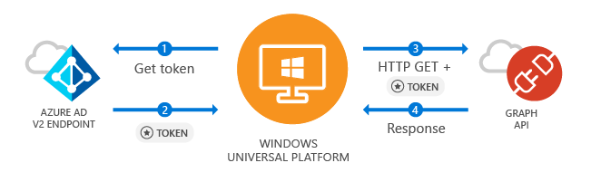
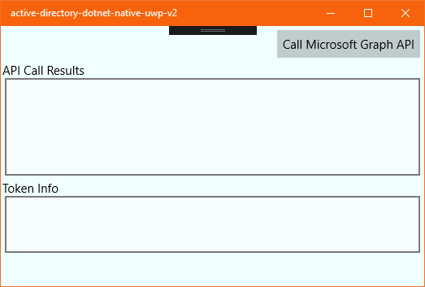
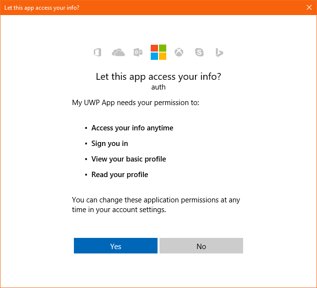

# Call Microsoft Graph API from a Universal Windows Platform application (XAML)


> [!div renderon="docs"]
> [!INCLUDE [active-directory-develop-applies-v2-msal](../../../includes/active-directory-develop-applies-v2-msal.md)]

This guide explains how a native Universal Windows Platform (UWP) application can request an access token and then call Microsoft Graph API. The guide also applies to other APIs that require access tokens from the Azure Active Directory v2 endpoint.

At the end of this guide, your application calls a protected API by using personal accounts. Examples are outlook.com, live.com, and others. Your application also calls work and school accounts from any company or organization that has Azure Active Directory.

>[!NOTE]
> This guide requires Visual Studio 2017 with Universal Windows Platform development installed. See [Get set up](https://docs.microsoft.com/windows/uwp/get-started/get-set-up) for instructions to download and configure Visual Studio to develop Universal Windows Platform apps.

### How this guide works



This guide creates a sample UWP application that queries Microsoft Graph API or a Web API that accepts tokens from the Azure Active Directory v2 endpoint. For this scenario, a token is added to HTTP requests via the Authorization header. Microsoft Authentication Library (MSAL) handles token acquisitions and renewals.

### NuGet packages

This guide uses the following NuGet packages:

|Library|Description|
|---|---|
|[Microsoft.Identity.Client](https://www.nuget.org/packages/Microsoft.Identity.Client)|Microsoft Authentication Library|


## Set up your project

This section provides step-by-step instructions to integrate a Windows Desktop .NET application (XAML) with *Sign-In with Microsoft*. Then it can query Web APIs that require a token, such as Microsoft Graph API.

This guide creates an application that displays a button that queries Graph API, a sign-out button, and text boxes that display the results of the calls.

>[!NOTE]
> Do you want to download this sample's Visual Studio project instead? [Download a project](https://github.com/Azure-Samples/active-directory-dotnet-native-uwp-v2/archive/master.zip) and skip to the [application registration](#register-your-application "application registration step") step to configure the code sample before it runs.


### Create your application
1. In Visual Studio, select **File** > **New** > **Project**.
2. Under **Templates**, select **Visual C#**.
3. Select **Blank App (Universal Windows)**.
4. Name the app, and select **OK**.
5. If prompted, select any version for **Target** and **Minimum** versions, and select **OK**.

    >

## Add Microsoft Authentication Library to your project
1. In Visual Studio, select **Tools** > **NuGet Package Manager** > **Package Manager Console**.
2. Copy and paste the following command in the **Package Manager Console** window:

    ```powershell
    Install-Package Microsoft.Identity.Client -Pre -Version 1.1.4-preview0002
    ```

> [!NOTE]
> This command installs [Microsoft Authentication Library](https://github.com/AzureAD/microsoft-authentication-library-for-dotnet). MSAL acquires, caches, and refreshes user tokens that access APIs protected by Azure Active Directory v2.

> [!NOTE]
> This tutorial does not use yet the latest version of MSAL.NET, but we are working on updating it.

## Initialize MSAL
This step helps you create a class to handle interaction with MSAL, such as handling tokens.

1. Open the **App.xaml.cs** file and add the reference for MSAL to the class:

    ```csharp
    using Microsoft.Identity.Client;
    ```

2. Add the following two lines to the app's class (inside <code>sealed partial class App : Application</code> block):

    ```csharp
    // Below is the clientId of your app registration. 
    // You have to replace the below with the Application Id for your app registration
    private static string ClientId = "your_client_id_here";
    
    public static PublicClientApplication PublicClientApp = new PublicClientApplication(ClientId);
    ```

## Create your application’s UI

A **MainPage.xaml** file is created automatically as a part of your project template. Open this file, and then follow the instructions:

* Replace your application’s **Grid** node with the following code:

    ```xml
    <Grid>
        <StackPanel Background="Azure">
            <StackPanel Orientation="Horizontal" HorizontalAlignment="Right">
                <Button x:Name="CallGraphButton" Content="Call Microsoft Graph API" HorizontalAlignment="Right" Padding="5" Click="CallGraphButton_Click" Margin="5" FontFamily="Segoe Ui"/>
                <Button x:Name="SignOutButton" Content="Sign-Out" HorizontalAlignment="Right" Padding="5" Click="SignOutButton_Click" Margin="5" Visibility="Collapsed" FontFamily="Segoe Ui"/>
            </StackPanel>
            <TextBlock Text="API Call Results" Margin="2,0,0,-5" FontFamily="Segoe Ui" />
            <TextBox x:Name="ResultText" TextWrapping="Wrap" MinHeight="120" Margin="5" FontFamily="Segoe Ui"/>
            <TextBlock Text="Token Info" Margin="2,0,0,-5" FontFamily="Segoe Ui" />
            <TextBox x:Name="TokenInfoText" TextWrapping="Wrap" MinHeight="70" Margin="5" FontFamily="Segoe Ui"/>
        </StackPanel>
    </Grid>
    ```
    
## Use MSAL to get a token for Microsoft Graph API

This section shows how to use MSAL to get a token for Microsoft Graph API.

1.	In **MainPage.xaml.cs**, add the reference for MSAL to the class:

    ```csharp
    using Microsoft.Identity.Client;
    ```
2. Replace the code of your <code>MainPage</code> class with the following code:

    ```csharp
    public sealed partial class MainPage : Page
    {
        // Set the API Endpoint to Graph 'me' endpoint
        string graphAPIEndpoint = "https://graph.microsoft.com/v1.0/me";
    
        // Set the scope for API call to user.read
        string[] scopes = new string[] { "user.read" };
    
        public MainPage()
        {
            this.InitializeComponent();
        }
    
        /// <summary>
        /// Call AcquireTokenAsync - to acquire a token requiring user to sign-in
        /// </summary>
        private async void CallGraphButton_Click(object sender, RoutedEventArgs e)
        {
            AuthenticationResult authResult = null;
            ResultText.Text = string.Empty;
            TokenInfoText.Text = string.Empty;
    
            try
            {
                authResult = await App.PublicClientApp.AcquireTokenSilentAsync(scopes, App.PublicClientApp.Users.FirstOrDefault());
            }
            catch (MsalUiRequiredException ex)
            {
                // A MsalUiRequiredException happened on AcquireTokenSilentAsync. This indicates you need to call AcquireTokenAsync to acquire a token
                System.Diagnostics.Debug.WriteLine($"MsalUiRequiredException: {ex.Message}");
    
                try
                {
                    authResult = await App.PublicClientApp.AcquireTokenAsync(scopes);
                }
                catch (MsalException msalex)
                {
                    ResultText.Text = $"Error Acquiring Token:{System.Environment.NewLine}{msalex}";
                }
            }
            catch (Exception ex)
            {
                ResultText.Text = $"Error Acquiring Token Silently:{System.Environment.NewLine}{ex}";
                return;
            }
    
            if (authResult != null)
            {
                ResultText.Text = await GetHttpContentWithToken(graphAPIEndpoint, authResult.AccessToken);
                DisplayBasicTokenInfo(authResult);
                this.SignOutButton.Visibility = Visibility.Visible;
            }
        }
    }
    ```

### More information
#### Get a user token interactively
A call to the `AcquireTokenAsync` method results in a window that prompts users to sign in. Applications usually require users to sign in interactively the first time they need to access a protected resource. They might also need to sign in when a silent operation to acquire a token fails. An example is when a user’s password is expired.

#### Get a user token silently
The `AcquireTokenSilentAsync` method handles token acquisitions and renewals without any user interaction. After `AcquireTokenAsync` is executed for the first time and the user is prompted for credentials, the `AcquireTokenSilentAsync` method should be used to request tokens for subsequent calls because it acquire tokens silently. MSAL will handle token cache and renewal.

Eventually, the `AcquireTokenSilentAsync` method fails. Reasons for failure might be that users have either signed out or changed their password on another device. When MSAL detects that the issue can be resolved by requiring an interactive action, it fires an `MsalUiRequiredException` exception. Your application can handle this exception in two ways:

* It can make a call against `AcquireTokenAsync` immediately. This call results in prompting the user to sign in. Normally, this pattern is used in online applications where there's no available offline content for the user. The sample generated by this guided setup follows the pattern. You see it in action the first time you run the sample. 
    * Because no user has used the application, `PublicClientApp.Users.FirstOrDefault()` contains a null value, and an `MsalUiRequiredException` exception is thrown.
    * The code in the sample then handles the exception by calling `AcquireTokenAsync`. This call results in prompting the user to sign in.

* Or instead, it presents a visual indication to users that an interactive sign in is required. Then they can select the right time to sign in. Or the application can retry `AcquireTokenSilentAsync` later. Frequently, this pattern is used when users can use other application functionality without disruption. An example is when offline content is available in the application. In this case, users can decide when they want to sign in to either access the protected resource or refresh the outdated information. Or else the application can decide to retry `AcquireTokenSilentAsync` when the network is restored after it was temporarily unavailable.

## Call Microsoft Graph API by using the token you just obtained

* Add the following new method to **MainPage.xaml.cs**. This method is used to make a `GET` request against Graph API by using an [Authorize] header:

    ```csharp
    /// <summary>
    /// Perform an HTTP GET request to a URL using an HTTP Authorization header
    /// </summary>
    /// <param name="url">The URL</param>
    /// <param name="token">The token</param>
    /// <returns>String containing the results of the GET operation</returns>
    public async Task<string> GetHttpContentWithToken(string url, string token)
    {
        var httpClient = new System.Net.Http.HttpClient();
        System.Net.Http.HttpResponseMessage response;
        try
        {
            var request = new System.Net.Http.HttpRequestMessage(System.Net.Http.HttpMethod.Get, url);
            // Add the token in Authorization header
            request.Headers.Authorization = new System.Net.Http.Headers.AuthenticationHeaderValue("Bearer", token);
            response = await httpClient.SendAsync(request);
            var content = await response.Content.ReadAsStringAsync();
            return content;
        }
        catch (Exception ex)
        {
            return ex.ToString();
        }
    }
    ```

### More information on making a REST call against a protected API

In this sample application, the `GetHttpContentWithToken` method is used to make an HTTP `GET` request against a protected resource that requires a token. Then the method returns the content to the caller. This method adds the acquired token in the **HTTP Authorization** header. For this sample, the resource is the Microsoft Graph API **me** endpoint, which displays the user's profile information.
<!--end-collapse-->

## Add a method to sign out the user

* To sign out the user, add the following method to **MainPage.xaml.cs**:

    ```csharp
    /// <summary>
    /// Sign out the current user
    /// </summary>
    private void SignOutButton_Click(object sender, RoutedEventArgs e)
    {
        if (App.PublicClientApp.Users.Any())
        {
            try
            {
                App.PublicClientApp.Remove(App.PublicClientApp.Users.FirstOrDefault());
                this.ResultText.Text = "User has signed-out";
                this.CallGraphButton.Visibility = Visibility.Visible;
                this.SignOutButton.Visibility = Visibility.Collapsed;
            }
            catch (MsalException ex)
            {
                ResultText.Text = $"Error signing-out user: {ex.Message}";
            }
        }
    }
    ```

### More information on sign-out

The `SignOutButton_Click` method removes the user from the MSAL user cache. This method effectively tells MSAL to forget the current user. Then a future request to acquire a token succeeds only if it's made to be interactive.
The application in this sample supports a single user. But MSAL supports scenarios where more than one account can be signed in at the same time. An example is an email application where a user has several accounts.

## Display basic token information

* Add the following method to **MainPage.xaml.cs** to display basic information about the token:

    ```csharp
    /// <summary>
    /// Display basic information contained in the token
    /// </summary>
    private void DisplayBasicTokenInfo(AuthenticationResult authResult)
    {
        TokenInfoText.Text = "";
        if (authResult != null)
        {
            TokenInfoText.Text += $"Name: {authResult.User.Name}" + Environment.NewLine;
            TokenInfoText.Text += $"Username: {authResult.User.DisplayableId}" + Environment.NewLine;
            TokenInfoText.Text += $"Token Expires: {authResult.ExpiresOn.ToLocalTime()}" + Environment.NewLine;
            TokenInfoText.Text += $"Access Token: {authResult.AccessToken}" + Environment.NewLine;
        }
    }
    ```

### More information

ID tokens acquired via **OpenID Connect** also contain a small subset of information pertinent to the user. `DisplayBasicTokenInfo` displays basic information contained in the token. Examples are the user's display name and ID, the expiration date of the token, and the string that represents the access token itself. If you select the **Call Microsoft Graph API** button several times, you'll see that the same token was reused for subsequent requests. You can also see the expiration date extended when MSAL decides it's time to renew the token.

## Register your application

Now you need to register your application in the Microsoft Application Registration Portal:
1. Go to the [Microsoft Application Registration Portal](https://apps.dev.microsoft.com/portal/register-app) to register an application.
2. Enter a name for your application.
3. Make sure that the option for **Guided Setup** is *not selected*.
4. Select **Add Platforms**, select **Native Application**, and then select **Save**.
5. Copy the GUID in **Application ID**, go back to Visual Studio, open **App.xaml.cs**, and replace `your_client_id_here` with the Application ID you just registered:

    ```csharp
    private static string ClientId = "your_application_id_here";
    ```

## Enable integrated authentication on federated domains (optional)

To enable Windows Integrated Authentication when it's used with a federated Azure Active Directory domain, the application manifest must enable additional capabilities:

1. Double-click **Package.appxmanifest**.
2. Select the **Capabilities** tab and make sure that the following settings are enabled:

    - Enterprise Authentication
    - Private Networks (Client & Server)
    - Shared User Certificates

3. Open **App.xaml.cs** and add the following line in the app constructor:

    ```csharp
    App.PublicClientApp.UseCorporateNetwork = true;
    ```

> [!IMPORTANT]
> Windows Integrated Authentication is not configured by default for this sample. Applications that request *Enterprise Authentication* or *Shared User Certificates* capabilities require a higher level of verification by the Windows Store. Also, not all developers want to perform the higher level of verification. Enable this setting only if you need Windows Integrated Authentication with a federated Azure Active Directory domain.


## Test your code

To test your application, select F5 to run your project in Visual Studio. Your main window appears:



When you're ready to test, select **Call Microsoft Graph API**. Then use a Microsoft Azure Active Directory organizational account or a Microsoft account, such as live.com or outlook.com, to sign in. If it's your first time, you see a window asking the user to sign in:


### Consent
The first time you sign in to your application, you're presented with a consent screen similar to the following. Select **Yes** to explicitly consent to access:


### Expected results
You see user profile information returned by the Microsoft Graph API call on the **API Call Results** screen:


You also see basic information about the token acquired via `AcquireTokenAsync` or `AcquireTokenSilentAsync` in the **Token Info** box:

|Property  |Format  |Description |
|---------|---------|---------|
|**Name** |User's full name|The user’s first and last name.|
|**Username** |<span>user@domain.com</span> |The username that identifies the user.|
|**Token Expires** |DateTime |The time when the token expires. MSAL extends the expiration date by renewing the token as necessary.|
|**Access Token** |String |The token string that is sent to HTTP requests that require an *Authorization header*.|

#### See what's in the access token (optional)
Optionally, copy the value in **Access Token** and paste it in https://jwt.ms to decode it and see the list of claims.

### More information about scopes and delegated permissions

Microsoft Graph API requires the *user.read* scope to read a user's profile. This scope is added automatically by default in every application that's registered in the Application Registration Portal. Other APIs for Microsoft Graph, and custom APIs for your back-end server, might require additional scopes. Microsoft Graph API requires the *Calendars.Read* scope to list the user’s calendars.

To access the user’s calendars in the context of an application, add the *Calendars.Read* delegated permission to the application registration information. Then add the *Calendars.Read* scope to the `acquireTokenSilent` call. 

> [!NOTE]
> Users might be prompted for additional consents as you increase the number of scopes.

## Known issues

### Issue 1
You receive one of the following error messages when you sign in on your application on a federated Azure Active Directory domain:
 - No valid client certificate found in the request.
 - No valid certificates found in the user's certificate store.
 - Try again choosing a different authentication method.

**Cause:** Enterprise and certificate capabilities aren't enabled.

**Solution:** Follow the steps in [integrated authentication on federated domains](#enable-integrated-authentication-on-federated-domains-optional).

### Issue 2
You enable [integrated authentication on federated domains](#enable-integrated-authentication-on-federated-domains-optional) and try to use Windows Hello on a Windows 10 computer to sign in on an environment with multifactor authentication configured. The list of certificates is presented. However, if you choose to use your PIN, the PIN window is never presented.

**Cause:** This issue is a known limitation of the web authentication broker in UWP applications that run on Windows 10 desktop. It works fine on Windows 10 Mobile.

**Workaround:** Select **Sign in with other options**. Then select **Sign in with a username and password**. Select **Provide your password**. Then go through the phone authentication process.
