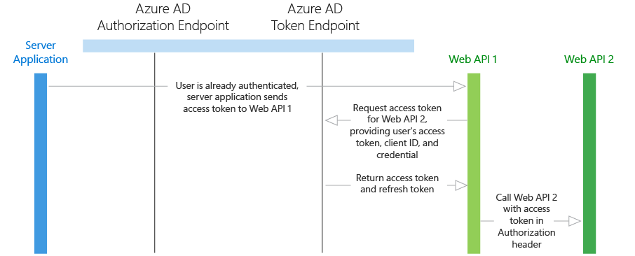
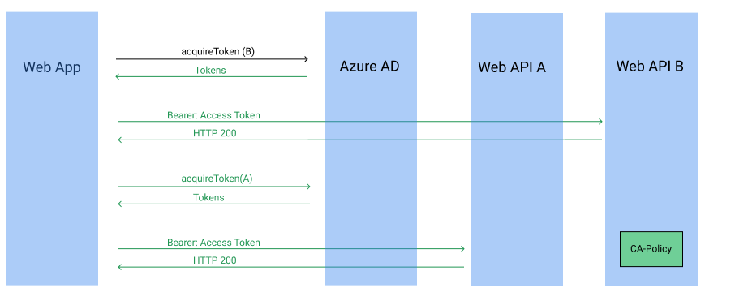
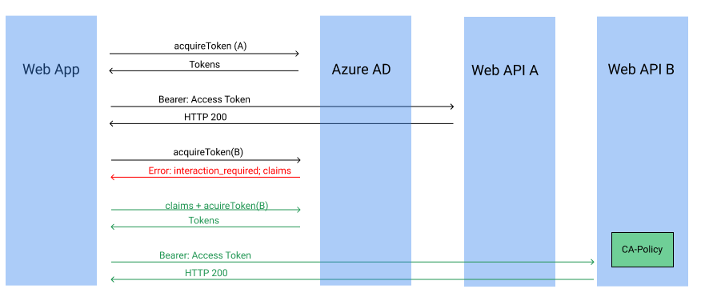
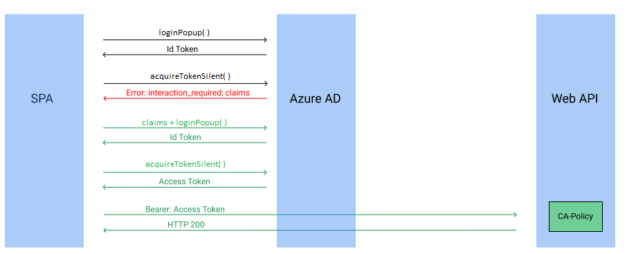

# Developer guidance for Microsoft Entra Conditional Access

The Conditional Access feature in Microsoft Entra ID offers one of several ways that you can use to secure your app and protect a service. Conditional Access enables developers and enterprise customers to protect services in a multitude of ways including:

* [Multi-factor authentication](../authentication/concept-mfa-howitworks.md)
* Allowing only Intune enrolled devices to access specific services
* Restricting user locations and IP ranges

For more information on the full capabilities of Conditional Access, see the article [What is Conditional Access](../conditional-access/overview.md).

For developers building apps for Microsoft Entra ID, this article shows how you can use Conditional Access and you'll also learn about the impact of accessing resources that you don't have control over that may have Conditional Access policies applied. The article also explores the implications of Conditional Access in the on-behalf-of flow, web apps, accessing Microsoft Graph, and calling APIs.

Knowledge of [single](quickstart-register-app.md) and [multi-tenant](howto-convert-app-to-be-multi-tenant.md) apps and [common authentication patterns](./authentication-vs-authorization.md) is assumed.

> [!NOTE]
> Using this feature requires a Microsoft Entra ID P1 license. To find the right license for your requirements, see [Comparing generally available features of the Free, Basic, and Premium editions](https://www.microsoft.com/security/business/identity-access-management/azure-ad-pricing).
> Customers with [Microsoft 365 Business licenses](/office365/servicedescriptions/office-365-service-descriptions-technet-library) also have access to Conditional Access features.

## How does Conditional Access impact an app?

### App types impacted

In most common cases, Conditional Access does not change an app's behavior or requires any changes from the developer. Only in certain cases when an app indirectly or silently requests a token for a service, an app requires code changes to handle Conditional Access challenges. It may be as simple as performing an interactive sign-in request.

Specifically, the following scenarios require code to handle Conditional Access challenges:

* Apps performing the on-behalf-of flow
* Apps accessing multiple services/resources
* Single-page apps using MSAL.js
* Web Apps calling a resource

Conditional Access policies can be applied to the app, but also can be applied to a web API your app accesses. To learn more about how to configure a Conditional Access policy, see [Quickstart: Require MFA for specific apps with Microsoft Entra Conditional Access](../authentication/tutorial-enable-azure-mfa.md).

Depending on the scenario, an enterprise customer can apply and remove Conditional Access policies at any time. For your app to continue functioning when a new policy is applied, implement challenge handling. The following examples illustrate challenge handling.

### Conditional Access examples

Some scenarios require code changes to handle Conditional Access whereas others work as is. Here are a few scenarios using Conditional Access to do multi-factor authentication that gives some insight into the difference.

* You are building a single-tenant iOS app and apply a Conditional Access policy. The app signs in a user and doesn't request access to an API. When the user signs in, the policy is automatically invoked and the user needs to perform multi-factor authentication (MFA).
* You are building a native app that uses a middle tier service to access a downstream API. An enterprise customer at the company using this app applies a policy to the downstream API. When an end user signs in, the native app requests access to the middle tier and sends the token. The middle tier performs on-behalf-of flow to request access to the downstream API. At this point, a claims "challenge" is presented to the middle tier. The middle tier sends the challenge back to the native app, which needs to comply with the Conditional Access policy.

#### Microsoft Graph

Microsoft Graph has special considerations when building apps in Conditional Access environments. Generally, the mechanics of Conditional Access behave the same, but the policies your users see will be based on the underlying data your app is requesting from the graph.

Specifically, all Microsoft Graph scopes represent some dataset that can individually have policies applied. Since Conditional Access policies are assigned the specific datasets, Microsoft Entra ID will enforce Conditional Access policies based on the data behind Graph - rather than Graph itself.

For example, if an app requests the following Microsoft Graph scopes,

```
scopes="ChannelMessages.Read.All Mail.Read"
```

An app can expect their users to fulfill all policies set on Teams and Exchange. Some scopes may map to multiple datasets if it grants access.

### Complying with a Conditional Access policy

For several different app topologies, a Conditional Access policy is evaluated when the session is established. As a Conditional Access policy operates on the granularity of apps and services, the point at which it is invoked depends heavily on the scenario you're trying to accomplish.

When your app attempts to access a service with a Conditional Access policy, it may encounter a Conditional Access challenge. This challenge is encoded in the `claims` parameter that comes in a response from Microsoft Entra ID. Here's an example of this challenge parameter:

```
claims={"access_token":{"polids":{"essential":true,"Values":["<GUID>"]}}}
```

Developers can take this challenge and append it onto a new request to Microsoft Entra ID. Passing this state prompts the end user to perform any action necessary to comply with the Conditional Access policy. In the following scenarios, specifics of the error and how to extract the parameter are explained.

## Scenarios

### Prerequisites

Microsoft Entra Conditional Access is a feature included in [Microsoft Entra ID P1 or P2](../fundamentals/whatis.md). Customers with [Microsoft 365 Business licenses](/office365/servicedescriptions/office-365-service-descriptions-technet-library) also have access to Conditional Access features.

### Considerations for specific scenarios

The following information only applies in these Conditional Access scenarios:

* Apps performing the on-behalf-of flow
* Apps accessing multiple services/resources
* Single-page apps using MSAL.js

The following sections discuss common scenarios that are more complex. The core operating principle is Conditional Access policies are evaluated at the time the token is requested for the service that has a Conditional Access policy applied.

## Scenario: App performing the on-behalf-of flow

In this scenario, we walk through the case in which a native app calls a web service/API. In turn, this service does the "on-behalf-of" flow to call a downstream service. In our case, we've applied our Conditional Access policy to the downstream service (Web API 2) and are using a native app rather than a server/daemon app.



The initial token request for Web API 1 does not prompt the end user for multi-factor authentication as Web API 1 may not always hit the downstream API. Once Web API 1 tries to request a token on-behalf-of the user for Web API 2, the request fails since the user has not signed in with multi-factor authentication.

Microsoft Entra ID returns an HTTP response with some interesting data:

> [!NOTE]
> In this instance it's a multi-factor authentication error description, but there's a wide range of `interaction_required` possible pertaining to Conditional Access.

```
HTTP 400; Bad Request
error=interaction_required
error_description=AADSTS50076: Due to a configuration change made by your administrator, or because you moved to a new location, you must use multi-factor authentication to access '<Web API 2 App/Client ID>'.
claims={"access_token":{"polids":{"essential":true,"Values":["<GUID>"]}}}
```

In Web API 1, we catch the error `error=interaction_required`, and send back the `claims` challenge to the desktop app. At that point, the desktop app can make a new `acquireToken()` call and append the `claims`challenge as an extra query string parameter. This new request requires the user to do multi-factor authentication and then send this new token back to Web API 1 and complete the on-behalf-of flow.

To try out this scenario, see our [.NET code sample](https://github.com/Azure-Samples/active-directory-dotnet-native-aspnetcore-v2/tree/master/2.%20Web%20API%20now%20calls%20Microsoft%20Graph#handling-required-interactions-with-the-user-dynamic-consent-mfa-etc-). It demonstrates how to pass the claims challenge back from Web API 1 to the native app and construct a new request inside the client app.

## Scenario: App accessing multiple services

In this scenario, we walk through the case in which a web app accesses two services one of which has a Conditional Access policy assigned. Depending on your app logic, there may exist a path in which your app does not require access to both web services. In this scenario, the order in which you request a token plays an important role in the end-user experience.

Let's assume we have web service A and B and web service B has our Conditional Access policy applied. While the initial interactive auth request requires consent for both services, the Conditional Access policy is not required in all cases. If the app requests a token for web service B, then the policy is invoked and subsequent requests for web service A also succeeds as follows.



Alternatively, if the app initially requests a token for web service A, the end user does not invoke the Conditional Access policy. This allows the app developer to control the end-user experience and not force the Conditional Access policy to be invoked in all cases. The tricky case is if the app subsequently requests a token for web service B. At this point, the end user needs to comply with the Conditional Access policy. When the app tries to `acquireToken`, it may generate the following error (illustrated in the following diagram):

```
HTTP 400; Bad Request
error=interaction_required
error_description=AADSTS50076: Due to a configuration change made by your administrator, or because you moved to a new location, you must use multi-factor authentication to access '<Web API App/Client ID>'.
claims={"access_token":{"polids":{"essential":true,"Values":["<GUID>"]}}}
```



If the app is using the MSAL library, a failure to acquire the token is always retried interactively. When this interactive request occurs, the end user has the opportunity to comply with the Conditional Access. This is true unless the request is a `AcquireTokenSilentAsync` or `PromptBehavior.Never` in which case the app needs to perform an interactive ```AcquireToken``` request to give the end user the opportunity to comply with the policy.

## Scenario: Single-page app (SPA) using MSAL.js

In this scenario, we walk through the case when we have a single-page app (SPA) calling a Conditional Access protected web API using MSAL.js. This is a simple architecture but has some nuances that need to be taken into account when developing around Conditional Access.

In MSAL.js, there are a few functions that obtain tokens: `acquireTokenSilent()`, `acquireTokenPopup()`, and `acquireTokenRedirect()`.

* `acquireTokenSilent()` can be used to silently obtain an access token meaning it does not show UI in any circumstance.
* `acquireTokenPopup()` and `acquireTokenRedirect()` are both used to interactively request a token for a resource meaning they always show sign-in UI.

When an app needs an access token to call a web API, it attempts an `acquireTokenSilent()`. If the token is expired or we need to comply with a Conditional Access policy, then the *acquireToken* function fails and the app uses `acquireTokenPopup()` or `acquireTokenRedirect()`.



Let's walk through an example with our Conditional Access scenario. The end user just landed on the site and doesn’t have a session. We perform a `loginPopup()` call, get an ID token without multi-factor authentication. Then the user hits a button that requires the app to request data from a web API. The app tries to do an `acquireTokenSilent()` call but fails since the user has not performed multi-factor authentication yet and needs to comply with the Conditional Access policy.

Microsoft Entra ID sends back the following HTTP response:

```
HTTP 400; Bad Request
error=interaction_required
error_description=AADSTS50076: Due to a configuration change made by your administrator, or because you moved to a new location, you must use multi-factor authentication to access '<Web API App/Client ID>'.
```

Our app needs to catch the `error=interaction_required`. The application can then use either `acquireTokenPopup()` or `acquireTokenRedirect()` on the same resource. The user is forced to do a multi-factor authentication. After the user completes the multi-factor authentication, the app is issued a fresh access token for the requested resource.

To try out this scenario, see our [React SPA calling Node.js web API using on-behalf-of flow](https://github.com/Azure-Samples/ms-identity-javascript-react-tutorial/tree/main/6-AdvancedScenarios/1-call-api-obo) code sample. This code sample uses the Conditional Access policy and web API you registered earlier with a React SPA to demonstrate this scenario. It shows how to properly handle the claims challenge and get an access token that can be used for your web API.

## See also

* To learn more about the capabilities, see [Conditional Access in Microsoft Entra ID](../conditional-access/overview.md).
* For more Microsoft Entra code samples, see [samples](sample-v2-code.md).
* For more info on the MSAL SDK's and access the reference documentation, see the [Microsoft Authentication Library overview](msal-overview.md).
* To learn more about multi-tenant scenarios, see [How to sign in users using the multi-tenant pattern](howto-convert-app-to-be-multi-tenant.md).
* Learn more about [Conditional Access and securing access to IoT apps](/azure/architecture/reference-architectures/iot).
