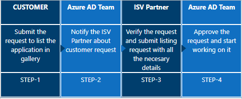

# Add your application to the Azure Active Directory application gallery

This article shows how to list an application in the Azure Active Directory (Azure AD) application gallery, implement single sign-on (SSO), and manage the listing.

## What is the Azure AD app gallery?
The Azure AD app gallery is a collection of apps that are pre-configured to use Azure AD as an identity provider. Using Azure AD as an identity provider provides single sign-on to users. To learn more about single sign-on, see [What is single sign-on?](../manage-apps/what-is-single-sign-on.md). To learn more about how customers manage apps in Azure AD, see [What is application management?](manage-apps/what-is-application-management.md).

There are many benefits to adding your app to the Azure AD gallery. Some of these include:

- Customers find the best possible single sign-on experience for your app.
- Configuration of the application is simple and minimal.
- A quick search finds your application in the gallery.
- Free, Basic, and Premium Azure AD customers can all use this integration.
- Mutual customers get a step-by-step configuration tutorial.

In addition, there are many benefits when your customers use Azure AD as an identity provider for your app. Some of these include:

- Your application can be discoverable in the Office 365 App Gallery, the Office 365 App Launcher and within Microsoft Search on Office.com
- Your application can use the Microsoft Graph REST API to access the data that drives user productivity that is available from the Microsoft Graph.
- You reduce support costs by making it easier for your customers.
- Application-specific documentation co-produced with the Azure AD team for our mutual customers eases adoption.
- If one-click SSO is enabled, your customers’ IT Administrators don't have to learn how to configure your application for use in their organization.
- You provide your customers the ability to completely manage their employee and guest identities’ authentication and authorization.
- Placing all account management and compliance responsibility with the customer owner of those identities.
- Providing ability to enable or disable SSO for specific identity providers, groups, or users to meet their business needs.
- You increase your marketability and adoptability. Many large organizations require that (or aspire to) their employees have seamless SSO experiences across all applications. Making SSO easy is important.
- You reduce end-user friction, which may increase end-user usage and increase your revenue.
- Customers who use the System for Cross-domain Identity Management ([SCIM](https://techcommunity.microsoft.com/t5/Identity-Standards-Blog/Provisioning-with-SCIM-getting-started/ba-p/880010)) can use provisioning for the same app.
- When you offer your application for use by other companies through a purchase or subscription, you make your application available to customers within their own Azure tenants. This is known as creating a multi-tenant application. For overview of this concept, see [Multitenant Applications in Azure](https://docs.microsoft.com/azure/dotnet-develop-multitenant-applications) and [Tenancy in Azure Active Directory](single-and-multi-tenant-apps.md).
- Single sign-on (SSO) adds security and convenience when users sign on to applications by using Azure AD and other identities. When an application is SSO enabled, users don't have to enter separate credentials to access that application.

## Prerequisites

- For federated applications (Open ID and SAML/WS-Fed), the application must support the software-as-a-service (SaaS) model for getting listed in the Azure AD app gallery. The enterprise gallery applications must support multiple customer configurations and not any specific customer.
- For Open ID Connect, the application must be multitenanted and the [Azure AD consent framework](consent-framework.md) must be properly implemented for the application. The user can send the sign-in request to a common endpoint so that any customer can provide consent to the application. You can control user access based on the tenant ID and the user's UPN received in the token.
- For SAML 2.0/WS-Fed, your application must have the capability to do the SAML/WS-Fed SSO integration in SP or IDP mode. Make sure this capability is working correctly before you submit the request.
- For password SSO, make sure that your application supports form authentication so that password vaulting can be done to get single sign-on to work as expected.
- You need a permanent account for testing with at least two users registered.

**How to get Azure AD for developers?**

You can get a free test account with all the premium Azure AD features - 90 days free and can get extended as long as you do dev work with it: https://docs.microsoft.com/office/developer-program/office-365-developer-program

## Submit the request in the portal

After you've tested that your application integration works with Azure AD, submit your application request in the [Microsoft Application Network portal](https://microsoft.sharepoint.com/teams/apponboarding/Apps).

If the following page appears after you sign in, contact the [Azure AD SSO Integration Team](<mailto:SaaSApplicationIntegrations@service.microsoft.com>). Provide the email account that you want to use for submitting the request. A business email address such as [name@yourbusiness.com](mailto:name@yourbusiness.com) is preferred. The Azure AD team will add the account in the Microsoft Application Network portal.

After the account is added, you can sign in to the Microsoft Application Network portal.

If the following page appears after you sign in, provide a business justification for needing access in the text box. Then select **Request Access**.

  

Our team reviews the details and gives you access accordingly. After your request is approved, you can sign in to the portal and submit the request by selecting the **Submit Request (ISV)** tile on the home page.

## Issues on logging into portal

If you are seeing this error while logging in then here are the detail on the issue and this is how you can fix it.

* If your sign-in was blocked as shown below:

  

**What's happening:**

The guest user is federated to a home tenant which is also an Azure AD. The guest user is at High risk. Microsoft doesn't allow High risk users to access its resources. All High risk users (employees or guests / vendors) must remediate / close their risk to access Microsoft resources. For guest users, this user risk comes from the home tenant and the policy comes from the resource tenant (Microsoft in this case).
 
**Secure solutions:**

* MFA registered guest users remediate their own user risk. This can be done by the guest user performing a secured password change or reset (https://aka.ms/sspr) at their home tenant (this needs MFA and SSPR at the home tenant). The secured password change or reset must be initiated on Azure AD and not on-prem.

* Guest users have their admins remediate their risk. In this case, the admin will perform a password reset (temporary password generation). This does not need Identity Protection. The guest user's admin can go to https://aka.ms/RiskyUsers and click on 'Reset password'.

* Guest users have their admins close / dismiss their risk. Again, this does not need Identity Protection. The admin can go to https://aka.ms/RiskyUsers and click on 'Dismiss user risk'. However, the admin must do the due diligence to ensure this was a false positive risk assessment before closing the user risk. Otherwise, they are putting their and Microsoft's resources at risk by suppressing a risk assessment without investigation.

> [!NOTE]
> If you have any issues with access, contact the [Azure AD SSO Integration Team](<mailto:SaaSApplicationIntegrations@service.microsoft.com>).

## How to enable Single Sign-on in your published application

1. Choose the right federation protocol for your multi-tenant application.
1. Implement SSO in your application.
   - ‎See [guidance on authentication patterns](v2-app-types.md).
   - See [Azure active Directory code samples](sample-v2-code.md) for OIDC and OAuth protocols.
1. Create your Azure Tenant and test your application.
1. Create and publish SSO documentation on your site.
1. Submit your application listing and partner with Microsoft to create documentation on Microsoft’s site.
1. [Join the Microsoft Partner Network (free) and create your go to market plan](https://partner.microsoft.com/explore/commercial#gtm).

## Create an Azure tenant for a multi-tenant application  

To provide access to your multi-tenant application you must create an Azure Active Directory tenant to register the application and enable the federation of your customer’s identities. This tenant will allow you to test your application and the federation in an environment that is similar to your customers Azure AD environments.

## Implement SSO by using the federation protocol

To list an application in the Azure AD app gallery, you first need to implement one of the following federation protocols supported by Azure AD. You also need to agree to the Azure AD application gallery terms and conditions. Read the terms and conditions of the Azure AD application gallery on [this website](https://azure.microsoft.com/support/legal/active-directory-app-gallery-terms/).

### Choose the right federation protocol for your multi-tenant application

When you develop your software as a service (SaaS) application, you must select the federation protocol that best meets your and your customers’ needs. This decision is based on your development platform, and your desire to integrate with data available within your customers’ Office 365 and Azure AD ecosystem.

See the complete list of [protocols available for SSO integrations](../manage-apps/sso-options.md) with Azure Active Directory.
The following table compares 
* Open Authentication 2.0 (OAuth 2.0)
* Open ID Connect (OIDC)
* Security Assertion Markup Language (SAML)
* Web Services Federation (WSFed)

| Capability| OAuth / OIDC| SAML / WSFed |
| - |-|-|
| Web-based Single sign-on| √| √ |
| Web-based Single sign-out| √| √ |
| Mobile-based Single sign-on| √| √* |
| Mobile-based Single sign-out| √| √* |
| Conditional Access policies for mobile applications| √| X |
| Seamless MFA experience for mobile applications| √| X |
| Access Microsoft Graph| √| X |

*Possible, but Microsoft doesn't provide samples or guidance.

### OAuth 2.0 and OpenID Connect
To integrate your application with Azure AD by using the Open ID Connect protocol, follow the [developers' instructions](../azuread-dev/v1-authentication-scenarios.md).

    

    * If you want to add your application to list in the gallery by using OpenID Connect, select **OpenID Connect & OAuth 2.0** as shown.
    * If you have any issues with access, contact the [Azure AD SSO Integration Team](<mailto:SaaSApplicationIntegrations@service.microsoft.com>).

OAuth 2.0 is an [industry-standard](https://oauth.net/2/) protocol for authorization. OIDC (OpenID Connect) is an [industry standard](https://openid.net/connect/) identity authentication layer built on top of the OAuth 2.0 protocol.

#### Benefits

Microsoft recommends using OIDC/OAuth 2.0 as they have authentication and authorization built in to the protocols. With SAML, you must additionally implement authorization.

The authorization inherent in these protocols enables your application to access and integrate with rich user and organizational data through the Microsoft Graph API.

Using OAuth 2.0 and OIDC simplifies your customers’ end-user experience when adopting SSO for your application. You can easily define the permission sets necessary, which are then automatically represented to the administrator or end user consenting.

Additionally, using these protocols enables your customers to use Conditional Access and MFA policies to control access to the applications. Microsoft provides libraries and [code samples across multiple technology platforms](https://github.com/AzureAD/microsoft-authentication-library-for-js/wiki/Samples) to aid your development.  

#### Implementation

You register your application with Microsoft Identity, which is an OAuth 2.0 provider. You could then also register your OAuth 2.0-based application with any other Identity Provider that you wish to integrate with. 

For information on how to register your application and implement these protocols for SSO to web apps, see [Authorize access to web applications using OpenID Connect and Azure Active Directory](sample-v2-code.md).  For information on how to implement these protocols for SSO in mobile apps, see the following: 

* [Android](quickstart-v2-android.md)
* [iOS](quickstart-v2-ios.md)
* [Universal Windows Platform](quickstart-v2-uwp.md)

### SAML 2.0** or **WS-Fed**
If your app supports SAML 2.0, you can integrate it directly with an Azure AD tenant by following the [instructions to add a custom application](../manage-apps/configure-saml-single-sign-on.md).

  

  * If you want to add your application to list in the gallery by using **SAML 2.0** or **WS-Fed**, select **SAML 2.0/WS-Fed** as shown.

  * If you have any issues with access, contact the [Azure AD SSO Integration Team](<mailto:SaaSApplicationIntegrations@service.microsoft.com>).

Security Assertion Markup Language (SAML) is usually used for web applications. See [How Azure uses the SAML protocol](active-directory-saml-protocol-reference.md) for an overview. 

Web Services Federation (WSFed) is an [industry standard](https://docs.oasis-open.org/wsfed/federation/v1.2/ws-federation.html) generally used for web applications that are developed using the .Net platform.

#### Benefits

SAML 2.0 is a mature standard and most technology platforms support open-source libraries for SAML 2.0. You can provide your customers an administration interface to configure SAML SSO. They can configure SAML SSO for Microsoft Azure AD,  and any other identity provider that supports SAML 2

#### Trade-offs

When using SAML 2.0 or WSFed protocols for mobile applications, certain Conditional Access policies including Multi-factor Authentication (MFA) will have a degraded experience. Additionally, if you want to access the Microsoft Graph, you will need to implement authorization through OAuth 2.0 to generate necessary tokens. 

#### Implementation

Microsoft does not provide libraries for SAML implementation or recommend specific libraries. There are many open-source libraries available.

### Implement SSO by using the password SSO

Create a web application that has an HTML sign-in page to configure [password-based single sign-on](../manage-apps/sso-options.md). Password-based SSO, also referred to as password vaulting, enables you to manage user access and passwords to web applications that don't support identity federation. It's also useful for scenarios in which several users need to share a single account, such as to your organization's social media app accounts.

* If you want to add your application to list in the gallery by using password SSO, select **Password SSO** as shown.
* If you have any issues with access, contact the [Azure AD SSO Integration Team](<mailto:SaaSApplicationIntegrations@service.microsoft.com>).

## SSO and Using Microsoft Graph Rest API 

Microsoft Graph is the data fabric across all of Microsoft 365, including Office 365, Windows 10 and Enterprise Mobility and Security, and additional products such as Dynamics 365. This includes the core schemas of the entities such as Users, Groups, Calendar, Mail, Files, and more, that drive user productivity. Microsoft Graph offers three interfaces for developers a REST based API, Microsoft Graph data connect, and Connectors that allow developers to add their own data into the Microsoft Graph.  

Using any of the above protocols for SSO enables your application’s access to the rich data available through the Microsoft Graph REST API. This  enables your customers  to get more value from their investment in Microsoft 365. For example,  your application can call the Microsoft Graph API to integrate with your customers’ Office 365 instance and surface users’ Microsoft Office and SharePoint items within your application. 

If you are using Open ID Connect  to authenticate, then your development experience is seamless  because you will use OAuth2, the foundation of Open ID Connect, to acquire tokens can be used for invoking Microsoft Graph APIs. If your application is using SAML or WSFed, you must add additional code within your application to get these OAuth2 to acquire the tokens  required to  invoking Microsoft Graph APIs. 

## Request for user provisioning

Follow the process shown in the following image to request user provisioning.

   

## Costs of hosting a multi-tenant application

Azure Active Directory is available in multiple editions. [See the detailed feature comparison](https://azure.microsoft.com/pricing/details/active-directory/).

You can create your Azure subscription and Azure active directory for free, and use basic features.

## Create your tenant

1. Create your Tenant. See [Set up a dev environment](quickstart-create-new-tenant.md).

2. Enable and test single sign-on access to your application,

   a. **For OIDC or Oath applications**, [Register your application](quickstart-register-app.md) as a multi-tenant application. ‎Select the Accounts in any organizational directory and personal Microsoft accounts option in Supported Account types

   b. **For SAML- and WS-Fed-based applications**, you [Configure SAML-based Single sign-on](../manage-apps/configure-saml-single-sign-on.md) applications using a generic SAML template in Azure AD.

You can also [convert a single-tenant application to multi-tenant](howto-convert-app-to-be-multi-tenant.md) if necessary.

## Update or remove an existing listing

To update or remove an existing application in the Azure AD app gallery, you first need to submit the request in the [Application Network portal](https://microsoft.sharepoint.com/teams/apponboarding/Apps). If you have an Office 365 account, use that to sign in to this portal. If not, use your Microsoft account, such as Outlook or Hotmail, to sign in.

- Select the appropriate option as shown in the following image.

    

    * To update an existing application, select the appropriate option as per your requirement.
    * To remove an existing application from the Azure AD app gallery, select **Remove my application listing from the gallery**.
    * If you have any issues with access, contact the [Azure AD SSO Integration Team](<mailto:SaaSApplicationIntegrations@service.microsoft.com>).

## List requests by customers

Customers can submit a request to list an application by selecting **App requests by Customers** > **Submit new request**.

Here's the flow of customer-requested applications.

## Timelines

The timeline for the process of listing a SAML 2.0 or WS-Fed application in the gallery is 7 to 10 business days.

  

The timeline for the process of listing an OpenID Connect application in the gallery is 2 to 5 business days.

  

## Escalations

For any escalations, send email to the [Azure AD SSO Integration Team](mailto:SaaSApplicationIntegrations@service.microsoft.com) at SaaSApplicationIntegrations@service.microsoft.com, and we'll respond as soon as possible.

## Create and publish single sign-on documentation for your application   

### Documentation on your site

Ease of adoption is a significant factor in enterprise software decisions. Clear easy-to-follow documentation supports your customers in their adoption journey and reduces support costs. Working with thousands of software vendors, Microsoft has seen what works.

We recommend that your documentation on your site at a minimum include the following items.

* Introduction to your SSO functionality
  * Protocols supported
  * Version and SKU
  * Supported Identity Providers list with documentation links
* Licensing information for your application
* Role-based access control for configuring SSO
* SSO Configuration Steps
  * UI configuration elements for SAML with expected values from the provider
  * Service provider information to be passed to identity providers
* If OIDC/OAuth
  * List of permissions required for consent with business justifications
* Testing steps for pilot users
* Troubleshooting information, including error codes and messages
* Support mechanisms for customers

### Documentation on the Microsoft Site

When you list your application with the Azure Active Directory Application Gallery, which also publishes your application in the Azure Marketplace, Microsoft will generate documentation for our mutual customers explaining the step-by-step process. You can see an example [here](https://aka.ms/appstutorial). This documentation is created based on your submission to the gallery, and you can easily update it if you make changes to your application using your GitHub account.

## Next steps

For more information on building applications that support Azure AD sign-ins, see [Authentication scenarios for Azure AD](authentication-flows-app-scenarios.md).
