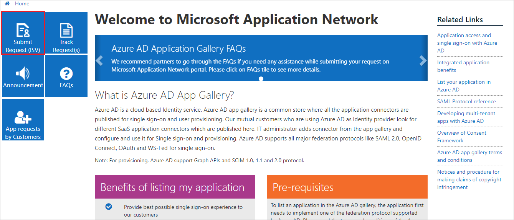
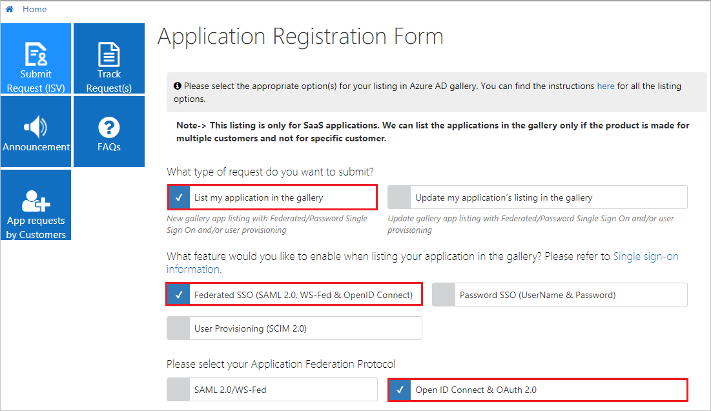
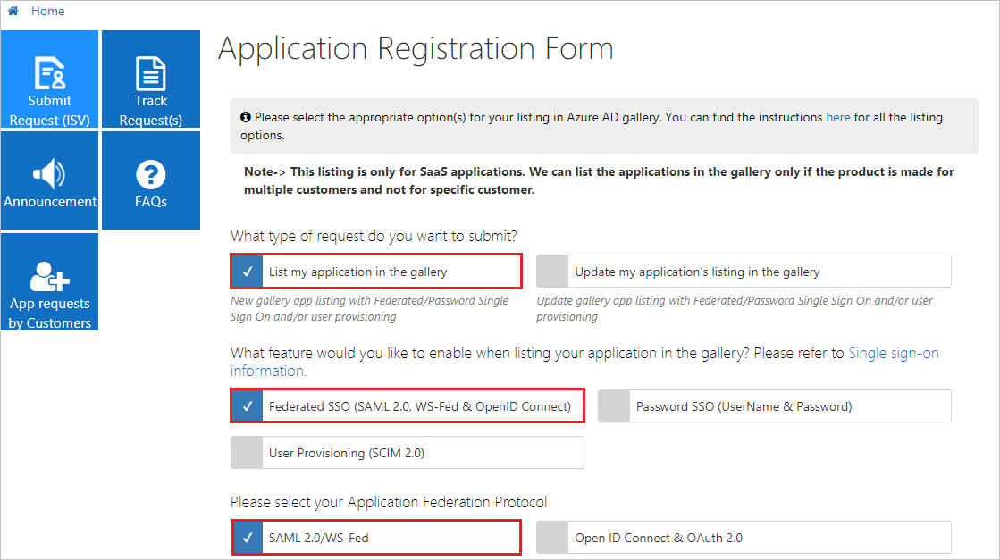
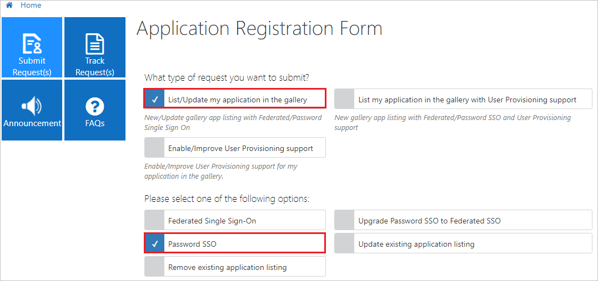
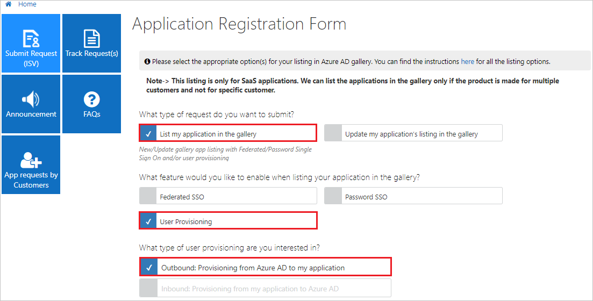
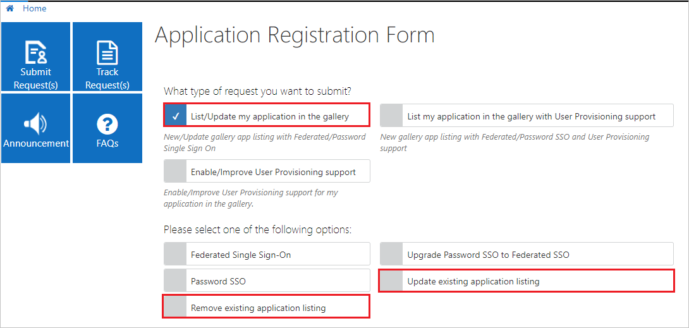
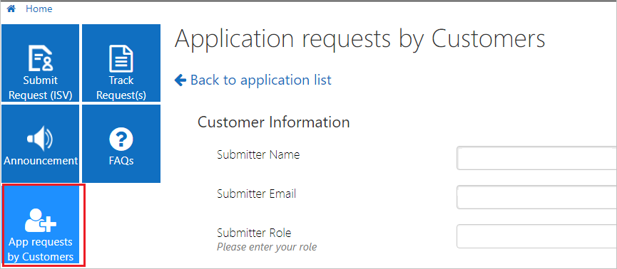
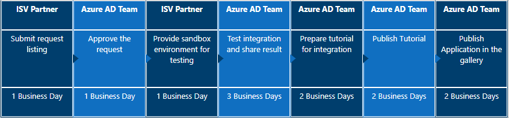

# Publish your app to the Azure AD app gallery

You can publish your app in the Azure AD app gallery. When your app is published, it will show up as an option for customers when they are adding apps to their tenant. 

Some of the benefits of adding your app to the Azure AD gallery include:

- Customers find the best possible single sign-on experience for your app.
- Configuration of the application is simple and minimal.
- A quick search finds your application in the gallery.
- Free, Basic, and Premium Azure AD customers can all use this integration.
- Mutual customers get a step-by-step configuration tutorial.

In addition, there are many benefits when your customers use Azure AD as an identity provider for your app. Some of these include:

- Provide single sign-on for your users. With SSO you reduce support costs by making it easier for your customers with single sign-on. If one-click SSO is enabled, your customers’ IT Administrators don't have to learn how to configure your application for use in their organization. To learn more about single sign-on, see [What is single sign-on?](../manage-apps/what-is-single-sign-on.md).
- Your app can be discoverable in the Microsoft 365 App Gallery, the Microsoft 365 App Launcher, and within Microsoft Search on Office.com. 
- Integrated app management. To learn more about app management in Azure AD, see [What is application management?](../manage-apps/what-is-application-management.md).
- Your app can use the [Graph API](https://docs.microsoft.com/graph/) to access the data that drives user productivity in the Microsoft ecosystem.
- Application-specific documentation co-produced with the Azure AD team for our mutual customers eases adoption.
- You provide your customers the ability to completely manage their employee and guest identities’ authentication and authorization.
- Placing all account management and compliance responsibility with the customer owner of those identities.
- Providing ability to enable or disable SSO for specific identity providers, groups, or users to meet their business needs.
- You increase your marketability and adoptability. Many large organizations require that (or aspire to) their employees have seamless SSO experiences across all applications. Making SSO easy is important.
- You reduce end-user friction, which may increase end-user usage and increase your revenue.
- Customers who use the System for Cross-domain Identity Management ([SCIM](https://techcommunity.microsoft.com/t5/Identity-Standards-Blog/Provisioning-with-SCIM-getting-started/ba-p/880010)) can use provisioning for the same app.
- Add security and convenience when users sign on to applications by using Azure AD SSO and removing the need for separate credentials.

> [!TIP]
> When you offer your application for use by other companies through a purchase or subscription, you make your application available to customers within their own Azure tenants. This is known as creating a multi-tenant application. For an overview of this concept, see [Multitenant Applications in Azure](https://docs.microsoft.com/azure/dotnet-develop-multitenant-applications) and [Tenancy in Azure Active Directory](single-and-multi-tenant-apps.md).

> [!IMPORTANT]
> To publish your app in the Azure AD gallery you must agree to specific terms and conditions. Before you begin, make sure to read and agree to the [terms and conditions](https://azure.microsoft.com/support/legal/active-directory-app-gallery-terms/).

The steps to publishing your app in the Azure AD app gallery are:
1. Choose the right single sign-on standard for your app.
2. Implement single sign-on in your app.
3. Create your Azure tenant and test your app.
4. Create and publish documentation.
5. Submit your app.
6. Join the Microsoft partner network.

## What is the Azure AD application gallery?

- Customers find the best possible single sign-on experience.
- Configuration of the application is simple and minimal.
- A quick search finds your application in the gallery.
- Free, Basic, and Premium Azure AD customers can all use this integration.
- Mutual customers get a step-by-step configuration tutorial.
- Customers who use the System for Cross-domain Identity Management ([SCIM](https://techcommunity.microsoft.com/t5/Identity-Standards-Blog/Provisioning-with-SCIM-getting-started/ba-p/880010)) can use provisioning for the same app.

## Prerequisites

You need a permanent account for testing with at least two users registered.

- For federated applications (Open ID and SAML/WS-Fed), the application must support the software-as-a-service (SaaS) model for getting listed in the Azure AD app gallery. The enterprise gallery applications must support multiple customer configurations and not any specific customer.
- For Open ID Connect, the application must be multitenanted and the [Azure AD consent framework](../develop/consent-framework.md?toc=/azure/active-directory/azuread-dev/toc.json&bc=/azure/active-directory/azuread-dev/breadcrumb/toc.json) must be properly implemented for the application. The user can send the sign-in request to a common endpoint so that any customer can provide consent to the application. You can control user access based on the tenant ID and the user's UPN received in the token.
- For SAML 2.0/WS-Fed, your application must have the capability to do the SAML/WS-Fed SSO integration in SP or IDP mode. Make sure this capability is working correctly before you submit the request.
- For password SSO, make sure that your application supports form authentication so that password vaulting can be done to get single sign-on to work as expected.
- You need a permanent account for testing with at least two users registered.

**How to get Azure AD for developers?**

You can get a free test account with all the premium Azure AD features - 90 days free and can get extended as long as you do dev work with it: https://docs.microsoft.com/office/developer-program/office-365-developer-program

## Step 1 - Choose the right single sign-on standard for your app

To list an application in the Azure AD app gallery, you need to implement at least one of the supported single sign-on options. To understand the single sign-on options, and how customers will configure them in Azure AD, see [SSO options](../manage-apps/sso-options.md).

The following table compares the main standards: Open Authentication 2.0 (OAuth 2.0) with OpenID Connect (OIDC), Security Assertion Markup Language (SAML), and Web Services Federation (WS-Fed).

| Capability| OAuth / OIDC| SAML / WS-Fed |
| - |-|-|
| Web-based single sign-on| √| √ |
| Web-based single sign-out| √| √ |
| Mobile-based single sign-on| √| √* |
| Mobile-based single sign-out| √| √* |
| Conditional Access policies for mobile applications| √| X |
| Seamless MFA experience for mobile applications| √| X |
| Access Microsoft Graph| √| X |

*Possible, but Microsoft doesn't provide samples or guidance.

### OAuth 2.0 and OpenID Connect
OAuth 2.0 is an [industry-standard](https://oauth.net/2/) protocol for authorization. OpenID Connect (OIDC) is an [industry standard](https://openid.net/connect/) identity authentication layer built on top of the OAuth 2.0 protocol. 

**Reasons to choose OAuth/OIDC**
- The authorization inherent in these protocols enables your application to access and integrate with rich user and organizational data through the Microsoft Graph API.
- Simplifies your customers’ end-user experience when adopting SSO for your application. You can easily define the permission sets necessary, which are then automatically represented to the administrator or end user consenting.
- Using these protocols enables your customers to use Conditional Access and Multi-Factor Authentication (MFA) policies to control access to the applications. 
- Microsoft provides libraries and [code samples across multiple technology platforms](https://github.com/AzureAD/microsoft-authentication-library-for-js/wiki/Samples) to aid your development.  

**Some things to consider**
- If you have already implemented SAML based single sign-on for your application then you might not want to implement a new standard to get your app in the gallery.

### SAML 2.0 or WS-Fed

SAML is a mature, and widely adopted, [single sign-on standard](https://www.oasis-open.org/standards#samlv2.0) for web applications. To learn more about how Azure uses SAML, see [How Azure uses the SAML protocol](active-directory-saml-protocol-reference.md). 

Web Services Federation (WS-Fed) is an [industry standard](https://docs.oasis-open.org/wsfed/federation/v1.2/ws-federation.html) generally used for web applications that are developed using the .NET platform.

**Reasons to choose SAML**
- SAML 2.0 is a mature standard and most technology platforms support open-source libraries for SAML 2.0. 
- You can provide your customers an administration interface to configure SAML SSO. They can configure SAML SSO for Microsoft Azure AD, and any other identity provider that supports SAML.

**Some things to consider**
- When using SAML 2.0 or WSFed protocols for mobile applications, certain Conditional Access policies including Multi-factor Authentication (MFA) will have a degraded experience.
- If you want to access the Microsoft Graph, you will need to implement authorization through OAuth 2.0 to generate necessary tokens. 

### Password-based
Password-based SSO, also referred to as password vaulting, enables you to manage user access and passwords to web applications that don't support identity federation. It's also useful for scenarios in which several users need to share a single account, such as to your organization's social media app accounts.

## Step 2 - Implement single sign-on in your app
Every app in the gallery must implement one of the supported single sign-on options. To learn more about the supported options, see [SSO options](../manage-apps/sso-options.md).

For OAuth and OIDC, see [guidance on authentication patterns](v2-app-types.md) and [Azure active Directory code samples](sample-v2-code.md).

For SAML and WS-Fed, your application must have the capability to do SSO integration in SP or IDP mode. Make sure this capability is working correctly before you submit the request.

To learn more about authentication, see [What is authentication?](../azuread-dev/v1-authentication-scenarios.md).

> [!IMPORTANT]
> For federated applications (OpenID and SAML/WS-Fed), the app must support the Software as a Service (SaaS) model. Azure AD gallery applications must support multiple customer configurations and should not be specific to any single customer.

### Implement OAuth 2.0 and OpenID Connect

For OpenID Connect, the application must be multi-tenanted and the [Azure AD consent framework](consent-framework.md) must be properly implemented for the application. The user can send the sign-in request to a common endpoint so that any customer can provide consent to the application. You can control user access based on the tenant ID and the user's UPN received in the token.

To review specific examples, see [Microsoft identity platform code samples](sample-v2-code.md). 

To review mobile specific examples, see: 
* [Android](quickstart-v2-android.md)
* [iOS](quickstart-v2-ios.md)
* [Universal Windows Platform](quickstart-v2-uwp.md)

### Implement SAML 2.0

If your app supports SAML 2.0, you can integrate it directly with an Azure AD tenant. To learn more about SAML configuration with Azure AD, see [Configure SAML-based single sign-on](../manage-apps/configure-saml-single-sign-on.md).

Microsoft does not provide, or recommend, libraries for SAML implementations. There are many open-source libraries available.

### Implement WS-Fed
To learn more about WS-Fed in ASP.NET Core, see [Authenticate users with WS-Federation in ASP.NET Core](https://docs.microsoft.com/aspnet/core/security/authentication/ws-federation).

### Implement password vaulting

Create a web application that has an HTML sign-in page. Make sure that your application supports form authentication so that password vaulting can be done to get single sign-on to work as expected.

## Step 3 - Create your Azure tenant and test your app

You will need an Azure AD tenant in order to test your app. To set up your development environment, see [Quickstart: Set up a tenant](quickstart-create-new-tenant.md).

Alternatively, an Azure AD tenant comes with every Microsoft 365 subscription. To set up a free Microsoft 365 development environment, see [Join the Microsoft 365 Developer Program](https://docs.microsoft.com/office/developer-program/microsoft-365-developer-program).

Once you have a tenant, you need to enable and test single-sign on access. 

**For OIDC or Oath applications**, [Register your application](quickstart-register-app.md) as a multi-tenant application. ‎Select the Accounts in any organizational directory and personal Microsoft accounts option in Supported Account types.

**For SAML- and WS-Fed-based applications**, you [Configure SAML-based Single sign-on](../manage-apps/configure-saml-single-sign-on.md) applications using a generic SAML template in Azure AD.

You can also [convert a single-tenant application to multi-tenant](howto-convert-app-to-be-multi-tenant.md) if necessary.

## Step 4 - Create and publish documentation

### Documentation on your site

Ease of adoption is a significant factor in enterprise software decisions. Clear easy-to-follow documentation supports your customers in their adoption journey and reduces support costs. Working with thousands of software vendors, Microsoft has seen what works.

We recommend that your documentation on your site at a minimum include the following items.

* Introduction to your SSO functionality
  * Protocols supported
  * Version and SKU
  * Supported Identity Providers list with documentation links
* Licensing information for your application
* Role-based access control for configuring SSO
* SSO Configuration Steps
  * UI configuration elements for SAML with expected values from the provider
  * Service provider information to be passed to identity providers
* If OIDC/OAuth
  * List of permissions required for consent with business justifications
* Testing steps for pilot users
* Troubleshooting information, including error codes and messages
* Support mechanisms for customers

### Documentation on the Microsoft Site

When you list your application with the Azure Active Directory Application Gallery, which also publishes your application in the Azure Marketplace, Microsoft will generate documentation for our mutual customers explaining the step-by-step process. You can see an example [here](https://aka.ms/appstutorial). This documentation is created based on your submission to the gallery, and you can easily update it if you make changes to your application using your GitHub account.

## Step 5 - Submit your app

After you've tested that your application integration works with Azure AD, submit your application request in the [Microsoft Application Network portal](https://microsoft.sharepoint.com/teams/apponboarding/Apps).

The first time you try to sign into the portal you will be presented with one of two screens. 

If you receive the message "That didn't work" then you will need to contact the [Azure AD SSO Integration Team](<mailto:SaaSApplicationIntegrations@service.microsoft.com>). Provide the email account that you want to use for submitting the request. A business email address such as `name@yourbusiness.com` is preferred. The Azure AD team will add the account in the Microsoft Application Network portal.

If you see a "Request Access" page then fill in the business justification and select **Request Access**.

After the account is added, you can sign in to the Microsoft Application Network portal and submit the request by selecting the **Submit Request (ISV)** tile on the home page.

### Issues on logging into portal

If you are seeing this error while logging in then here are the detail on the issue and this is how you can fix it.

* If your sign-in was blocked as shown below:

  

**What's happening:**

The guest user is federated to a home tenant which is also an Azure AD. The guest user is at High risk. Microsoft doesn't allow High risk users to access its resources. All High risk users (employees or guests / vendors) must remediate / close their risk to access Microsoft resources. For guest users, this user risk comes from the home tenant and the policy comes from the resource tenant (Microsoft in this case).
 
**Secure solutions:**

* MFA registered guest users remediate their own user risk. This can be done by the guest user performing a secured password change or reset (https://aka.ms/sspr) at their home tenant (this needs MFA and SSPR at the home tenant). The secured password change or reset must be initiated on Azure AD and not on-prem.

* Guest users have their admins remediate their risk. In this case, the admin will perform a password reset (temporary password generation). This does not need Identity Protection. The guest user's admin can go to https://aka.ms/RiskyUsers and click on 'Reset password'.

* Guest users have their admins close / dismiss their risk. Again, this does not need Identity Protection. The admin can go to https://aka.ms/RiskyUsers and click on 'Dismiss user risk'. However, the admin must do the due diligence to ensure this was a false positive risk assessment before closing the user risk. Otherwise, they are putting their and Microsoft's resources at risk by suppressing a risk assessment without investigation.

> [!NOTE]
> If you have any issues with access, contact the [Azure AD SSO Integration Team](<mailto:SaaSApplicationIntegrations@service.microsoft.com>).

### Implementation specific options
If you want to add your application to list in the gallery by using OpenID Connect, select **OpenID Connect & OAuth 2.0** as shown.

If you want to add your application to list in the gallery by using **SAML 2.0** or **WS-Fed**, select **SAML 2.0/WS-Fed** as shown.

If you want to add your application to list in the gallery by using password SSO, select **Password SSO(UserName & Password)** as shown.

If you are implementing a SCIM 2.0 endpoint for user provisioning, select the option as shown. 

   

### Update or remove an existing listing

You can update or remove an existing gallery app in the [Microsoft Application Network portal](https://microsoft.sharepoint.com/teams/apponboarding/Apps).

> [!NOTE]
> If you have any issues with access, review the previous section on creating your account. If that doesn't work, contact the [Azure AD SSO Integration Team](<mailto:SaaSApplicationIntegrations@service.microsoft.com>).

### List requests by customers

Customers can submit a request to list an application by selecting **App requests by Customers** > **Submit new request**.

Here's the flow of customer-requested applications.

### Timelines

The timeline for the process of listing a SAML 2.0 or WS-Fed application in the gallery is 7 to 10 business days.

The timeline for the process of listing an OpenID Connect application in the gallery is 2 to 5 business days.

### Escalations

For any escalations, send email to the [Azure AD SSO Integration Team](mailto:SaaSApplicationIntegrations@service.microsoft.com), and we'll respond as soon as possible.

## Step 6 - Join the Microsoft partner network
The Microsoft Partner Network provides instant access to exclusive resources, programs, tools, and connections. To join the network and create your go to market plan, see [Reach commercial customers](https://partner.microsoft.com/explore/commercial#gtm).

## Next steps
* [Build a SCIM endpoint and configure user provisioning](../app-provisioning/use-scim-to-provision-users-and-groups.md)
* [Authentication scenarios for Azure AD](authentication-flows-app-scenarios.md)
