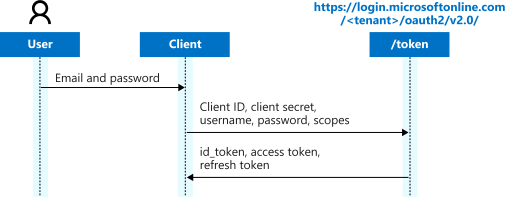

# Microsoft identity platform and the OAuth 2.0 resource owner password credential

Microsoft identity platform supports the [resource owner password credential (ROPC) grant](https://tools.ietf.org/html/rfc6749#section-4.3), which allows an application to sign in the user by directly handling their password. The ROPC flow requires a high degree of trust and user exposure and you should only use this flow when other, more secure, flows can't be used.

> [!IMPORTANT]
>
> * The Microsoft identity platform endpoint only supports ROPC for Azure AD tenants, not personal accounts. This means that you must use a tenant-specific endpoint (`https://login.microsoftonline.com/{TenantId_or_Name}`) or the `organizations` endpoint.
> * Personal accounts that are invited to an Azure AD tenant can't use ROPC.
> * Accounts that don't have passwords can't sign in through ROPC. For this scenario, we recommend that you use a different flow for your app instead.
> * If users need to use multi-factor authentication (MFA) to log in to the application, they will be blocked instead.

## Protocol diagram

The following diagram shows the ROPC flow.



## Authorization request

The ROPC flow is a single request&mdash;it sends the client identification and user's credentials to the IDP, and then receives tokens in return. The client must request the user's email address (UPN) and password before doing so. Immediately after a successful request, the client should securely release the user's credentials from memory. It must never save them.

> [!TIP]
> Try executing this request in Postman!
> [](https://app.getpostman.com/run-collection/f77994d794bab767596d)


```
// Line breaks and spaces are for legibility only.

POST {tenant}/oauth2/v2.0/token
Host: login.microsoftonline.com
Content-Type: application/x-www-form-urlencoded

client_id=6731de76-14a6-49ae-97bc-6eba6914391e
&scope=user.read%20openid%20profile%20offline_access
&username=MyUsername@myTenant.com
&password=SuperS3cret
&grant_type=password
```

| Parameter | Condition | Description |
| --- | --- | --- |
| `tenant` | Required | The directory tenant that you want to log the user into. This can be in GUID or friendly name format. This parameter can't be set to `common` or `consumers`, but may be set to `organizations`. |
| `grant_type` | Required | Must be set to `password`. |
| `username` | Required | The user's email address. |
| `password` | Required | The user's password. |
| `scope` | Recommended | A space-separated list of [scopes](v2-permissions-and-consent.md), or permissions, that the app requires. In an interactive flow, the admin or the user must consent to these scopes ahead of time. |

### Successful authentication response

The following example shows a successful token response:

```json
{
    "token_type": "Bearer",
    "scope": "User.Read profile openid email",
    "expires_in": 3599,
    "access_token": "eyJ0eXAiOiJKV1QiLCJhbGciOiJSUzI1NiIsIng1dCI6Ik5HVEZ2ZEstZnl0aEV1Q...",
    "refresh_token": "AwABAAAAvPM1KaPlrEqdFSBzjqfTGAMxZGUTdM0t4B4...",
    "id_token": "eyJ0eXAiOiJKV1QiLCJhbGciOiJub25lIn0.eyJhdWQiOiIyZDRkMTFhMi1mODE0LTQ2YTctOD..."
}
```

| Parameter | Format | Description |
| --------- | ------ | ----------- |
| `token_type` | String | Always set to `Bearer`. |
| `scope` | Space separated strings | If an access token was returned, this parameter lists the scopes the access token is valid for. |
| `expires_in`| int | Number of seconds that the included access token is valid for. |
| `access_token`| Opaque string | Issued for the [scopes](v2-permissions-and-consent.md) that were requested. |
| `id_token` | JWT | Issued if the original `scope` parameter included the `openid` scope. |
| `refresh_token` | Opaque string | Issued if the original `scope` parameter included `offline_access`. |

You can use the refresh token to acquire new access tokens and refresh tokens using the same flow described in the [OAuth Code flow documentation](v2-oauth2-auth-code-flow.md#refresh-the-access-token).

### Error response

If the user hasn't provided the correct username or password, or the client hasn't received the requested consent, authentication will fail.

| Error | Description | Client action |
|------ | ----------- | -------------|
| `invalid_grant` | The authentication failed | The credentials were incorrect or the client doesn't have consent for the requested scopes. If the scopes aren't granted, a `consent_required` error will be returned. If this occurs, the client should send the user to an interactive prompt using a webview or browser. |
| `invalid_request` | The request was improperly constructed | The grant type isn't supported on the `/common` or `/consumers` authentication contexts.  Use `/organizations` instead. |
| `invalid_client` | The app is improperly set up | This can happen if the `allowPublicClient` property isn't set to true in the [application manifest](reference-app-manifest.md). The `allowPublicClient` property is needed because the ROPC grant doesn't have a redirect URI. Azure AD can't determine if the app is a public client application or a confidential client application unless the property is set. ROPC is only supported for public client apps. |

## Learn more

* Try out ROPC for yourself using the [sample console application](https://github.com/azure-samples/active-directory-dotnetcore-console-up-v2).
* To determine whether you should use the v2.0 endpoint, read about [Microsoft identity platform limitations](active-directory-v2-limitations.md).
