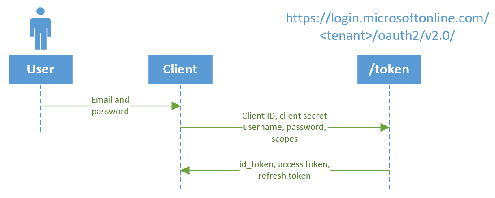

# Azure Active Directory v2.0 and the OAuth 2.0 resource owner password credential

Azure AD supports the [resource owner password credential grant](https://tools.ietf.org/html/rfc6749#section-4.3) (ROPC), which allows an application to sign in the user by directly handling their password.  Because this flow requires a high degree of trust and user exposure, the ROPC flow should only be used when the other, more secure flows, cannot be used.

> [!Important]
> The v2.0 endpoint only supports ROPC for Azure AD tenants, not personal accounts.  This means that you must use a tenanted endpoint or the organizations endpoint.  
>
> Personal accounts that are invited to an Azure AD tenant will be able to use the device flow grant, but only in the context of the tenant.
>
> Accounts that don't have passwords cannot sign in via ROPC - for this reason, we encourage your app to use a different flow instead.

> [!NOTE]
> The v2.0 endpoint doesn't support all Azure Active Directory scenarios and features. To determine whether you should use the v2.0 endpoint, read about [v2.0 limitations](active-directory-v2-limitations.md).
>

## Protocol diagram

The entire device code flow looks similar to the next diagram. We describe each of the steps later in this article.



## Device authorization request

The client must first check with the authentication server for a device and user code, used to initiate authentication.  The client collects this request from the `/devicecode` endpoint. In this request, the client should also include the permissions it needs to acquire from the user.  From the moment this request is sent, the user has only 15 minutes to sign in (the usual value for `expires_in`), so only make this request when the user has indicated they're ready to sign in.

```
// Line breaks are for legibility only.

POST https://login.microsoftonline.com/{tenant}/devicecode
Content-Type: application/x-www-form-urlencoded

client_id=6731de76-14a6-49ae-97bc-6eba6914391e
scope=user.read%20openid%20profile

```

| Parameter | Condition | Description |
| --- | --- | --- |
| tenant |Required |The directory tenant that you want to log the user into. This can be in GUID or friendly name format.  |
| grant_type |Required | Must be `password`.  |
|username| Required| The user's username,  |
|password| Required| The user's password.  |
| scope | Recommended | A space-separated list of [scopes](v2-permissions-and-consent.md) that the app requires.  These must be pre-consented to by an admin. |

### Expected errors

Because the device code flow is a polling protocol, your client must expect to receive errors before the user has finished authenticating.  

| Error | Description | Client Action |
|------ | ----------- | -------------|
| `authorization_pending` |  The user has not yet finished authenticating, but has not canceled the flow. | Repeat the request after at least `interval` seconds. |
| `invalid_grant` | The authentication failed. | The credentials were incorrect or the client does not have consent for the 

### Succesful authentication response

A successful token response will look like:

```json
{
    "token_type": "Bearer",
    "scope": "User.Read profile openid email",
    "expires_in": 3599,
    "access_token": "eyJ0eXAiOiJKV1QiLCJhbGciOiJSUzI1NiIsIng1dCI6Ik5HVEZ2ZEstZnl0aEV1Q...",
    "refresh_token": "AwABAAAAvPM1KaPlrEqdFSBzjqfTGAMxZGUTdM0t4B4...",
    "id_token": "eyJ0eXAiOiJKV1QiLCJhbGciOiJub25lIn0.eyJhdWQiOiIyZDRkMTFhMi1mODE0LTQ2YTctOD..."
}
```

| Parameter | Format | Description |
| --------- | ------ | ----------- |
|`token_type` | String| Always "Bearer. |
|`scope` | Space seperated strings | If an access token was returned, this lists the scopes the access token is valid for. |
|`expires_in`| int | Number of seconds before the included access token is valid for. |
|`access_token`| Opaque string | Issued for the [scopes](v2-permissions-and-consent.md) that were requested.  |
|`id_token`   | JWT | Issued if the original `scope` parameter included the `openid` scope.  |
|`refresh_token` | Opaque string | Issued if the original `scope` parameter included `offline_access`.  |

The refresh token can be used to acquire new access tokens and refresh tokens using the same flow detailed in the [OAuth Code flow documentation](v2-oauth2-auth-code-flow.md#refresh-the-access-token).  