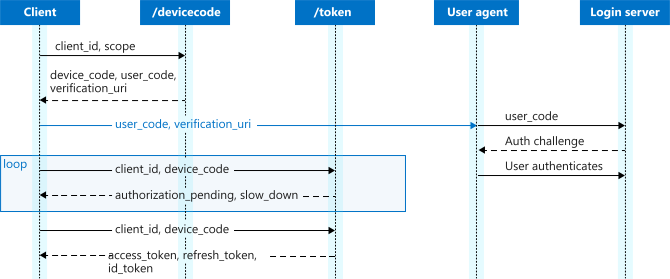

# Microsoft identity platform and the OAuth 2.0 device code flow

[!INCLUDE [active-directory-develop-applies-v2](../../../includes/active-directory-develop-applies-v2.md)]

The Microsoft identity platform supports the [device code grant](https://tools.ietf.org/html/draft-ietf-oauth-device-flow-12), which allows users to sign in to input-constrained devices such as a smart TV, IoT device, or printer.  To enable this flow, the device has the user visit a webpage in their browser on another device to sign in.  Once the user signs in, the device is able to get access tokens and refresh tokens as needed.  

> [!IMPORTANT]
> At this time, the Microsoft identity platform endpoint only supports the device flow for Azure AD tenants, but not personal accounts.  This means that you must use an endpoint set up as a tenant, or the `organizations` endpoint.  This support will be enabled soon. 
>
> Personal accounts that are invited to an Azure AD tenant will be able to use the device flow grant, but only in the context of the tenant.
>
> As an additional note, the `verification_uri_complete` response field is not included or supported at this time.  

> [!NOTE]
> The Microsoft identity platform endpoint doesn't support all Azure Active Directory scenarios and features. To determine whether you should use the Microsoft identity platform endpoint, read about [Microsoft identity platform limitations](active-directory-v2-limitations.md).

## Protocol diagram

The entire device code flow looks similar to the next diagram. We describe each of the steps later in this article.



## Device authorization request

The client must first check with the authentication server for a device and user code that's used to initiate authentication. The client collects this request from the `/devicecode` endpoint. In this request, the client should also include the permissions it needs to acquire from the user. From the moment this request is sent, the user has only 15 minutes to sign in (the usual value for `expires_in`), so only make this request when the user has indicated they're ready to sign in.

> [!TIP]
> Try executing this request in Postman!
> [](https://app.getpostman.com/run-collection/f77994d794bab767596d)

```
// Line breaks are for legibility only.

POST https://login.microsoftonline.com/{tenant}/devicecode
Content-Type: application/x-www-form-urlencoded

client_id=6731de76-14a6-49ae-97bc-6eba6914391e
scope=user.read%20openid%20profile

```

| Parameter | Condition | Description |
| --- | --- | --- |
| `tenant` | Required |The directory tenant that you want to request permission from. This can be in GUID or friendly name format.  |
| `client_id` | Required | The **Application (client) ID** that the [Azure portal – App registrations](https://go.microsoft.com/fwlink/?linkid=2083908) experience assigned to your app. |
| `scope` | Recommended | A space-separated list of [scopes](v2-permissions-and-consent.md) that you want the user to consent to.  |

### Device authorization response

A successful response will be a JSON object containing the required information to allow the user to sign in.  

| Parameter | Format | Description |
| ---              | --- | --- |
|`device_code`     | String | A long string used to verify the session between the client and the authorization server. The client uses this parameter to request the access token from the authorization server. |
|`user_code`       | String | A short string shown to the user that's used to identify the session on a secondary device.|
|`verification_uri`| URI | The URI the user should go to with the `user_code` in order to sign in. |
|`expires_in`      | int | The number of seconds before the `device_code` and `user_code` expire. |
|`interval`        | int | The number of seconds the client should wait between polling requests. |
| `message`        | String | A human-readable string with instructions for the user. This can be localized by including a **query parameter** in the request of the form `?mkt=xx-XX`, filling in the appropriate language culture code. |

## Authenticating the user

After receiving the `user_code` and `verification_uri`, the client displays these to the user, instructing them to sign in using their mobile phone or PC browser.  Additionally, the client can use a QR code or similar mechanism to display the `verfication_uri_complete`, which will take the step of entering the `user_code` for the user.

While the user is authenticating at the `verification_uri`, the client should be polling the `/token` endpoint for the requested token using the `device_code`.

``` 
POST https://login.microsoftonline.com/tenant/oauth2/v2.0/token
Content-Type: application/x-www-form-urlencoded

grant_type: urn:ietf:params:oauth:grant-type:device_code
client_id: 6731de76-14a6-49ae-97bc-6eba6914391e
device_code: GMMhmHCXhWEzkobqIHGG_EnNYYsAkukHspeYUk9E8
```

| Parameter | Required | Description|
| -------- | -------- | ---------- |
| `grant_type` | Required | Must be `urn:ietf:params:oauth:grant-type:device_code`|
| `client_id`  | Required | Must match the `client_id` used in the initial request. |
| `device_code`| Required | The `device_code` returned in the device authorization request.  |

### Expected errors

The device code flow is a polling protocol so your client must expect to receive errors before the user has finished authenticating.  

| Error | Description | Client Action |
| ------ | ----------- | -------------|
| `authorization_pending` | The user hasn't finished authenticating, but hasn't canceled the flow. | Repeat the request after at least `interval` seconds. |
| `authorization_declined` | The end user denied the authorization request.| Stop polling, and revert to an unauthenticated state.  |
| `bad_verification_code`| The `device_code` sent to the `/token` endpoint wasn't recognized. | Verify that the client is sending the correct `device_code` in the request. |
| `expired_token` | At least `expires_in` seconds have passed, and authentication is no longer possible with this `device_code`. | Stop polling and revert to an unauthenticated state. |

### Successful authentication response

A successful token response will look like:

```json
{
    "token_type": "Bearer",
    "scope": "User.Read profile openid email",
    "expires_in": 3599,
    "access_token": "eyJ0eXAiOiJKV1QiLCJhbGciOiJSUzI1NiIsIng1dCI6Ik5HVEZ2ZEstZnl0aEV1Q...",
    "refresh_token": "AwABAAAAvPM1KaPlrEqdFSBzjqfTGAMxZGUTdM0t4B4...",
    "id_token": "eyJ0eXAiOiJKV1QiLCJhbGciOiJub25lIn0.eyJhdWQiOiIyZDRkMTFhMi1mODE0LTQ2YTctOD..."
}
```

| Parameter | Format | Description |
| --------- | ------ | ----------- |
| `token_type` | String| Always "Bearer. |
| `scope` | Space separated strings | If an access token was returned, this lists the scopes the access token is valid for. |
| `expires_in`| int | Number of seconds before the included access token is valid for. |
| `access_token`| Opaque string | Issued for the [scopes](v2-permissions-and-consent.md) that were requested.  |
| `id_token`   | JWT | Issued if the original `scope` parameter included the `openid` scope.  |
| `refresh_token` | Opaque string | Issued if the original `scope` parameter included `offline_access`.  |

You can use the refresh token to acquire new access tokens and refresh tokens using the same flow documented in the [OAuth Code flow documentation](v2-oauth2-auth-code-flow.md#refresh-the-access-token).  
