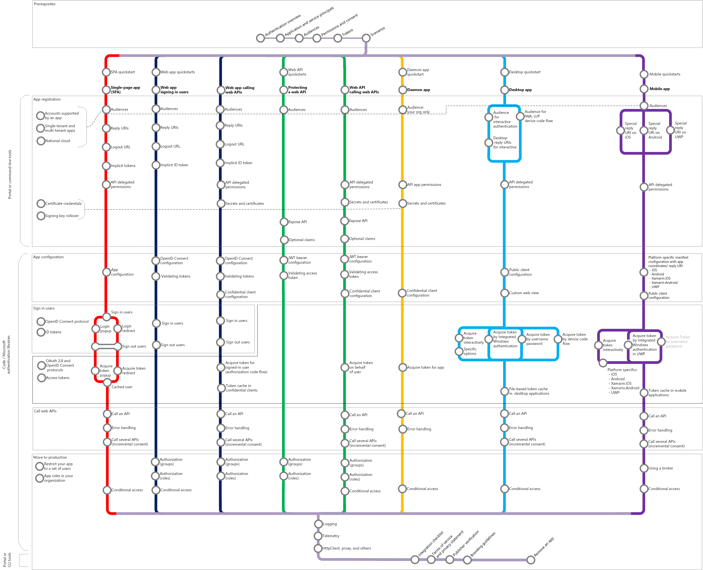

# Microsoft identity platform (v2.0) overview

Microsoft identity platform is an evolution of the Azure Active Directory (Azure AD) developer platform. It allows developers to build applications that sign in all Microsoft identities and get tokens to call Microsoft APIs, such as Microsoft Graph, or APIs that developers have built. The Microsoft identity platform consists of:

- **OAuth 2.0 and OpenID Connect standard-compliant authentication service** that enables developers to authenticate any Microsoft identity, including:
  - Work or school accounts (provisioned through Azure AD)
  - Personal Microsoft accounts (such as Skype, Xbox, and Outlook.com)
  - Social or local accounts (via Azure AD B2C)
- **Open-source libraries**: Microsoft Authentication Libraries (MSAL) and support for other standards-compliant libraries
- **Application management portal**: A registration and configuration experience built in the Azure portal, along with all your other Azure management capabilities.
- **Application configuration API and PowerShell**: which allows programmatic configuration of your applications through the Microsoft Graph API and PowerShell, so you can automate your DevOps tasks.
- **Developer content**: conceptual and reference documentation, quickstart samples, code samples, tutorials, and how-to guides.

For developers, Microsoft identity platform offers seamless integration into innovations in the identity and security space, such as passwordless authentication, step-up authentication, and Conditional Access.  You don’t need to implement such functionality yourself: applications integrated with the Microsoft identity platform natively take advantage of such innovations.

With Microsoft identity platform, you can write code once and reach any user. You can build an app once and have it work across many platforms, or build an app that functions as a client as well as a resource application (API).

## Getting started

Working with identity doesn’t have to be hard. 

Watch a [Microsoft identity platform video](identity-videos.md) to learn the basics. 

Choose a [scenario](authentication-flows-app-scenarios.md) that applies to you— each scenario path has a quickstart and an overview page to get you up and running in minutes:

- [Build a single-page app](scenario-spa-overview.md)
- [Build a web app that signs in users](scenario-web-app-sign-user-overview.md)
- [Build a web app that calls web APIs](scenario-web-app-call-api-overview.md)
- [Build a protected web API](scenario-protected-web-api-overview.md)
- [Build a web API that calls web APIs](scenario-web-api-call-api-overview.md)
- [Build a desktop app](scenario-desktop-overview.md)
- [Build a daemon app](scenario-daemon-overview.md)
- [Build a mobile app](scenario-mobile-overview.md)

The following chart outlines common authentication app scenarios – use it as a reference when integrating the Microsoft identity platform with your app.

## Next steps

If you’d like to learn more about core authentication concepts, we recommend you start with these topics:

- [Authentication flows and application scenarios](authentication-flows-app-scenarios.md)
- [Authentication basics](authentication-scenarios.md)
- [Application and service principals](app-objects-and-service-principals.md)
- [Audiences](v2-supported-account-types.md)
- [Permissions and consent](v2-permissions-and-consent.md)
- [ID tokens](id-tokens.md) and [access tokens](access-tokens.md)

Build a data-rich application that calls [Microsoft Graph](https://docs.microsoft.com/graph/overview).

When you’re ready to launch your app into a **production environment**, review these best practices:

- [Enable logging](msal-logging.md) in your application.
- Enable telemetry in your application.
- Enable [proxies and customize HTTP clients](msal-net-provide-httpclient.md).
- Test your integration by following the [Microsoft identity platform integration checklist](identity-platform-integration-checklist.md).

## Learn more

If you’re planning to build a customer-facing application that signs in social and local identities, see the [Azure AD B2C overview](https://docs.microsoft.com/azure/active-directory-b2c/tutorial-add-identity-providers).
