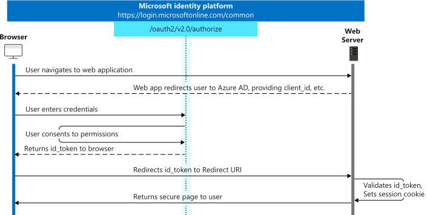
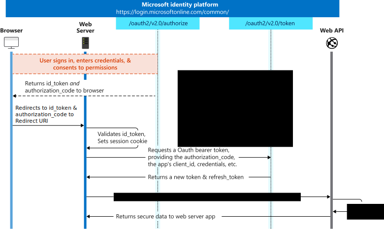

# Microsoft identity platform and OpenID Connect protocol

OpenID Connect is an authentication protocol built on OAuth 2.0 that you can use to securely sign in a user to a web application. When you use the Microsoft identity platform endpoint's implementation of OpenID Connect, you can add sign-in and API access to your web-based apps. This article shows how to do this independent of language and describes how to send and receive HTTP messages without using any Microsoft open-source libraries.

> [!NOTE]
> The Microsoft identity platform endpoint does not support all Azure Active Directory (Azure AD) scenarios and features. To determine whether you should use the Microsoft identity platform endpoint, read about [Microsoft identity platform limitations](active-directory-v2-limitations.md).

[OpenID Connect](https://openid.net/specs/openid-connect-core-1_0.html) extends the OAuth 2.0 *authorization* protocol to use as an *authentication* protocol, so that you can do single sign-on using OAuth. OpenID Connect introduces the concept of an *ID token*, which is a security token that allows the client to verify the identity of the user. The ID token also gets basic profile information about the user. Because OpenID Connect extends OAuth 2.0, apps can securely acquire *access tokens*, which can be used to access resources that are secured by an [authorization server](active-directory-v2-protocols.md#the-basics). The Microsoft identity platform endpoint also allows third-party apps that are registered with Azure AD to issue access tokens for secured resources such as Web APIs. For more information about how to set up an application to issue access tokens, see [How to register an app with the Microsoft identity platform endpoint](quickstart-register-app.md). We recommend that you use OpenID Connect if you are building a [web application](v2-app-types.md#web-apps) that is hosted on a server and accessed via a browser.

## Protocol diagram: Sign-in

The most basic sign-in flow has the steps shown in the next diagram. Each step is described in detail in this article.



## Fetch the OpenID Connect metadata document

OpenID Connect describes a metadata document that contains most of the information required for an app to do sign-in. This includes information such as the URLs to use and the location of the service's public signing keys. For the Microsoft identity platform endpoint, this is the OpenID Connect metadata document you should use:

```
https://login.microsoftonline.com/{tenant}/v2.0/.well-known/openid-configuration
```
> [!TIP]
> Try it! Click [https://login.microsoftonline.com/common/v2.0/.well-known/openid-configuration](https://login.microsoftonline.com/common/v2.0/.well-known/openid-configuration) to see the `common` tenants configuration.

The `{tenant}` can take one of four values:

| Value | Description |
| --- | --- |
| `common` |Users with both a personal Microsoft account and a work or school account from Azure AD can sign in to the application. |
| `organizations` |Only users with work or school accounts from Azure AD can sign in to the application. |
| `consumers` |Only users with a personal Microsoft account can sign in to the application. |
| `8eaef023-2b34-4da1-9baa-8bc8c9d6a490` or `contoso.onmicrosoft.com` | Only users from a specific Azure AD tenant (whether they are members in the directory with a work or school account, or they are guests in the directory with a personal Microsoft account) can sign in to the application. Either the friendly domain name of the Azure AD tenant or the tenant's GUID identifier can be used. You can also use the consumer tenant, `9188040d-6c67-4c5b-b112-36a304b66dad`, in place of the `consumers` tenant.  |

The metadata is a simple JavaScript Object Notation (JSON) document. See the following snippet for an example. The snippet's contents are fully described in the [OpenID Connect specification](https://openid.net/specs/openid-connect-discovery-1_0.html#rfc.section.4.2).

```
{
  "authorization_endpoint": "https:\/\/login.microsoftonline.com\/{tenant}\/oauth2\/v2.0\/authorize",
  "token_endpoint": "https:\/\/login.microsoftonline.com\/{tenant}\/oauth2\/v2.0\/token",
  "token_endpoint_auth_methods_supported": [
    "client_secret_post",
    "private_key_jwt"
  ],
  "jwks_uri": "https:\/\/login.microsoftonline.com\/{tenant}\/discovery\/v2.0\/keys",

  ...

}
```

If your app has custom signing keys as a result of using the [claims-mapping](active-directory-claims-mapping.md) feature, you must append an `appid` query parameter containing the app ID in order to get a `jwks_uri` pointing to your app's signing key information. For example: `https://login.microsoftonline.com/{tenant}/.well-known/v2.0/openid-configuration?appid=6731de76-14a6-49ae-97bc-6eba6914391e` contains a `jwks_uri` of `https://login.microsoftonline.com/{tenant}/discovery/v2.0/keys?appid=6731de76-14a6-49ae-97bc-6eba6914391e`.

Typically, you would use this metadata document to configure an OpenID Connect library or SDK; the library would use the metadata to do its work. However, if you're not using a pre-built OpenID Connect library, you can follow the steps in the remainder of this article to do sign-in in a web app by using the Microsoft identity platform endpoint.

## Send the sign-in request

When your web app needs to authenticate the user, it can direct the user to the `/authorize` endpoint. This request is similar to the first leg of the [OAuth 2.0 authorization code flow](v2-oauth2-auth-code-flow.md), with these important distinctions:

* The request must include the `openid` scope in the `scope` parameter.
* The `response_type` parameter must include `id_token`.
* The request must include the `nonce` parameter.

> [!IMPORTANT]
> In order to successfully request an ID token from the /authorization endpoint, the app registration in the [registration portal](https://portal.azure.com) must have the implicit grant of id_tokens enabled in the Authentication tab (which sets the `oauth2AllowIdTokenImplicitFlow` flag in the [application manifest](reference-app-manifest.md) to `true`). If it isn't enabled, an `unsupported_response` error will be returned: "The provided value for the input parameter 'response_type' isn't allowed for this client. Expected value is 'code'"

For example:

```
// Line breaks are for legibility only.

GET https://login.microsoftonline.com/{tenant}/oauth2/v2.0/authorize?
client_id=6731de76-14a6-49ae-97bc-6eba6914391e
&response_type=id_token
&redirect_uri=http%3A%2F%2Flocalhost%2Fmyapp%2F
&response_mode=form_post
&scope=openid
&state=12345
&nonce=678910
```

> [!TIP]
> Click the following link to execute this request. After you sign in, your browser will be redirected to `https://localhost/myapp/`, with an ID token in the address bar. Note that this request uses `response_mode=fragment` (for demonstration purposes only). We recommend that you use `response_mode=form_post`.
> <a href="https://login.microsoftonline.com/common/oauth2/v2.0/authorize?client_id=6731de76-14a6-49ae-97bc-6eba6914391e&response_type=id_token&redirect_uri=http%3A%2F%2Flocalhost%2Fmyapp%2F&scope=openid&response_mode=fragment&state=12345&nonce=678910" target="_blank">https://login.microsoftonline.com/common/oauth2/v2.0/authorize...</a>

| Parameter | Condition | Description |
| --- | --- | --- |
| `tenant` | Required | You can use the `{tenant}` value in the path of the request to control who can sign in to the application. The allowed values are `common`, `organizations`, `consumers`, and tenant identifiers. For more information, see [protocol basics](active-directory-v2-protocols.md#endpoints). |
| `client_id` | Required | The **Application (client) ID** that the [Azure portal – App registrations](https://go.microsoft.com/fwlink/?linkid=2083908) experience assigned to your app. |
| `response_type` | Required | Must include `id_token` for OpenID Connect sign-in. It might also include other `response_type` values, such as `code`. |
| `redirect_uri` | Recommended | The redirect URI of your app, where authentication responses can be sent and received by your app. It must exactly match one of the redirect URIs you registered in the portal, except that it must be URL encoded. If not present, the endpoint will pick one registered redirect_uri at random to send the user back to. |
| `scope` | Required | A space-separated list of scopes. For OpenID Connect, it must include the scope `openid`, which translates to the "Sign you in" permission in the consent UI. You might also include other scopes in this request for requesting consent. |
| `nonce` | Required | A value included in the request, generated by the app, that will be included in the resulting id_token value as a claim. The app can verify this value to mitigate token replay attacks. The value typically is a randomized, unique string that can be used to identify the origin of the request. |
| `response_mode` | Recommended | Specifies the method that should be used to send the resulting authorization code back to your app. Can be `form_post` or `fragment`. For web applications, we recommend using `response_mode=form_post`, to ensure the most secure transfer of tokens to your application. |
| `state` | Recommended | A value included in the request that also will be returned in the token response. It can be a string of any content you want. A randomly generated unique value typically is used to [prevent cross-site request forgery attacks](https://tools.ietf.org/html/rfc6749#section-10.12). The state also is used to encode information about the user's state in the app before the authentication request occurred, such as the page or view the user was on. |
| `prompt` | Optional | Indicates the type of user interaction that is required. The only valid values at this time are `login`, `none`, and `consent`. The `prompt=login` claim forces the user to enter their credentials on that request, which negates single sign-on. The `prompt=none` claim is the opposite. This claim ensures that the user isn't presented with any interactive prompt at. If the request can't be completed silently via single sign-on, the Microsoft identity platform endpoint returns an error. The `prompt=consent` claim triggers the OAuth consent dialog after the user signs in. The dialog asks the user to grant permissions to the app. |
| `login_hint` | Optional | You can use this parameter to pre-fill the username and email address field of the sign-in page for the user, if you know the username ahead of time. Often, apps use this parameter during reauthentication, after already extracting the username from an earlier sign-in by using the `preferred_username` claim. |
| `domain_hint` | Optional | The realm of the user in a federated directory.  This skips the email-based discovery process that the user goes through on the sign-in page, for a slightly more streamlined user experience. For tenants that are federated through an on-premises directory like AD FS, this often results in a seamless sign-in because of the existing login session. |

At this point, the user is prompted to enter their credentials and complete the authentication. The Microsoft identity platform endpoint verifies that the user has consented to the permissions indicated in the `scope` query parameter. If the user hasn't consented to any of those permissions, the Microsoft identity platform endpoint prompts the user to consent to the required permissions. You can read more about [permissions, consent, and multi-tenant apps](v2-permissions-and-consent.md).

After the user authenticates and grants consent, the Microsoft identity platform endpoint returns a response to your app at the indicated redirect URI by using the method specified in the `response_mode` parameter.

### Successful response

A successful response when you use `response_mode=form_post` looks like this:

```
POST /myapp/ HTTP/1.1
Host: localhost
Content-Type: application/x-www-form-urlencoded

id_token=eyJ0eXAiOiJKV1QiLCJhbGciOiJSUzI1NiIsIng1dCI6Ik1uQ19WWmNB...&state=12345
```

| Parameter | Description |
| --- | --- |
| `id_token` | The ID token that the app requested. You can use the `id_token` parameter to verify the user's identity and begin a session with the user. For more information about ID tokens and their contents, see the [`id_tokens` reference](id-tokens.md). |
| `state` | If a `state` parameter is included in the request, the same value should appear in the response. The app should verify that the state values in the request and response are identical. |

### Error response

Error responses might also be sent to the redirect URI so that the app can handle them. An error response looks like this:

```
POST /myapp/ HTTP/1.1
Host: localhost
Content-Type: application/x-www-form-urlencoded

error=access_denied&error_description=the+user+canceled+the+authentication
```

| Parameter | Description |
| --- | --- |
| `error` | An error code string that you can use to classify types of errors that occur, and to react to errors. |
| `error_description` | A specific error message that can help you identify the root cause of an authentication error. |

### Error codes for authorization endpoint errors

The following table describes error codes that can be returned in the `error` parameter of the error response:

| Error code | Description | Client action |
| --- | --- | --- |
| `invalid_request` | Protocol error, such as a missing, required parameter. |Fix and resubmit the request. This is a development error that typically is caught during initial testing. |
| `unauthorized_client` | The client application can't request an authorization code. |This usually occurs when the client application isn't registered in Azure AD or isn't added to the user's Azure AD tenant. The application can prompt the user with instructions to install the application and add it to Azure AD. |
| `access_denied` | The resource owner denied consent. |The client application can notify the user that it can't proceed unless the user consents. |
| `unsupported_response_type` |The authorization server does not support the response type in the request. |Fix and resubmit the request. This is a development error that typically is caught during initial testing. |
| `server_error` | The server encountered an unexpected error. |Retry the request. These errors can result from temporary conditions. The client application might explain to the user that its response is delayed because of a temporary error. |
| `temporarily_unavailable` | The server is temporarily too busy to handle the request. |Retry the request. The client application might explain to the user that its response is delayed because of a temporary condition. |
| `invalid_resource` | The target resource is invalid because either it does not exist, Azure AD can't find it, or it isn't correctly configured. |This indicates that the resource, if it exists, hasn't been configured in the tenant. The application can prompt the user with instructions for installing the application and adding it to Azure AD. |

## Validate the ID token

Just receiving an id_token isn't sufficient to authenticate the user; you must validate the id_token's signature and verify the claims in the token per your app's requirements. The Microsoft identity platform endpoint uses [JSON Web Tokens (JWTs)](https://self-issued.info/docs/draft-ietf-oauth-json-web-token.html) and public key cryptography to sign tokens and verify that they're valid.

You can choose to validate the `id_token` in client code, but a common practice is to send the `id_token` to a backend server and do the validation there. Once you've validated the signature of the id_token, there are a few claims you'll be required to verify. See the [`id_token` reference](id-tokens.md) for more information, including [Validating Tokens](id-tokens.md#validating-an-id_token) and [Important Information About Signing Key Rollover](active-directory-signing-key-rollover.md). We recommend making use of a library for parsing and validating tokens - there is at least one available for most languages and platforms.

You may also wish to validate additional claims depending on your scenario. Some common validations include:

* Ensuring the user/organization has signed up for the app.
* Ensuring the user has proper authorization/privileges
* Ensuring a certain strength of authentication has occurred, such as multi-factor authentication.

Once you have validated the id_token, you can begin a session with the user and use the claims in the id_token to obtain information about the user in your app. This information can be used for display, records, personalization, etc.

## Send a sign-out request

When you want to sign out the user from your app, it isn't sufficient to clear your app's cookies or otherwise end the user's session. You must also redirect the user to the Microsoft identity platform endpoint to sign out. If you don't do this, the user reauthenticates to your app without entering their credentials again, because they will have a valid single sign-in session with the Microsoft identity platform endpoint.

You can redirect the user to the `end_session_endpoint` listed in the OpenID Connect metadata document:

```
GET https://login.microsoftonline.com/common/oauth2/v2.0/logout?
post_logout_redirect_uri=http%3A%2F%2Flocalhost%2Fmyapp%2F
```

| Parameter | Condition | Description |
| ----------------------- | ------------------------------- | ------------ |
| `post_logout_redirect_uri` | Recommended | The URL that the user is redirected to after successfully signing out. If the parameter isn't included, the user is shown a generic message that's generated by the Microsoft identity platform endpoint. This URL must match one of the redirect URIs registered for your application in the app registration portal. |

## Single sign-out

When you redirect the user to the `end_session_endpoint`, the Microsoft identity platform endpoint clears the user's session from the browser. However, the user may still be signed in to other applications that use Microsoft accounts for authentication. To enable those applications to sign the user out simultaneously, the Microsoft identity platform endpoint sends an HTTP GET request to the registered `LogoutUrl` of all the applications that the user is currently signed in to. Applications must respond to this request by clearing any session that identifies the user and returning a `200` response. If you wish to support single sign-out in your application, you must implement such a `LogoutUrl` in your application's code. You can set the `LogoutUrl` from the app registration portal.

## Protocol diagram: Access token acquisition

Many web apps need to not only sign the user in, but also to access a web service on behalf of the user by using OAuth. This scenario combines OpenID Connect for user authentication while simultaneously getting an authorization code that you can use to get access tokens if you are using the OAuth authorization code flow.

The full OpenID Connect sign-in and token acquisition flow looks similar to the next diagram. We describe each step in detail in the next sections of the article.



## Get access tokens
To acquire access tokens, modify the sign-in request:

```
// Line breaks are for legibility only.

GET https://login.microsoftonline.com/{tenant}/oauth2/v2.0/authorize?
client_id=6731de76-14a6-49ae-97bc-6eba6914391e        // Your registered Application ID
&response_type=id_token%20code
&redirect_uri=http%3A%2F%2Flocalhost%2Fmyapp%2F       // Your registered redirect URI, URL encoded
&response_mode=form_post                              // 'form_post' or 'fragment'
&scope=openid%20                                      // Include both 'openid' and scopes that your app needs  
offline_access%20                                         
https%3A%2F%2Fgraph.microsoft.com%2Fuser.read
&state=12345                                          // Any value, provided by your app
&nonce=678910                                         // Any value, provided by your app
```

> [!TIP]
> Click the following link to execute this request. After you sign in, your browser is redirected to `https://localhost/myapp/`, with an ID token and a code in the address bar. Note that this request uses `response_mode=fragment` for demonstration purposes only. We recommend that you use `response_mode=form_post`.
> <a href="https://login.microsoftonline.com/common/oauth2/v2.0/authorize?client_id=6731de76-14a6-49ae-97bc-6eba6914391e&response_type=id_token%20code&redirect_uri=http%3A%2F%2Flocalhost%2Fmyapp%2F&response_mode=fragment&scope=openid%20offline_access%20https%3A%2F%2Fgraph.microsoft.com%2Fuser.read&state=12345&nonce=678910" target="_blank">https://login.microsoftonline.com/common/oauth2/v2.0/authorize...</a>

By including permission scopes in the request and by using `response_type=id_token code`, the Microsoft identity platform endpoint ensures that the user has consented to the permissions indicated in the `scope` query parameter. It returns an authorization code to your app to exchange for an access token.

### Successful response

A successful response from using `response_mode=form_post` looks like this:

```
POST /myapp/ HTTP/1.1
Host: localhost
Content-Type: application/x-www-form-urlencoded

id_token=eyJ0eXAiOiJKV1QiLCJhbGciOiJSUzI1NiIsIng1dCI6Ik1uQ19WWmNB...&code=AwABAAAAvPM1KaPlrEqdFSBzjqfTGBCmLdgfSTLEMPGYuNHSUYBrq...&state=12345
```

| Parameter | Description |
| --- | --- |
| `id_token` | The ID token that the app requested. You can use the ID token to verify the user's identity and begin a session with the user. You'll find more details about ID tokens and their contents in the [`id_tokens` reference](id-tokens.md). |
| `code` | The authorization code that the app requested. The app can use the authorization code to request an access token for the target resource. An authorization code is short-lived. Typically, an authorization code expires in about 10 minutes. |
| `state` | If a state parameter is included in the request, the same value should appear in the response. The app should verify that the state values in the request and response are identical. |

### Error response

Error responses might also be sent to the redirect URI so that the app can handle them appropriately. An error response looks like this:

```
POST /myapp/ HTTP/1.1
Host: localhost
Content-Type: application/x-www-form-urlencoded

error=access_denied&error_description=the+user+canceled+the+authentication
```

| Parameter | Description |
| --- | --- |
| `error` | An error code string that you can use to classify types of errors that occur, and to react to errors. |
| `error_description` | A specific error message that can help you identify the root cause of an authentication error. |

For a description of possible error codes and recommended client responses, see [Error codes for authorization endpoint errors](#error-codes-for-authorization-endpoint-errors).

When you have an authorization code and an ID token, you can sign the user in and get access tokens on their behalf. To sign the user in, you must validate the ID token [exactly as described](id-tokens.md#validating-an-id_token). To get access tokens, follow the steps described in [OAuth code flow documentation](v2-oauth2-auth-code-flow.md#request-an-access-token).
