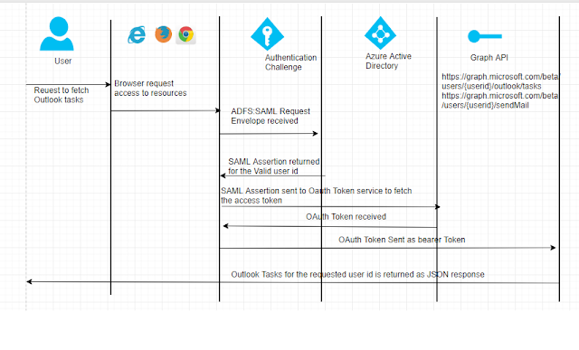
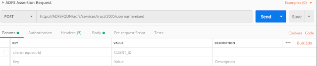
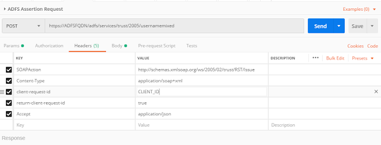
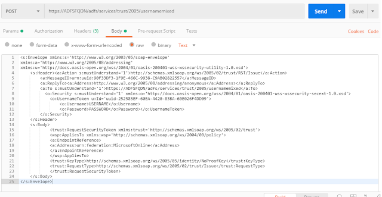
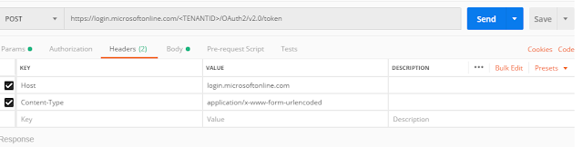
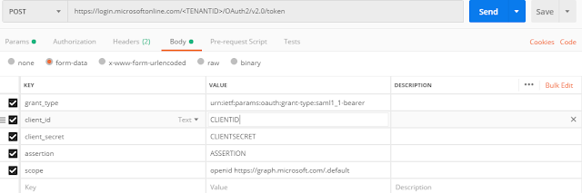
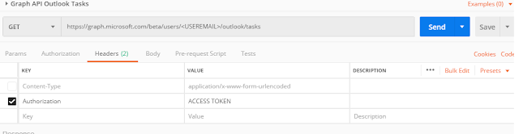

# Exchange a SAML token issued by AD FS for a Microsoft Graph access token

To enable single sign-on (SSO) in applications that use SAML tokens issued by Active Directory Federation Services (AD FS) and also require access to Microsoft Graph, follow the steps in this article.

You'll enable the SAML bearer assertion flow to exchange a SAMLv1 token issued by the federated AD FS instance for an OAuth 2.0 access token for Microsoft Graph. When the user's browser is redirected to Microsoft Entra ID to authenticate them, the browser picks up the session from the SAML sign-in instead of asking the user to enter their credentials.

> [!IMPORTANT]
> This scenario works **only** when AD FS is the federated identity provider that issued the original SAMLv1 token. You **cannot** exchange a SAMLv2 token issued by Microsoft Entra ID for a Microsoft Graph access token.

## Prerequisites

- AD FS federated as an identity provider for single sign-on; see [Setting up AD FS and Enabling Single Sign-On to Office 365](/archive/blogs/canitpro/step-by-step-setting-up-ad-fs-and-enabling-single-sign-on-to-office-365) for an example.
- [Postman](https://www.postman.com/) for testing requests.

## Scenario overview

The OAuth 2.0 SAML bearer assertion flow allows you to request an OAuth access token using a SAML assertion when a client needs to use an existing trust relationship. The signature applied to the SAML assertion provides authentication of the authorized app. A SAML assertion is an XML security token issued by an identity provider and consumed by a service provider. The service provider relies on its content to identify the assertion's subject for security-related purposes.

The SAML assertion is posted to the OAuth token endpoint. The endpoint processes the assertion and issues an access token based on prior approval of the app. The client isn't required to have or store a refresh token, nor is the client secret required to be passed to the token endpoint.

## Register the application with Microsoft Entra ID

Start by registering the application in the [portal](https://portal.azure.com/#blade/Microsoft_AAD_RegisteredApps/ApplicationsListBlade):

1. Sign in to the [app registration page of the portal](https://portal.azure.com/#blade/Microsoft_AAD_RegisteredApps/ApplicationsListBlade) (Please note that we are using the v2.0 endpoints for Graph API and hence need to register the application in Microsoft Entra admin center. Otherwise we could have used the registrations in Microsoft Entra ID).
1. Select **New registration**.
1. When the **Register an application** page appears, enter your application's registration information:
    1. **Name** - Enter a meaningful application name that will be displayed to users of the app.
    1. **Supported account types** - Select which accounts you would like your application to support.
    1. **Redirect URI (optional)** - Select the type of app you're building, Web, or Public client (mobile & desktop), and then enter the redirect URI (or reply URL) for your application.
    1. When finished, select **Register**.
1. Make a note of the application (client) ID.
1. In the left pane, select **Certificates & secrets**. Click **New client secret** in the **Client secrets** section. Copy the new client secret, you won't be able to retrieve when you leave the page.
1. In the left pane, select **API permissions** and then **Add a permission**. Select **Microsoft Graph**, then **delegated permissions**, and then select **Tasks.read** since we intend to use the Outlook Graph API.

## Get the SAML assertion from AD FS

Create a POST request to the AD FS endpoint using SOAP envelope to fetch the SAML assertion:

Header values:

AD FS request body:

Once the request is posted successfully, you should receive a SAML assertion from AD FS. Only the **SAML:Assertion** tag data is required, convert it to base64 encoding to use in further requests.

## Get the OAuth 2.0 token using the SAML assertion

Fetch an OAuth 2.0 token using the AD FS assertion response.

1. Create a POST request as shown below with the header values:

    
1. In the body of the request, replace **client_id**, **client_secret**, and **assertion** (the base64 encoded SAML assertion obtained the previous step):

    
1. Upon successful request, you'll receive an access token from Microsoft Entra ID.

## Get the data with the OAuth 2.0 token

After receiving the access token, call the Graph APIs (Outlook tasks in this example).

1. Create a GET request with the access token fetched in the previous step:

    

1. Upon successful request, you'll receive a JSON response.

## Next steps

For more information about app registration and authentication flow, see:

- [Register an application with the Microsoft identity platform](quickstart-register-app.md)
- [Authentication flows and application scenarios](authentication-flows-app-scenarios.md)

<!-- _This article was originally contributed by [Umesh Barapatre](https://github.com/umeshbarapatre)._ -->
