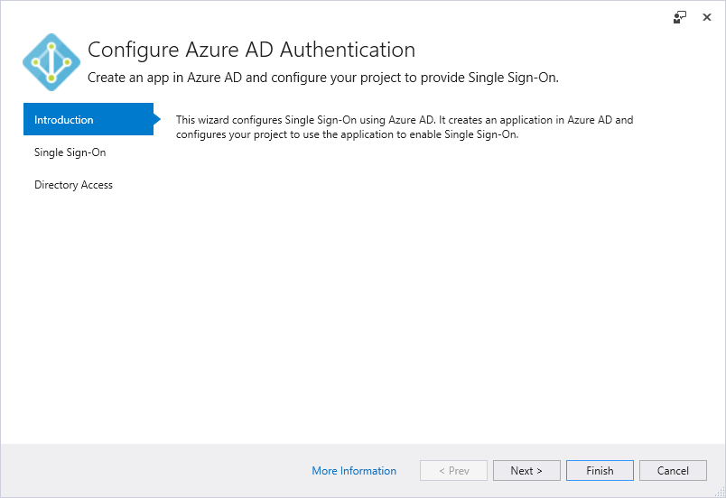
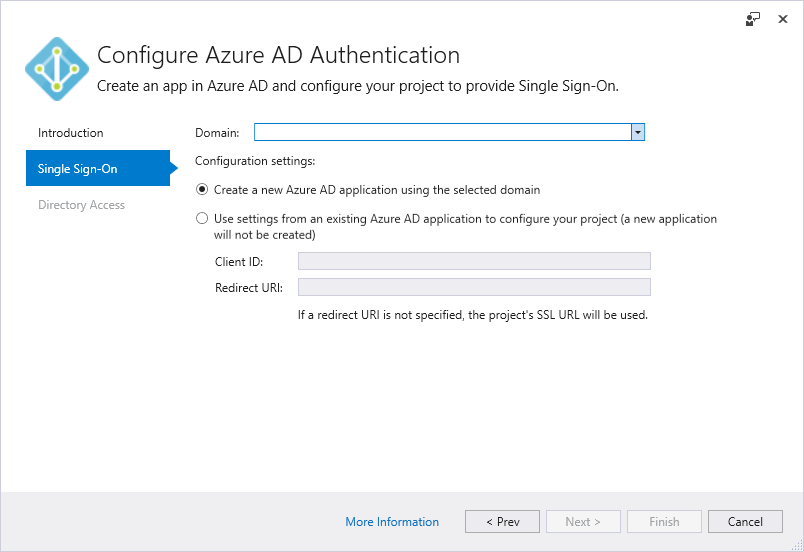
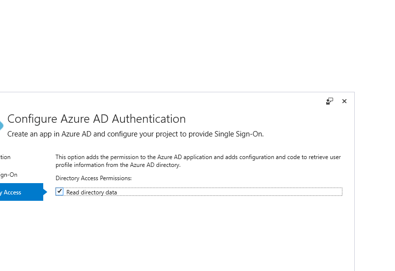
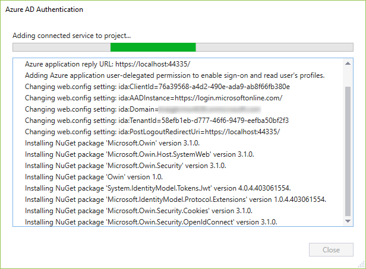

# Add an Azure Active Directory by using Connected Services in Visual Studio

By using Azure Active Directory (Azure AD), you can support Single Sign-On (SSO) for ASP.NET MVC web applications, or Active Directory Authentication in Web API services. With Azure AD Authentication, your users can use their accounts from Azure Active Directory to connect to your web applications. The advantages of Azure AD Authentication with Web API include enhanced data security when exposing an API from a web application. With Azure AD, you do not have to manage a separate authentication system with its own account and user management.

This article and its companion articles provide details of using the Visual Studio Connected Service feature for Active Directory. The capability is available in Visual Studio 2015 and later.

At present, the Active Directory connected service does not support ASP.NET Core applications.

## Prerequisites

- Azure account: if you don't have an Azure account, you can [sign up for a free trial](https://azure.microsoft.com/pricing/free-trial/?WT.mc_id=A261C142F) or [activate your Visual Studio subscriber benefits](https://azure.microsoft.com/pricing/member-offers/msdn-benefits-details/?WT.mc_id=A261C142F).
- **Visual Studio 2015** or later. [Download Visual Studio now](https://aka.ms/vsdownload?utm_source=mscom&utm_campaign=msdocs).

### Connect to Azure Active Directory using the Connected Services dialog

1. In Visual Studio, create or open an ASP.NET MVC project, or an ASP.NET Web API project. You can use the MVC, Web API, Single-Page Application, Azure API App, Azure Mobile App, and Azure Mobile Service templates.

1. Select the **Project > Add Connected Service...** menu command, or double-click the **Connected Services** node found under the project in Solution Explorer.

1. On the **Connected Services** page, select **Authentication with Azure Active Directory**.

    

1. On the **Introduction** page, select **Next**. If you see errors on this page, refer to [Diagnosing errors with the Azure Active Directory Connected Service](vs-active-directory-error.md).

    

1. On the **Single-Sign On** page, select a domain from the **Domain** drop-down list. The list contains all domains accessible by the accounts listed in the Account Settings dialog of Visual Studio (**File > Account Settings...**). As an alternative, you can enter a domain name if you don’t find the one you’re looking for, such as `mydomain.onmicrosoft.com`. You can choose the option to create an Azure Active Directory app or use the settings from an existing Azure Active Directory app. Select **Next** when done.

    

1. On the **Directory Access** page, select the **Read directory data** option as desired. Developers typically include this option.

    

1. Select **Finish** to start modifications to your project to enable Azure AD authentication. Visual Studio shows progress during this time:

    

1. When the process is complete, Visual Studio opens your browser to one of the following articles, as appropriate to your project type:

    - [Get started with .NET MVC projects](vs-active-directory-dotnet-getting-started.md)
    - [Get started with WebAPI projects](vs-active-directory-webapi-getting-started.md)

1. You can also see the Active Directory domain on the [Azure portal](https://go.microsoft.com/fwlink/p/?LinkID=525040).

## How your project is modified

When you add the connected service the wizard, Visual Studio adds Azure Active Directory and associated references to your project. Configuration files and code files in your project are also modified to add support for Azure AD. The specific modifications that Visual Studio makes depend on the project type. See the following articles for details:

- [What happened to my .NET MVC project?](vs-active-directory-dotnet-what-happened.md)
- [What happened to my Web API project?](vs-active-directory-webapi-what-happened.md)

## Next steps

- [Authentication scenarios for Azure Active Directory](authentication-scenarios.md)
- [Add sign-in with Microsoft to an ASP.NET web app](quickstart-v1-aspnet-webapp.md)
