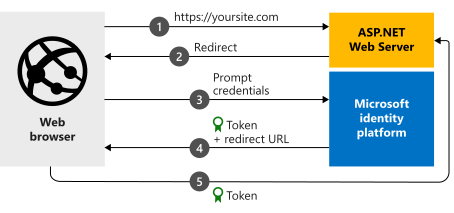

# Quickstart: ASP.NET web app that signs in Azure AD users

> [!div renderon="docs"]
> Welcome! This probably isn't the page you were expecting. While we work on a fix, this link should take you to the right article:
>
> > [Quickstart: ASP.NET web app that signs in users](web-app-quickstart.md?pivots=devlang-aspnet)
> 
> We apologize for the inconvenience and appreciate your patience while we work to get this resolved.

> [!div renderon="portal" id="display-on-portal" class="sxs-lookup"]
> # Quickstart: ASP.NET web app that signs in Azure AD users
>
> In this quickstart, you download and run a code sample that demonstrates an ASP.NET web application that can sign in users with Azure Active Directory (Azure AD) accounts.
> 
> #### Step 1: Configure your application in the Azure portal
> For the code sample in this quickstart to work, enter **https://localhost:44368/** for **Redirect URI**.
> 
> <button id="makechanges" class="nextstepaction configure-app-button"> Make these changes for me </button>
> 
> > [!div id="appconfigured" class="alert alert-info"]
> >  Your application is configured with this attribute.
> 
> #### Step 2: Download the project
> 
> Run the project by using Visual Studio 2019.
> > [!div class="nextstepaction"]
> > <button id="downloadsample" class="download-sample-button">Download the code sample</button>
> 
> [!INCLUDE [active-directory-develop-path-length-tip](../../../includes/active-directory-develop-path-length-tip.md)]
> 
> 
> #### Step 3: Your app is configured and ready to run
> We've configured your project with values of your app's properties.
> 
> 1. Extract the .zip file to a local folder that's close to the root folder. For example, extract to *C:\Azure-Samples*.
>    
>    We recommend extracting the archive into a directory near the root of your drive to avoid errors caused by path length limitations on Windows.
> 2. Open the solution in Visual Studio (*AppModelv2-WebApp-OpenIDConnect-DotNet.sln*).
> 3. Depending on the version of Visual Studio, you might need to right-click the project > **AppModelv2-WebApp-OpenIDConnect-DotNet** and then select **Restore NuGet packages**.
> 4. Open the Package Manager Console by selecting **View** > **Other Windows** > **Package Manager Console**. Then run `Update-Package Microsoft.CodeDom.Providers.DotNetCompilerPlatform -r`.
> 
> > [!NOTE]
> > `Enter_the_Supported_Account_Info_Here`
> 
> ## More information
> 
> This section gives an overview of the code required to sign in users. This overview can be useful to understand how the code works, what the main arguments are, and how to add sign-in to an existing ASP.NET application.
> 
> 
> ### How the sample works
> 
> 
> 
> ### OWIN middleware NuGet packages
> 
> You can set up the authentication pipeline with cookie-based authentication by using OpenID Connect in ASP.NET with OWIN middleware packages. You can install these packages by running the following commands in Package Manager Console within Visual Studio:
> 
> ```powershell
> Install-Package Microsoft.Owin.Security.OpenIdConnect
> Install-Package Microsoft.Owin.Security.Cookies
> Install-Package Microsoft.Owin.Host.SystemWeb
> ```
> 
> ### OWIN startup class
> 
> The OWIN middleware uses a *startup class* that runs when the hosting process starts. In this quickstart, the *startup.cs* file is in the root folder. The following code shows the parameters that this quickstart uses:
> 
> ```csharp
> public void Configuration(IAppBuilder app)
> {
>     app.SetDefaultSignInAsAuthenticationType(CookieAuthenticationDefaults.AuthenticationType);
> 
>     app.UseCookieAuthentication(new CookieAuthenticationOptions());
>     app.UseOpenIdConnectAuthentication(
>         new OpenIdConnectAuthenticationOptions
>         {
>             // Sets the client ID, authority, and redirect URI as obtained from Web.config
>             ClientId = clientId,
>             Authority = authority,
>             RedirectUri = redirectUri,
>             // PostLogoutRedirectUri is the page that users will be redirected to after sign-out. In this case, it's using the home page
>             PostLogoutRedirectUri = redirectUri,
>             Scope = OpenIdConnectScope.OpenIdProfile,
>             // ResponseType is set to request the code id_token, which contains basic information about the signed-in user
>             ResponseType = OpenIdConnectResponseType.CodeIdToken,
>             // ValidateIssuer set to false to allow personal and work accounts from any organization to sign in to your application
>             // To only allow users from a single organization, set ValidateIssuer to true and the 'tenant' setting in Web.> config to the tenant name
>             // To allow users from only a list of specific organizations, set ValidateIssuer to true and use the ValidIssuers parameter
>             TokenValidationParameters = new TokenValidationParameters()
>             {
>                 ValidateIssuer = false // Simplification (see note below)
>             },
>             // OpenIdConnectAuthenticationNotifications configures OWIN to send notification of failed authentications to > the OnAuthenticationFailed method
>             Notifications = new OpenIdConnectAuthenticationNotifications
>             {
>                 AuthenticationFailed = OnAuthenticationFailed
>             }
>         }
>     );
> }
> ```
> 
> > |Where  | Description |
> > |---------|---------|
> > | `ClientId`     | The application ID from the application registered in the Azure portal. |
> > | `Authority`    | The security token service (STS) endpoint for the user to authenticate. It's usually `https://login.microsoftonline.com/{tenant}/v2.0` for the public cloud. In that URL, *{tenant}* is the name of your tenant, your tenant ID, or `common` for a reference to the common endpoint. (The common endpoint is used for multitenant applications.) |
> > | `RedirectUri`  | The URL where users are sent after authentication against the Microsoft identity platform. |
> > | `PostLogoutRedirectUri`     | The URL where users are sent after signing off. |
> > | `Scope`     | The list of scopes being requested, separated by spaces. |
> > | `ResponseType`     | The request that the response from authentication contains an authorization code and an ID token. |
> > | `TokenValidationParameters`     | A list of parameters for token validation. In this case, `ValidateIssuer` is set to `false` to indicate that it can accept sign-ins from any personal, work, or school account type. |
> > | `Notifications`     | A list of delegates that can be run on `OpenIdConnect` messages. |
> 
> 
> > [!NOTE]
> > Setting `ValidateIssuer = false` is a simplification for this quickstart. In real applications, validate the issuer. See the samples to understand how to do that.
> 
> ### Authentication challenge
> 
> You can force a user to sign in by requesting an authentication challenge in your controller:
> 
> ```csharp
> public void SignIn()
> {
>     if (!Request.IsAuthenticated)
>     {
>         HttpContext.GetOwinContext().Authentication.Challenge(
>             new AuthenticationProperties{ RedirectUri = "/" },
>             OpenIdConnectAuthenticationDefaults.AuthenticationType);
>     }
> }
> ```
> 
> > [!TIP]
> > Requesting an authentication challenge by using this method is optional. You'd normally use it when you want a view to be accessible from both authenticated and unauthenticated users. Alternatively, you can protect controllers by using the method described in the next section.
> 
> ### Attribute for protecting a controller or a controller actions
> 
> You can protect a controller or controller actions by using the `[Authorize]` attribute. This attribute restricts access to the controller or actions by allowing only authenticated users to access the actions in the controller. An authentication challenge will then happen automatically when an unauthenticated user tries to access one of the actions or controllers decorated by the `[Authorize]` attribute.
> 
> [!INCLUDE [Help and support](../../../includes/active-directory-develop-help-support-include.md)]
> 
> ## Next steps
> 
> For a complete step-by-step guide on building applications and new features, including a full explanation of this quickstart, try out the ASP.NET tutorial.
> 
> > [!div class="nextstepaction"]
> > [Add sign-in to an ASP.NET web app](tutorial-v2-asp-webapp.md)