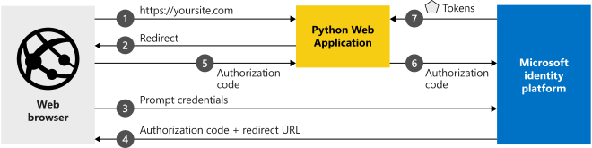

# Quickstart: Add sign-in with Microsoft to a Python web app

> [!div renderon="docs"]
> Welcome! This probably isn't the page you were expecting. While we work on a fix, this link should take you to the right article:
>
> > [Quickstart: Add sign-in with Microsoft to a Python web app](quickstart-web-app-python-sign-in.md)
> 
> We apologize for the inconvenience and appreciate your patience while we work to get this resolved.

> [!div renderon="portal" id="display-on-portal" class="sxs-lookup"]
> # Quickstart: Add sign-in with Microsoft to a Python web app
>
> In this quickstart, you download and run a code sample that demonstrates how a Python web application can sign in users and get an access token to call the Microsoft Graph API. Users with a personal Microsoft Account or an account in any Microsoft Entra organization can sign into the application.
> 
> See [How the sample works](#how-the-sample-works) for an illustration.
> 
> ## Prerequisites
> 
> - An Azure account with an active subscription. [Create an account for free](https://azure.microsoft.com/free/?WT.mc_id=A261C142F).
> - [Python 2.7+](https://www.python.org/downloads/release/python-2713/) or [Python 3+](https://www.python.org/downloads/release/python-364/)
> - [Flask](https://flask.palletsprojects.com/en/3.0.x/), [Flask-Session](https://pypi.org/project/Flask-Session/), [requests](https://github.com/psf/requests/graphs/contributors)
> - [MSAL Python](https://github.com/AzureAD/microsoft-authentication-library-for-python)
> 
> #### Step 1: Configure your application in Azure portal
> 
> For the code sample in this quickstart to work:
> 
> 1. Add a reply URL as `http://localhost:5000/getAToken`.
> 1. Create a Client Secret.
> 1. Add Microsoft Graph API's User.ReadBasic.All delegated permission.
> 
> <button id="makechanges" class="nextstepaction configure-app-button"> Make these changes for me </button>
> 
> > [!div id="appconfigured" class="alert alert-info"]
> >  Your application is configured with this attribute
> 
> #### Step 2: Download your project
> 
> Download the project and extract the zip file to a local folder closer to the root folder - for example, **C:\Azure-Samples**
>
> > [!div class="nextstepaction"]
> > <button id="downloadsample" class="download-sample-button">Download the code sample</button>
> 
> > [!NOTE]
> > `Enter_the_Supported_Account_Info_Here`
> 
> #### Step 3: Run the code sample
> 
> 1. You will need to install MSAL Python library, Flask framework, Flask-Sessions for server-side session management and requests using pip as follows:
> 
>     ```shell
>     pip install -r requirements.txt
>     ```
> 
> 2. Run `app.py` from shell or command line:
> 
>     ```shell
>     python app.py
>     ```
> 
>    > [!IMPORTANT]
>    > This quickstart application uses a client secret to identify itself as confidential client. Because the client secret is added as a plain-text to your project files, for security reasons, it is recommended that you use a certificate instead of a client secret before considering the application as production application. For more information on how to use a certificate, see [these instructions](./certificate-credentials.md).
> 
> ## More information
> 
> ### How the sample works
> 
> 
> ### Getting MSAL
> MSAL is the library used to sign in users and request tokens used to access an API protected by the Microsoft identity platform.
> You can add MSAL Python to your application using Pip.
> 
> ```Shell
> pip install msal
> ```
> 
> ### MSAL initialization
> You can add the reference to MSAL Python by adding the following code to the top of the file where you will be using MSAL:
> 
> ```Python
> import msal
> ```
> 
> [!INCLUDE [Help and support](./includes/error-handling-and-tips/help-support-include.md)]
> 
> ## Next steps
> 
> Learn more about web apps that sign in users in our multi-part scenario series.
> 
> > [!div class="nextstepaction"]
> > [Scenario: Web app that signs in users](scenario-web-app-sign-user-overview.md)
