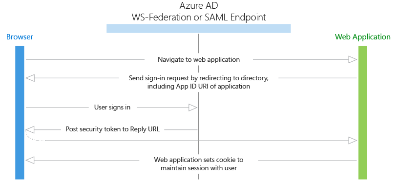

# Web apps

Web apps are applications that authenticate a user in a web browser to a web application. In this scenario, the web application directs the user’s browser to sign them in to Azure AD. Azure AD returns a sign-in response through the user’s browser, which contains claims about the user in a security token. This scenario supports sign-on using the OpenID Connect, SAML 2.0, and WS-Federation protocols.

## Diagram



## Protocol flow

1. When a user visits the application and needs to sign in, they are redirected via a sign-in request to the authentication endpoint in Azure AD.
1. The user signs in on the sign-in page.
1. If authentication is successful, Azure AD creates an authentication token and returns a sign-in response to the application’s Reply URL that was configured in the Azure portal. For a production application, this Reply URL should be HTTPS. The returned token includes claims about the user and Azure AD that are required by the application to validate the token.
1. The application validates the token by using a public signing key and issuer information available at the federation metadata document for Azure AD. After the application validates the token, it starts a new session with the user. This session allows the user to access the application until it expires.

## Code samples

See the code samples for web browser to web application scenarios. And, check back frequently as new samples are added frequently.

## App registration

To register a web app, see [Register an app with the Azure AD v2.0 endpoint](quickstart-v2-register-an-app.md).

* Single tenant - If you are building an application just for your organization, it must be registered in your company’s directory by using the Azure portal.
* Multi-tenan - If you are building an application that can be used by users outside your organization, it must be registered in your company’s directory, but also must be registered in each organization’s directory that will be using the application. To make your application available in their directory, you can include a sign-up process for your customers that enables them to consent to your application. When they sign up for your application, they will be presented with a dialog that shows the permissions the application requires, and then the option to consent. Depending on the required permissions, an administrator in the other organization may be required to give consent. When the user or administrator consents, the application is registered in their directory.

## Token expiration

The user’s session expires when the lifetime of the token issued by Azure AD expires. Your application can shorten this time period if desired, such as signing out users based on a period of inactivity. When the session expires, the user will be prompted to sign in again.

## Web apps that use the Azure AD v2.0 endpoint

For web apps (.NET, PHP, Java, Ruby, Python, Node) that the user accesses through a browser, you can use OpenID Connect for user sign-in. In OpenID Connect, the web app receives an ID token. An ID token is a security token that verifies the user's identity and provides information about the user in the form of claims:

```
// Partial raw ID token
eyJ0eXAiOiJKV1QiLCJhbGciOiJSUzI1NiIsIng1dCI6ImtyaU1QZG1Cd...

// Partial content of a decoded ID token
{
    "name": "John Smith",
    "email": "john.smith@gmail.com",
    "oid": "d9674823-dffc-4e3f-a6eb-62fe4bd48a58"
    ...
}
```

You can learn about all the types of tokens and claims that are available to an app in the [v2.0 tokens reference](v2-id-and-access-tokens.md).

In web server apps, the sign-in authentication flow takes these high-level steps:


You can ensure the user's identity by validating the ID token with a public signing key that is received from the v2.0 endpoint. A session cookie is set, which can be used to identify the user on subsequent page requests.

In addition to simple sign-in, a web server app might need to access another web service, such as a REST API. In this case, the web server app engages in a combined OpenID Connect and OAuth 2.0 flow, by using the [OAuth 2.0 authorization code flow](v2-oauth2-auth-code-flow.md). For more information about this scenario, read about [getting started with web apps and Web APIs](active-directory-v2-devquickstarts-webapp-webapi-dotnet.md).
