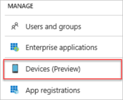
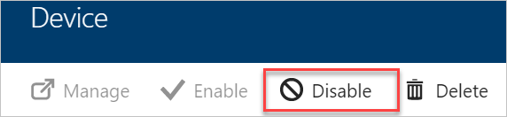

# Managing devices using the Azure portal

With device management in Azure Active Directory (Azure AD), you can ensure that your users are accessing your resources from devices that meet your standards for security and compliance. 

This topic:

- Assumes that you are familiar with the [introduction to device management in Azure Active Directory](device-management-introduction.md)

- Provides you with information about managing your devices using the Azure portal

To manage devices in the Azure portal, you need to click **Devices** in the **Manage** section of the the **Azure Active Directory** blade.

## Configure device settings

To manage your devices using the Azure portal, they need to be either registered or joined to Azure AD. As an administrator, you can fine-tune the process of registering and joining devices by configuring the device settings.

The device settings blade enables you to configure:

- The users who can join devices to Azure AD
- Additional local administrators on Azure AD joined devices
- Whether users can register their devices with Azure AD
- Whether multi-factor authentication is required to join devices
- The maximum number of devices per user
- The users who can sync settings and app data across devices 

## Locate devices

As an administrator, in the Azure portal, you have two options to locate registered and joined devices:

- **All devices** in the **Manage** section of the **Devices** blade  

    

- **Devices** in the **Manage** section of a **User** blade
 
    

With both options, you can get to a view that:

- Enables you to search for devices using the display name as filter.

- Provides you with detailed overview of registered and joined devices

- Enables you to perform common device management tasks
   

## Device management tasks

As an administrator, you can manage the registered or joined devices. This section provides you with information about common device management tasks.

**Manage an Intune device** - If you are an Intune administrator, you can manage devices marked as **Microsoft Intune**. An administrator can see additional device 

**Enable / disable an Azure AD device**

To enable or disable a device, you need to be a global administrator in Azure  AD. Disabling a device prevents a device from accessing your Azure AD resources.  To disable the device, you can either click *…* click the device for additional details.

 

Disabling a device changes the state in the **ENABLED** column to **No**.

**Delete an Azure AD device** - To delete a device, you need to be a global administrator in Azure AD.  
Deleting a device:
 
- Prevents a device from accessing your Azure AD resources 

- Removes all details that are attached to the device, for example, BitLocker keys for Windows devices  

- Represents a non-recoverable activity and is not recommended unless it is required

If a device is managed by another management authority (e.g. Microsoft Intune), please make sure that the device has been wiped / retired before deleting the device in Azure AD.

You can either select “…” to delete the device or click on the device for additional details
 

**View or copy device ID** - You can use a device ID to verify the device ID details on the device or using PowerShell during troubleshooting. To access the copy option, click the device.

  

**View or copy BitLocker keys** - If you are an administrator, you can view and copy the BitLocker keys to help users to recover their encrypted drive. These keys are only available for Windows devices that are encrypted and have their keys stored in Azure AD. You can copy these keys when accessing details of the device.
 

## Next steps

* [Introduction to device management in Azure Active Directory](device-management-introduction.md)

<!--Image references-->
[1]: ./media/active-directory-conditional-access-automatic-device-registration-setup/12.png
