# Managing devices using the Azure portal

With device management in Azure Active Directory (Azure AD), you can ensure that your users are accessing your resources from devices that meet your standards for security and compliance. 

This topic:

- Assumes that you are familiar with the [introduction to device management in Azure Active Directory](device-management-introduction.md)

- Provides you with information about managing your devices using the Azure portal

## Configure device settings

To manage your devices using the Azure portal, your devices need to be either [registered or joined](device-management-introduction.md#getting-devices-under-the-control-of-azure-ad) to Azure AD. As an administrator, you can fine-tune the process of registering and joining devices by configuring the device settings. 

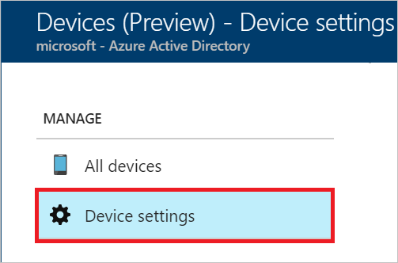

The device settings page enables you to configure:

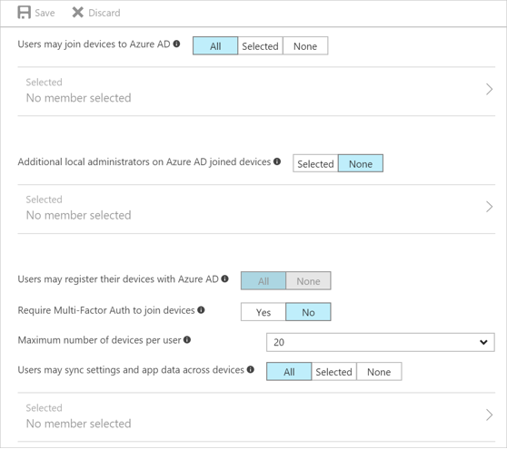

- **Users may join devices to Azure AD** - This setting enables you to select the users who can [join devices](device-management-introduction.m#azure-ad-joined-devices) to Azure AD. The default is **All**.

- **Additional local administrators on Azure AD joined devices** - You can select the users that are granted local administrator rights on a device. Users added here are added to the *Device Administrators* role in Azure AD. Global administrators in Azure AD and device owners are granted local administrator rights by default. 
This option is a premium edition capability available through products such as Azure AD Premium or the Enterprise Mobility Suite (EMS). 

- **Users may register their devices with Azure AD** - You need to configure this setting to allow devices to be [registered](device-management-introduction.md#azure-ad-registered-devices) with Azure AD. If you select **None**, devices are not allowed to register when they are not Azure AD joined or hybrid Azure AD joined. Enrollment with Microsoft Intune or Mobile Device Management (MDM) for Office 365 requires registration. If you have configured either of these services, **ALL** is selected and **NONE** is not available..

- **Require Multi-Factor Auth to join devices** - You can choose whether users are required to provide a second authentication factor to [join](device-management-introduction.md#azure-ad-joined-devices) their device to Azure AD. The default is **No**. We recommend requiring multi-factor authentication when registering a device. Before you enable multi-factor authentication for this service, you must ensure that multi-factor authentication is configured for the users that register their devices. For more information on different Azure multi-factor authentication services, see [getting started with Azure multi-factor authentication](../multi-factor-authentication/multi-factor-authentication-get-started.md). 

- **Maximum number of devices** - This setting enables you to select the maximum number of devices that a user can have in Azure AD. If a user reaches this quota, they are not be able to add additional devices until one or more of the existing devices are removed. The device quote is counted for all devices that are either Azure AD joined or Azure AD registered today. The default value is **20**.

- **Users may sync settings and app data across devices** - By default, this setting is set to **NONE**. Selecting specific users or groups or ALL allows the user’s settings and app data to sync across their Windows 10 devices. Learn more on how sync works in Windows 10.
This option is a premium capability available through products such as Azure AD Premium or the Enterprise Mobility Suite (EMS).
 

## Locate devices

You have two options to locate registered and joined devices:

- **All devices** in the **Manage** section of the **Devices** page  

    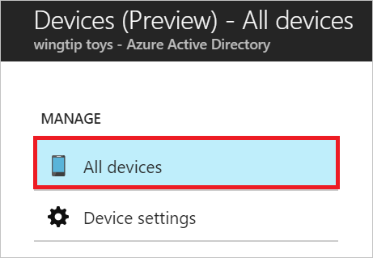

- **Devices** in the **Manage** section of a **User** page
 
    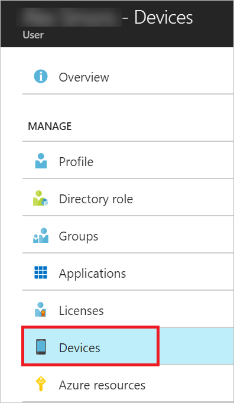

With both options, you can get to a view that:

- Enables you to search for devices using the display name as filter.

- Provides you with detailed overview of registered and joined devices

- Enables you to perform common device management tasks
   

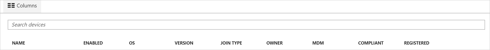

## Device management tasks

As an administrator, you can manage the registered or joined devices. This section provides you with information about common device management tasks.

### Manage an Intune device

If you are an Intune administrator, you can manage devices marked as **Microsoft Intune**. An administrator can see additional device 

### Enable / disable an Azure AD device

To enable / disable a device, you have two options:

- The tasks menu ("...") on the **All devices** page

    

- The toolbar on the **Devices** page

    

**Remarks:**

- You need to be a global administrator in Azure  AD to enable / disable a device. 
- Disabling a device prevents a device from accessing your Azure AD resources. 

### Delete an Azure AD device

To delete a device, you have two options:

- The tasks menu ("...") on the **All devices** page

    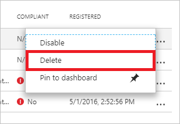

- The toolbar on the **Devices** page

    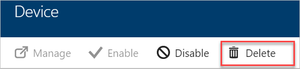

**Remarks:**

- You need to be a global administrator in Azure AD to delete a device.  

- Deleting a device:
 
    - Prevents a device from accessing your Azure AD resources. 

    - Removes all details that are attached to the device, for example, BitLocker keys for Windows devices.  

    - Represents a non-recoverable activity and is not recommended unless it is required.

If a device is managed by another management authority (for example, Microsoft Intune), please make sure that the device has been wiped / retired before deleting the device in Azure AD.

 

### View or copy device ID

You can use a device ID to verify the device ID details on the device or using PowerShell during troubleshooting. To access the copy option, click the device.

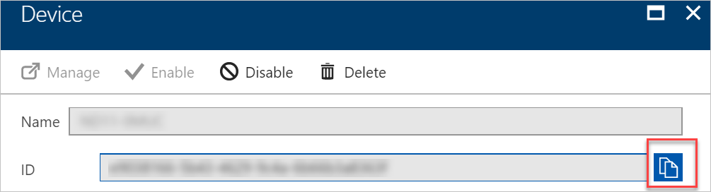
  

### View or copy BitLocker keys

If you are an administrator, you can view and copy the BitLocker keys to help users to recover their encrypted drive. These keys are only available for Windows devices that are encrypted and have their keys stored in Azure AD. You can copy these keys when accessing details of the device.
 

## Audit logs

Device activities are available through the activity logs. This includes activities triggered by the device registration service and by users:

- Device creation and adding owners / users on the device

- Changes to device settings

- Device operations such as deleting or updating a device
 
Your entry point to the auditing data is **Audit logs** in the **Activity** section of the **Devices** page.

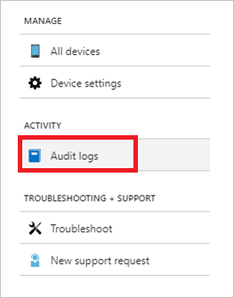

An audit log has a default list view that shows:

- The date and time of the occurrence

- The targets

- The initiator / actor (who) of an activity

- The activity (what)

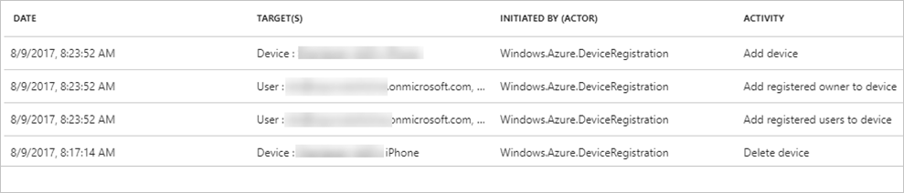

You can customize the list view by clicking **Columns** in the toolbar.
 

To narrow down the reported data to a level that works for you, you can filter the audit data using the following fields:

- Category
- Activity resource type
- Activity
- Date range
- Target
- Initiated By (Actor)

In addition to the filters, you can search for specific entries.

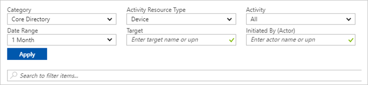

## Next steps

* [Introduction to device management in Azure Active Directory](device-management-introduction.md)

