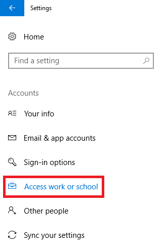
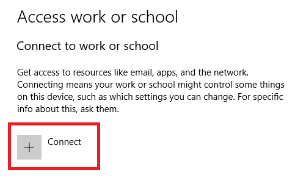

# How to configure Azure Active Directory registered Windows 10 devices

With device management in Azure Active Directory (Azure AD), you can ensure that your users are accessing your resources from devices that meet your standards for security and compliance. For more details, see [Introduction to device management in Azure Active Directory](device-management-introduction.md).

If you want to enable the **Bring Your Own Device (BYOD)** scenario, you can accomplish this by configuring Azure AD registered devices. In Azure AD, you can configure Azure AD registered devices for Windows 10, iOS, Android and macOS. This topic provides you with the related steps for Windows 10 devices. 

## Before you begin

## Registering a device

**To register your Windows 10 device:**

1. In the **Start** menu, click **Settings**.

    

2. Click **Accounts**.

    

3. Click **Access work or school**.

    

4. On the **Access work or school** dialog, click **Connect**.

    

5. On the  **Set up a work or school account dialog**, enter your account name (someone@example.com), and then click **Next**.

**Remarks**

- You might be required to go through multi-factor authentication challenge. This challenge is configurable by your IT administrator.

- Windows registers the device in the organization’s directory in Azure AD

- Azure AD checks whether the device requires mobile device management enrollment and enrolls it if applicable.

- If you are a managed user, Windows takes you to the desktop through the automatic sign-in.

- If you are a federated user, you will be taken to a Windows sign-in screen to enter your credentials.

5. dd Work or School account, and then type in your organizational account.
On the sign-in page for your organization, enter your user name and password, and then click OK.
You will be prompted for a multi-factor authentication challenge. (This challenge is configurable by an IT administrator.)
Azure Active Directory (Azure AD) checks whether the device requires mobile device management enrollment.
Windows registers the device in the organization’s directory in Azure AD and enrolls it in mobile device management, if appropriate.
If you are a managed user, Windows takes you to the desktop through the automatic sign-in.
If you are a federated user, you will be taken to a Windows sign-in screen to enter your credentials.

## Next steps

* [Introduction to device management in Azure Active Directory](device-management-introduction.md)

