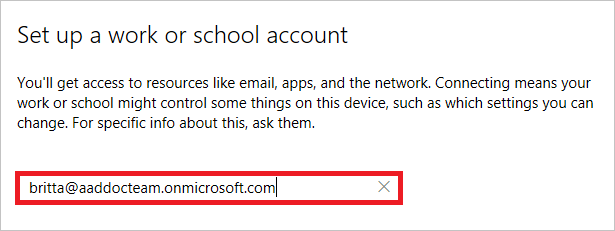
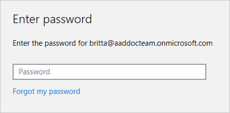

# How to configure Azure Active Directory registered Windows 10 devices

With device management in Azure Active Directory (Azure AD), you can ensure that your users are accessing your resources from devices that meet your standards for security and compliance. For more details, see [Introduction to device management in Azure Active Directory](device-management-introduction.md).

If you want to enable the **Bring Your Own Device (BYOD)** scenario, you can accomplish this by configuring Azure AD registered devices. In Azure AD, you can configure Azure AD registered devices for Windows 10, iOS, Android and macOS. This topic provides you with the related steps for Windows 10 devices. 

## Before you begin

To register a Windows 10 device, the device registration service must be configured to enable you to register devices. In addition to having permission to registering devices in your Azure AD tenant, you must have fewer devices registered than the configured maximum. For more details, see [configure device settings](device-management-azure-portal.md#configure-device-settings).

## What you should know

When registering a device, you should keep the following in mind:

- Windows registers the device in the organization’s directory in Azure AD

- You might be required to go through multi-factor authentication challenge. This challenge is configurable by your IT administrator.

- Azure AD checks whether the device requires mobile device management enrollment and enrolls it if applicable.

- If you are a managed user, Windows takes you to the desktop through the automatic sign-in.

- If you are a federated user, you will be taken to a Windows sign-in screen to enter your credentials.

## Registering a device

This section provides you with the steps to register your Windows 10 device to your Azure AD. If you have successfully registered your device to Azure AD, your **Access work or school** dialog indicates this with a **Work or school account** entry.

**To register your Windows 10 device:**

1. In the **Start** menu, click **Settings**.

    

2. Click **Accounts**.

    

3. Click **Access work or school**.

    

4. On the **Access work or school** dialog, click **Connect**.

    

5. On the  **Set up a work or school account** dialog, enter your account name (e.g.: someone@example.com), and then click **Next**.

    

6. On the  **Enter password** dialog, enter your password, and then click **Next**.

    

7. On the **You're all set** dialog, click **Done**.

    

## Verification

To verify whether a device is joined to an Azure AD, you can review the **Access work or school** dialog on your device.

Alternatively, you can also review device settings on the Azure AD portal.

## Next steps

- For more details, see the [introduction to device management in Azure Active Directory](device-management-introduction.md)

- For more details about managing devices in the Azure AD portal, see the [managing devices using the Azure portal ](device-management-azure-portal.md).

