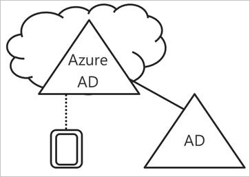
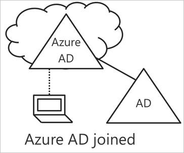
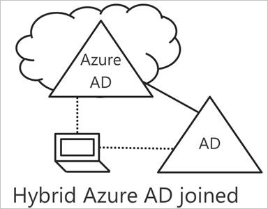

# Introduction to device management in Azure Active Directory

In a mobile-first, cloud-first world, Azure Active Directory (Azure AD) enables single sign-on to devices, apps, and services from anywhere. With the proliferation of devices - including Bring Your Own Device (BYOD), IT professionals are faced with two opposing goals:

- Empower the end users to be productive wherever and whenever
- Protect the corporate assets at any time

Through devices, your users are getting access to your corporate assets. To protect your corporate assets, as an IT administrator, you want to have control over these devices. This enables you to make sure that your users are accessing your resources from devices that meet your standards for security and compliance. 

Device management is also the foundation for [device-based conditional access](active-directory-conditional-access-policy-connected-applications.md). With device-based conditional access, you can ensure that access to resources in your environment is only possible with trusted devices.   

This topic explains how device management in Azure Active Directory works.

## Getting devices under the control of Azure AD

To get a device under the control of Azure AD, you have two options:

- Registering 
- Joining

**Registering** a device to Azure AD enables you to manage a device’s identity. When a device is registered, Azure AD device registration provides the device with an identity that is used to authenticate the device when a user signs-in to Azure AD. You can use the identity to enable or disable a device.

When combined with a mobile device management(MDM) solution such as Microsoft Intune, the device attributes in Azure AD are updated with additional information about the device. This allows you to create conditional access rules that enforce access from devices to meet your standards for security and compliance. For more information on enrolling devices in Microsoft Intune, see Enroll devices for management in Intune .

**Joining** a device is an extension to registering a device. This means, it provides you with all the benefits of registering a device and in addition to this, it also changes the local state of a device. Changing the local state enables your users to sign-in to a device using an organizational work or school account instead of a personal account.

## Azure AD registered devices   

The goal of Azure AD registered devices is to provide you with support for the **Bring Your Own Device (BYOD)** scenario. In this scenario, a user can access your organization’s Azure Active Directory controlled resources using a personal device.  

The access is based on a work or school account that has been entered on the device.  
For example, Windows 10 enables users to add a work or school account to a personal computer, tablet, or phone.  
When a user has added a work or school account, the device is registered with Azure AD and optionally enrolled in the mobile device management (MDM) system that your organization has configured. 
Your organization’s users can add a work or school account to a personal device conveniently:

- When accessing a work application for the first time
- Manually via the **Settings** menu in the case of Windows 10 

You can configure Azure AD registered devices for Windows 10, iOS, Android and macOS.

## Azure AD joined devices

The goal of Azure AD joined devices is to simplify:

- Windows deployments of work-owned devices 
- Access to organizational apps and resources from any Windows device

These goals are accomplished by providing your users with a self-service experience for getting work-owned devices under the control of Azure AD.  
**Azure AD Join** is intended for organizations that are cloud-first / cloud-only. These are typically small- and medium-sized businesses that do not have an on-premises Windows Server Active Directory infrastructure. 

Implementing Azure AD joined devices provides you with the following benefits:

- **Single-Sign-On (SSO)** to your Azure managed SaaS apps and services. Your users don’t see additional authentication prompts when accessing work resources. The SSO functionality is even when they are not connected to the domain network available.

- **Enterprise compliant roaming** of user settings across joined devices. Users don’t need to connect a Microsoft account (for example, Hotmail) to see settings across devices.

- **Access to Windows Store for Business** using AD account. Your users can choose from an inventory of applications pre-selected by the organization.

- **Windows Hello** support for secure and convenient access to work resources.

- **Restriction of access** to apps from only devices that meet compliance policy.

While Azure AD join is primarily intended for organizations that do not have an on-premises Windows Server Active Directory infrastructure, you can certainly also use it in scenarios where:

- You can’t use an on-premises domain join, for example, if you need to get mobile devices such as tablets and phones under control.

- Your users primarily need to access Office 365 or other SaaS apps integrated with Azure AD.

- You want to manage a group of users in Azure AD instead of in Active Directory. This can apply, for example, to seasonal workers, contractors, or students.

- You want to provide joining capabilities to workers in remote branch offices with limited on-premises infrastructure.

You can configure Azure AD joined devices for Windows 10 devices.

## Hybrid Azure AD joined devices

For more than a decade, many organizations have used the domain join to their on-premises Active Directory to enable:

- IT departments to manage work-owned devices from a central location.

- Users to sign in to their devices with their Active Directory work or school accounts. 

Typically, organizations with an on-premises footprint rely on imaging methods to provision devices, and they often use **System Center Configuration Manager (SCCM)** or **group policy (GP)** to manage them.

If your environment has an on-premises AD footprint and you also want benefit from the capabilities provided by Azure Active Directory, you can implement hybrid Azure AD joined devices. These are devices that are both, joined to your on-premises Active Directory and your Azure Active Directory.

You should use Azure AD hybrid joined devices if:

- You have Win32 apps deployed to these devices that use NTLM / Kerberos.

- You require GP or SCCM / DCM to manage devices.

- You want to continue to use imaging solutions to configure devices for your employees.

You can configure Hybrid Azure AD joined devices for Windows 10 and down-level devices such as Windows 8 and Windows 7.

## Summary

With device management in Azure AD, you can: 

- Simplify the process of bringing devices under the control of Azure AD

- Provide your users with an easy to use access to your organization’s cloud-based resources

As a rule of a thumb, you should use:

- Azure AD registered devices for personal devices

- Azure AD joined devices for devices that are not joined to an on-premises AD 

- Hybrid Azure AD joined devices for devices that are joined to an on-premises AD     

## Next steps

- To get an overview of how to manage device in the Azure portal, see [managing devices using the Azure portal](device-management-azure-portal.md)

- To learn more about device-based conditional access, see [configure Azure Active Directory device-based conditional access policies](active-directory-conditional-access-policy-connected-applications.md).

- To setup:
    - Azure Active Directory registered Windows 10 devices, see [how to configure Azure Active Directory registered Windows 10 devices](device-management-azuread-registered-devices-windows10-setup.md)
    - Azure Active Directory joined devices, see [how to configure Azure Active Directory joined devices](device-management-azuread-joined-devices-setup.md)
    - Hybrid Azure AD joined devices, see [how to configure hybrid Azure Active Directory joined devices](device-management-hybrid-azuread-joined-devices-setup.md).

