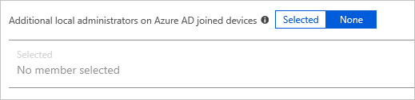

# How to manage the local administrators group on Azure AD joined devices

To manage a Windows device, you need to be a member of the local administrators group. As part of the Azure Active Directory (Azure AD) join process, Azure AD updates the membership of this group on a device. You can customize the membership update to satisfy your business requirements. A membership update is, for example, helpful if you want to enable your helpdesk staff to do tasks requiring administrator rights on a device.

This article explains how the local administrators membership update works and how you can customize it during an Azure AD Join. The content of this article doesn't apply to a **hybrid Azure AD joined** devices.

## How it works

When you connect a Windows device with Azure AD using an Azure AD join, Azure AD adds the following security principals to the local administrators group on the device:

- The Azure AD global administrator role
- The Azure AD device administrator role 
- The user performing the Azure AD join   

By adding Azure AD roles to the local administrators group, you can update the users that can manage a device anytime in Azure AD without modifying anything on the device. Currently, you cannot assign groups to an administrator role.
Azure AD also adds the Azure AD device administrator role to the local administrators group to support the principle of least privilege (PoLP). In addition to the global administrators, you can also enable users that have been *only* assigned the device administrator role to manage a device. 

## Manage the global administrators role

To view and update the membership of the global administrator role, see:

- [View all members of an administrator role in Azure Active Directory](../users-groups-roles/directory-manage-roles-portal.md)
- [Assign a user to administrator roles in Azure Active Directory](../fundamentals/active-directory-users-assign-role-azure-portal.md)

## Manage the device administrator role 

In the Azure portal, you can manage the device administrator role on the **Devices** page. To open the **Devices** page:

1. Sign in to your [Azure portal](https://portal.azure.com) as a global administrator.
1. Search for and select *Azure Active Directory*.
1. In the **Manage** section, click **Devices**.
1. On the **Devices** page, click **Device settings**.

To modify the device administrator role, configure **Additional local administrators on Azure AD joined devices**.  

>[!NOTE]
> This option requires an Azure AD Premium tenant. 

Device administrators are assigned to all Azure AD joined devices. You cannot scope device administrators to a specific set of devices. Updating the device administrator role doesn't necessarily have an immediate impact on the affected users. On devices where a user is already signed into, the privilege elevation takes place when *both* the below actions happen:

- Upto 4 hours have passed for Azure AD to issue a new Primary Refresh Token with the appropriate privileges. 
- User signs out and signs back in, not lock/unlock, to refresh their profile.

>[!NOTE]
> The above actions are not applicable to users who have not signed in to the relevant device previously. In this case, the administrator privileges are applied immediately after their first sign-in to the device. 

## Manage regular users

By default, Azure AD adds the user performing the Azure AD join to the administrator group on the device. If you want to prevent regular users from becoming local administrators, you have the following options:

- [Windows Autopilot](/windows/deployment/windows-autopilot/windows-10-autopilot) -
Windows Autopilot provides you with an option to prevent primary user performing the join from becoming a local administrator. You can accomplish this by [creating an Autopilot profile](/intune/enrollment-autopilot#create-an-autopilot-deployment-profile).
- [Bulk enrollment](/intune/windows-bulk-enroll) - An Azure AD join that is performed in the context of a bulk enrollment happens in the context of an auto-created user. Users signing in after a device has been joined are not added to the administrators group.   

## Manually elevate a user on a device 

In addition to using the Azure AD join process, you can also manually elevate a regular user to become a local administrator on one specific device. This step requires you to already be a member of the local administrators group. 

Starting with the **Windows 10 1709** release, you can perform this task from **Settings -> Accounts -> Other users**. Select **Add a work or school user**, enter the user's UPN under **User account** and select *Administrator* under **Account type**  
 
Additionally, you can also add users using the command prompt:

- If your tenant users are synchronized from on-premises Active Directory, use `net localgroup administrators /add "Contoso\username"`.
- If your tenant users are created in Azure AD, use `net localgroup administrators /add "AzureAD\UserUpn"`

## Considerations 

You cannot assign groups to the device administrator role, only individual users are allowed.

Device administrators are assigned to all Azure AD Joined devices. They can't be scoped to a specific set of devices.

When you remove users from the device administrator role, they still have the local administrator privilege on a device as long as they are signed in to it. The privilege is revoked during their next sign-in when a new primary refresh token is issued. This revocation, similar to the privilege elevation, could take upto 4 hours.

## Next steps

- To get an overview of how to manage device in the Azure portal, see [managing devices using the Azure portal](device-management-azure-portal.md)
- To learn more about device-based Conditional Access, see [configure Azure Active Directory device-based Conditional Access policies](../conditional-access/require-managed-devices.md).
