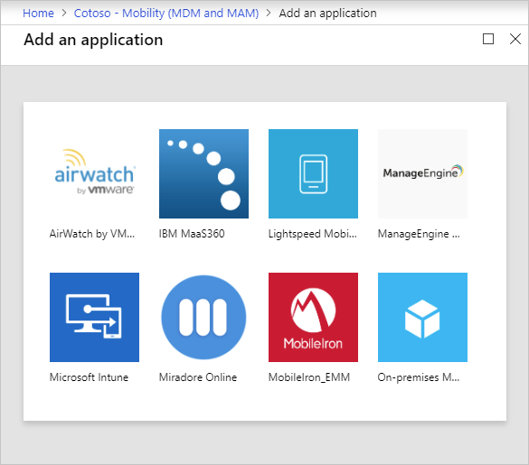

# How to: Plan your Azure AD join implementation

Azure AD join allows you to join devices directly to Azure AD without the need to join to on-premises Active Directory while keeping your users productive and secure. Azure AD join is enterprise-ready for both at-scale and scoped deployments.   

This article provides you with the information you need to plan your Azure AD join implementation.
 
## Prerequisites

This article assumes that you are familiar with the [Introduction to device management in Azure Active Directory](../device-management-introduction.md).

## Plan your implementation

To plan your Azure AD join implementation, you should familiarize yourself with:

|   |   |
|---|---|
|![Check][1]|Review your scenarios|
|![Check][1]|Review your identity infrastructure|
|![Check][1]|Assess your device management|
|![Check][1]|Understand considerations for applications and resources|
|![Check][1]|Understand your provisioning options|
|![Check][1]|Configure enterprise state roaming|
|![Check][1]|Configure Conditional Access|

## Review your scenarios 

While Hybrid Azure AD join may be preferred for certain scenarios, Azure AD join enables you to transition towards a cloud-first model with Windows. If you are planning to modernize your devices management and reduce device-related IT costs, Azure AD join provides a great foundation towards achieving those objectives.  
 
You should consider Azure AD join if your goals align with the following criteria:

- You are adopting Microsoft 365 as the productivity suite for your users.
- You want to manage devices with a cloud device management solution.
- You want to simplify device provisioning for geographically distributed users.
- You plan to modernize your application infrastructure.

## Review your identity infrastructure  

Azure AD join works with both, managed and federated environments.  

### Managed environment

A managed environment can be deployed either through [Password Hash Sync](https://docs.microsoft.com/azure/active-directory/hybrid/how-to-connect-password-hash-synchronization) or [Pass Through Authentication](https://docs.microsoft.com/azure/active-directory/hybrid/how-to-connect-pta-quick-start) with Seamless Single Sign On.

These scenarios don't require you to configure a federation server for authentication.

### Federated environment

A federated environment should have an identity provider that supports both WS-Trust and WS-Fed protocols:

- **WS-Fed:** This protocol is required to join a device to Azure AD.
- **WS-Trust:** This protocol is required to sign in to an Azure AD joined device. 

If your identity provider does not support these protocols, Azure AD join does not work natively. Beginning with  Windows 10 1809, your users can sign in to an Azure AD joined device with a SAML-based identity provider through [web sign-in on Windows 10](https://docs.microsoft.com/windows/whats-new/whats-new-windows-10-version-1809#web-sign-in-to-windows-10). Currently, web sign-in is a preview feature and is not recommended for production deployments.

### Smartcards and certificate-based authentication

You can't use smartcards or certificate-based authentication to join devices to Azure AD. However, smartcards can be used to sign in to Azure AD joined devices if you have AD FS configured.

**Recommendation:** Implement Windows Hello for Business for strong, password-less authentication to Windows 10 devices.

### User configuration

If you create users in your:

- **On-premises Active Directory**, you need to synchronize them to Azure AD using [Azure AD Connect](https://docs.microsoft.com/azure/active-directory/hybrid/how-to-connect-sync-whatis). 
- **Azure AD**, no additional setup is required.

On-premises UPNs that are different from Azure AD UPNs are not supported on Azure AD joined devices. If your users use an on-premises UPN, you should plan to switch to using their primary UPN in Azure AD.

## Assess your device management

### Supported devices

Azure AD join:

- Is only applicable to Windows 10 devices. 
- Is not applicable to previous versions of Windows or other operating systems. If you have Windows 7/8.1 devices, you must upgrade to Windows 10 to deploy Azure AD join.
- Is not supported on devices with TPM in FIPS mode.
 
**Recommendation:** Always use the latest Windows 10 release to take advantage of updated features.

### Management platform

Device management for Azure AD joined devices is based on an MDM platform such as Intune, and MDM CSPs. Windows 10 has a built-in MDM agent that works with all compatible MDM solutions.

> [!NOTE]
> Group policies are not supported in Azure AD joined devices as they are not connected to on-premises Active Directory. Management of Azure AD joined devices is only possible through MDM

There are two approaches for managing Azure AD joined devices:

- **MDM-only** - A device is exclusively managed by an MDM provider like Intune. All policies are delivered as part of the MDM enrollment process. For Azure AD Premium or EMS customers, MDM enrollment is an automated step that is part of an Azure AD join.
- **Co-management** -  A device is managed by an MDM provider and SCCM. In this approach, the SCCM agent is installed on an MDM-managed device to administer certain aspects.

If you are using group policies, evaluate your MDM policy parity by using the [MDM Migration Analysis Tool (MMAT)](https://github.com/WindowsDeviceManagement/MMAT). 

Review supported and unsupported policies to determine whether you can use an MDM solution instead of Group policies. For unsupported policies, consider the following:

- Are the unsupported policies necessary for Azure AD joined devices or users?
- Are the unsupported policies applicable in a cloud driven deployment?

If your MDM solution is not available through the Azure AD app gallery, you can add it following the process 
outlined in [Azure Active Directory integration with MDM](https://docs.microsoft.com/windows/client-management/mdm/azure-active-directory-integration-with-mdm). 

Through co-management, you can use SCCM to manage certain aspects of your devices while policies are delivered through your MDM platform. Microsoft Intune enables co-management with SCCM. For more information, see [Co-management for Windows 10 devices](https://docs.microsoft.com/sccm/core/clients/manage/co-management-overview). If you use an MDM product other than Intune, please check with your MDM provider on applicable co-management scenarios.

**Recommendation:** Consider MDM only management for Azure AD joined devices.

## Understand considerations for applications and resources

We recommend migrating applications from on-premises to cloud for a better user experience and access control. However, Azure AD joined devices can seamlessly provide access to both, on-premises and cloud applications. For more information, see [How SSO to on-premises resources works on Azure AD joined devices](azuread-join-sso.md).

The following sections list considerations for different types of applications and resources.

### Cloud-based applications

If an application is added to Azure AD app gallery, users get SSO through Azure AD joined devices. No additional configuration is required. Users get SSO on both, Microsoft Edge and Chrome browsers. For Chrome, you need to deploy the [Windows 10 Accounts extension](https://chrome.google.com/webstore/detail/windows-10-accounts/ppnbnpeolgkicgegkbkbjmhlideopiji). 

All Win32 applications that:

- Rely on Web Account Manager (WAM) for token requests also get SSO on Azure AD joined devices. 
- Don't rely on WAM may prompt users for authentication. 

### On-premises web applications

If your apps are custom built and/or hosted on-premises, you need to add them to your browser’s trusted sites to:

- Enable Windows integrated authentication to work 
- Provide a no-prompt SSO experience to users. 

If you use AD FS, see [Verify and manage single sign-on with AD FS](https://docs.microsoft.com/previous-versions/azure/azure-services/jj151809(v%3dazure.100)). 

**Recommendation:** Consider hosting in the cloud (for example, Azure) and integrating with Azure AD for a better experience.

### On-premises applications relying on legacy protocols

Users get SSO from Azure AD joined devices if the device has access to a domain controller. 

**Recommendation:** Deploy [Azure AD App proxy](https://docs.microsoft.com/azure/active-directory/manage-apps/application-proxy) to enable secure access for these applications.

### On-premises network shares

Your users have SSO from Azure AD joined devices when a device has access to an on-premises domain controller.

### Printers

For printers, you need to deploy [hybrid cloud print](https://docs.microsoft.com/windows-server/administration/hybrid-cloud-print/hybrid-cloud-print-deploy) for discovering printers on Azure AD joined devices. 

While printers can't be automatically discovered in a cloud only environment, your users can also use the printers’ UNC path to directly add them. 

###	On-premises applications relying on machine authentication

Azure AD joined devices don't support on-premises applications relying on machine authentication. 

**Recommendation:** Consider retiring these applications and moving to their modern alternatives.

### Remote Desktop Services

Remote desktop connection to an Azure AD joined devices requires the host machine to be either Azure AD joined or Hybrid Azure AD joined. Remote desktop from an unjoined or non-Windows device is not supported. For more information, see [Connect to remote Azure AD joined pc](https://docs.microsoft.com/windows/client-management/connect-to-remote-aadj-pc)

## Understand your provisioning options

You can provision Azure AD join using the following approaches:

- **Self-service in OOBE/Settings** - In the self-service mode, users go through the Azure AD join process either during Windows Out of Box Experience (OOBE) or from Windows Settings. For more information, see [Join your work device to your organization's network](https://docs.microsoft.com/azure/active-directory/user-help/user-help-join-device-on-network). 
- **Windows Autopilot** - Windows Autopilot enables pre-configuration of devices for a smoother experience in OOBE to perform an Azure AD join. For more information, see the [Overview of Windows Autopilot](https://docs.microsoft.com/windows/deployment/windows-autopilot/windows-10-autopilot). 
- **Bulk enrollment** - Bulk enrollment enables an administrator driven Azure AD join by using a bulk provisioning tool to configure devices. For more information, see [Bulk enrollment for Windows devices](https://docs.microsoft.com/intune/windows-bulk-enroll).
 
Here’s a comparison of these three approaches 
 
|   | Self-service setup | Windows Autopilot | Bulk enrollment |
| --- | --- | --- | --- |
| Require user interaction to set up | Yes | Yes | No |
| Require IT effort | No | Yes | Yes |
| Applicable flows | OOBE & Settings | OOBE only | OOBE only |
| Local admin rights to primary user | Yes, by default | Configurable | No |
| Require device OEM support | No | Yes | No |
| Supported versions | 1511+ | 1709+ | 1703+ |
 
Choose your deployment approach or approaches by reviewing the table above and reviewing the following considerations for adopting either approach:  

- Are your users tech savvy to go through the setup themselves? 
   - Self-service can work best for these users. Consider Windows Autopilot to enhance the user experience.  
- Are your users remote or within corporate premises? 
   - Self-service or Autopilot work best for remote users for a hassle-free setup. 
- Do you prefer a user driven or an admin-managed configuration? 
   - Bulk enrollment works better for admin driven deployment to set up devices before handing over to users.     
- Do you purchase devices from 1-2 OEMS, or do you have a wide distribution of OEM devices?  
   - If purchasing from limited OEMs who also support Autopilot, you can benefit from tighter integration with Autopilot. 

## Configure your device settings

The Azure portal allows you to control the deployment of Azure AD joined devices in your organization. To configure the related settings, on the **Azure Active Directory page**, select `Devices > Device settings`.

### Users may join devices to Azure AD

Set this option to **All** or **Selected** based on the scope of your deployment and who you want to allow to setup an Azure AD joined device. 

### Additional local administrators on Azure AD joined devices

Choose **Selected** and selects the users you want to add to the local administrators’ group on all Azure AD joined devices. 

### Require multi-factor Auth to join devices

Select **“Yes** if you require users to perform MFA while joining devices to Azure AD. For the users joining devices to Azure AD using MFA, the device itself becomes a 2nd factor.

## Configure your mobility settings

Before you can configure your mobility settings, you may have to add an MDM provider, first.

**To add an MDM provider**:

1. On the **Azure Active Directory page**, in the **Manage** section, click `Mobility (MDM and MAM)`. 
1. Click **Add application**.
1. Select your MDM provider from the list.

   

Select your MDM provider to configure the related settings. 

### MDM user scope

Select **Some** or **All** based on the scope of your deployment. 

Based on your scope, one of the following happens: 

- **User is in MDM scope**: If you have an Azure AD Premium subscription, MDM enrollment is automated along with Azure AD join. All scoped users must have an appropriate license for your MDM. If MDM enrollment fails in this scenario, Azure AD join will also be rolled back.
- **User is not in MDM scope**: If users are not in MDM scope, Azure AD join completes without any MDM enrollment. This results in an unmanaged device.

### MDM URLs

There are three URLs that are related to your MDM configuration:

- MDM terms of use URL
- MDM discovery URL 
- MDM compliance URL

Each URL has a predefined default value. If these fields are empty, please contact your MDM provider for more information.

### MAM settings

MAM does not apply to Azure AD join. 

## Configure enterprise state roaming

If you want to enable state roaming to Azure AD so that users can sync their settings across devices, see [Enable Enterprise State Roaming in Azure Active Directory](https://docs.microsoft.com/azure/active-directory/devices/enterprise-state-roaming-enable). 

**Recommendation**: Enable this setting even for hybrid Azure AD joined devices.

## Configure Conditional Access

If you have an MDM provider configured for your Azure AD joined devices, the provider flags the device as compliant as soon as the device is under management. 

You can use this implementation to [require managed devices for cloud app access with Conditional Access](../conditional-access/require-managed-devices.md).

## Next steps

> [!div class="nextstepaction"]
> [Join a new Windows 10 device with Azure AD during a first run](azuread-joined-devices-frx.md)
> [Join your work device to your organization's network](https://docs.microsoft.com/azure/active-directory/user-help/user-help-join-device-on-network)

<!--Image references-->
[1]: ./media/azureadjoin-plan/12.png
