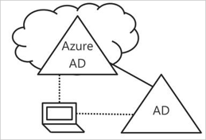
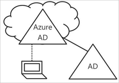

# Hybrid Azure AD joined devices

For more than a decade, many organizations have used the domain join to their on-premises Active Directory to enable:

- IT departments to manage work-owned devices from a central location.
- Users to sign in to their devices with their Active Directory work or school accounts.

Typically, organizations with an on-premises footprint rely on imaging methods to provision devices, and they often use **System Center Configuration Manager (SCCM)** or **group policy (GP)** to manage them.

If your environment has an on-premises AD footprint and you also want benefit from the capabilities provided by Azure Active Directory, you can implement hybrid Azure AD joined devices. These are devices that are joined to your on-premises Active Directory and registered with your Azure Active Directory.

You should use Azure AD hybrid joined devices if:

- You have Win32 apps deployed to these devices that rely on Active Directory machine authentication.
- You require GP to manage devices.
- You want to continue to use imaging solutions to configure devices for your employees.

You can configure Hybrid Azure AD joined devices for Windows 10 and down-level devices such as Windows 8 and Windows 7.

## Azure AD joined devices

The goal of Azure AD joined devices is to simplify:

- Windows deployments of work-owned devices
- Access to organizational apps and resources from any Windows device
- Cloud-based management of work-owned devices
- Users to sign in to their devices with their Azure AD or synced Active Directory work or school accounts.

Azure AD Join can be deployed by using any of the following methods:

- [Windows Autopilot](https://docs.microsoft.com/windows/deployment/windows-autopilot/windows-10-autopilot)
- [Bulk deployment](https://docs.microsoft.com/intune/windows-bulk-enroll)
- [Self-service experience](azuread-joined-devices-frx.md)
