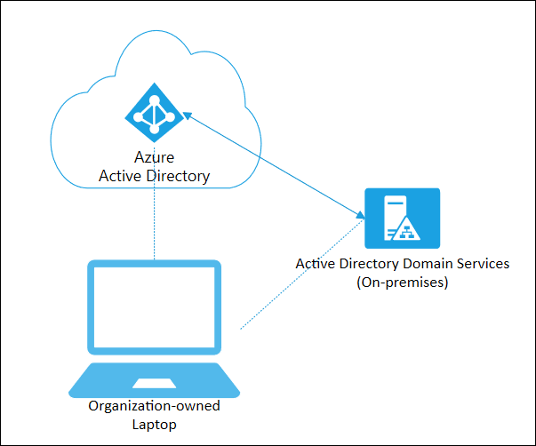

# Hybrid Azure AD joined devices

For more than a decade, many organizations have used the domain join to their on-premises Active Directory to enable:

- IT departments to manage work-owned devices from a central location.
- Users to sign in to their devices with their Active Directory work or school accounts.

Typically, organizations with an on-premises footprint rely on imaging methods to provision devices, and they often use **Configuration Manager** or **group policy (GP)** to manage them.

If your environment has an on-premises AD footprint and you also want benefit from the capabilities provided by Azure Active Directory, you can implement hybrid Azure AD joined devices. These devices, are devices that are joined to your on-premises Active Directory and registered with your Azure Active Directory.

| Hybrid Azure AD Join | Description |
| --- | --- |
| **Definition** | Joined to on-premises AD and Azure AD requiring organizational account to sign in to the device |
| **Primary audience** | Suitable for hybrid organizations with existing on-premises AD infrastructure |
|   | Applicable to all users in an organization |
| **Device ownership** | Organization |
| **Operating Systems** | Windows 10, 8.1 and 7 |
|   | Windows Server 2008/R2, 2012/R2, 2016 and 2019 |
| **Provisioning** | Windows 10, Windows Server 2016/2019 |
|   | Domain join by IT and autojoin via Azure AD Connect or ADFS config |
|   | Domain join by Windows Autopilot and autojoin via Azure AD Connect or ADFS config |
|   | Windows 8.1, Windows 7, Windows Server 2012 R2, Windows Server 2012, and Windows Server 2008 R2 - Require MSI |
| **Device sign in options** | Organizational accounts using: |
|   | Password |
|   | Windows Hello for Business for Win10 |
| **Device management** | Group Policy |
|   | Configuration Manager standalone or co-management with Microsoft Intune |
| **Key capabilities** | SSO to both cloud and on-premises resources |
|   | Conditional Access through Domain join or through Intune if co-managed |
|   | Self-service Password Reset and Windows Hello PIN reset on lock screen |
|   | Enterprise State Roaming across devices |

## Scenarios

Use Azure AD hybrid joined devices if:

- You have Win32 apps deployed to these devices that rely on Active Directory machine authentication.
- You want to continue to use Group Policy to manage device configuration.
- You want to continue to use existing imaging solutions to deploy and configure devices.
- You must support down-level Windows 7 and 8.1 devices in addition to Windows 10

## Next steps

- [Plan your hybrid Azure AD join implementation](hybrid-azuread-join-plan.md)
- [Manage device identities using the Azure portal](device-management-azure-portal.md)
- [Manage stale devices in Azure AD](manage-stale-devices.md)
