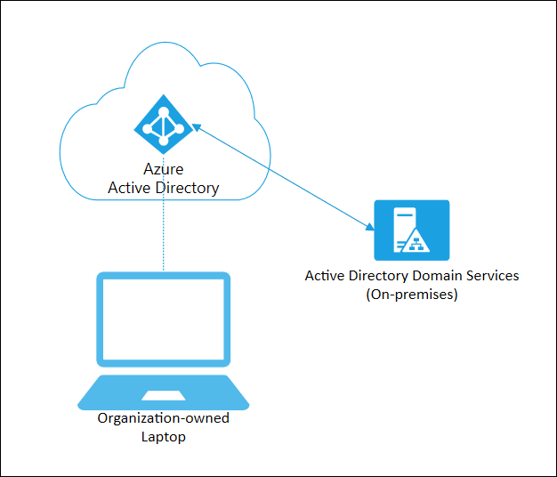

# Azure AD joined devices

Azure AD join is intended for organizations that want to be cloud-first or cloud-only. Any organization can deploy Azure AD joined devices no matter the size or industry. Azure AD join works even in a hybrid environment, enabling access to both cloud and on-premises apps and resources.

| Azure AD Join | Description |
| --- | --- |
| **Definition** | Joined only to Azure AD requiring organizational account to sign in to the device |
| **Primary audience** | Suitable for both cloud-only and hybrid organizations. |
|   | Applicable to all users in an organization |
| **Device ownership** | Organization |
| **Operating Systems** | All Windows 10 devices |
| **Provisioning** | Self-service: Windows OOBE or Settings |
|   | Bulk enrollment |
|   | Windows Autopilot |
| **Device sign in options** | Organizational accounts using: |
|   | Password |
|   | Windows Hello for Business |
|   | FIDO2.0 security keys (preview) |
| **Device management** | Mobile Device Management (example: Microsoft Intune) |
|   | Co-management with Microsoft Intune and Microsoft Endpoint Configuration Manager |
| **Key capabilities** | SSO to both cloud and on-premises resources |
|   | Conditional Access through MDM enrollment and MDM compliance evaluation |
|   | Self-service Password Reset and Windows Hello PIN reset on lock screen |
|   | Enterprise State Roaming across devices |

Azure AD joined devices are signed in to using an organizational Azure AD account. Access to resources in the organization can be further limited based on that Azure AD account and [Conditional Access policies](../conditional-access/howto-conditional-access-policy-compliant-device.md) applied to the device identity.

Administrators can secure and further control Azure AD joined devices using Mobile Device Management (MDM) tools like Microsoft Intune or in co-management scenarios using Microsoft Endpoint Configuration Manager. These tools provide a means to enforce organization-required configurations like requiring storage to be encrypted, password complexity, software installations, and software updates. Administrators can make organization applications available to Azure AD joined devices using Configuration Manager to [Manage apps from the Microsoft Store for Business and Education](/configmgr/apps/deploy-use/manage-apps-from-the-windows-store-for-business).

Azure AD join can be accomplished using self-service options like the Out of Box Experience (OOBE), bulk enrollment, or [Windows Autopilot](/intune/enrollment-autopilot).

Azure AD joined devices can still maintain single sign-on access to on-premises resources when they are on the organization's network. Devices that are Azure AD joined can still authenticate to on-premises servers like file, print, and other applications.

## Scenarios

While Azure AD join is primarily intended for organizations that do not have an on-premises Windows Server Active Directory infrastructure, you can certainly use it in scenarios where:

- You want to transition to cloud-based infrastructure using Azure AD and MDM like Intune.
- You can’t use an on-premises domain join, for example, if you need to get mobile devices such as tablets and phones under control.
- Your users primarily need to access Office 365 or other SaaS apps integrated with Azure AD.
- You want to manage a group of users in Azure AD instead of in Active Directory. This scenario can apply, for example, to seasonal workers, contractors, or students.
- You want to provide joining capabilities to workers in remote branch offices with limited on-premises infrastructure.

You can configure Azure AD joined devices for Windows 10 devices.

The goal of Azure AD joined devices is to simplify:

- Windows deployments of work-owned devices
- Access to organizational apps and resources from any Windows device
- Cloud-based management of work-owned devices
- Users to sign in to their devices with their Azure AD or synced Active Directory work or school accounts.

Azure AD Join can be deployed by using any of the following methods:

- [Windows Autopilot](/windows/deployment/windows-autopilot/windows-10-autopilot)
- [Bulk deployment](/intune/windows-bulk-enroll)
- [Self-service experience](azuread-joined-devices-frx.md)

## Next steps

- [Plan your Azure AD join implementation](azureadjoin-plan.md)
- [How to manage the local administrators group on Azure AD joined devices](assign-local-admin.md)
- [Manage device identities using the Azure portal](device-management-azure-portal.md)
- [Manage stale devices in Azure AD](manage-stale-devices.md)
