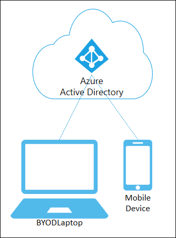

# Azure AD registered devices

The goal of Azure AD registered devices is to provide your users with support for the Bring Your Own Device (BYOD) or mobile device scenarios. In these scenarios, a user can access your organization’s Azure Active Directory controlled resources using a personal device.

|   | Azure AD Registered |
| --- | --- |
| **Definition** | Registered to Azure AD without requiring organizational account to sign in to the device |
| **Primary audience** | Applicable to all users with the following criteria: |
|   | Bring your own device (BYOD) |
|   | Mobile devices |
| **Device ownership** | User or Organization |
| **Operating Systems** | Windows 10, iOS, Android, and MacOS |
| **Provisioning** | Windows 10 – Settings |
|   | iOS/Android – Company Portal or Microsoft Authenticator app |
|   | MacOS – Company Portal |
| **Device sign in options** | End-user local credentials |
|   | Password |
|   | Windows Hello |
|   | PIN |
|   | Biometrics or Pattern for other devices |
| **Device management** | Mobile Device Management (example: Microsoft Intune) |
|   | Mobile Application Management |
| **Key capabilities** | SSO to cloud resources |
|   | Conditional Access when enrolled into Intune |
|   | Conditional Access via App protection policy |
|   | Enables Phone sign in with Microsoft Authenticator app |

Azure AD registered devices are signed in to using a local account like a Microsoft account on a Windows 10 device, but additionally have an Azure AD account attached for access to organizational resources. Access to resources in the organization can be further limited based on that Azure AD account and Conditional Access policies applied to the device identity.

Administrators can secure and further control these Azure AD registered devices using Mobile Device Management (MDM) tools like Microsoft Intune. MDM provides a means to enforce organization-required configurations like requiring storage to be encrypted, password complexity, and security software kept updated. 

Azure AD registration can be accomplished when accessing a work application for the first time or manually using the Windows 10 Settings menu. 

## Scenarios

A user in your organization wants to access tools for email, reporting time-off, and benefits enrollment from their home PC. Your organization has these tools behind a Conditional Access policy that requires access from an Intune compliant device. The user adds their organization account and registers their home PC with Azure AD and the required Intune policies are enforced giving the user access to their resources.

Another user wants to access their organizational email on their personal Android phone that has been rooted. Your company requires a compliant device and has created an Intune compliance policy to block any rooted devices. The employee is stopped from accessing organizational resources on this device.

## Next steps

- [Manage device identities using the Azure portal](device-management-azure-portal.md)
- [Manage stale devices in Azure AD](manage-stale-devices.md)
