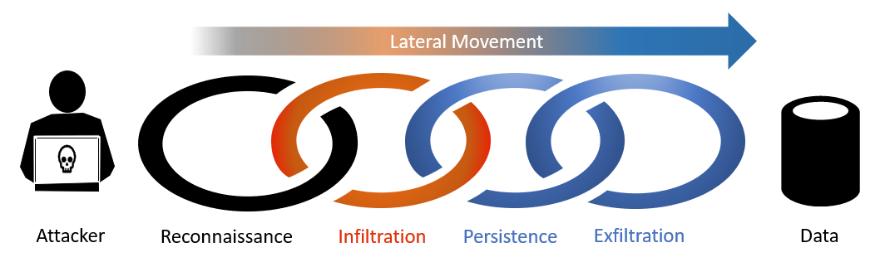
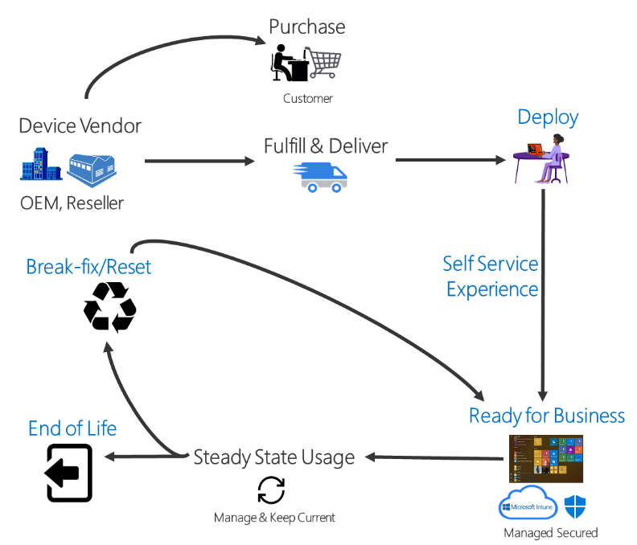
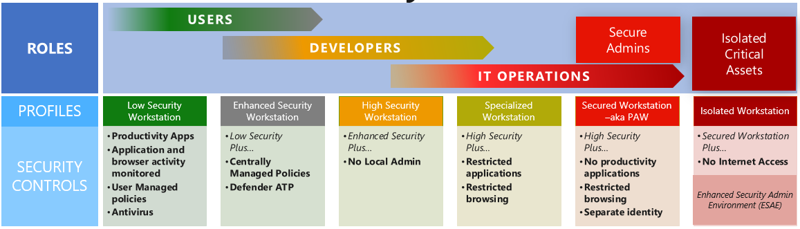
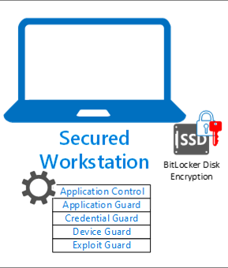

# Understand secure, Azure-managed workstations

Secured, isolated workstations are critically important for the security of sensitive roles like administrators, developers, and critical service operators. If client workstation security is compromised, many security controls and assurances can fail or be ineffective.

This document explains what you need for building a secure workstation, often known as a privileged access workstation (PAW). The article also contains detailed instructions to set up initial security controls. This guidance describes how cloud-based technology can manage the service. It relies on security capabilities that were introduced in Windows 10RS5, Microsoft Defender Advanced Threat Protection (ATP), Azure Active Directory, and Intune.

> [!NOTE]
> This article explains the concept of a secure workstation and its importance. If you are already familiar with the concept and would like to skip to deployment, visit [Deploy a Secure Workstation](https://docs.microsoft.com/azure/active-directory/devices/howto-azure-managed-workstation).

## Why secure workstation access is important

The rapid adoption of cloud services and the ability to work from anywhere has created a new exploitation method. By exploiting weak security controls on devices where administrators work, attackers can gain access to privileged resources.

Privileged misuse and supply chain attacks are among the top five methods that attackers use to breach organizations. They're also the second most commonly detected tactics in incidents reported in 2018 according to the [Verizon Threat report](https://enterprise.verizon.com/resources/reports/dbir/), and the [Security Intelligence Report](https://aka.ms/sir).

Most attackers follow these steps:

1. Reconnaissance to find a way in, often specific to an industry.
1. Analysis to collect information and identify the best way to infiltrate a workstation that is perceived as low value.
1. Persistence to look for a means to move [laterally](https://en.wikipedia.org/wiki/Network_Lateral_Movement).
1. Exfiltration of confidential and sensitive data.

During reconnaissance, attackers frequently infiltrate devices that seem low risk or undervalued. They use these vulnerable devices to locate an opportunity for lateral movement and to find administrative users and devices. After they gain access to privileged user roles, attackers identify high value data and successfully exfiltrate that data.

This document describes a solution that can help protect your computing devices from such lateral attacks. The solution isolates management and services from less valuable productivity devices, breaking the chain before the device that has access to sensitive cloud resources can be infiltrated. The solution uses native Azure services that are part of the Microsoft 365 Enterprise stack:

* Intune for device management and a safe list of applications and URLs
* Autopilot for device setup, deployment, and refresh
* Azure AD for user management, conditional access, and multi-factor authentication
* Windows 10 (current version) for device health attestation and user experience
* Defender ATP for cloud-managed endpoint protection, detection, and response
* Azure AD PIM for managing authorization and just-in-time (JIT) privileged access to resources

## Who benefits from a secure workstation?

All users and operators benefit when using a secure workstation. An attacker who compromises a PC or device can impersonate all cached accounts. When logged in to the device, they might also use credentials and tokens. This risk makes it important to secure devices that are used for privileged roles, including administrative rights. Devices with privileged accounts are targets for lateral movement and privilege escalation attacks. These accounts can be used for a variety of assets such as:

* Administrator of on-premises or cloud-based systems
* Developer workstation for critical systems
* Social media account administrator with high exposure
* Highly sensitive workstation, such as a SWIFT payment terminal
* Workstation handling trade secrets

To reduce risk, you should implement elevated security controls for privileged workstations that make use of these accounts. For more information, see the [Azure Active Directory feature deployment guide](https://docs.microsoft.com/azure/active-directory/fundamentals/active-directory-deployment-checklist-p2), [Office 365 roadmap](https://aka.ms/o365secroadmap), and [Securing Privileged Access roadmap](https://aka.ms/sparoadmap)).

## Why use dedicated workstations?

While it's possible to add security to an existing device, it's better to start with a secure foundation. To put your organization in the best position to maintain a high security level, start with a device you know is secure and implement a set of known security controls.

A growing number of attack vectors through email and web browsing makes it increasingly hard to be sure that a device can be trusted. This guide assumes that a dedicated workstation is isolated from standard productivity, browsing, and email. Removal of productivity, web browsing, and email from a device can have a negative impact on productivity. However, this safeguard is typically acceptable for scenarios where the job tasks don’t explicitly require it and risk of a security incident is high.

> [!NOTE]
> Web browsing here refers to general access to arbitrary websites which can be a high risk activity. Such browsing is distinctly different from using a web browser to access a small number of well-known administrative websites for services like Azure, Office 365, other cloud providers, and SaaS applications.

Containment strategies tighten security by increasing the number and type of controls that deter an attacker from gaining access sensitive assets. The model described in this article uses a tiered privilege design and restricts administrative privileges to specific devices.

## Supply chain management

Essential to a secured workstation is a supply chain solution where you use a trusted workstation called the 'root of trust'. For this solution, the root of trust uses [Microsoft Autopilot](https://docs.microsoft.com/windows/deployment/windows-autopilot/windows-autopilot) technology. To secure a workstation, Autopilot lets you leverage Microsoft OEM-optimized Windows 10 devices. These devices come in a known good state from the manufacturer. Instead of reimaging a potentially insecure device, Autopilot can transform a Windows device into a “business-ready” state. It applies settings and policies, installs apps, and even changes the edition of Windows 10. For example, Autopilot might change a device's Windows installation from Windows 10 Pro to Windows 10 Enterprise so that it can use advanced features.

## Device roles and profiles

This guidance references several security profiles and roles that can help you create more secure solutions for users, developers, and IT personnel. These profiles balance usability and risks for common users that can benefit from an enhanced or secure workstation. The settings configurations provided here are based on industry accepted standards. This guidance shows how to harden Windows 10 and reduce the risks associated with device or user compromise. It does so by using policy and technology to help manage security features and risks.

* **Low Security** – A managed, standard workstation provides a good starting point for most home and small business use. These devices are registered in  Azure AD and managed with Intune. This profile permits users to run any applications and browse any website. An anti-malware solution like [Microsoft Defender](https://www.microsoft.com/windows/comprehensive-security) should be enabled.

* **Enhanced Security** – This entry-level, protected solution is good for home users, small business users, and general developers.

   The enhanced workstation is a policy-based way to increase the security of the low security profile. It provides a secure means to work with customer data while also using productivity tools like email and web browsing. You can use audit policies and Intune to monitor an enhanced workstation for user behavior and profile usage. You deploy the enhanced workstation profile with the Windows10 (1809) script, and it takes advantage of advanced malware protection using [Advanced Threat Protection (ATP)](https://docs.microsoft.com/office365/securitycompliance/office-365-atp).

* **High Security** – The most effective means to reduce the attack surface of a workstation is to remove the ability to self-administer the workstation. Removing local administrative rights is a step that improves security, but it can impact productivity if implemented incorrectly. The high security profile builds on the enhanced security profile with one considerable change: the removal of the local admin. This profile is designed for high profile users: executives, payroll and sensitive data users, approvers for services and processes.

   The high security user demands a more controlled environment while still being able to do activities such as email and web browsing in a simple-to-use experience. The users expect features such as cookies, favorites, and other shortcuts to work. However, these users may not require the ability to modify or debug their device. They also don't need to install drivers. The high security profile is deployed using the High Security - Windows10 (1809) script.

* **Specialized** – Attackers target developers and IT administrators because they can alter systems of interest to the attackers. The specialized workstation expands on the policies of the high security workstation by managing local applications and limiting websites. It also restricts high-risk productivity capabilities such as ActiveX, Java, browser plugins, and other Windows controls. You deploy this profile with the DeviceConfiguration_NCSC - Windows10 (1803) SecurityBaseline script.

* **Secured** – An attacker who compromises an administrative account can cause significant business damage by data theft, data alteration, or service disruption. In this hardened state, the workstation enables all the security controls and policies that restrict direct control of local application management. A secured workstation has no productivity tools so the device more difficult to compromise. It blocks the most common vector for phishing attacks: email and social media.  The secured workstation can be deployed with the Secure Workstation - Windows10 (1809) SecurityBaseline script.

   

   A secure workstation provides an administrator with a hardened workstation that has clear application control and application guard. The workstation uses credential guard, device guard, and exploit guard to protect the host from malicious behavior. All local disks are also encrypted with BitLocker.

* **Isolated** – This custom, offline scenario represents the extreme end of the spectrum. No installation scripts are provided for this case. You might need to manage a business-critical function that requires an unsupported or unpatched legacy operating system. For example, a high value production line or a life-support system. Because security is critical and cloud services are unavailable, you can manage and update these computers manually or with an isolated Active Directory forest architecture such as the Enhanced Security Admin Environment (ESAE). In these circumstances, consider removing all access except basic Intune and ATP health checks.

  * [Intune network communications requirement](https://docs.microsoft.com/intune/network-bandwidth-use)
  * [ATP network communications requirement](https://docs.microsoft.com/azure-advanced-threat-protection/configure-proxy)

## Next steps

[Deploy a secure Azure-managed workstation](howto-azure-managed-workstation.md).
