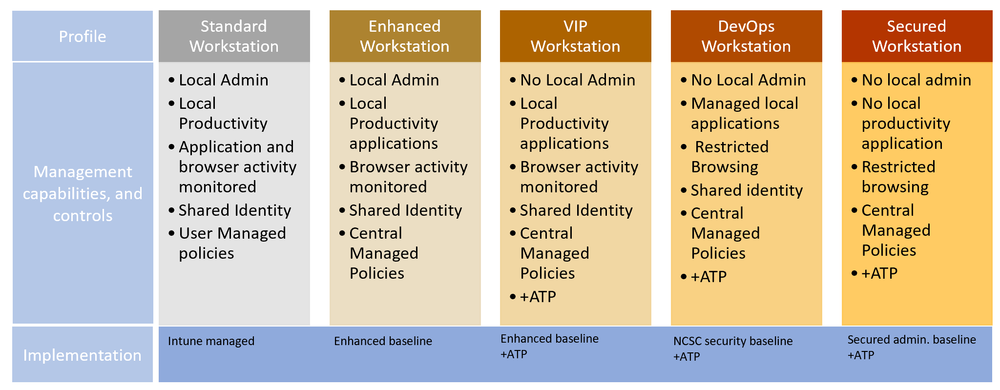

# Why securing workstation access is important?

The rapid adoption of cloud services and the ability to work from anywhere has created a new method for exploitation. Attackers are exploiting weak security controls on devices where administrators work and are able to gain access to privileged resources.

As documented in the [Verizon Threat report](https://enterprise.verizon.com/resources/reports/dbir/), privileged misuse is among the top five mechanisms used to breach organizations, and the second most commonly detected tactic in incidents reported in 2018.

Most attackers follow the path below:

* Start with simple reconnaissance, often specific to an industry, to find a way in
* Analyze collected information to identify the best means to gain access, exfiltrate data, or cause other intended harm
* Access, gather, and cause intended harm
* Exfiltrate and cover tracks

Attackers frequently infiltrate devices that seem low risk or undervalued for reconnaissance. These vulnerable devices are then used to locate an opportunity for lateral movement, find high valued data, and successfully exfiltrate information once they gain privileged user roles.

This document provides a solution to help protect your most sensitive computing devices by isolating management and services to help protect against lateral movement or attacks from less valuable productivity devices. The design helps reduce the ability to successfully execute a breach by breaking the chain prior and prevent infiltration of the device used to manage or access sensitive cloud resources. The solution described will utilize native Azure services that are part of the Microsoft 365 Enterprise stack including:

* Intune for device management, including application and URL whitelisting
* Autopilot for device setup and deployment and refresh
* Azure AD for user management, conditional access, and multi-factor authentication
* Windows 10 (current version) for device health attestation and user experience
* Microsoft Defender Advanced Threat Protection (ATP) for endpoint protection, detection, and response with cloud management
* Azure AD PIM for managing authorization, including Just In Time (JIT) privileged access to resources

## Who benefit from using a secure workstation?

An attacker who compromises a PC or device can do several things including impersonate all cached accounts, and use credentials, and tokens used on that device while they are logged on. This risk makes securing the devices used for administration so important as devices where a privileged account is used are targets for lateral movement and privilege escalation attacks. These accounts may be used for a variety of assets such as:

* Administrators of on-premises and cloud-based systems
* Developer workstations for critical systems
* Social media accounts administrator with high exposure
* Highly sensitive workstations like SWIFT payment terminals
* Workstations handling trade secrets

Microsoft recommends implementing elevated security controls for privileged workstations where these accounts are used to reduce risk. Additional guidance can be found in the [Azure Active Directory feature deployment guide](https://docs.microsoft.com/azure/active-directory/fundamentals/active-directory-deployment-checklist-p2), [Office 365 Roadmap](https://aka.ms/o365secroadmap), and [Securing Privileged Access roadmap](https://aka.ms/sparoadmap)).

## Why dedicated workstations

While it is possible to add security to an existing device, it is better to start with a secure foundation. Starting with a known good device and a set of known security controls puts your organization in the best position to maintain that increased level of security. With the ever growing number of attack vectors allowed by casual email and web browsing, it is increasingly hard to ensure a device can be trusted. This guide works under the assumption a dedicated workstation separated from standard productivity, browsing, and email tasks are completed. Removal of productivity, web browsing, and email from a device can have a negative impact on productivity, but this safeguard is typically acceptable for scenarios where the job tasks don’t explicitly require it and risk of a security incident is high.

> [!NOTE]
> Web browsing here refers to general access to arbitrary websites, which is a high risk distinctly different from using a web browser to access a small number of well-known administrative websites for services like Azure, Office 365, other cloud providers, and SaaS applications.

Containment strategies provide increased security assurances by increasing the number and type of controls an adversary has to overcome in order to access sensitive assets. The model developed here provides containment of administrative privileges to specific devices using a tiered privilege model.

Throughout the guidance, multiple security profiles will be addressed to achieve a more secure solution. These profiles reflect common users in organizations that can benefit from a secure workstation, while balancing usability and risk. The guidance will provide configuration of settings based on industry accepted standards. This guidance is used to illustrate a method in hardening Windows 10 and reducing the risks associated with device or user compromise using policy and technology to help manage security features and risks. We will outline the steps required to achieve a level of hardening called secured workstation.

* Standard – A managed standard workstation provides a good starting point for most home, and simple business use. These devices are Azure AD registered and Intune managed.
* Enhanced – Is an entry level solution for basics of securing a Windows 10 workstation.
   * The Enhanced workstation provides a secure means to ensure that users that require to work with customer data, and must actively do email and web browsing are performed is effectively on the front line and faces high exposure to many common cyberattacks. An Enhanced workstation can be used to audit, and profile use of a workstation by enabling auditing, and logging to Intune. In this profile, the workstation will enable security controls and policies described in the content, and deployed in the Enhanced Workstation - Windows10 (1809) script.
* VIP – Organizational VIPs can reflect executives, as well as high profile users that may occasionally have contact with sensitive data such as payroll, or approval of services, and processes.
   * The VIP user profile demands a higher controlled environment while still being able to perform their productivity activity, such as mail, and web browsing while maintaining a simple to use experience. The users expect features such as cookies, favorites, and other shortcuts available to operate. However these users do not require the ability to modify their device, and will not install drivers, develop code, or write scripts. The deployment is similar to the Enhanced workstation, but enhances the hardening by enabling ATP, and removing local admin rights.
* DevOps – Developers and testers are an attractive target to attackers as these roles can alter systems of interest to the attackers. The DevOps workstation takes the effort deployed in the VIP workstation, and further emphases its security by managing local applications, limiting internet web sites, and restricting productivity capabilities that are high risk such as ActiveX, Java, browser plug in's, and several other known high risk controls on a Windows device. In this profile, the workstation will enable security controls and policies described in the content, and deployed in the DeviceConfiguration_NCSC - Windows10 (1803) SecurityBaseline (60) script.
* Secured – An attacker who can compromise an administrative account can typically cause significant business damage by data theft, data alteration, or service disruption. In this hardened state, the workstation will enable all the security controls and policies described in the content, and deployed in the Secure Workstation - Windows10 (1809) SecurityBaseline (90) script.

## Next steps

[Deploying a secure Azure-managed workstation](howto-azure-managed-workstation.md)