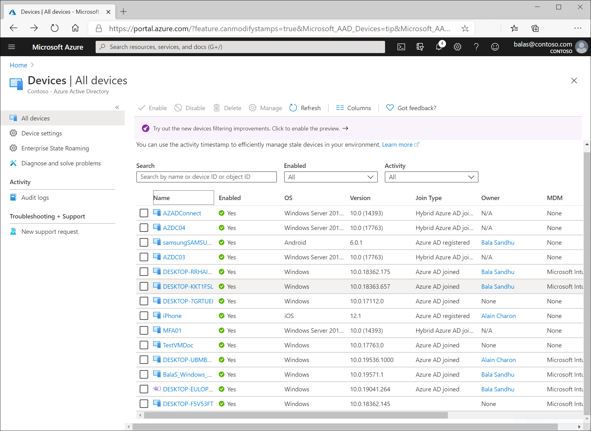
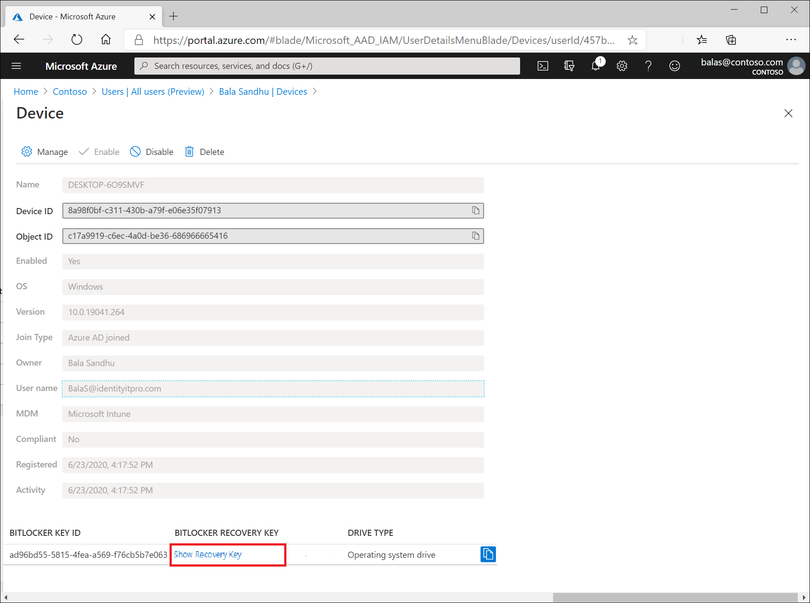
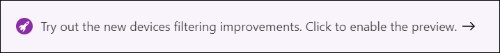
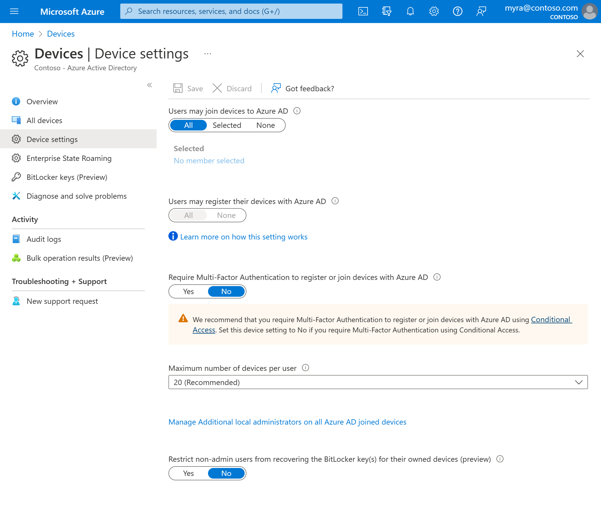

# Manage device identities using the Azure portal

Azure AD provides you with a central place to manage device identities.

The **All devices** page enables you to:

- Identify devices, including:
   - Devices that have been joined or registered in Azure AD.
   - Devices deployed using [Windows Autopilot](/windows/deployment/windows-autopilot/windows-autopilot).
   - Printers using [Universal Print](/universal-print/fundamentals/universal-print-getting-started)
- Perform device identity management tasks like enable, disable, delete, or manage.
   - [Printers](/universal-print/fundamentals/) and [Windows Autopilot](/windows/deployment/windows-autopilot/windows-autopilot) devices have limited management options in Azure AD. They must be managed from their respective admin interfaces.
- Configure your device identity settings.
- Enable or disable Enterprise State Roaming.
- Review device-related audit logs

You can access the devices portal using the following steps:

1. Sign in to the [Azure portal](https://portal.azure.com).
1. Browse to **Azure Active Directory** > **Devices**.

## Manage devices

There are two locations to manage devices in Azure AD:

- **Azure portal** > **Azure Active Directory** > **Devices**
- **Azure portal** > **Azure Active Directory** > **Users** > Select a user > **Devices**

Both options allow administrators the ability to:

- Search for devices.
- See device details including:
    - Device name
    - Device ID
    - OS and Version
    - Join type
    - Owner
    - Mobile device management and compliance
    - BitLocker recovery key
- Perform device identity management tasks like, enable, disable, delete, or manage.
   - [Printers](/universal-print/fundamentals/) and [Windows Autopilot](/windows/deployment/windows-autopilot/windows-autopilot) devices have limited management options in Azure AD. They must be managed from their respective admin interfaces.

> [!TIP]
> - Hybrid Azure AD Joined Windows 10 devices do not have an owner. If you are looking for a device by owner and didn't find it, search by the device ID.
>
> - If you see a device that is "Hybrid Azure AD joined" with a state "Pending" under the REGISTERED column, it indicates that the device has been synchronized from Azure AD connect and is waiting to complete registration from the client. Read more on how to [plan your Hybrid Azure AD join implementation](hybrid-azuread-join-plan.md). Additional information can be found in the article, [Devices frequently asked questions](faq.md).
>
> - For some iOS devices, the device names containing apostrophes can potentially use different characters that look like apostrophes. So searching for such devices is a little tricky - if you are not seeing search results correctly, ensure that the search string contains matching apostrophe character.

### Manage an Intune device

If you are an Intune administrator, you can manage devices where MDM is marked **Microsoft Intune**. If the device is not enrolled with Microsoft Intune, the "Manage" option will be greyed out.

### Enable or disable an Azure AD device

To enable or disable devices, you have two options:

- The toolbar on the **All devices** page after selecting one or more devices.
- The toolbar after drilling down into a specific device.

> [!IMPORTANT]
> - You must be a global administrator or cloud device administrator in Azure AD to enable or disable a device. 
> - Disabling a device prevents a device from successfully authenticating with Azure AD, thereby preventing the device from accessing your Azure AD resources that are protected by device-based Conditional Access or using Windows Hello for Business credentials.
> - Disabling a device will revoke both the Primary Refresh Token (PRT) and any Refresh Tokens (RT) on the device.
> - Printers cannot be enabled or disabled in Azure AD.

### Delete an Azure AD device

To delete a device, you have two options:

- The toolbar on the **All devices** page after selecting one or more devices.
- The toolbar after drilling down into a specific device.

> [!IMPORTANT]
> - You must be assigned the cloud device administrator, Intune administrator, or global administrator role in Azure AD to delete a device.
> - Printers and Windows Autopilot devices cannot be deleted in Azure AD
> - Deleting a device:
>    - Prevents a device from accessing your Azure AD resources.
>    - Removes all details that are attached to the device, for example, BitLocker keys for Windows devices.  
>    - Represents a non-recoverable activity and is not recommended unless it is required.

If a device is managed by another management authority (for example, Microsoft Intune), make sure that the device has been wiped / retired before deleting the device in Azure AD. Review how to [manage stale devices](manage-stale-devices.md) before deleting any devices.

### View or copy device ID

You can use a device ID to verify the device ID details on the device or using PowerShell during troubleshooting. To access the copy option, click the device.

  
### View or copy BitLocker keys

You can view and copy the BitLocker keys to allow users to recover encrypted drives. These keys are only available for Windows devices that are encrypted and have their keys stored in Azure AD. You can find these keys when accessing details of a device by selecting **Show Recovery Key**. Selecting **Show Recovery Key** will generate an audit log, which you can find in the `KeyManagement` category.

To view or copy the BitLocker keys, you need to be either the owner of the device, or a user that has at least one of the following roles assigned:

- Cloud Device Administrator
- Global Administrator
- Helpdesk Administrator
- Intune Service Administrator
- Security Administrator
- Security Reader

### Device list filtering (preview)

Previously, you could only filter the devices list by activity and enabled state. This preview now allows you to filter the devices list by the following attributes on a device:

- Enabled state
- Compliant state
- Join type (Azure AD joined, Hybrid Azure AD joined, Azure AD registered)
- Activity timestamp
- OS
- Device type (Printers, Secure VMs, Shared devices, Registered devices)

To enable the preview filtering functionality in the **All devices** view:

1. Sign in to the [Azure portal](https://portal.azure.com).
1. Browse to **Azure Active Directory** > **Devices**.
1. Select the banner that says, **Try out the new devices filtering improvements. Click to enable the preview.**

You will now have the ability to **Add filters** to your **All devices** view.

## Configure device settings

To manage device identities using the Azure AD portal, those devices need to be either [registered or joined](overview.md) to Azure AD. As an administrator, you can control the process of registering and joining devices by configuring the following device settings.

You must be assigned one of the following roles to view or manage device settings in the Azure portal:

- Global administrator
- Cloud device administrator
- Global reader
- Directory reader

- **Users may join devices to Azure AD** - This setting enables you to select the users who can register their devices as Azure AD joined devices. The default is **All**.

> [!NOTE]
> **Users may join devices to Azure AD** setting is only applicable to Azure AD join on Windows 10.

- **Additional local administrators on Azure AD joined devices** - You can select the users that are granted local administrator rights on a device. These users are added to the *Device Administrators* role in Azure AD. Global administrators in Azure AD and device owners are granted local administrator rights by default. 
This option is a premium edition capability available through products such as Azure AD Premium or the Enterprise Mobility Suite (EMS).
- **Users may register their devices with Azure AD** - You need to configure this setting to allow Windows 10 personal, iOS, Android, and macOS devices to be registered with Azure AD. If you select **None**, devices are not allowed to register with Azure AD. Enrollment with Microsoft Intune or Mobile Device Management (MDM) for Microsoft 365 requires registration. If you have configured either of these services, **ALL** is selected and **NONE** is not available.
- **Require Multi-Factor Auth to join devices** - You can choose whether users are required to provide an additional authentication factor to join their device to Azure AD. The default is **No**. We recommend requiring multi-factor authentication when registering a device. Before you enable multi-factor authentication for this service, you must ensure that multi-factor authentication is configured for the users that register their devices. For more information on different Azure multi-factor authentication services, see [getting started with Azure multi-factor authentication](../authentication/concept-mfa-howitworks.md). 

> [!NOTE]
> **Require Multi-Factor Auth to join devices** setting applies to devices that are either Azure AD joined or Azure AD registered. This setting does not apply to hybrid Azure AD joined devices.

- **Maximum number of devices** - This setting enables you to select the maximum number of Azure AD joined or Azure AD registered devices that a user can have in Azure AD. If a user reaches this quota, they are not be able to add additional devices until one or more of the existing devices are removed. The default value is **50**.

> [!NOTE]
> **Maximum number of devices** setting applies to devices that are either Azure AD joined or Azure AD registered. This setting does not apply to hybrid Azure AD joined devices.

- [Enterprise State Roaming](enterprise-state-roaming-overview.md)

## Audit logs

Device activities are available through the activity logs. These logs include activities triggered by the device registration service and by users:

- Device creation and adding owners / users on the device
- Changes to device settings
- Device operations such as deleting or updating a device

Your entry point to the auditing data is **Audit logs** in the **Activity** section of the **Devices** page.

The audit log has a default list view that shows:

- The date and time of the occurrence
- The targets
- The initiator / actor (who) of an activity
- The activity (what)

:::image type="content" source="./media/device-management-azure-portal/63.png" alt-text="Screenshot of a table in the Activity section of the Devices page that lists the date, target, actor, and activity for four audit logs." border="false":::

You can customize the list view by clicking **Columns** in the toolbar.

:::image type="content" source="./media/device-management-azure-portal/64.png" alt-text="Screenshot showing the toolbar of the Devices page. The Columns item is highlighted." border="false":::

To narrow down the reported data to a level that works for you, you can filter the audit data using the following fields:

- Category
- Activity resource type
- Activity
- Date range
- Target
- Initiated By (Actor)

In addition to the filters, you can search for specific entries.

:::image type="content" source="./media/device-management-azure-portal/65.png" alt-text="Screenshot of audit data filter controls, with category, activity resource type, activity, date range, target, and actor fields and a search field." border="false":::

## Next steps

[How to manage stale devices in Azure AD](manage-stale-devices.md)

[Enterprise State Roaming](enterprise-state-roaming-overview.md)