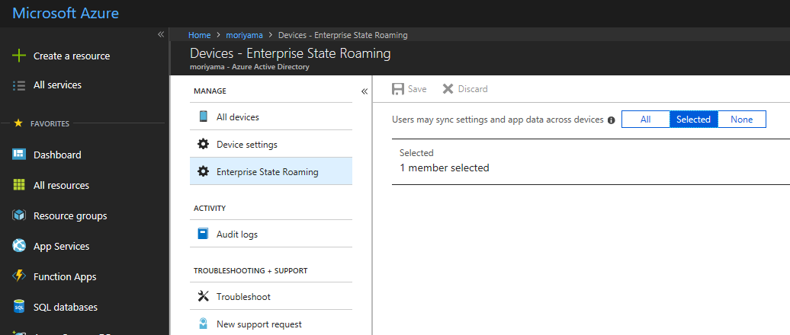
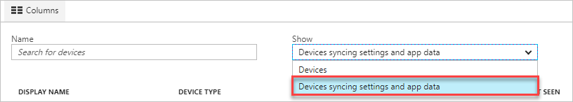

# Enable Enterprise State Roaming in Azure Active Directory
Enterprise State Roaming is available to any organization with an Azure AD Premium or Enterprise Mobility + Security
(EMS) license. For more information on how to get an Azure AD subscription, see the [Azure AD product page](https://azure.microsoft.com/services/active-directory).

When you enable Enterprise State Roaming, your organization is automatically granted a free, limited-use license for Azure Rights Management protection from Azure Information Protection. This free subscription is limited to encrypting and decrypting enterprise settings and application data synced by Enterprise State Roaming. You must have [a paid subscription](https://azure.microsoft.com/pricing/details/information-protection/) to use the full capabilities of the Azure Rights Management service.

## To enable Enterprise State Roaming

1. Sign in to [Azure AD admin center](https://aad.portal.azure.com/).
1. Select **Azure Active Directory** &gt; **Devices** &gt; **Enterprise State Roaming**.
1. Select **Users may sync settings and app data across devices**. For more information, see [how to configure device settings](https://docs.microsoft.com/azure/active-directory/device-management-azure-portal).
  
   
  
For a Windows 10 device to use the Enterprise State Roaming service, the device must authenticate using an Azure AD identity. For devices that are joined to Azure AD, the user’s primary sign-in identity is their Azure AD identity, so no additional configuration is required. For devices that use on-premises Active Directory, the IT admin must [Configure hybrid Azure Active Directory joined devices](https://docs.microsoft.com/azure/active-directory/devices/hybrid-azuread-join-manual-steps). 

## Data storage
Enterprise State Roaming data is hosted in one or more [Azure regions](https://azure.microsoft.com/regions/) that best align with the country/region value set in the Azure Active Directory instance. Enterprise State Roaming data is partitioned based on three major geographic regions: North America, EMEA, and APAC. Enterprise State Roaming data for the tenant is locally located with the geographical region, and is not replicated across regions.  For example:

| Country/region value | has their data hosted in |
| -------------------- | ------------------------ |
| An EMEA country/region such as France or Zambia | One or more of the Azure regions within Europe |
| A North American country/region such as United States or Canada | One or more of the Azure regions within the US |
| An APAC country/region such as Australia or New Zealand | One or more of the Azure regions within Asia |
| South American and Antarctica regions | One or more Azure regions within the US |

The country/region value is set as part of the Azure AD directory creation process and cannot be subsequently modified. If you need more details on your data storage location, file a ticket with [Azure support](https://azure.microsoft.com/support/options/).

## View per-user device sync status
Follow these steps to view a per-user device sync status report.

1. Sign in to [Azure AD admin center](https://aad.portal.azure.com/).
1. Select **Azure Active Directory** &gt; **Users** &gt; **All users**.
1. Select the user, and then select **Devices**.
1. Under **Show**, select **Devices syncing settings and app data** to show sync status.
  
   
  
1. If there are devices syncing for this user, you see the devices as shown here.
  
   

## Data retention
Data synced to the Microsoft cloud using Enterprise State Roaming is retained until it is manually deleted or until the data in question is determined to be stale. 

### Explicit deletion
Explicit deletion is when an Azure admin deletes a user or a directory or otherwise requests explicitly that data is to be deleted.

* **User deletion**: When a user is deleted in Azure AD, the user account roaming data is deleted after 90 to 180 days. 
* **Directory deletion**: Deleting an entire directory in Azure AD is an immediate operation. All the settings data associated with that directory is deleted after 90 to 180 days. 
* **On request deletion**: If the Azure AD admin wants to manually delete a specific user’s data or settings data, the admin can file a ticket with [Azure support](https://azure.microsoft.com/support/). 

### Stale data deletion
Data that has not been accessed for one year (“the retention period”) will be treated as stale and may be deleted from the Microsoft cloud. The retention period is subject to change but will not be less than 90 days. The stale data may be a specific set of Windows/application settings or all settings for a user. For example:

* If no devices access a particular settings collection (for example, an application is removed from the device, or a settings group such as “Theme” is disabled for all of a user’s devices), then that collection becomes stale after the retention period and may be deleted. 
* If a user has turned off settings sync on all their devices, then none of the settings data will be accessed, and all the settings data for that user will become stale and may be deleted after the retention period. 
* If the Azure AD directory admin turns off Enterprise State Roaming for the entire directory, then all users in that directory will stop syncing settings, and all settings data for all users will become stale and may be deleted after the retention period. 

### Deleted data recovery
The data retention policy is not configurable. Once the data is permanently deleted, it is not recoverable. However, The settings data is deleted only from the Microsoft cloud, not from the end-user device. If any device later reconnects to the Enterprise State Roaming service, the settings are again synced and stored in the Microsoft cloud.

## Next steps

* [Enterprise State Roaming overview](enterprise-state-roaming-overview.md)
* [Settings and data roaming FAQ](enterprise-state-roaming-faqs.md)
* [Group Policy and MDM settings for settings sync](enterprise-state-roaming-group-policy-settings.md)
* [Windows 10 roaming settings reference](enterprise-state-roaming-windows-settings-reference.md)
* [Troubleshooting](enterprise-state-roaming-troubleshooting.md)
