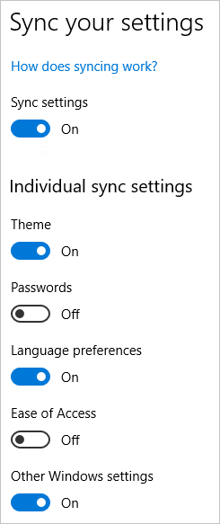
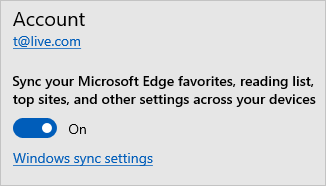
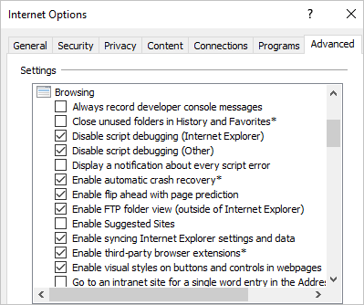

# Windows 10 roaming settings reference

The following is a list of the settings that will be roamed or backed up in Windows 10 or newer. 

## Windows Settings overview

The following settings groups are available for end users to enable/disable settings sync on Windows 10 or newer devices.

- Ease of Access
- Internet Explorer Settings
- Language Preferences
- Microsoft Edge browser setting
- Other Windows Settings
- Passwords

> [!NOTE]
> This article applies to the Microsoft Edge Legacy HTML-based browser launched with Windows 10 in July 2015. The article does not apply to the new Microsoft Edge Chromium-based browser released on January 15, 2020. For more information on the Sync behavior for the new Microsoft Edge, see the article [Microsoft Edge Sync](/deployedge/microsoft-edge-enterprise-sync).

Microsoft Edge browser setting group (favorites, reading list) syncing can be enabled or disabled by end users through Microsoft Edge browser Settings menu option.

For Windows 10 version 1803 or later, Internet Explorer setting group (favorites, typed URLs) syncing can be enabled or disabled by end users through Internet Explorer Settings menu option. 

## Windows Settings details

In the following table, Other entries in the Settings Group column refer to settings that can be disabled by going to Settings > Accounts > Sync your settings > Other Windows settings. 

Internal entries in the Settings Group column refer to settings and apps that can only be disabled from syncing within the app itself or by disabling sync for the entire device using mobile device management (MDM) or Group Policy settings.
Settings that don't roam or sync won't belong to a group.

| Settings | Windows 10 (21H1 or newer) |
| --- | --- |
| Keyboard: turn on toggle keys (off by default) | sync |
| App data: individual apps can sync data | sync backup |
| Microsoft Edge browser: ask me what to do with each download [[1]](#footnote-1) | sync |
| Microsoft Edge browser: block pop-up windows [[1]](#footnote-1) | sync |
| Microsoft Edge browser: cookies preference [[1]](#footnote-1) | sync |
| Microsoft Edge browser: favorites | sync |
| Microsoft Edge browser: favorites bar settings [[1]](#footnote-1) | sync |
| Microsoft Edge browser: let sites save protected media licenses on my device [[1]](#footnote-1) | sync |
| Microsoft Edge browser: offer to save passwords [[1]](#footnote-1) | sync |
| Microsoft Edge browser: reading list | sync |
| Microsoft Edge browser: save form entries [[1]](#footnote-1) | sync |
| Microsoft Edge browser: screen reader setting [[1]](#footnote-1) | sync |
| Microsoft Edge browser: send do not track requests [[1]](#footnote-1) | sync |
| Microsoft Edge browser: show search and site suggestions as I type [[1]](#footnote-1) | sync |
| Microsoft Edge browser: show the home button [[1]](#footnote-1) | sync |
| Microsoft Edge browser: top sites [[1]](#footnote-1) | sync |
| Microsoft Edge browser: typed URLs [[1]](#footnote-1) | sync |
| Internet Explorer: browsing history | sync |
| Internet Explorer: domain suggestions | sync |
| Internet Explorer: excluded URLs | sync |
| Internet Explorer: favorites | sync |
| Internet Explorer: home pages | sync |
| Internet Explorer: open tabs (URL and title) | sync |
| Internet Explorer: reading list | sync |
| Internet Explorer: typed URLs | sync |
| Date, Time, and Region: automatic time (Internet time sync) | sync |
| Date, Time, and Region: country/region | sync |
| Date, Time, and Region: region format (locale) | sync |
| Language: language profile | sync |
| Language: list of keyboards | sync |
| Wi-Fi: Wi-Fi profiles (only WPA) | sync |

## Footnote 1

[1]Minimum supported OS version of Windows Creators Update (Build 15063). 

## Next steps

For an overview, see [enterprise state roaming overview](enterprise-state-roaming-overview.md).
