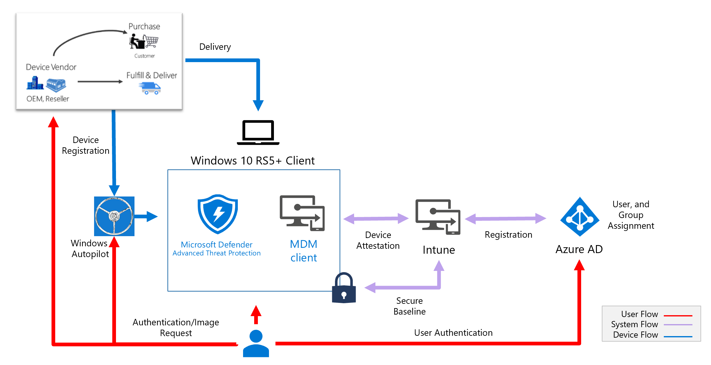

# Deploy a secure, Azure-managed workstation

Now that you [understand secure workstations](concept-azure-managed-workstation.md), it's time to begin the process of deployment. With this guidance, you use defined profiles to create a workstation that's more secure from the start.



Select a profile before deploying the solution. You can use multiple profiles simultaneously in a deployment and assign them with tags or groups.

> [!NOTE]
> Apply any of the profiles as needed by your requirements. You can move to another profile by assigning it in Microsoft Intune.

| Profile | Low | Enhanced | High | Specialized | Secured | Isolated |
| :---: | :---: | :---: | :---: | :---: | :---: | :---: |
| User in Azure AD | Yes | Yes | Yes | Yes | Yes | Yes |
| Intune-managed | Yes | Yes | Yes | Yes | Yes | Yes |
| Device - Azure AD registered | Yes |  |  |  |  | |   |
| Device - Azure AD joined |   | Yes | Yes | Yes | Yes | Yes |
| Intune security baseline applied |   | Yes <br> (Enhanced) | Yes <br> (HighSecurity) | Yes <br> (NCSC) | Yes <br> (Secured) | NA |
| Hardware meets secure Windows 10 Standards |   | Yes | Yes | Yes | Yes | Yes |
| Microsoft Defender ATP enabled |   | Yes  | Yes | Yes | Yes | Yes |
| Removal of admin rights |   |   | Yes  | Yes | Yes | Yes |
| Deployment using Microsoft Autopilot |   |   | Yes  | Yes | Yes | Yes |
| Apps installed only by Intune |   |   |   | Yes | Yes |Yes |
| URLs restricted to approved list |   |   |   | Yes | Yes |Yes |
| Internet blocked (inbound/outbound) |   |   |   |  |  |Yes |

> [!NOTE]
> In the secure workstation guidance **devices** will be assigned with profiles and policies. Users will not have the policies applied to them directly, allowing device sharing (shared devices) to be in effect. If a secure workstation is not shared in your deployment, or individual user policies are needed, assignment of the user policy profiles can be assigned to the user and device. 

## License requirements

The concepts covered in this guide assume you have Microsoft 365 Enterprise E5 or an equivalent SKU. Some of the recommendations in this guide can be implemented with lower SKUs. For more information, see [Microsoft 365 Enterprise licensing](https://www.microsoft.com/licensing/product-licensing/microsoft-365-enterprise).

To automate license provisioning, consider [group-based licensing](../users-groups-roles/licensing-groups-assign.md) for your users.

## Azure Active Directory configuration

Azure Active Directory (Azure AD) manages users, groups, and devices for your administrator workstations. Enable identity services and features with an [administrator account](../users-groups-roles/directory-assign-admin-roles.md).

When you create the secured workstation administrator account, you expose the account to your current workstation. Make sure you use a known safe device to do this initial configuration and all global configuration. To reduce the attack exposure for the first-time experience, consider following the [guidance to prevent malware infections](/windows/security/threat-protection/intelligence/prevent-malware-infection).

Require multi-factor authentication, at least for your administrators. See [Deploy cloud-based MFA](../authentication/howto-mfa-getstarted.md) for implementation guidance.

### Azure AD users and groups

1. From the Azure portal, browse to **Azure Active Directory** > **Users** > **New user**.
1. Create your device administrator by following the steps in the [create user tutorial](/Intune/quickstart-create-user).
1. Enter:

   * **Name** - Secure Workstation Administrator
   * **User name** - `secure-ws-admin@identityitpro.com`
   * **Directory role** - **Limited administrator** and select the **Intune Administrator** role.

1. Select **Create**.

Next, you create two groups: workstation users and workstation devices.

From the Azure portal, browse to **Azure Active Directory** > **Groups** > **New group**.

1. For the workstation users group, you might want to configure [group-based licensing](../users-groups-roles/licensing-groups-assign.md) to automate provisioning of licenses to users.
1. For the workstation users group, enter:

   * **Group type** - Security
   * **Group name** - Secure Workstation Users
   * **Membership type** - Assigned

1. Add your secure workstation administrator user: `secure-ws-admin@identityitpro.com`
1. You can add any other users that will be managing secure workstations.
1. Select **Create**.
1. For the workstation devices group, enter:

   * **Group type** - Security
   * **Group name** - Secure Workstations
   * **Membership type** - Assigned

1. Select **Create**.

### Azure AD device configuration

#### Specify who can join devices to Azure AD

Configure your devices setting in Active Directory to allow your administrative security group to join devices to your domain. To configure this setting from the Azure portal:

1. Go to **Azure Active Directory** > **Devices** > **Device settings**.
1. Choose **Selected** under **Users may join devices to Azure AD**, and then select the "Secure Workstation Users" group.

#### Removal of local admin rights

This method requires that users of the VIP, DevOps, and secure-level workstations have no administrator rights on their machines. To configure this setting from the Azure portal:

1. Go to **Azure Active Directory** > **Devices** > **Device settings**.
1. Select **None** under **Additional local administrators on Azure AD joined devices**.

#### Require multi-factor authentication to join devices

To further strengthen the process of joining devices to Azure AD:

1. Go to **Azure Active Directory** > **Devices** > **Device settings**.
1. Select **Yes** under **Require Multi-Factor Auth to join devices**.
1. Select **Save**.

#### Configure mobile device management

From the Azure portal:

1. Browse to **Azure Active Directory** > **Mobility (MDM and MAM)** > **Microsoft Intune**.
1. Change the **MDM user scope** setting to **All**.
1. Select **Save**.

These steps allow you to manage any device with Intune. For more information, see [Intune Quickstart: Set up automatic enrollment for Windows 10 devices](/Intune/quickstart-setup-auto-enrollment). You create Intune configuration and compliance policies in a future step.

#### Azure AD Conditional Access

Azure AD Conditional Access can help restrict privileged administrative tasks to compliant devices. Predefined members of the **Secure Workstation Users** group are required to perform multi-factor authentication when signing in to cloud applications. A best practice is to exclude emergency access accounts from the policy. For more information, see [Manage emergency access accounts in Azure AD](../users-groups-roles/directory-emergency-access.md).

## Intune configuration

### Configure enrollment status

It's important to ensure that your secure workstation is a trusted clean device. When purchasing new devices, you can insist that they're factory set to [Windows 10 Pro in S mode](/Windows/deployment/Windows-10-pro-in-s-mode), which limits exposure to vulnerabilities during supply chain management. After you receive a device from your supplier, you can use Autopilot to change it from S mode. The following guidance provides details on applying the transformation process.

To ensure that devices are fully configured before use, Intune provides a means to **Block device use until all apps and profiles are installed**.

From the **Azure portal**:

1. Go to **Microsoft Intune** > **Device enrollment** > **Windows enrollment** > **Enrollment Status Page** > **Default** > **Settings**.
1. Set **Show app profile installation progress** to **Yes**.
1. Set **Block device use until all apps and profiles are installed** to **Yes**.

### Create an Autopilot deployment profile

After creating a device group, you must create a deployment profile to configure the Autopilot devices.

In Intune in the Azure portal:

1. Select **Device enrollment** > **Windows enrollment** > **Deployment Profiles** > **Create Profile**.
1. Enter:

   * Name - **Secure workstation deployment profile**.
   * Description - **Deployment of secure workstations**.
   * Set **Convert all targeted devices to Autopilot** to **Yes**. This setting makes sure that all devices in the list get registered with the Autopilot deployment service. Allow 48 hours for the registration to be processed.

1. Select **Next**.

   * For **Deployment mode**, choose **Self-Deploying (Preview)**. Devices with this profile are associated with the user who enrolls the device. User credentials are required to enroll the device. It's essential to note that deploying a device in the **Self-Deploying** mode will allow you to deploy laptops in a shared model. No user assignment will happen until the device is assigned to a user for the first time. As a result, any user policies such as BitLocker will not be enabled until a user assignment is completed. For more information about how to log on to a secured device, see [selected profiles](/intune/device-profile-assign).
   * The **Join to Azure AD as** box should show **Azure AD joined** and be grayed out.
   * Select your Language (Region), User account type **standard**. 

1. Select **Next**.

   * Select a scope tag if you have preconfigured one.

1. Select **Next**.
1. Choose **Assignments** > **Assign to** > **Selected Groups**. In **Select groups to include**, choose **Secure Workstations**.
1. Select **Next**.
1. Select **Create** to create the profile. The Autopilot deployment profile is now available to assign to devices.

Device enrollment in Autopilot provides a different user experience based on device type and role. In our deployment example, we illustrate a model where the secured devices are bulk deployed and can be shared, but when used for the first time, the device is assigned to a user. For more information, see [Intune Autopilot device enrollment](/intune/device-enrollment).

### Configure Windows Update

Keeping Windows 10 up to date is one of the most important things you can do. To maintain Windows in a secure state, you deploy an update ring to manage the pace that updates are applied to workstations. 

This guidance recommends that you create a new update ring and change the following default settings:

In the Azure portal:

1. Go to **Microsoft Intune** > **Software updates** > **Windows 10 Update Rings**.
1. Enter:

   * Name - **Azure-managed workstation updates**
   * Servicing channel - **Windows Insider - Fast**
   * Quality update deferral (days) - **3**
   * Feature update deferral period (days) - **3**
   * Automatic update behavior - **Auto install and reboot without end-user control**
   * Block user from pausing Windows updates - **Block**
   * Require user's approval to restart outside of work hours - **Required**
   * Allow user to restart (engaged restart) - **Required**
   * Transition users to engaged restart after an auto-restart (days) - **3**
   * Snooze engaged restart reminder (days) - **3**
   * Set deadline for pending restarts (days) - **3**

1. Select **Create**.
1. On the **Assignments** tab, add the **Secure Workstations** group.

For more information about Windows Update policies, see [Policy CSP - Update](/windows/client-management/mdm/policy-csp-update).

### Windows Defender ATP Intune integration

Windows Defender ATP and Microsoft Intune work together to help prevent security breaches. They can also limit the impact of breaches. ATP capabilities provide real-time threat detection as well as enable extensive auditing and logging of the end-point devices.

To configure integration of Windows Defender ATP and Intune, go to the Azure portal.

1. Browse to **Microsoft Intune** > **Device compliance** > **Windows Defender ATP**.
1. In step 1 under **Configuring Windows Defender ATP**, select **Connect Windows Defender ATP to Microsoft Intune in the Windows Defender Security Center​**.
1. In the Windows Defender Security Center:

   1. Select **Settings** > **Advanced features**.
   1. For **Microsoft Intune connection**, choose **On**.
   1. Select **Save preferences**.

1. After a connection is established, return to Intune and select **Refresh** at the top.
1. Set **Connect Windows devices version 10.0.15063 and above to Windows Defender ATP** to **On**.
1. Select **Save**.

For more information, see [Windows Defender Advanced Threat Protection](/Windows/security/threat-protection/windows-defender-atp/windows-defender-advanced-threat-protection).

### Finish workstation profile hardening

To successfully complete the hardening of the solution, download and execute the appropriate script. Find the download links for your desired **profile level**:

| Profile | Download location | Filename |
| --- | --- | --- |
| Low Security | N/A | N/A |
| Enhanced Security | https://aka.ms/securedworkstationgit | Enhanced-Workstation-Windows10-(1809).ps1 |
| High Security | https://aka.ms/securedworkstationgit | HighSecurityWorkstation-Windows10-(1809).ps1 |
| Specialized | https://github.com/pelarsen/IntunePowerShellAutomation | DeviceConfiguration_NCSC - Windows10 (1803) SecurityBaseline.ps1 |
| Specialized Compliance* | https://aka.ms/securedworkstationgit | DeviceCompliance_NCSC-Windows10(1803).ps1 |
| Secured | https://aka.ms/securedworkstationgit | Secure-Workstation-Windows10-(1809)-SecurityBaseline.ps1 |

\* Specialized Compliance is a script that enforces the Specialized configuration provided in the NCSC Windows10 SecurityBaseline.

After the script successfully executes, you can make updates to profiles and policies in Intune. The scripts for Enhanced and Secure profiles create policies and profiles for you, but you must assign the policy to your **Secure Workstations** device group.

* Here's where you can find the Intune device configuration profiles created by the scripts: **Azure portal** > **Microsoft Intune** > **Device configuration** > **Profiles**.
* Here's where you can find the Intune device compliance policies created by the scripts: **Azure portal** > **Microsoft Intune** > **Device Compliance** > **Policies**.

To review changes made by the scripts, you can export the profiles. This way you can determine additional hardening that may be required as outlined in the [SECCON documentation](/windows/security/threat-protection/windows-security-configuration-framework/windows-security-configuration-framework).

Run the Intune data export script `DeviceConfiguration_Export.ps1` from the [DeviceConfiguration GiuHub repository](https://github.com/microsoftgraph/powershell-intune-samples/tree/master/DeviceConfiguration) to export all current Intune profiles.

## Additional configurations and hardening to consider

By following the guidance here, you've deployed a secure workstation. However, you also should consider additional controls. For example:

* limit access to alternate browsers
* allow outbound HTTP
* block select websites
* set permissions for running custom PowerShell scripts

### Set rules in the firewall configuration service provider (CSP)

You can make additional changes to the management of both inbound and outbound rules as needed for your permitted and blocked endpoints. As you continue to harden the secure workstation, you can loosen the restriction that denies all inbound and outbound traffic. You might add permitted outbound sites to include common and trusted websites. For more information, see [Firewall configuration service](/Windows/client-management/mdm/firewall-csp).

Restrictive URL traffic management includes:

* Deny All inbound traffic - Set in the Secured workstation profile script.
* Deny All outbound except selected Azure and Microsoft services including Azure Cloud Shell and the ability to allows Azure Password Reset.

```
[HKEY_CURRENT_USER\Software\Microsoft\Windows\CurrentVersion\Internet Settings]
"ProxyEnable"=dword:00000001
"ProxyServer"="127.0.0.1:80"
"ProxyOverride"="*.azure.com;*.azure.net;*.microsoft.com;*.windowsupdate.com;*.microsoftonline.com;*.microsoftonline.cn;*.windows.net;*.windowsazure.com;*.windowsazure.cn;*.azure.cn;*.loganalytics.io;*.applicationinsights.io;*.vsassets.io;*.azure-automation.net;*.visualstudio.com,portal.office.com;*.aspnetcdn.com;*.sharepointonline.com;*.msecnd.net;*.msocdn.com;*.webtrends.com"
"AutoDetect"=dword:00000000
```

If you are looking to provide more granularity to your blocking rules, you can refer to the Spamhaus Project who maintains [the Domain Block List (DBL)](https://www.spamhaus.org/dbl/): a good resource to use as an advanced set of rules to implement for blocking sites.

### Manage local applications

The secure workstation moves to a truly hardened state when local applications are removed, including productivity applications. Here, you add Chrome as the default browser and use Intune to limit a user's ability to modify the browser and its plug-ins.

#### Deploy applications using Intune

In some situations, applications like the Google Chrome browser are required on the secured workstation. The following example provides instructions to install Chrome to devices in the security group **Secure Workstations**.

1. Download the offline installer [Chrome bundle for Windows 64‑bit](https://cloud.google.com/chrome-enterprise/browser/download/).
1. Extract the files and make note of the location of the `GoogleChromeStandaloneEnterprise64.msi` file.
1. In the **Azure portal** browse to **Microsoft Intune** > **Client apps** > **Apps** > **Add**.
1. Under **App type**, choose **Line-of-business**.
1. Under **App package file**, select the `GoogleChromeStandaloneEnterprise64.msi` file from the extracted location and select **OK**.
1. Under **App information**, provide a description and a publisher. Select **OK**.
1. Select **Add**.
1. On the **Assignments** tab, select **Available for enrolled devices** under **Assignment type**.
1. Under **Included Groups**, add the **Secure Workstations** group.
1. Select **OK**, and then select **Save**.

For more information on configuring Chrome settings, see [Manage Chrome Browser with Microsoft Intune](https://support.google.com/chrome/a/answer/9102677).

#### Configuring the company portal for custom apps

In a secured mode, application installation is restricted to the Intune company portal. However, installing the portal requires access to Microsoft Store. In your secured solution, you can make the company portal available to all devices through an offline mode.

An Intune-managed copy of the [Company Portal](/Intune/store-apps-company-portal-app) gives you on-demand access to additional tools that you can push down to users of the secured workstations.

You might need to install Windows 32-bit apps or other apps whose deployment require special preparations. In such cases, the [Microsoft win32 content prep tool](https://github.com/Microsoft/Microsoft-Win32-Content-Prep-Tool) can provide a ready-to-use `.intunewin` format file for installation.

### Conditional Access only allowing secured workstation ability to access Azure portal

Azure AD offers the ability to manage and restrict, who and what can access your Azure cloud management portal. Enabling [Conditional Access](../conditional-access/overview.md) will assure that only your secure workstation can manage or change resources. It's essential that while deploying this feature you consider, if [emergency access](../users-groups-roles/directory-emergency-access.md) functionality can or should be used only for extreme cases and the account managed through policy.

> [!NOTE]
> You will need to create a user group, and include your emergency user that can bypass the Conditional Access policy. For our example we have a security group called **Emergency BreakGlass**

1. Browse to the **Azure portal** > **Microsoft Intune** > **Conditional Access - Policies** > **New Policy**.
1. Provide a **Name** for the policy.
1. Select **User and Groups** > **Select users and groups** 
1. Select **Include** > **Directory roles** > Choose the roles > Global Administrator, Privileged Role Administrator, Privileged Authentication Administrator, Security Administrator, Compliance Administrator, Conditional Access Administrator, Application Administrator, Cloud Application Administrator, Intune Service Administrator
1. Select **Exclude** > Choose **Users and groups** > Select **Select excluded users** > Select your **Emergency BreakGlass** group.
1. Select **Cloud apps or actions** > Select **All cloud apps**
1. Select **Conditions** > Select **Device Platforms** > Choose configure **Yes** > Select **Select Device platforms** Choose **Windows**
1. Select **Access controls** > Select **Grant Access** **Yes** > Choose **Require device to be marked as compliant**. 
1. Select **Enable Policy** > **On**
 
This policy set will ensure that your Administrators must use a compliant Windows device, which is set by Intune, and WDATP. 

Organizations should also consider blocking legacy authentication protocols in their environments. There are multiple ways to accomplish this task, for more information about blocking legacy authentication protocols see the article, [How to: Block legacy authentication to Azure AD with Conditional Access](../conditional-access/block-legacy-authentication.md).

### Use PowerShell to create custom settings

You can also use PowerShell to extend host management capabilities. This example script sets up a default background on the host. It's a capability that's also available through the Azure portal and profiles. The example script serves only to illustrate the PowerShell functionality.

You might need to set up some custom controls and settings on your secure workstations. This example changes the background of the workstation by using Powershell's ability to easily identify the device as a ready-to-use, secure workstation.

The [SetDesktopBackground.ps1](https://gallery.technet.microsoft.com/scriptcenter/Set-Desktop-Image-using-5430c9fb/) script from the Microsoft Scripting Center allows Windows to load this [free, generic background image](https://i.imgur.com/OAJ28zO.png) on startup.

1. Download the script to a local device.
1. Update the customerXXXX and the download location of the background image. In our example, we replace customerXXXX to backgrounds.
1. Browse to the **Azure portal** > **Microsoft Intune** > **Device configuration** > **PowerShell scripts** > **Add**.
1. Provide a **Name** for the script and specify the **Script location**.
1. Select **Configure**.
   1. Set **Run this script using the logged on credentials** to **Yes**.
   1. Select **OK**.
1. Select **Create**.
1. Select **Assignments** > **Select groups**.
   1. Add the security group **Secure Workstations**.
   1. Select **Save**.

## Enroll and validate your first device

1. To enroll your device, you need the following information:
   * **Serial number** - found on the device chassis.
   * **Windows Product ID** - found under **System** > **About** from the Windows Settings menu.
   * You can run [Get-WindowsAutoPilotInfo](https://aka.ms/Autopilotshell) to get a CSV hash file with all of the required information for device enrollment.
   
     Run `Get-WindowsAutoPilotInfo – outputfile device1.csv` to output the information as a CSV file that you can import in to Intune.

     > [!NOTE]
     > The script requires elevated rights. It runs as remote signed. The `Set-ExecutionPolicy -ExecutionPolicy RemoteSigned` command allows the script to run correctly.

   * You can gather this information by signing in to a Windows 10 version 1809 or higher device. Your hardware reseller can also provide this information.
1. In the **Azure portal**, go to **Microsoft Intune** > **Device enrollment** > **Windows enrollment** > **Devices - Manage Windows Autopilot devices**.
1. Select **Import** and choose your CSV file.
1. Add the device to the **Secure Workstations** security group.
1. On the Windows 10 device you wish to configure, go to **Windows Settings** > **Update & Security** > **Recovery**.
   1. Choose **Get started** under **Reset this PC**.
   1. Follow the prompts to reset and reconfigure the device with the profile and compliance policies configured.

After you have configured the device, complete a review and check the configuration. Confirm that the first device is configured correctly before continuing your deployment.

## Assign devices

To assign devices and users, you need to map the [selected profiles](/intune/device-profile-assign) to your security group. All new users who require permissions to the service must be added to the security group as well.

## Using Sentinel and Windows Defender ATP to monitor and respond to security incidents

Monitoring the secure workstation deployment can be accomplished by enabling [Sentinel] and utilizing [Threat and Vulnerability Management](/windows/security/threat-protection/microsoft-defender-atp/next-gen-threat-and-vuln-mgt)
The guidance will not provide exhaustive threat hunting, but provide good common sense efforts to monitor and responds to potential security incidents.

We will use **Azure Sentinel** to: 

* Collect data from Intune, Azure portal, and Azure AD for user and device monitoring
* Help Investigate user and device configuration suspicious activity
* And drive the ability to explore security investigations using WDATP

Sentinel monitoring requires that connectors to your data sources such as Azure AD be set up.

1. In the **Azure portal**, go to **Azure Sentinel (Preview)** > Select **Add**
1. In the **Choose a workspace to add to Azure Sentinel** Select **Create a new workspace**
1. Enter:
   * **Log Analytics Workspace** - 'Secure Workstation Monitoring'
   * **Subscription** - Select your active subscription
   * **Resource Group** - select the ** Create New** > Secure Workstation RG > **Ok**
   * **Location** - Select the location that is geographically best suited for your deployment
   * **Price Tier** - Select **Per GB (2018)**
1. Select **Ok**.

Next we will connect available secure workstation data sources to the monitoring.

1. In the **Azure portal**, go to **Azure Sentinel workspace** > Select **Secure Workstation Monitoring** workspace
1. Select **Data Connectors**
1. Choose **Azure Active Directory** > Open Connector Page > After reviewing the Prerequisite. Proceed to Configuration and select **Connect** for both Azure AD Sign-in Logs, as well as Azure AD Audit Logs.
1. Choose **Azure Activity** > Open Connector Page > After reviewing the Prerequisite. Proceed to Configure Azure Activity Logs > Select your subscription > Select **Connect**

As data is collected by Sentinel you will be able to observe activity by selecting **Azure portal**, go to **Azure Sentinel Overview** 

We will use **Windows Defender ATP (WDATP)** to:

* Continuously observe and monitor vulnerabilities and misconfigurations
* Utilize WDATP to prioritize dynamic threats in the wild
* Drive correlation of vulnerabilities with endpoint detection and response (EDR) alerts
* Use the dashboard to identify machine-level vulnerability during investigations
* Push out remediations to Intune

Configure your [Defender ATP dashboard](https://securitycenter.windows.com/machines). Using guidance at [Threat & Vulnerability Management dashboard overview](/windows/security/threat-protection/microsoft-defender-atp/tvm-dashboard-insights).

## Monitoring Application activity using Microsoft Monitoring Agent (MMA)
Starting at the Specialized workstation, app locker is enabled for monitoring of application activity on a workstation. For the monitoring to be integrated in your Log Analytics workspace, an MMA agent and configuration must be followed. 

> [!NOTE]
> The Specialized workstation profile contains the AppLocker monitoring policies. Deployment of the policies is required for monitoring of application activity on a client

Deploy the MMA agent with Intune PowerShell script

1. Download the setup [script to a local device](https://aka.ms/securedworkstationgit).
1. Update the parameters, **$WorkSpaceID** and **$WorkSpaceKey**
1. Browse to the **Azure portal** > **Microsoft Intune** > **Device configuration** > **PowerShell scripts** > **Add**.
1. Provide a **Name** for the script and specify the **Script location**.
1. Select **Configure**.
   1. Set **Run this script using the logged on credentials** to **Yes**.
   1. Select **OK**.
1. Select **Create**.
1. Select **Assignments** > **Select groups**.
   1. Add the security group **Secure Workstations**.
   1. Select **Save**.

Next you must set up Log Analytics to receive the new logs
1. In the **Azure portal**, go to **Log Analytics Workspace** > Select - 'Secure Workstation Monitoring'
1. Select **Advanced settings** > **Data** > **Windows Event Logs**
1. In **Collect events from the following event logs** 
1. Enter:
   * 'Microsoft-Windows-AppLocker/EXE and DLL' > Unselect **Informational**
   * 'Microsoft-Windows-AppLocker/MSI and Script' > Unselect **Informational**
   * 'Microsoft-Windows-AppLocker/Packaged app-Deployment' > Unselect **Informational**
   * 'Microsoft-Windows-AppLocker/Packaged app-Execution' > Unselect **Informational**
1. Select **Save**

Application logging will be available in your selected Log Analytics workspace.

## Monitoring

* Learn how to [Detect threats with Azure Sentinel](/azure/sentinel/tutorial-detect-threats)
* [Investigate incidents with Azure Sentinel](/azure/sentinel/tutorial-investigate-cases)
* [Set up automated threat responses in Azure Sentinel](/azure/sentinel/tutorial-respond-threats-playbook)
* Understand how to review your [Exposure Score](/windows/security/threat-protection/microsoft-defender-atp/tvm-exposure-score)
* Review [Security recommendation](/windows/security/threat-protection/microsoft-defender-atp/tvm-security-recommendation)
* Manage security [Remediations](/windows/security/threat-protection/microsoft-defender-atp/tvm-remediation)
* Manage [endpoint detection and response](/windows/security/threat-protection/microsoft-defender-atp/overview-endpoint-detection-response)
* Monitor profiles with [Intune profile monitoring](/intune/device-profile-monitor).

## Next steps

* Learn more about [Microsoft Intune](/intune/index).
* Understand [Azure AD](../index.yml).
* Work with [Microsoft Defender Advanced Threat Protection](/windows/security/threat-protection/microsoft-defender-atp/microsoft-defender-advanced-threat-protection)
* Discover [Azure Sentinel](/azure/sentinel/)
