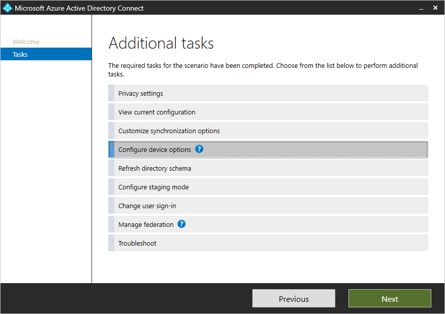
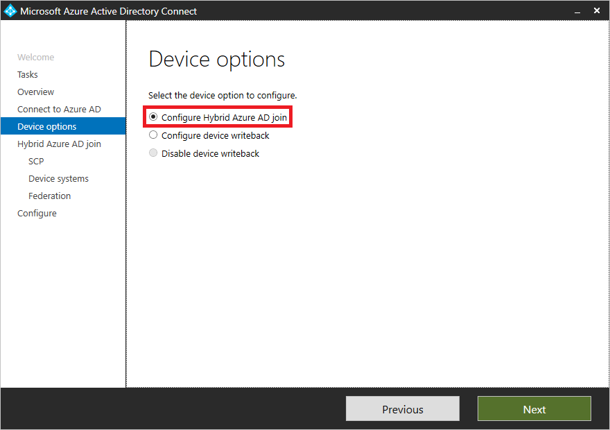
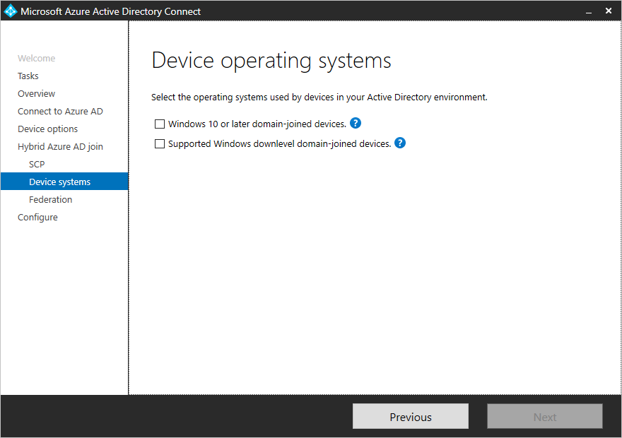
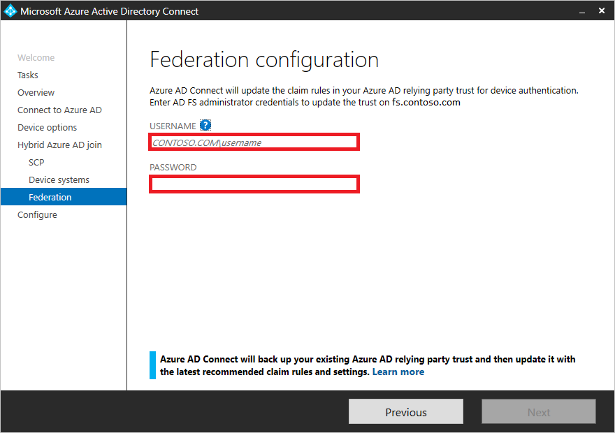
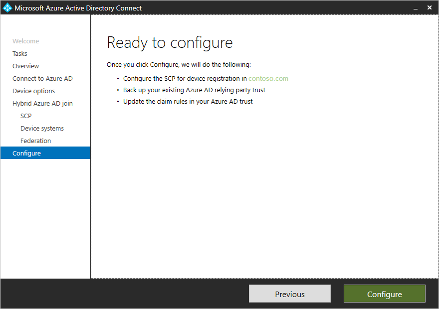
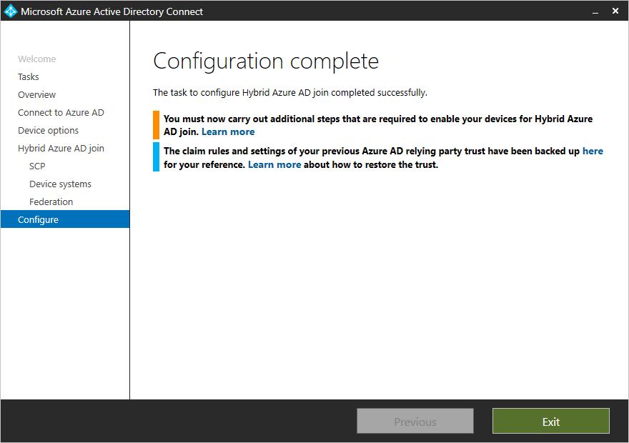

# Tutorial: Configure hybrid Azure Active Directory join for federated domains

In a similar way to a user, a device is another core identity you want to protect and use it to protect your resources at any time and from any location. You can accomplish this goal by bringing and managing device identities in Azure AD using one of the following methods:

- Azure AD join
- Hybrid Azure AD join
- Azure AD registration

By bringing your devices to Azure AD, you maximize your users' productivity through single sign-on (SSO) across your cloud and on-premises resources. At the same time, you can secure access to your cloud and on-premises resources with [conditional access](../active-directory-conditional-access-azure-portal.md).

In this tutorial, you learn how to configure hybrid Azure AD join for AD domain-joined computers devices in a federated environment using AD FS.

> [!NOTE]
> If your federated environment is using an identity provider other than AD FS, then you need to ensure that your identity provider supports WS-Trust protocol. WS-Trust is needed to authenticate your Windows current hybrid Azure AD joined devices with Azure AD. Additionally, if you have Windows down-level devices that you need to hybrid Azure AD join, your identity provider will need to support WIAORMULTIAUTHN claim. 

> [!div class="checklist"]
> * Configure hybrid Azure AD join
> * Enable Windows down-level devices
> * Verify the registration
> * Troubleshoot

## Prerequisites

This tutorial assumes that you are familiar with:

- [Introduction to device identity management in Azure Active Directory](../device-management-introduction.md)
- [How to plan your hybrid Azure Active Directory join implementation](hybrid-azuread-join-plan.md)
- [How to do controlled validation of hybrid Azure AD join](hybrid-azuread-join-control.md)

To configure the scenario in this tutorial, you need:

- Windows Server 2012 R2 with AD FS
- [Azure AD Connect](https://www.microsoft.com/download/details.aspx?id=47594) version 1.1.819.0 or higher.

Beginning with version 1.1.819.0, Azure AD Connect provides you with a wizard to configure hybrid Azure AD join. The wizard enables you to significantly simplify the configuration process. The related wizard:

- Configures the service connection points (SCP) for device registration
- Backs up your existing Azure AD relying party trust
- Updates the claim rules in your Azure AD trust

The configuration steps in this article are based on this wizard. If you have an older version of Azure AD Connect installed, you need upgrade it to 1.1.819 or higher. If installing the latest version of Azure AD Connect is not an option for you, see [how to manually configure hybrid Azure AD join](https://docs.microsoft.com/azure/active-directory/devices/hybrid-azuread-join-manual).

Hybrid Azure AD join requires the devices to have access to the following Microsoft resources from inside your organization's network:  

- `https://enterpriseregistration.windows.net`
- `https://login.microsoftonline.com`
- `https://device.login.microsoftonline.com`
- Your organization's STS (federated domains)
- `https://autologon.microsoftazuread-sso.com` (If you are using or planning to use Seamless SSO)

Beginning with Windows 10 1803, if the instantaneous Hybrid Azure AD join for federated environment using AD FS fails, we rely on Azure AD Connect to sync the computer object in Azure AD that is subsequently used to complete the device registration for Hybrid Azure AD join. Verify that Azure AD Connect has synchronized the computer objects of the devices you want to be hybrid Azure AD joined to Azure AD. If the computer objects belong to specific organizational units (OU), then these OUs need to be configured for synchronization in Azure AD connect as well. To learn more on how to synchronize computer objects using Azure AD Connect, see the article on [Configure filtering using Azure AD Connect](https://docs.microsoft.com/azure/active-directory/hybrid/how-to-connect-sync-configure-filtering#organizational-unitbased-filtering).

If your organization requires access to the Internet via an outbound proxy, Microsoft recommends [implementing Web Proxy Auto-Discovery (WPAD)](https://docs.microsoft.com/previous-versions/tn-archive/cc995261(v%3dtechnet.10)) to enable Windows 10 computers to do device registration with Azure AD. If you are encountering issues with configuring and managing WPAD, go to [troubleshooting automatic detection](https://docs.microsoft.com/previous-versions/tn-archive/cc302643(v=technet.10)). 

If you are not using WPAD and need to configure proxy settings on your computer, you can do so starting with Windows 10 1709, by [configuring WinHTTP settings using a group policy object (GPO)](https://blogs.technet.microsoft.com/netgeeks/2018/06/19/winhttp-proxy-settings-deployed-by-gpo/).

> [!NOTE]
> If you configure proxy settings on your computer using WinHTTP settings, then any computers that are unable to connect to the configured proxy will fail to connect to the internet.

If your organization requires access to the Internet via an authenticated outbound proxy, you must make sure that your Windows 10 computers can successfully authenticate to the outbound proxy. Because Windows 10 computers run device registration using machine context, it is necessary to configure outbound proxy authentication using machine context. Follow up with your outbound proxy provider on the configuration requirements.

## Configure hybrid Azure AD join

To configure a hybrid Azure AD join using Azure AD Connect, you need:

- The credentials of a global administrator for your Azure AD tenant.  
- The enterprise administrator credentials for each of the forests.
- The credentials of your AD FS administrator.

**To configure a hybrid Azure AD join using Azure AD Connect:**

1. Launch Azure AD Connect, and then click **Configure**.

   

1. On the **Additional tasks** page, select **Configure device options**, and then click **Next**.

   

1. On the **Overview** page, click **Next**.

   

1. On the **Connect to Azure AD** page, enter the credentials of a global administrator for your Azure AD tenant, and then click **Next**.

   

1. On the **Device options** page, select **Configure Hybrid Azure AD join**, and then click **Next**.

   

1. On the **SCP** page, perform the following steps, and then click **Next**:

   

   1. Select the forest.
   1. Select the authentication service. You must select AD FS server unless your organization has exclusively Windows 10 clients and you have configured computer/device sync or your organization is using SeamlessSSO.
   1. Click **Add** to enter the enterprise administrator credentials.

1. On the **Device operating systems** page, select the operating systems used by devices in your Active Directory environment, and then click **Next**.

   

1. On the **Federation configuration** page, enter the credentials of your AD FS administrator, and then click **Next**.

   

1. On the **Ready to configure** page, click **Configure**.

   

1. On the **Configuration complete** page, click **Exit**.

   

## Enable Windows down-level devices

If some of your domain-joined devices are Windows down-level devices, you need to:

- Configure the local intranet settings for device registration
- install Microsoft Workplace Join for Windows down-level computers

### Configure the local intranet settings for device registration

To successfully complete hybrid Azure AD join of your Windows down-level devices, and to avoid certificate prompts when devices authenticate to Azure AD you can push a policy to your domain-joined devices to add the following URLs to the Local Intranet zone in Internet Explorer:

- `https://device.login.microsoftonline.com`
- Your organization's Security Token Service (STS - federated domains)
- `https://autologon.microsoftazuread-sso.com` (for Seamless SSO).

Additionally, you need to enable **Allow updates to status bar via script** in the user’s local intranet zone.

### Install Microsoft Workplace Join for Windows down-level computers

To register Windows down-level devices, organizations must install [Microsoft Workplace Join for non-Windows 10 computers](https://www.microsoft.com/download/details.aspx?id=53554) available on the Microsoft Download Center.

You can deploy the package by using a software distribution system like [System Center Configuration Manager](https://www.microsoft.com/cloud-platform/system-center-configuration-manager). The package supports the standard silent installation options with the quiet parameter. The current branch of Configuration Manager offers benefits over earlier versions, like the ability to track completed registrations.

The installer creates a scheduled task on the system that runs in the user context. The task is triggered when the user does a sign in to Windows. The task silently joins the device with Azure AD with the user credentials after authenticating with Azure AD.

## Verify the registration

To verify the device registration state in your Azure tenant, you can use the **[Get-MsolDevice](https://docs.microsoft.com/powershell/msonline/v1/get-msoldevice)** cmdlet in the **[Azure Active Directory PowerShell module](/powershell/azure/install-msonlinev1?view=azureadps-2.0)**.

When using the **Get-MSolDevice** cmdlet to check the service details:

- An object with the **device ID** that matches the ID on the Windows client must exist.
- The value for **DeviceTrustType** must be **Domain Joined**. This is equivalent to the **Hybrid Azure AD joined** state on the Devices page in the Azure AD portal.
- The value for **Enabled** must be **True** and **DeviceTrustLevel** must be **Managed** for devices that are used in conditional access.

**To check the service details:**

1. Open **Windows PowerShell** as administrator.
1. Type `Connect-MsolService` to connect to your Azure tenant.  
1. Type `get-msoldevice -deviceId <deviceId>`.
1. Verify that **Enabled** is set to **True**.

## Troubleshoot your implementation

If you are experiencing issues with completing hybrid Azure AD join for domain joined Windows devices, see:

- [Troubleshooting Hybrid Azure AD join for Windows current devices](troubleshoot-hybrid-join-windows-current.md)
- [Troubleshooting Hybrid Azure AD join for Windows down-level devices](troubleshoot-hybrid-join-windows-legacy.md)

## Next steps

- For more information about managing device identities in the Azure AD portal, see [managing device identities using the Azure portal](device-management-azure-portal.md).

<!--Image references-->
[1]: ./media/active-directory-conditional-access-automatic-device-registration-setup/12.png
