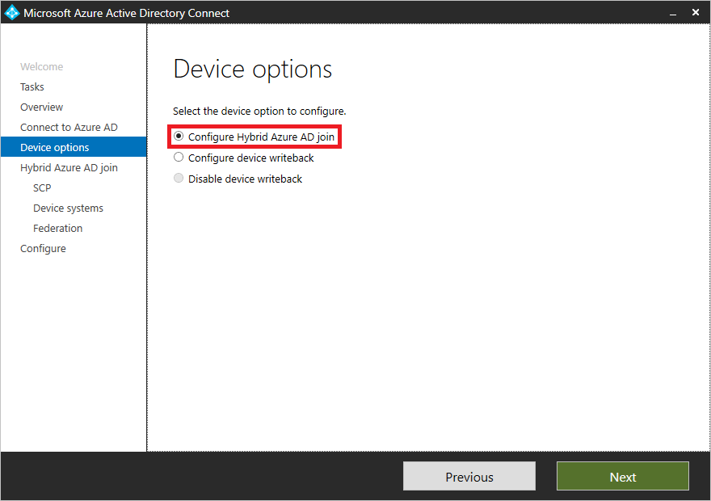

# Tutorial: Configure hybrid Azure Active Directory join for managed domains

Like a user in your organization, a device is a core identity you want to protect. You can use a device's identity to protect your resources at any time and from any location. You can accomplish this goal by bringing device identities and managing them in Azure Active Directory (Azure AD) by using one of the following methods:

- Azure AD join
- Hybrid Azure AD join
- Azure AD registration

Bringing your devices to Azure AD maximizes user productivity through single sign-on (SSO) across your cloud and on-premises resources. You can secure access to your cloud and on-premises resources with [Conditional Access](../active-directory-conditional-access-azure-portal.md) at the same time.

In this tutorial, you learn how to configure hybrid Azure AD join for Active Directory domain-joined computers devices in a managed environment. 

A managed environment can be deployed either through [password hash sync (PHS)](../hybrid/whatis-phs.md) or [pass-through authentication (PTA)](../hybrid/how-to-connect-pta.md) with [seamless single sign-on](../hybrid/how-to-connect-sso.md). These scenarios don't require you to configure a federation server for authentication.

In this tutorial, you learn how to:

> [!div class="checklist"]
> * Configure hybrid Azure AD join
> * Enable Windows down-level devices
> * Verify joined devices
> * Troubleshoot

## Prerequisites

This tutorial assumes that you're familiar with these articles:

- [What is a device identity?](overview.md)
- [How to plan your hybrid Azure AD join implementation](hybrid-azuread-join-plan.md)
- [How to do controlled validation of hybrid Azure AD join](hybrid-azuread-join-control.md)

> [!NOTE]
> Azure AD doesn't support smartcards or certificates in managed domains.

To configure the scenario in this article, you need the [latest version of Azure AD Connect](https://www.microsoft.com/download/details.aspx?id=47594) (1.1.819.0 or later) installed.

Verify that Azure AD Connect has synced the computer objects of the devices you want to be hybrid Azure AD joined to Azure AD. If the computer objects belong to specific organizational units (OUs), you must also configure the OUs to sync in Azure AD Connect. To learn more about how to sync computer objects by using Azure AD Connect, see [Configure filtering by using Azure AD Connect](../hybrid/how-to-connect-sync-configure-filtering.md#organizational-unitbased-filtering).

Beginning with version 1.1.819.0, Azure AD Connect includes a wizard that you can use to configure hybrid Azure AD join. The wizard significantly simplifies the configuration process. The wizard configures the service connection points (SCPs) for device registration.

The configuration steps in this article are based on using the wizard in Azure AD Connect.

Hybrid Azure AD join requires devices to have access to the following Microsoft resources from inside your organization's network:  

- `https://enterpriseregistration.windows.net`
- `https://login.microsoftonline.com`
- `https://device.login.microsoftonline.com`
- `https://autologon.microsoftazuread-sso.com` (If you use or plan to use seamless SSO)

If your organization requires access to the internet via an outbound proxy, Microsoft recommends [implementing Web Proxy Auto-Discovery (WPAD)](https://docs.microsoft.com/previous-versions/tn-archive/cc995261(v%3dtechnet.10)) to enable Windows 10 computers for device registration with Azure AD. If you encounter issues configuring and managing WPAD, see [Troubleshoot automatic detection](https://docs.microsoft.com/previous-versions/tn-archive/cc302643(v=technet.10)). 

If you don't use WPAD and need to configure proxy settings on your computer, you can do so beginning with Windows 10 1709. For more information, see [Configure WinHTTP settings using a group policy object (GPO)](https://blogs.technet.microsoft.com/netgeeks/2018/06/19/winhttp-proxy-settings-deployed-by-gpo/).

> [!NOTE]
> If you configure proxy settings on your computer by using WinHTTP settings, any computers that can't connect to the configured proxy will fail to connect to the internet.

If your organization requires access to the internet via an authenticated outbound proxy, you must make sure that your Windows 10 computers can successfully authenticate to the outbound proxy. Because Windows 10 computers run device registration by using machine context, you must configure outbound proxy authentication by using machine context. Follow up with your outbound proxy provider on the configuration requirements.

## Configure hybrid Azure AD join

To configure a hybrid Azure AD join using Azure AD Connect, you need:

- The credentials of a global administrator for your Azure AD tenant
- The enterprise administrator credentials for each of the forests

**To configure a hybrid Azure AD join by using Azure AD Connect:**

1. Start Azure AD Connect, and then select **Configure**.

   

1. On the **Additional tasks** page, select **Configure device options**, and then select **Next**.

   

1. On the **Overview** page, select **Next**.

   

1. On the **Connect to Azure AD** page, enter the credentials of a global administrator for your Azure AD tenant.  

   

1. On the **Device options** page, select **Configure Hybrid Azure AD join**, and then select **Next**.

   

1. On the **SCP** page, for each forest where you want Azure AD Connect to configure the SCP, complete the following steps, and then select **Next**:

   

   1. Select the forest.
   1. Select the authentication service.
   1. Select **Add** to enter the enterprise administrator credentials.

1. On the **Device operating systems** page, select the operating systems that devices in your Active Directory environment use, and then select **Next**.

   

1. On the **Ready to configure** page, select **Configure**.

   

1. On the **Configuration complete** page, select **Exit**.

   

## Enable Windows downlevel devices

If some of your domain-joined devices are Windows downlevel devices, you must:

- Configure the local intranet settings for device registration
- Configure seamless SSO
- Install Microsoft Workplace Join for Windows downlevel computers

### Configure the local intranet settings for device registration

o successfully complete hybrid Azure AD join of your Windows downlevel devices and to avoid certificate prompts when devices authenticate to Azure AD, you can push a policy to your domain-joined devices to add the following URLs to the local intranet zone in Internet Explorer:

- `https://device.login.microsoftonline.com`
- `https://autologon.microsoftazuread-sso.com`

You also must enable **Allow updates to status bar via script** in the user’s local intranet zone.

### Configure seamless SSO

To successfully complete hybrid Azure AD join of your Windows downlevel devices in a managed domain that uses [PHS]../hybrid/whatis-phs.md) or [PTA](../hybrid/how-to-connect-pta.md) as your Azure AD cloud authentication method, you must also [configure seamless SSO](../hybrid/how-to-connect-sso-quick-start.md#step-2-enable-the-feature).

### Install Microsoft Workplace Join for Windows downlevel computers

To register Windows downlevel devices, organizations must install [Microsoft Workplace Join for non-Windows 10 computers](https://www.microsoft.com/download/details.aspx?id=53554). Microsoft Workplace Join for non-Windows 10 computers is available in the Microsoft Download Center.

You can deploy the package by using a software distribution system like [System Center Configuration Manager](https://www.microsoft.com/cloud-platform/system-center-configuration-manager). The package supports the standard silent installation options with the `quiet` parameter. The current branch of Configuration Manager offers benefits over earlier versions, like the ability to track completed registrations.

The installer creates a scheduled task on the system that runs in the user context. The task is triggered when the user signs in to Windows. The task silently joins the device with Azure AD by using the user credentials after it authenticates with Azure AD.

## Verify the registration

To verify the device registration state in your Azure tenant, you can use the **[Get-MsolDevice](/powershell/msonline/v1/get-msoldevice)** cmdlet in the [Azure Active Directory PowerShell module](/powershell/azure/install-msonlinev1?view=azureadps-2.0).

When you use the **Get-MSolDevice** cmdlet to check the service details:

- An object with the **device ID** that matches the ID on the Windows client must exist.
- The value for **DeviceTrustType** must be **Domain Joined**. This setting is equivalent to the **Hybrid Azure AD joined** state on the **Devices** page in the Azure AD portal.
- For devices that are used in Conditional Access, the value for **Enabled** must be **True** and **DeviceTrustLevel** must be **Managed**.

**To check the service details**:

1. Open Windows PowerShell as an administrator.
1. Enter `Connect-MsolService` to connect to your Azure tenant.  
1. Enter `get-msoldevice -deviceId <deviceId>`.
1. Verify that **Enabled** is set to **True**.

## Troubleshoot your implementation

If you experience issues with completing hybrid Azure AD join for domain-joined Windows devices, see:

- [Troubleshoot hybrid Azure AD join for Windows current devices](troubleshoot-hybrid-join-windows-current.md)
- [Troubleshoot hybrid Azure AD join for Windows downlevel devices](troubleshoot-hybrid-join-windows-legacy.md)

## Next steps

Learn how to [manage device identities by using the Azure portal](device-management-azure-portal.md).
