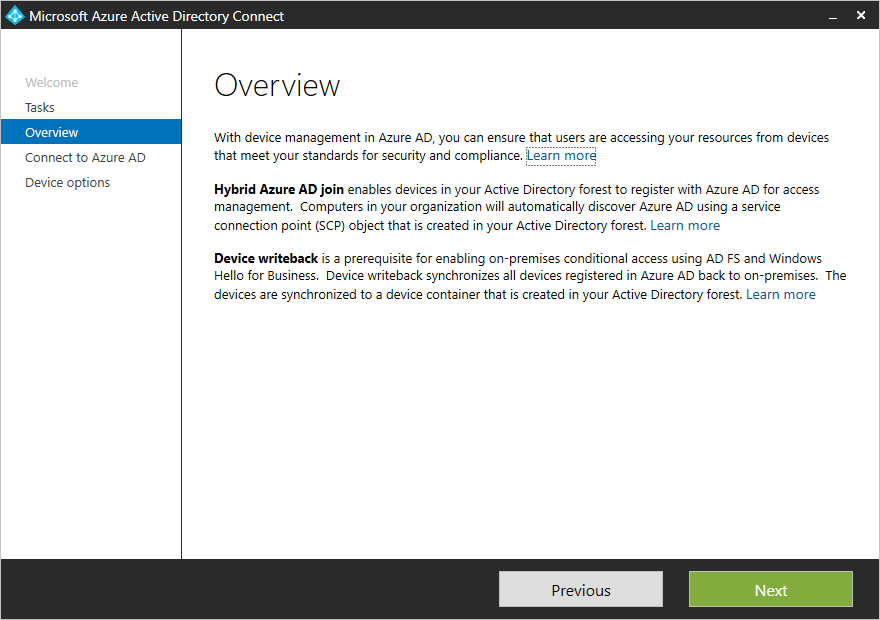
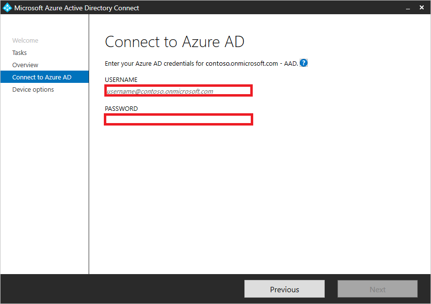
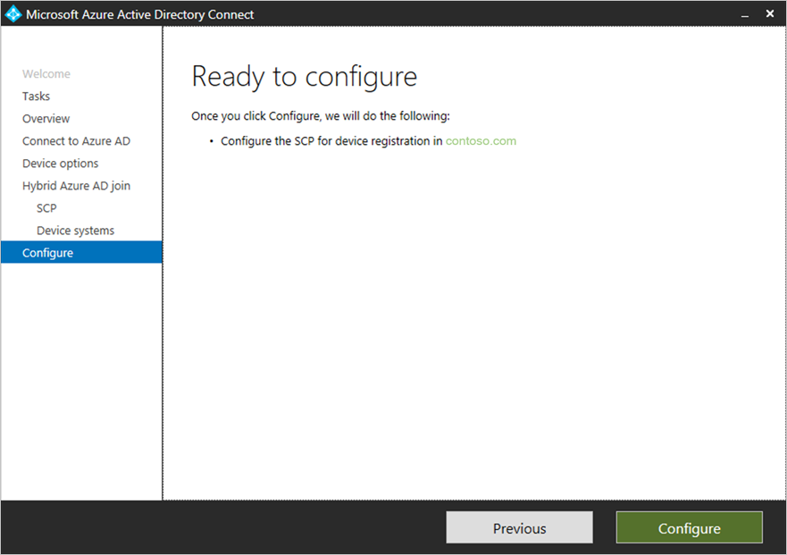

# Tutorial: Configure hybrid Azure Active Directory join for managed domains

In this tutorial, you learn how to configure hybrid Azure Active Directory (Azure AD) join for Active Directory domain-joined devices. This method supports a managed environment that includes both on-premises Active Directory and Azure AD.

Like a user in your organization, a device is a core identity you want to protect. You can use a device's identity to protect your resources at any time and from any location. You can accomplish this goal by managing device identities in Azure AD. Use one of the following methods:

- Azure AD join
- Hybrid Azure AD join
- Azure AD registration

This article focuses on hybrid Azure AD join.

Bringing your devices to Azure AD maximizes user productivity through single sign-on (SSO) across your cloud and on-premises resources. You can secure access to your cloud and on-premises resources with [Conditional Access](../conditional-access/howto-conditional-access-policy-compliant-device.md) at the same time.

You can deploy a managed environment by using [password hash sync (PHS)](../hybrid/whatis-phs.md) or [pass-through authentication (PTA)](../hybrid/how-to-connect-pta.md) with [seamless single sign-on](../hybrid/how-to-connect-sso.md). These scenarios don't require you to configure a federation server for authentication.

In this tutorial, you learn how to:

> [!div class="checklist"]
> * Configure hybrid Azure AD join
> * Enable Windows down-level devices
> * Verify joined devices
> * Troubleshoot

## Prerequisites

- The [Azure AD Connect](https://www.microsoft.com/download/details.aspx?id=47594) (1.1.819.0 or later)
- The credentials of a global administrator for your Azure AD tenant
- The enterprise administrator credentials for each of the forests

Familiarize yourself with these articles:

- [What is a device identity?](overview.md)
- [How To: Plan your hybrid Azure Active Directory join implementation](hybrid-azuread-join-plan.md)
- [Controlled validation of hybrid Azure AD join](hybrid-azuread-join-control.md)

> [!NOTE]
> Azure AD doesn't support smartcards or certificates in managed domains.

Verify that Azure AD Connect has synced the computer objects of the devices you want to be hybrid Azure AD joined to Azure AD. If the computer objects belong to specific organizational units (OUs), configure the OUs to sync in Azure AD Connect. To learn more about how to sync computer objects by using Azure AD Connect, see [Organizational unit–based filtering](../hybrid/how-to-connect-sync-configure-filtering.md#organizational-unitbased-filtering).

Beginning with version 1.1.819.0, Azure AD Connect includes a wizard to configure hybrid Azure AD join. The wizard significantly simplifies the configuration process. The wizard configures the service connection points (SCPs) for device registration.

The configuration steps in this article are based on using the wizard in Azure AD Connect.

Hybrid Azure AD join requires devices to have access to the following Microsoft resources from inside your organization's network:  

- `https://enterpriseregistration.windows.net`
- `https://login.microsoftonline.com`
- `https://device.login.microsoftonline.com`
- `https://autologon.microsoftazuread-sso.com` (If you use or plan to use seamless SSO)

If your organization requires access to the internet via an outbound proxy, we recommend [implementing Web Proxy Auto-Discovery (WPAD)](https://docs.microsoft.com/previous-versions/tn-archive/cc995261(v%3dtechnet.10)) to enable Windows 10 computers for device registration with Azure AD. To address issues configuring and managing WPAD, see [Troubleshooting Automatic Detection](/previous-versions/tn-archive/cc302643(v=technet.10)).

If you don't use WPAD, you can configure proxy settings on your computer beginning with Windows 10 1709. For more information, see [WinHTTP Proxy Settings deployed by GPO](https://blogs.technet.microsoft.com/netgeeks/2018/06/19/winhttp-proxy-settings-deployed-by-gpo/).

> [!NOTE]
> If you configure proxy settings on your computer by using WinHTTP settings, any computers that can't connect to the configured proxy will fail to connect to the internet.

If your organization requires access to the internet via an authenticated outbound proxy, make sure that your Windows 10 computers can successfully authenticate to the outbound proxy. Because Windows 10 computers run device registration by using machine context, configure outbound proxy authentication by using machine context. Follow up with your outbound proxy provider on the configuration requirements.

Verify the device can access the above Microsoft resources under the system account by using the [Test Device Registration Connectivity](https://gallery.technet.microsoft.com/Test-Device-Registration-3dc944c0) script.

## Configure hybrid Azure AD join

To configure a hybrid Azure AD join by using Azure AD Connect:

1. Start Azure AD Connect, and then select **Configure**.

   

1. In **Additional tasks**, select **Configure device options**, and then select **Next**.

   

1. In **Overview**, select **Next**.

   

1. In **Connect to Azure AD**, enter the credentials of a global administrator for your Azure AD tenant.  

   

1. In **Device options**, select **Configure Hybrid Azure AD join**, and then select **Next**.

   

1. In **SCP configuration**, for each forest where you want Azure AD Connect to configure the SCP, complete the following steps, and then select **Next**.

   1. Select the **Forest**.
   1. Select an **Authentication Service**.
   1. Select **Add** to enter the enterprise administrator credentials.

   

1. In **Device operating systems**, select the operating systems that devices in your Active Directory environment use, and then select **Next**.

   

1. In **Ready to configure**, select **Configure**.

   

1. In **Configuration complete**, select **Exit**.

   

## Enable Windows down-level devices

If some of your domain-joined devices are Windows down-level devices, you must:

- Configure the local intranet settings for device registration
- Configure seamless SSO
- Install Microsoft Workplace Join for Windows down-level computers

> [!NOTE]
> Windows 7 support ended on January 14, 2020. For more information, see [Windows 7 support ended](https://support.microsoft.com/help/4057281/windows-7-support-ended-on-january-14-2020).

### Configure the local intranet settings for device registration

To complete hybrid Azure AD join of your Windows down-level devices and to avoid certificate prompts when devices authenticate to Azure AD, you can push a policy to your domain-joined devices to add the following URLs to the local intranet zone in Internet Explorer:

- `https://device.login.microsoftonline.com`
- `https://autologon.microsoftazuread-sso.com`

You also must enable **Allow updates to status bar via script** in the user's local intranet zone.

### Configure seamless SSO

To complete hybrid Azure AD join of your Windows down-level devices in a managed domain that uses [password hash sync](../hybrid/whatis-phs.md) or [pass-through authentication](../hybrid/how-to-connect-pta.md) as your Azure AD cloud authentication method, you must also [configure seamless SSO](../hybrid/how-to-connect-sso-quick-start.md#step-2-enable-the-feature).

### Install Microsoft Workplace Join for Windows down-level computers

To register Windows down-level devices, organizations must install [Microsoft Workplace Join for non-Windows 10 computers](https://www.microsoft.com/download/details.aspx?id=53554). Microsoft Workplace Join for non-Windows 10 computers is available in the Microsoft Download Center.

You can deploy the package by using a software distribution system like [Microsoft Endpoint Configuration Manager](/configmgr/). The package supports the standard silent installation options with the `quiet` parameter. The current version of Configuration Manager offers benefits over earlier versions, like the ability to track completed registrations.

The installer creates a scheduled task on the system that runs in the user context. The task is triggered when the user signs in to Windows. The task silently joins the device with Azure AD by using the user credentials after it authenticates with Azure AD.

## Verify the registration

Here are 3 ways to locate and verify the device state:

### Locally on the device

1. Open Windows PowerShell.
2. Enter `dsregcmd /status`.
3. Verify that both **AzureAdJoined** and **DomainJoined** are set to **YES**.
4. You can use the **DeviceId** and compare the status on the service using either the Azure portal or PowerShell.

### Using the Azure portal

1. Go to the devices page using a [direct link](https://portal.azure.com/#blade/Microsoft_AAD_IAM/DevicesMenuBlade/Devices).
2. Information on how to locate a device can be found in [How to manage device identities using the Azure portal](https://docs.microsoft.com/azure/active-directory/devices/device-management-azure-portal#locate-devices).
3. If the **Registered** column says **Pending**, then Hybrid Azure AD Join has not completed.
4. If the **Registered** column contains a **date/time**, then Hybrid Azure AD Join has completed.

### Using PowerShell

Verify the device registration state in your Azure tenant by using **[Get-MsolDevice](/powershell/msonline/v1/get-msoldevice)**. This cmdlet is in the [Azure Active Directory PowerShell module](/powershell/azure/install-msonlinev1?view=azureadps-2.0).

When you use the **Get-MSolDevice** cmdlet to check the service details:

- An object with the **device ID** that matches the ID on the Windows client must exist.
- The value for **DeviceTrustType** is **Domain Joined**. This setting is equivalent to the **Hybrid Azure AD joined** state on the **Devices** page in the Azure AD portal.
- For devices that are used in Conditional Access, the value for **Enabled** is **True** and **DeviceTrustLevel** is **Managed**.

1. Open Windows PowerShell as an administrator.
2. Enter `Connect-MsolService` to connect to your Azure tenant.

#### Count all Hybrid Azure AD joined devices (excluding **Pending** state)

```azurepowershell
(Get-MsolDevice -All -IncludeSystemManagedDevices | where {($_.DeviceTrustType -eq 'Domain Joined') -and (([string]($_.AlternativeSecurityIds)).StartsWith("X509:"))}).count
```

#### Count all Hybrid Azure AD joined devices with **Pending** state

```azurepowershell
(Get-MsolDevice -All -IncludeSystemManagedDevices | where {($_.DeviceTrustType -eq 'Domain Joined') -and (-not([string]($_.AlternativeSecurityIds)).StartsWith("X509:"))}).count
```

#### List all Hybrid Azure AD joined devices

```azurepowershell
Get-MsolDevice -All -IncludeSystemManagedDevices | where {($_.DeviceTrustType -eq 'Domain Joined') -and (([string]($_.AlternativeSecurityIds)).StartsWith("X509:"))}
```

#### List all Hybrid Azure AD joined devices with **Pending** state

```azurepowershell
Get-MsolDevice -All -IncludeSystemManagedDevices | where {($_.DeviceTrustType -eq 'Domain Joined') -and (-not([string]($_.AlternativeSecurityIds)).StartsWith("X509:"))}
```

#### List details of a single device:

1. Enter `get-msoldevice -deviceId <deviceId>` (This is the **DeviceId** obtained locally on the device).
2. Verify that **Enabled** is set to **True**.

## Troubleshoot your implementation

If you experience issues completing hybrid Azure AD join for domain-joined Windows devices, see:

- [Troubleshooting devices using dsregcmd command](https://docs.microsoft.com/azure/active-directory/devices/troubleshoot-device-dsregcmd)
- [Troubleshooting hybrid Azure Active Directory joined devices](troubleshoot-hybrid-join-windows-current.md)
- [Troubleshooting hybrid Azure Active Directory joined down-level devices](troubleshoot-hybrid-join-windows-legacy.md)

## Next steps

Advance to the next article to learn how to manage device identities by using the Azure portal.
> [!div class="nextstepaction"]
> [Manage device identities](device-management-azure-portal.md)
