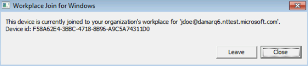

# Tutorial: Configure hybrid Azure Active Directory join for managed domains

As a IT admin, you typically want to so that I can do...
You can accomplish this goal by ...

With [device management](../device-management-introduction.md) in Azure Active Directory (Azure AD), you can ensure that your users are accessing your resources from devices that meet your standards for security and compliance. 
If you have an on-premises Active Directory environment and you want to join your domain-joined devices to Azure AD, you can accomplish this by configuring a hybrid Azure AD join. 

In this tutorial, you learn how to configure hybrid Azure AD join for devices in managed domains.

> [!div class="checklist"]
> * Configure hybrid Azure AD join
> * Enable Windows down-level devices
> * Verify joined devices 
> * Troubleshoot 

## Prerequisites

This tutorial assumes that you are familiar with:
    
-  [Introduction to device management in Azure Active Directory](../device-management-introduction.md)
    
-  [How to plan your hybrid Azure Active Directory join implementation](hybrid-azuread-join-plan.md)

To configure the scenario in this article, you need the [latest version of Azure AD Connect](https://www.microsoft.com/download/details.aspx?id=47594) (1.1.819.0 or higher) to be installed. 
 

Beginning with version 1.1.819.0, Azure AD Connect provides you with a wizard to configure hybrid Azure AD join. The wizard enables you to significantly simplify the configuration process. The related wizard configures the service connection points (SCP) for device registration.

The configuration steps in this article are based on this wizard. If you have an older version of Azure AD Connect installed, you need upgrade it to 1.1.819 or higher. If installing the required version of Azure AD Connect is not an option for you, see [how to manually configure device registration](../device-management-hybrid-azuread-joined-devices-setup.md).

Hybrid Azure AD join requires the devices to have access to the following Microsoft resources from inside your organization's network:  

- https://enterpriseregistration.windows.net
- https://login.microsoftonline.com
- https://device.login.microsoftonline.com
- https://autologon.microsoftazuread-sso.com (If you are using or planning to use Seamless SSO)

If your organization requires access to the Internet via an outbound proxy, starting with Windows 10 1709, you can configure proxy settings on your computer using a group policy object (GPO). If your computer is running anything older than Windows 10 1709, you must implement Web Proxy Auto-Discovery (WPAD) to enable Windows 10 computers to do device registration with Azure AD. 

If your organization requires access to the Internet via an authenticated outbound proxy, you must make sure that your Windows 10 computers can successfully authenticate to the outbound proxy. Because Windows 10 computers run device registration using machine context, it is necessary to configure outbound proxy authentication using machine context. Follow up with your outbound proxy provider on the configuration requirements. 

## Configure hybrid Azure AD join

To configure a hybrid Azure AD join using Azure AD Connect, you need:

- The credentials of a global administrator for your Azure AD tenant.  

- The enterprise administrator credentials for each of the forests.

**To configure a hybrid Azure AD join using Azure AD Connect:**

1. Launch Azure AD Connect, and then click **Configure**.

    

2. On the **Additional tasks** page, select **Configure device options**, and then click **Next**. 

    

3. On the **Overview** page, click **Next**. 

    

4. On the **Connect to Azure AD** page, enter the credentials of a global administrator for your Azure AD tenant.  

    

5. On the **Device options** page, select **Configure Hybrid Azure AD join**, and then click **Next**. 

    

6. On the **SCP** page, for each forest you want Azure AD Connect to the SCP, perform the following steps, and then click **Next**: 

    

    a. Select the forest.

    b. Select the authentication service.

    c. Click **Add** to enter the enterprise administrator credentials.

7. On the **Device operating systems** page, select the operating systems used by devices in your Active Directory environment, and then click **Next**. 

    

8. On the **Ready to configure** page, click **Configure**. 

    

9. On the **Configuration complete** page, click **Exit**. 

    

## Enable Windows down-level devices

If some of your domain-joined devices are Windows down-level devices, you need to:

- Update device settings
 
- Configure the local intranet settings for device registration

### Update device settings 

To register Windows down-level devices, you need to make sure that the device settings to allow users to register devices in Azure AD are set. In the Azure portal, you can find this setting  under:

`Home > [Name of your tenant] > Devices - Device settings`  

    
The following policy must be set to **All**: **Users may register their devices with Azure AD**

### Configure the local intranet settings for device registration

To successfully complete hybrid Azure AD join of your Windows down-level devices, and to avoid certificate prompts when devices authenticate authenticate to Azure AD you can push a policy to your domain-joined devices to add the following URLs to the Local Intranet zone in Internet Explorer:

- `https://device.login.microsoftonline.com`

- `https://device.login.microsoftonline.com`

If you either are already using or planning on using Seamless SSO, add `https://autologon.microsoftazuread-sso.com`.

Additionally, you need to enable **Allow updates to status bar via script** in the user’s local intranet zone.

## Verify the registration

To verify the device registration state, compare the registration details on the device and your Azure tenant.  

### Verify the registration on a Windows current device

On a Windows current device, use the **dsregcmd** command to verify the client details. When using **dsregcmd**, the following values must be set to **Yes**:

- AzureAdJoined: YES
- DomainJoined: YES

**To verify the client details on a Windows current device:**
 
1. Open the command prompt as an administrator.

2. Type **dsregcmd /status**.

3. Review the values of **AzureAdJoined** and **DomainJoined**. 

4. Copy the value of **DeviceId**.
 

### Verify the registration on a Windows down-level device

On a Windows down-level device, use **Autoworkplace** to check the client details.

**To verify the client details on a Windows down-level device:**
 
1.	Verify that the [MSI](hybrid-azuread-join-control.md#control-windows-down-level-devices) has been deployed on the device.
	
2.	Sign on with a valid user account to complete the hybrid Azure AD join.

3.	Open the command prompt as an administrator

4.	Type `"%programFiles%\Microsoft Workplace Join\autoworkplace.exe" /i`

5.	Copy the **Device id**.

### Verify the registration on an Azure tenant
 
You can use the **[Get-MsolDevice](https://docs.microsoft.com/powershell/msonline/v1/get-msoldevice)** cmdlet in the **[Azure Active Directory PowerShell module](/powershell/azure/install-msonlinev1?view=azureadps-2.0)** cmdlet to verify the registration on your Azure tenant.

When using the **Get-MSolDevice** cmdlet to check the service details:

- An object with the **device id** retrieved on the Windows device must exist.
- The value for **Enabled** must be **True**. 

**To check the service details:**

1. Open **Windows PowerShell** as administrator.

2. Type `Connect-MsolService` to connect to your Azure tenant.  

3. Type `get-msoldevice -deviceId <deviceId>`.

6. Verify that **Enabled** is set to **True**.

## Troubleshoot your implementation

If you are experiencing issues with completing hybrid Azure AD join for domain joined Windows devices, see:

- [Troubleshooting Hybrid Azure AD join for Windows current devices](../device-management-troubleshoot-hybrid-join-windows-current.md)
- [Troubleshooting Hybrid Azure AD join for Windows down-level devices](../device-management-troubleshoot-hybrid-join-windows-legacy.md)

## Next steps

> [!div class="nextstepaction"]
> [Configure hybrid Azure Active Directory join for federated domains](hybrid-azuread-join-federated-domains.md)
> [Configure hybrid Azure Active Directory join manually](../device-management-hybrid-azuread-joined-devices-setup.md)

