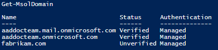

# Tutorial: Configure hybrid Azure Active Directory joined devices manually

With device management in Azure Active Directory (Azure AD), you can ensure that users are accessing your resources from devices that meet your standards for security and compliance. For more information, see [Introduction to device management in Azure Active Directory](overview.md).

> [!TIP]
> If using Azure AD Connect is an option for you, see the related tutorials for [managed](hybrid-azuread-join-managed-domains.md) or [federated](hybrid-azuread-join-federated-domains.md) domains. By using Azure AD Connect, you can significantly simplify the configuration of hybrid Azure AD join.

If you have an on-premises Active Directory environment and you want to join your domain-joined devices to Azure AD, you can accomplish this by configuring hybrid Azure AD joined devices. In this tutorial, you learn how to:

> [!div class="checklist"]
> * Manually configure hybrid Azure AD join
> * Configure a service connection point
> * Set up issuance of claims
> * Enable Windows down-level devices
> * Verify joined devices
> * Troubleshoot your implementation

## Prerequisites

This tutorial assumes that you're familiar with:

* [Introduction to device management in Azure Active Directory](./overview.md)
* [Plan your hybrid Azure Active Directory join implementation](hybrid-azuread-join-plan.md)
* [Control the hybrid Azure AD join of your devices](hybrid-azuread-join-control.md)

Before you start enabling hybrid Azure AD joined devices in your organization, make sure that:

* You're running an up-to-date version of Azure AD Connect.
* Azure AD Connect has synchronized the computer objects of the devices you want to be hybrid Azure AD joined to Azure AD. If the computer objects belong to specific organizational units (OUs), these OUs need to be configured for synchronization in Azure AD Connect as well.

Azure AD Connect:

* Keeps the association between the computer account in your on-premises Active Directory instance and the device object in Azure AD.
* Enables other device-related features, like Windows Hello for Business.

Make sure that the following URLs are accessible from computers inside your organization's network for registration of computers to Azure AD:

* `https://enterpriseregistration.windows.net`
* `https://login.microsoftonline.com`
* `https://device.login.microsoftonline.com`
* Your organization's STS (for federated domains), which should be included in the user's local intranet settings

> [!WARNING]
> If your organization uses proxy servers that intercept SSL traffic for scenarios like data loss prevention or Azure AD tenant restrictions, ensure that traffic to 'https://device.login.microsoftonline.com' is excluded from TLS break-and-inspect. Failure to exclude 'https://device.login.microsoftonline.com' may cause interference with client certificate authentication, causing issues with device registration and device-based Conditional Access.

If your organization plans to use Seamless SSO, the following URL needs to be reachable from the computers inside your organization. It must also be added to the user's local intranet zone.

* `https://autologon.microsoftazuread-sso.com`

Also, the following setting should be enabled in the user's intranet zone: "Allow status bar updates via script."

If your organization uses managed (non-federated) setup with on-premises Active Directory and does not use Active Directory Federation Services (AD FS) to federate with Azure AD, then hybrid Azure AD join on Windows 10 relies on the computer objects in Active Directory to be synced to Azure AD. Make sure that any OUs that contain the computer objects that need to be hybrid Azure AD joined are enabled for sync in the Azure AD Connect sync configuration.

For Windows 10 devices on version 1703 or earlier, if your organization requires access to the internet via an outbound proxy, you must implement Web Proxy Auto-Discovery (WPAD) to enable Windows 10 computers to register to Azure AD.

Beginning with Windows 10 1803, even if a hybrid Azure AD join attempt by a device in a federated domain through AD FS fails, and if Azure AD Connect is configured to sync the computer/device objects to Azure AD, the device will try to complete the hybrid Azure AD join by using the synced computer/device.

> [!NOTE]
> To get device registration sync join to succeed, as part of the device registration configuration, do not exclude the default device attributes from your Azure AD Connect sync configuration. To learn more about default device attributes synced to Azure AD, see [Attributes synchronized by Azure AD Connect](https://docs.microsoft.com/azure/active-directory/hybrid/reference-connect-sync-attributes-synchronized#windows-10).

To verify if the device is able to access the above Microsoft resources under the system account, you can use [Test Device Registration Connectivity](/samples/azure-samples/testdeviceregconnectivity/testdeviceregconnectivity/) script.

## Verify configuration steps

You can configure hybrid Azure AD joined devices for various types of Windows device platforms. This topic includes the required steps for all typical configuration scenarios.  

Use the following table to get an overview of the steps that are required for your scenario:  

| Steps | Windows current and password hash sync | Windows current and federation | Windows down-level |
| :--- | :---: | :---: | :---: |
| Configure service connection point | ![Check][1] | ![Check][1] | ![Check][1] |
| Set up issuance of claims |     | ![Check][1] | ![Check][1] |
| Enable non-Windows 10 devices |       |        | ![Check][1] |
| Verify joined devices | ![Check][1] | ![Check][1] | ![Check][1] |

## Configure a service connection point

Your devices use a service connection point (SCP) object during the registration to discover Azure AD tenant information. In your on-premises Active Directory instance, the SCP object for the hybrid Azure AD joined devices must exist in the configuration naming context partition of the computer's forest. There is only one configuration naming context per forest. In a multi-forest Active Directory configuration, the service connection point must exist in all forests that contain domain-joined computers.

You can use the [**Get-ADRootDSE**](/previous-versions/windows/it-pro/windows-server-2008-R2-and-2008/ee617246(v=technet.10)) cmdlet to retrieve the configuration naming context of your forest.  

For a forest with the Active Directory domain name *fabrikam.com*, the configuration naming context is:

`CN=Configuration,DC=fabrikam,DC=com`

In your forest, the SCP object for the auto-registration of domain-joined devices is located at:  

`CN=62a0ff2e-97b9-4513-943f-0d221bd30080,CN=Device Registration Configuration,CN=Services,[Your Configuration Naming Context]`

Depending on how you have deployed Azure AD Connect, the SCP object might have already been configured.
You can verify the existence of the object and retrieve the discovery values by using the following Windows PowerShell script:

   ```PowerShell
   $scp = New-Object System.DirectoryServices.DirectoryEntry;

   $scp.Path = "LDAP://CN=62a0ff2e-97b9-4513-943f-0d221bd30080,CN=Device Registration Configuration,CN=Services,CN=Configuration,DC=fabrikam,DC=com";

   $scp.Keywords;
   ```

The **$scp.Keywords** output shows the Azure AD tenant information. Here's an example:

   ```
   azureADName:microsoft.com
   azureADId:72f988bf-86f1-41af-91ab-2d7cd011db47
   ```

If the service connection point does not exist, you can create it by running the `Initialize-ADSyncDomainJoinedComputerSync` cmdlet on your Azure AD Connect server. Enterprise admin credentials are required to run this cmdlet.  

The cmdlet:

* Creates the service connection point in the Active Directory forest that Azure AD Connect is connected to.
* Requires you to specify the `AdConnectorAccount` parameter. This account is configured as the Active Directory connector account in Azure AD Connect.


The following script shows an example for using the cmdlet. In this script, `$aadAdminCred = Get-Credential` requires you to type a user name. You need to provide the user name in the user principal name (UPN) format (`user@example.com`).

   ```PowerShell
   Import-Module -Name "C:\Program Files\Microsoft Azure Active Directory Connect\AdPrep\AdSyncPrep.psm1";

   $aadAdminCred = Get-Credential;

   Initialize-ADSyncDomainJoinedComputerSync –AdConnectorAccount [connector account name] -AzureADCredentials $aadAdminCred;
   ```

The `Initialize-ADSyncDomainJoinedComputerSync` cmdlet:

* Uses the Active Directory PowerShell module and Active Directory Domain Services (AD DS) tools. These tools rely on Active Directory Web Services running on a domain controller. Active Directory Web Services is supported on domain controllers running Windows Server 2008 R2 and later.
* Is only supported by the MSOnline PowerShell module version 1.1.166.0. To download this module, use [this link](https://www.powershellgallery.com/packages/MSOnline/1.1.166.0).
* If the AD DS tools are not installed, `Initialize-ADSyncDomainJoinedComputerSync` will fail. You can install the AD DS tools through Server Manager under **Features** > **Remote Server Administration Tools** > **Role Administration Tools**.

For domain controllers running Windows Server 2008 or earlier versions, use the following script to create the service connection point. In a multi-forest configuration, use the following script to create the service connection point in each forest where computers exist.

   ```PowerShell
   $verifiedDomain = "contoso.com" # Replace this with any of your verified domain names in Azure AD
   $tenantID = "72f988bf-86f1-41af-91ab-2d7cd011db47" # Replace this with you tenant ID
   $configNC = "CN=Configuration,DC=corp,DC=contoso,DC=com" # Replace this with your Active Directory configuration naming context

   $de = New-Object System.DirectoryServices.DirectoryEntry
   $de.Path = "LDAP://CN=Services," + $configNC
   $deDRC = $de.Children.Add("CN=Device Registration Configuration", "container")
   $deDRC.CommitChanges()

   $deSCP = $deDRC.Children.Add("CN=62a0ff2e-97b9-4513-943f-0d221bd30080", "serviceConnectionPoint")
   $deSCP.Properties["keywords"].Add("azureADName:" + $verifiedDomain)
   $deSCP.Properties["keywords"].Add("azureADId:" + $tenantID)

   $deSCP.CommitChanges()
   ```

In the preceding script, `$verifiedDomain = "contoso.com"` is a placeholder. Replace it with one of your verified domain names in Azure AD. You have to own the domain before you can use it.

For more information about verified domain names, see [Add a custom domain name to Azure Active Directory](../fundamentals/add-custom-domain.md).

To get a list of your verified company domains, you can use the [Get-AzureADDomain](/powershell/module/Azuread/Get-AzureADDomain) cmdlet.



## Set up issuance of claims

In a federated Azure AD configuration, devices rely on AD FS or an  on-premises federation service from a Microsoft partner to authenticate to Azure AD. Devices authenticate to get an access token to register against the Azure Active Directory Device Registration Service (Azure DRS).

Windows current devices authenticate by using Integrated Windows Authentication to an active WS-Trust endpoint (either 1.3 or 2005 versions) hosted by the on-premises federation service.

When you're using AD FS, you need to enable the following WS-Trust endpoints
- `/adfs/services/trust/2005/windowstransport`
- `/adfs/services/trust/13/windowstransport`
- `/adfs/services/trust/2005/usernamemixed`
- `/adfs/services/trust/13/usernamemixed`
- `/adfs/services/trust/2005/certificatemixed`
- `/adfs/services/trust/13/certificatemixed`

> [!WARNING]
> Both **adfs/services/trust/2005/windowstransport** and **adfs/services/trust/13/windowstransport** should be enabled as intranet facing endpoints only and must NOT be exposed as extranet facing endpoints through the Web Application Proxy. To learn more on how to disable WS-Trust Windows endpoints, see [Disable WS-Trust Windows endpoints on the proxy](/windows-server/identity/ad-fs/deployment/best-practices-securing-ad-fs#disable-ws-trust-windows-endpoints-on-the-proxy-ie-from-extranet). You can see what endpoints are enabled through the AD FS management console under **Service** > **Endpoints**.

> [!NOTE]
>If you don’t have AD FS as your on-premises federation service, follow the instructions from your vendor to make sure they support WS-Trust 1.3 or 2005 endpoints and that these are published through the Metadata Exchange file (MEX).

For device registration to finish, the following claims must exist in the token that Azure DRS receives. Azure DRS will create a device object in Azure AD with some of this information. Azure AD Connect then uses this information to associate the newly created device object with the computer account on-premises.

* `http://schemas.microsoft.com/ws/2012/01/accounttype`
* `http://schemas.microsoft.com/identity/claims/onpremobjectguid`
* `http://schemas.microsoft.com/ws/2008/06/identity/claims/primarysid`

If you have more than one verified domain name, you need to provide the following claim for computers:

* `http://schemas.microsoft.com/ws/2008/06/identity/claims/issuerid`

If you're already issuing an ImmutableID claim (for example, using `mS-DS-ConsistencyGuid` or another attribute as the source value for the ImmutableID), you need to provide one corresponding claim for computers:

* `http://schemas.microsoft.com/LiveID/Federation/2008/05/ImmutableID`

In the following sections, you find information about:

* The values that each claim should have.
* What a definition would look like in AD FS.

The definition helps you to verify whether the values are present or if you need to create them.

> [!NOTE]
> If you don’t use AD FS for your on-premises federation server, follow your vendor's instructions to create the appropriate configuration to issue these claims.

### Issue account type claim

The `http://schemas.microsoft.com/ws/2012/01/accounttype` claim must contain a value of **DJ**, which identifies the device as a domain-joined computer. In AD FS, you can add an issuance transform rule that looks like this:

   ```
   @RuleName = "Issue account type for domain-joined computers"
   c:[
      Type == "http://schemas.microsoft.com/ws/2008/06/identity/claims/groupsid",
      Value =~ "-515$",
      Issuer =~ "^(AD AUTHORITY|SELF AUTHORITY|LOCAL AUTHORITY)$"
   ]
   => issue(
      Type = "http://schemas.microsoft.com/ws/2012/01/accounttype",
      Value = "DJ"
   );
   ```

### Issue objectGUID of the computer account on-premises

The `http://schemas.microsoft.com/identity/claims/onpremobjectguid` claim must contain the **objectGUID** value of the on-premises computer account. In AD FS, you can add an issuance transform rule that looks like this:

   ```
   @RuleName = "Issue object GUID for domain-joined computers"
   c1:[
      Type == "http://schemas.microsoft.com/ws/2008/06/identity/claims/groupsid",
      Value =~ "-515$", 
      Issuer =~ "^(AD AUTHORITY|SELF AUTHORITY|LOCAL AUTHORITY)$"
   ]
   &&
   c2:[
      Type == "http://schemas.microsoft.com/ws/2008/06/identity/claims/windowsaccountname",
      Issuer =~ "^(AD AUTHORITY|SELF AUTHORITY|LOCAL AUTHORITY)$"
   ]
   => issue(
      store = "Active Directory",
      types = ("http://schemas.microsoft.com/identity/claims/onpremobjectguid"),
      query = ";objectguid;{0}",
      param = c2.Value
   );
   ```

### Issue objectSID of the computer account on-premises

The `http://schemas.microsoft.com/ws/2008/06/identity/claims/primarysid` claim must contain the **objectSid** value of the on-premises computer account. In AD FS, you can add an issuance transform rule that looks like this:

   ```
   @RuleName = "Issue objectSID for domain-joined computers"
   c1:[
      Type == "http://schemas.microsoft.com/ws/2008/06/identity/claims/groupsid",
      Value =~ "-515$",
      Issuer =~ "^(AD AUTHORITY|SELF AUTHORITY|LOCAL AUTHORITY)$"
   ]
   &&
   c2:[
      Type == "http://schemas.microsoft.com/ws/2008/06/identity/claims/primarysid",
      Issuer =~ "^(AD AUTHORITY|SELF AUTHORITY|LOCAL AUTHORITY)$"
   ]
   => issue(claim = c2);
   ```

### Issue issuerID for the computer when multiple verified domain names are in Azure AD

The `http://schemas.microsoft.com/ws/2008/06/identity/claims/issuerid` claim must contain the Uniform Resource Identifier (URI) of any of the verified domain names that connect with the on-premises federation service (AD FS or partner) issuing the token. In AD FS, you can add issuance transform rules that look like the following ones in that specific order, after the preceding ones. Note that one rule to explicitly issue the rule for users is necessary. In the following rules, a first rule that identifies user versus computer authentication is added.

   ```
   @RuleName = "Issue account type with the value User when its not a computer"
   NOT EXISTS(
   [
      Type == "http://schemas.microsoft.com/ws/2012/01/accounttype",
      Value == "DJ"
   ]
   )
   => add(
      Type = "http://schemas.microsoft.com/ws/2012/01/accounttype",
      Value = "User"
   );

   @RuleName = "Capture UPN when AccountType is User and issue the IssuerID"
   c1:[
      Type == "http://schemas.xmlsoap.org/claims/UPN"
   ]
   &&
   c2:[
      Type == "http://schemas.microsoft.com/ws/2012/01/accounttype",
      Value == "User"
   ]
   => issue(
      Type = "http://schemas.microsoft.com/ws/2008/06/identity/claims/issuerid",
      Value = regexreplace(
      c1.Value,
      ".+@(?<domain>.+)",
      "http://${domain}/adfs/services/trust/"
      )
   );

   @RuleName = "Issue issuerID for domain-joined computers"
   c:[
      Type == "http://schemas.microsoft.com/ws/2008/06/identity/claims/groupsid",
      Value =~ "-515$",
      Issuer =~ "^(AD AUTHORITY|SELF AUTHORITY|LOCAL AUTHORITY)$"
   ]
   => issue(
      Type = "http://schemas.microsoft.com/ws/2008/06/identity/claims/issuerid",
      Value = "http://<verified-domain-name>/adfs/services/trust/"
   );
   ```

In the preceding claim, `<verified-domain-name>` is a placeholder. Replace it with one of your verified domain names in Azure AD. For example, use `Value = "http://contoso.com/adfs/services/trust/"`.

For more information about verified domain names, see [Add a custom domain name to Azure Active Directory](../fundamentals/add-custom-domain.md).  

To get a list of your verified company domains, you can use the [Get-MsolDomain](/powershell/module/msonline/get-msoldomain) cmdlet.


### Issue ImmutableID for the computer when one for users exists (for example, using mS-DS-ConsistencyGuid as the source for ImmutableID)

The `http://schemas.microsoft.com/LiveID/Federation/2008/05/ImmutableID` claim must contain a valid value for computers. In AD FS, you can create an issuance transform rule as follows:

   ```
   @RuleName = "Issue ImmutableID for computers"
   c1:[
      Type == "http://schemas.microsoft.com/ws/2008/06/identity/claims/groupsid",
      Value =~ "-515$",
      Issuer =~ "^(AD AUTHORITY|SELF AUTHORITY|LOCAL AUTHORITY)$"
   ]
   &&
   c2:[
      Type == "http://schemas.microsoft.com/ws/2008/06/identity/claims/windowsaccountname",
      Issuer =~ "^(AD AUTHORITY|SELF AUTHORITY|LOCAL AUTHORITY)$"
   ]
   => issue(
      store = "Active Directory",
      types = ("http://schemas.microsoft.com/LiveID/Federation/2008/05/ImmutableID"),
      query = ";objectguid;{0}",
      param = c2.Value
   );
   ```

### Helper script to create the AD FS issuance transform rules

The following script helps you with the creation of the issuance transform rules described earlier.

   ```
   $multipleVerifiedDomainNames = $false
   $immutableIDAlreadyIssuedforUsers = $false
   $oneOfVerifiedDomainNames = 'example.com'   # Replace example.com with one of your verified domains

   $rule1 = '@RuleName = "Issue account type for domain-joined computers"
   c:[
      Type == "http://schemas.microsoft.com/ws/2008/06/identity/claims/groupsid",
      Value =~ "-515$",
      Issuer =~ "^(AD AUTHORITY|SELF AUTHORITY|LOCAL AUTHORITY)$"
   ]
   => issue(
      Type = "http://schemas.microsoft.com/ws/2012/01/accounttype",
      Value = "DJ"
   );'

   $rule2 = '@RuleName = "Issue object GUID for domain-joined computers"
   c1:[
      Type == "http://schemas.microsoft.com/ws/2008/06/identity/claims/groupsid",
      Value =~ "-515$",
      Issuer =~ "^(AD AUTHORITY|SELF AUTHORITY|LOCAL AUTHORITY)$"
   ]
   &&
   c2:[
      Type == "http://schemas.microsoft.com/ws/2008/06/identity/claims/windowsaccountname",
      Issuer =~ "^(AD AUTHORITY|SELF AUTHORITY|LOCAL AUTHORITY)$"
   ]
   => issue(
      store = "Active Directory",
      types = ("http://schemas.microsoft.com/identity/claims/onpremobjectguid"),
      query = ";objectguid;{0}",
      param = c2.Value
   );'

   $rule3 = '@RuleName = "Issue objectSID for domain-joined computers"
   c1:[
      Type == "http://schemas.microsoft.com/ws/2008/06/identity/claims/groupsid",
      Value =~ "-515$",
      Issuer =~ "^(AD AUTHORITY|SELF AUTHORITY|LOCAL AUTHORITY)$"
   ]
   &&
   c2:[
      Type == "http://schemas.microsoft.com/ws/2008/06/identity/claims/primarysid",
      Issuer =~ "^(AD AUTHORITY|SELF AUTHORITY|LOCAL AUTHORITY)$"
   ]
   => issue(claim = c2);'

   $rule4 = ''
   if ($multipleVerifiedDomainNames -eq $true) {
   $rule4 = '@RuleName = "Issue account type with the value User when it is not a computer"
   NOT EXISTS(
   [
      Type == "http://schemas.microsoft.com/ws/2012/01/accounttype",
      Value == "DJ"
   ]
   )
   => add(
      Type = "http://schemas.microsoft.com/ws/2012/01/accounttype",
      Value = "User"
   );

   @RuleName = "Capture UPN when AccountType is User and issue the IssuerID"
   c1:[
      Type == "http://schemas.xmlsoap.org/claims/UPN"
   ]
   &&
   c2:[
      Type == "http://schemas.microsoft.com/ws/2012/01/accounttype",
      Value == "User"
   ]
   => issue(
      Type = "http://schemas.microsoft.com/ws/2008/06/identity/claims/issuerid",
      Value = regexreplace(
      c1.Value,
      ".+@(?<domain>.+)",
      "http://${domain}/adfs/services/trust/"
      )
   );

   @RuleName = "Issue issuerID for domain-joined computers"
   c:[
      Type == "http://schemas.microsoft.com/ws/2008/06/identity/claims/groupsid",
      Value =~ "-515$",
      Issuer =~ "^(AD AUTHORITY|SELF AUTHORITY|LOCAL AUTHORITY)$"
   ]
   => issue(
      Type = "http://schemas.microsoft.com/ws/2008/06/identity/claims/issuerid",
      Value = "http://' + $oneOfVerifiedDomainNames + '/adfs/services/trust/"
   );'
   }

   $rule5 = ''
   if ($immutableIDAlreadyIssuedforUsers -eq $true) {
   $rule5 = '@RuleName = "Issue ImmutableID for computers"
   c1:[
      Type == "http://schemas.microsoft.com/ws/2008/06/identity/claims/groupsid",
      Value =~ "-515$",
      Issuer =~ "^(AD AUTHORITY|SELF AUTHORITY|LOCAL AUTHORITY)$"
   ]
   &&
   c2:[
      Type == "http://schemas.microsoft.com/ws/2008/06/identity/claims/windowsaccountname",
      Issuer =~ "^(AD AUTHORITY|SELF AUTHORITY|LOCAL AUTHORITY)$"
   ]
   => issue(
      store = "Active Directory",
      types = ("http://schemas.microsoft.com/LiveID/Federation/2008/05/ImmutableID"),
      query = ";objectguid;{0}",
      param = c2.Value
   );'
   }

   $existingRules = (Get-ADFSRelyingPartyTrust -Identifier urn:federation:MicrosoftOnline).IssuanceTransformRules 

   $updatedRules = $existingRules + $rule1 + $rule2 + $rule3 + $rule4 + $rule5

   $crSet = New-ADFSClaimRuleSet -ClaimRule $updatedRules

   Set-AdfsRelyingPartyTrust -TargetIdentifier urn:federation:MicrosoftOnline -IssuanceTransformRules $crSet.ClaimRulesString
   ```

#### Remarks

* This script appends the rules to the existing rules. Do not run the script twice, because the set of rules would be added twice. Make sure that no corresponding rules exist for these claims (under the corresponding conditions) before running the script again.
* If you have multiple verified domain names (as shown in the Azure AD portal or via the **Get-MsolDomain** cmdlet), set the value of **$multipleVerifiedDomainNames** in the script to **$true**. Also make sure that you remove any existing **issuerid** claim that might have been created by Azure AD Connect or via other means. Here's an example for this rule:

   ```
   c:[Type == "http://schemas.xmlsoap.org/claims/UPN"]
   => issue(Type = "http://schemas.microsoft.com/ws/2008/06/identity/claims/issuerid", Value = regexreplace(c.Value, ".+@(?<domain>.+)",  "http://${domain}/adfs/services/trust/")); 
   ```

If you have already issued an **ImmutableID** claim  for user accounts, set the value of **$immutableIDAlreadyIssuedforUsers** in the script to **$true**.

## Enable Windows down-level devices

If some of your domain-joined devices are Windows down-level devices, you need to:

* Set a policy in Azure AD to enable users to register devices.
* Configure your on-premises federation service to issue claims to support Integrated Windows Authentication (IWA) for device registration.
* Add the Azure AD device authentication endpoint to the local intranet zones to avoid certificate prompts when authenticating the device.
* Control Windows down-level devices.

### Set a policy in Azure AD to enable users to register devices

To register Windows down-level devices, make sure that the setting to allow users to register devices in Azure AD is enabled. In the Azure portal, you can find this setting under **Azure Active Directory** > **Users and groups** > **Device settings**.

The following policy must be set to **All**: **Users may register their devices with Azure AD**.


### Configure the on-premises federation service

Your on-premises federation service must support issuing the **authenticationmethod** and **wiaormultiauthn** claims when it receives an authentication request to the Azure AD relying party holding a resource_params parameter with the following encoded value:

   ```
   eyJQcm9wZXJ0aWVzIjpbeyJLZXkiOiJhY3IiLCJWYWx1ZSI6IndpYW9ybXVsdGlhdXRobiJ9XX0

   which decoded is {"Properties":[{"Key":"acr","Value":"wiaormultiauthn"}]}
   ```

When such a request comes, the on-premises federation service must authenticate the user by using Integrated Windows Authentication. When authentication is successful, the federation service must issue the following two claims:

   `http://schemas.microsoft.com/ws/2008/06/identity/authenticationmethod/windows`
   `http://schemas.microsoft.com/claims/wiaormultiauthn`

In AD FS, you must add an issuance transform rule that passes through the authentication method. To add this rule:

1. In the AD FS management console, go to **AD FS** > **Trust Relationships** > **Relying Party Trusts**.
1. Right-click the Microsoft Office 365 Identity Platform relying party trust object, and then select **Edit Claim Rules**.
1. On the **Issuance Transform Rules** tab, select **Add Rule**.
1. In the **Claim rule** template list, select **Send Claims Using a Custom Rule**.
1. Select **Next**.
1. In the **Claim rule name** box, enter **Auth Method Claim Rule**.
1. In the **Claim rule** box, enter the following rule:

   `c:[Type == "http://schemas.microsoft.com/claims/authnmethodsreferences"] => issue(claim = c);`

1. On your federation server, enter the following PowerShell command. Replace **\<RPObjectName\>** with the relying party object name for your Azure AD relying party trust object. This object usually is named **Microsoft Office 365 Identity Platform**.

   `Set-AdfsRelyingPartyTrust -TargetName <RPObjectName> -AllowedAuthenticationClassReferences wiaormultiauthn`

### Add the Azure AD device authentication endpoint to the local intranet zones

To avoid certificate prompts when users of registered devices authenticate to Azure AD, you can push a policy to your domain-joined devices to add the following URL to the local intranet zone in Internet Explorer:

`https://device.login.microsoftonline.com`

### Control Windows down-level devices

To register Windows down-level devices, you need to download and install a Windows Installer package (.msi) from the Download Center. For more information, see the section [Controlled validation of hybrid Azure AD join on Windows down-level devices](hybrid-azuread-join-control.md#controlled-validation-of-hybrid-azure-ad-join-on-windows-down-level-devices).

## Verify joined devices

Here are 3 ways to locate and verify the device state:

### Locally on the device

1. Open Windows PowerShell.
2. Enter `dsregcmd /status`.
3. Verify that both **AzureAdJoined** and **DomainJoined** are set to **YES**.
4. You can use the **DeviceId** and compare the status on the service using either the Azure portal or PowerShell.

### Using the Azure portal

1. Go to the devices page using a [direct link](https://portal.azure.com/#blade/Microsoft_AAD_IAM/DevicesMenuBlade/Devices).
2. Information on how to locate a device can be found in [How to manage device identities using the Azure portal](./device-management-azure-portal.md#manage-devices).
3. If the **Registered** column says **Pending**, then Hybrid Azure AD Join has not completed. In federated environments, this can happen only if it failed to register and AAD connect is configured to sync the devices.
4. If the **Registered** column contains a **date/time**, then Hybrid Azure AD Join has completed.

### Using PowerShell

Verify the device registration state in your Azure tenant by using **[Get-MsolDevice](/powershell/module/msonline/get-msoldevice)**. This cmdlet is in the [Azure Active Directory PowerShell module](/powershell/azure/active-directory/install-msonlinev1).

When you use the **Get-MSolDevice** cmdlet to check the service details:

- An object with the **device ID** that matches the ID on the Windows client must exist.
- The value for **DeviceTrustType** is **Domain Joined**. This setting is equivalent to the **Hybrid Azure AD joined** state on the **Devices** page in the Azure AD portal.
- For devices that are used in Conditional Access, the value for **Enabled** is **True** and **DeviceTrustLevel** is **Managed**.

1. Open Windows PowerShell as an administrator.
2. Enter `Connect-MsolService` to connect to your Azure tenant.

#### Count all Hybrid Azure AD joined devices (excluding **Pending** state)

```azurepowershell
(Get-MsolDevice -All -IncludeSystemManagedDevices | where {($_.DeviceTrustType -eq 'Domain Joined') -and (([string]($_.AlternativeSecurityIds)).StartsWith("X509:"))}).count
```

#### Count all Hybrid Azure AD joined devices with **Pending** state

```azurepowershell
(Get-MsolDevice -All -IncludeSystemManagedDevices | where {($_.DeviceTrustType -eq 'Domain Joined') -and (-not([string]($_.AlternativeSecurityIds)).StartsWith("X509:"))}).count
```

#### List all Hybrid Azure AD joined devices

```azurepowershell
Get-MsolDevice -All -IncludeSystemManagedDevices | where {($_.DeviceTrustType -eq 'Domain Joined') -and (([string]($_.AlternativeSecurityIds)).StartsWith("X509:"))}
```

#### List all Hybrid Azure AD joined devices with **Pending** state

```azurepowershell
Get-MsolDevice -All -IncludeSystemManagedDevices | where {($_.DeviceTrustType -eq 'Domain Joined') -and (-not([string]($_.AlternativeSecurityIds)).StartsWith("X509:"))}
```

#### List details of a single device:

1. Enter `get-msoldevice -deviceId <deviceId>` (This is the **DeviceId** obtained locally on the device).
2. Verify that **Enabled** is set to **True**.

## Troubleshoot your implementation

If you experience issues completing hybrid Azure AD join for domain-joined Windows devices, see:

- [Troubleshooting devices using dsregcmd command](./troubleshoot-device-dsregcmd.md)
- [Troubleshooting hybrid Azure Active Directory joined devices](troubleshoot-hybrid-join-windows-current.md)
- [Troubleshooting hybrid Azure Active Directory joined down-level devices](troubleshoot-hybrid-join-windows-legacy.md)

## Next steps

* [Introduction to device management in Azure Active Directory](overview.md)

<!--Image references-->
[1]: ./media/hybrid-azuread-join-manual/12.png
