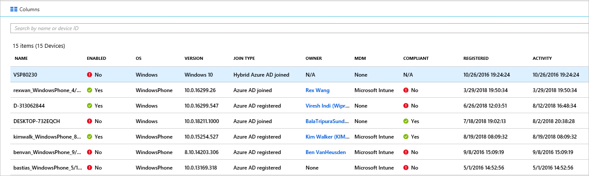
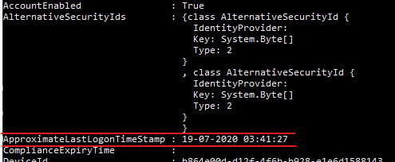

# How To: Manage stale devices in Azure AD

Ideally, to complete the lifecycle, registered devices should be unregistered when they are not needed anymore. However, due to, for example, lost, stolen, broken devices, or OS reinstallations you typically have stale devices in your environment. As an IT admin, you probably want a method to remove stale devices, so that you can focus your resources on managing devices that actually require management.

In this article, you learn how to efficiently manage stale devices in your environment.
  

## What is a stale device?

A stale device is a device that has been registered with Azure AD but has not been used to access any cloud apps for a specific timeframe. Stale devices have an impact on your ability to manage and support your devices and users in the tenant because: 

- Duplicate devices can make it difficult for your helpdesk staff to identify which device is currently active.
- An increased number of devices creates unnecessary device writebacks increasing the time for Azure AD connect syncs.
- As a general hygiene and to meet compliance, you may want to have a clean state of devices. 

Stale devices in Azure AD can interfere with the general lifecycle policies for devices in your organization.

## Detect stale devices

Because a stale device is defined as registered device that hasn't been used to access any cloud apps for a specific timeframe, detecting stale devices requires a timestamp-related property. In Azure AD, this property is called **ApproximateLastLogonTimestamp** or **activity timestamp**. If the delta between now and the value of the **activity timestamp** exceeds the timeframe you have defined for active devices, a device is considered to be stale. This **activity timestamp** is now in public preview.

## How is the value of the activity timestamp managed?  

The evaluation of the activity timestamp is triggered by an authentication attempt of a device. Azure AD evaluates the activity timestamp when:

- A Conditional Access policies requiring [managed devices](../conditional-access/require-managed-devices.md) or [approved client apps](../conditional-access/app-based-conditional-access.md) has been triggered.
- Windows 10 devices that are either Azure AD joined or hybrid Azure AD joined are active on the network. 
- Intune managed devices have checked in to the service.

If the delta between the existing value of the activity timestamp and the current value is more than 14 days (+/-5 day variance), the existing value is replaced with the new value.

## How do I get the activity timestamp?

You have two options to retrieve the value of the activity timestamp:

- The **Activity** column on the [devices page](https://portal.azure.com/#blade/Microsoft_AAD_IAM/DevicesMenuBlade/Devices) in the Azure portal

    

- The [Get-MsolDevice](/powershell/module/msonline/get-msoldevice?view=azureadps-1.0) cmdlet

    

## Plan the cleanup of your stale devices

To efficiently clean up stale devices in your environment, you should define a related policy. This policy helps you to ensure that you capture all considerations that are related to stale devices. The following sections provide you with examples for common policy considerations. 

### Cleanup account

To update a device in Azure AD, you need an account that has one of the following roles assigned:

- Global Administrator
- Cloud Device Administrator
- Intune Service Administrator

In your cleanup policy, select accounts that have the required roles assigned. 

### Timeframe

Define a timeframe that is your indicator for a stale device. When defining your timeframe, factor the window noted for updating the activity timestamp into your value. For example, you shouldn't consider a timestamp that is younger than 21 days (includes variance) as an indicator for a stale device. There are scenarios that can make a device look like stale while it isn't. For example, the owner of the affected device can be on vacation or on a sick leave.  that exceeds your timeframe for stale devices.

### Disable devices

It is not advisable to immediately delete a device that appears to be stale because you can't undo a deletion in the case of false positives. As a best practice, disable a device for a grace period before deleting it. In your policy, define a timeframe to disable a device before deleting it.

### MDM-controlled devices

If your device is under control of Intune or any other MDM solution, retire the device in the management system before disabling or deleting it.

### System-managed devices

Don't delete system-managed devices. These are generally devices such as Autopilot. Once deleted, these devices can't be reprovisioned. The new `get-msoldevice` cmdlet excludes system-managed devices by default. 

### Hybrid Azure AD joined devices

Your hybrid Azure AD joined devices should follow your policies for on-premises stale device management. 

To cleanup Azure AD:

- **Windows 10 devices** - Disable or delete Windows 10 devices in your on-premises AD, and let Azure AD Connect synchronize the changed device status to Azure AD.
- **Windows 7/8** - Disable or delete Windows 7/8 devices in your on-premises AD first. You can't use Azure AD Connect to disable or delete Windows 7/8 devices in Azure AD. Instead, when you make the change in your on-premises, you must disable/delete in Azure AD.

> [!NOTE]
>* Deleting devices in your on-premises AD or Azure AD does not remove registration on the client. It will only prevent access to resources using device as an identity (e.g. Conditional Access). Read additional information on how to [remove registration on the client](faq.md#hybrid-azure-ad-join-faq).
>* Deleting a Windows 10 device only in Azure AD will re-synchronize the device from your on-premises using Azure AD connect but as a new object in "Pending" state. A re-registration is required on the device.
>* Removing the device from sync scope for Windows 10/Server 2016 devices will delete the Azure AD device. Adding it back to sync scope will place a new object in "Pending" state. A re-registration of the device is required.
>* If you not using Azure AD Connect for Windows 10 devices to synchronize (e.g. ONLY using AD FS for registration), you must manage lifecycle similar to Windows 7/8 devices.


### Azure AD joined devices

Disable or delete Azure AD joined devices in the Azure AD.

> [!NOTE]
>* Deleting an Azure AD device does not remove registration on the client. It will only prevent access to resources using device as an identity (e.g Conditional Access). 
>* Read more on [how to unjoin on Azure AD](faq.md#azure-ad-join-faq) 

### Azure AD registered devices

Disable or delete Azure AD registered devices in the Azure AD.

> [!NOTE]
>* Deleting an Azure AD registered device in Azure AD does not remove registration on the client. It will only prevent access to resources using device as an identity (e.g. Conditional Access).
>* Read more on [how to remove a registration on the client](faq.md#azure-ad-register-faq)

## Clean up stale devices in the Azure portal  

While you can cleanup stale devices in the Azure portal, it is more efficient, to handle this process using a PowerShell script. Use the latest PowerShell V1 module to use the timestamp filter and to filter out system-managed devices such as Autopilot. At this point, using PowerShell V2 is not recommended.

A typical routine consists of the following steps:

1. Connect to Azure Active Directory using the [Connect-MsolService](/powershell/module/msonline/connect-msolservice?view=azureadps-1.0) cmdlet
1. Get the list of devices
1. Disable the device using the [Disable-MsolDevice](/powershell/module/msonline/disable-msoldevice?view=azureadps-1.0) cmdlet. 
1. Wait for the grace period of however many days you choose before deleting the device.
1. Remove the device using the [Remove-MsolDevice](/powershell/module/msonline/remove-msoldevice?view=azureadps-1.0) cmdlet.

### Get the list of devices

To get all devices and store the returned data in a CSV file:

```PowerShell
Get-MsolDevice -all | select-object -Property Enabled, DeviceId, DisplayName, DeviceTrustType, Approxi
mateLastLogonTimestamp | export-csv devicelist-summary.csv
```

If you have a large number of devices in your directory, use the timestamp filter to narrow down the number of returned devices. To get all devices with a timestamp older than specific date and store the returned data in a CSV file: 

```PowerShell
$dt = [datetime]’2017/01/01’
Get-MsolDevice -all -LogonTimeBefore $dt | select-object -Property Enabled, DeviceId, DisplayName, DeviceTrustType, ApproximateLastLogonTimestamp | export-csv devicelist-olderthan-Jan-1-2017-summary.csv
```

## What you should know

### Why is the timestamp not updated more frequently?

The timestamp is updated to support device lifecycle scenarios. This is not an audit. Use the sign-in audit logs for more frequent updates on the device.

### Why should I worry about my BitLocker keys?

When configured, BitLocker keys for Windows 10 devices are stored on the device object in Azure AD. If you delete a stale device, you also delete the BitLocker keys that are stored on the device. You should determine whether your cleanup policy aligns with the actual lifecycle of your device before deleting a stale device. 

### Why should I worry about Windows Autopilot devices?

When a Azure AD device was associated with a Windows Autopilot object the following three scenarios can occur if the device will be repurposed in future:
- With Windows Autopilot user-driven deployments without using white glove, a new Azure AD device will be created, but it won’t be tagged with the ZTDID.
- With Windows Autopilot self-deploying mode deployments, they will fail because an associate Azure AD device cannot be found.  (This is a security mechanism to make sure that no “imposter” devices try to join Azure AD with no credentials.) The failure will indicate a ZTDID mismatch.
- With Windows Autopilot white glove deployments, they will fail because an associated Azure AD device cannot be found. (Behind the scenes, white glove deployments use the same self-deploying mode process, so they enforce the same security mechanisms.)

### How do I know all the type of devices joined?

To learn more about the different types, see the [device management overview](overview.md).

### What happens when I disable a device?

Any authentication where a device is being used to authenticate to Azure AD are denied. Common examples are:

- **Hybrid Azure AD joined device** - Users might be able to use the device to sign-in to their on-premises domain. However, they can't access Azure AD resources such as Office 365.
- **Azure AD joined device** - Users can't use the device to sign in. 
- **Mobile devices** - User can't access Azure AD resources such as Office 365. 

## Next steps

To get an overview of how to manage device in the Azure portal, see [managing devices using the Azure portal](device-management-azure-portal.md)
